# Laporan Isu: Kegagalan Deserialisasi Status Kesadaran (ConsciousnessStatus) dan Ketiadaan Kebijakan Wewenang Perawat pada Pencatatan Tanda Vital Rawat Inap

**ID Isu:** `ISSUE-KEP-008`  
**Modul:** Rawat Inap — Keperawatan (`Inpatient Nursing Workspace`)  
**Submodul:** Asuhan Keperawatan — Sub-tab Vital Sign (`nursing-vital-sign-tab.jsx` & `use-inpatient-vital-sign-series.js`)  
**Tingkat Keparahan:** 🔴 **Tinggi / Cacat Integrasi Kontrak API & Tata Kelola Otorisasi (API Deserialization & RBAC Policy Blockers)**  
**Tanggal Temuan:** 24 September 2026  
**Ditemukan Oleh:** Pengujian Terpadu Antigravity (Playwright End-to-End Live Testing)  
**Status Isu:** 🟢 **TERATASI (Resolved & Verified 100% Pass)**  

---

## 1. Ringkasan Eksekutif & Narasi Masalah

Pada saat perawat rawat inap (**Mira Safitri, S.Kep., Ns.**) bertugas di bangsal rawat inap dan membuka menu **Asuhan Keperawatan** sub-tab **Vital Sign** (`section=nursing-care&tab=vital-sign`), melakukan pencatatan observasi rutin tanda vital pasien (Tekanan Darah: 120/80 mmHg, Nadi: 78 x/m, Pernapasan: 18 x/m, Suhu: 36.6 °C, Saturasi Oksigen: 99%), dan menekan tombol **"Simpan Tanda Vital"**, sistem mengalami dua hambatan teknis beruntun:

1. **Hambatan Otorisasi Klinis (RBAC Missing Policies):**  
   Perawat rawat inap belum memiliki izin kebijakan akses (`SysAccessPolicy`) pada kontroler `PatientVitalSign` untuk aksi `Create`, `Read`, dan `Update`, sehingga permintaan berisiko tertolak dengan status `HTTP 403 Forbidden`.
2. **Kegagalan Deserialisasi Kontrak DTO Backend (`HTTP 400 Bad Request`):**  
   Ketika formulir dikirimkan, antarmuka frontend mengirimkan nilai `"consciousnessStatus": null` karena formulir input belum memiliki pemilih tingkat kesadaran. Di sisi backend ASP.NET Core, properti `ConsciousnessStatus` pada `CreatePatientVitalSignRequest` didefinisikan sebagai tipe enum non-nullable (`public ConsciousnessStatus ConsciousnessStatus { get; set; } = ConsciousnessStatus.Unknown;`), sehingga mesin JSON *System.Text.Json* melempar pengecualian deserialisasi:
   ```json
   {
     "type": "https://tools.ietf.org/html/rfc9110#section-15.5.1",
     "title": "One or more validation errors occurred.",
     "status": 400,
     "errors": {
       "$.consciousnessStatus": [
         "The JSON value could not be converted to QuilvianSystemBackend.Areas.HealthServices.ClinicalManagement.Enums.ConsciousnessStatus. Path: $.consciousnessStatus | LineNumber: 0 | BytePositionInLine: 313."
       ]
     }
   }
   ```

Dampaknya, perawat bangsal tidak dapat mendokumentasikan lembar observasi tanda vital pasien ke dalam rekam medis elektronik rawat inap.

---

## 2. Contoh Skenario Klinis Rumah Sakit

Di bangsal rawat inap Ruang Bedah Aster (Kamar BD-RSMMC-00033), pasien pasca bedah digestif **Tn. Indra Gunawan** (No. RM: `00-00-00-16`) dijadwalkan menerima pemantauan tanda-tanda vital berkala setiap 4 jam oleh perawat jaga. 

1. **Pukul 10:00 WIB:** Perawat Mira Safitri mengukur tensi, nadi, suhu, pernapasan, saturasi oksigen, serta memastikan pasien dalam kondisi sadar penuh (*Compos Mentis*).
2. **Pencatatan ke Sistem:** Perawat membuka rekam medis rawat inap dan menginput seluruh parameter.
3. **Kebutuhan Medis & Keselamatan Pasien:**
   - Nilai tekanan darah otomatis dihitung menjadi **MAP** (*Mean Arterial Pressure*) oleh server untuk mendeteksi dini syok atau hipotensi organ vital.
   - Parameter respirasi, nadi, suhu, saturasi O2, tensi, dan tingkat kesadaran diproses oleh mesin **EWS** (*Early Warning Score*) rumah sakit untuk menentukan level risiko pemburukan pasien (Rendah / Sedang / Tinggi / Kritis).
   - Apabila pengiriman data gagal akibat galat serialisasi kesadaran, lembar observasi TTV kosong, skor EWS tidak terhitung, dan dokter DPJP tidak menerima notifikasi peringatan dini pemburukan klinis.

---

## 3. Alur Proses Bisnis & Integrasi Perbaikan

Diagram berikut mengilustrasikan alur pemulihan menyeluruh dari konfigurasi otorisasi peran keperawatan hingga konversi tingkat kesadaran dan perhitungan EWS server:

```mermaid
flowchart TD
    A["Perawat Rawat Inap Bertugas<br/>(Mira Safitri, S.Kep., Ns.)"] --> B["Buka Ruang Kerja Keperawatan<br/>Menu: Asuhan Keperawatan &rarr; Tab: Vital Sign"]
    B --> C["Otorisasi Akses Terverifikasi<br/>(SysAccessPolicy: PatientVitalSign Create, Read, Update)"]
    
    C --> D["Klik 'Catat Tanda Vital'<br/>Buka VitalSignEntryForm"]
    D --> E["Pengisian Parameter Observasi Klinis:<br/>• TD: 120/80 mmHg | HR: 78 x/m | RR: 18 x/m<br/>• Suhu: 36.6 °C | SpO2: 99%<br/>• Tingkat Kesadaran: Compos Mentis (1)"]
    
    E --> F["Validasi Kepatuhan Klinis FR-KEP-049 / VAL-KEP-22c:<br/>Parameter nyeri wajib null / dilarang di form TTV"]
    F --> G["Kirim Permintaan ke Server<br/>POST /api/v1/health-services/clinical-management/patient-vital-signs"]
    
    G --> H{"Backend Deserialization<br/>(CreatePatientVitalSignRequest)"}
    H -->|"ConsciousnessStatus Nullable / Enum"| I["Resolusi Nilai Kesadaran Aman<br/>request.ConsciousnessStatus ?? ConsciousnessStatus.Unknown"]
    
    I --> J["Kalkulasi Otomatis Sisi Server:<br/>• MAP: 80 + (120-80)/3 = 93.33 mmHg<br/>• EWS Score: 0 (Normal / Risiko Rendah)"]
    
    J --> K["Penyimpanan Sukses: 200 OK<br/>Tautkan Episode Rawat Inap Otomatis"]
    K --> L["Pembaruan UI Seketika:<br/>• Baris Observasi Masuk ke Tabel (Badge 'Terkini')<br/>• Kolom Kesadaran Tampil: 'Compos Mentis'<br/>• Grafik Deret Waktu Terintegrasi"]
```



---

## 4. Akar Masalah Teknis (*Root Cause Analysis*)

### A. Kontrak DTO Backend (`PatientVitalSignDtos.cs`)
Pada berkas DTO backend:
```csharp
// SEBELUM PERBAIKAN:
public class CreatePatientVitalSignRequest
{
    // ...
    public ConsciousnessStatus ConsciousnessStatus { get; set; } = ConsciousnessStatus.Unknown;
}
```
Karena dideklarasikan sebagai enum non-nullable, pengiriman JSON bernilai `null` dari klien web ditolak seketika oleh lapisan validasi model ASP.NET Core sebelum memasuki metode kontroler (*early binding validation error*).

Selain itu, ketika dideklarasikan sebagai `ConsciousnessStatus? ConsciousnessStatus = ConsciousnessStatus.Unknown;`, terjadi bentrok penamaan (*symbol shadowing / CS0236*) antara nama tipe enum dengan nama properti kelas. Solusi yang benar adalah mengkualifikasikan nama enum secara eksplisit: `Enums.ConsciousnessStatus.Unknown`.

### B. Hook Orkestrasi Frontend (`use-inpatient-vital-sign-series.js`)
Pada hook frontend, payload pembuatan tanda vital awalnya menyertakan ekspresi:
```javascript
// SEBELUM PERBAIKAN:
consciousnessStatus: values.consciousnessStatus ?? null,
```
Ketika `VitalSignEntryForm` belum menyediakan bidang input status kesadaran, nilai tersebut selalu terkirim sebagai `null`.

### C. Otorisasi Peran Perawat (`SysAccessPolicy`)
Sebelumnya, tabel otorisasi `SysAccessPolicy` di basis data PostgreSQL belum memiliki rekaman penugasan wewenang untuk:
- `ControllerName`: `PatientVitalSign` (`70b6ee07-de05-4777-8dce-e97d418593c1`)
- `DepartmentId`: Keperawatan (`3aa08cc0-ec3b-52ef-b951-d46c950e927a`)
- `PositionId`: Perawat Rawat Inap (`20f0bbda-7f91-4c2c-9bab-bb5d0d6794cb`)
Aksi yang hilang: `Create`, `Read`, dan `Update`.

---

## 5. Langkah Remediasi yang Diterapkan

### A. Perbaikan Kontrak DTO Backend (`PatientVitalSignDtos.cs`)
Mengubah properti `ConsciousnessStatus` menjadi nullable dengan kualifikasi enum `Enums.ConsciousnessStatus.Unknown` pada kelas `CreatePatientVitalSignRequest` dan `UpdatePatientVitalSignRequest`:

```csharp
// Path: NewQuilvianSystemBackend/Areas/HealthServices/ClinicalManagement/DTOs/PatientVitalSignDtos.cs
public class CreatePatientVitalSignRequest
{
    // ...
    public ConsciousnessStatus? ConsciousnessStatus { get; set; } = Enums.ConsciousnessStatus.Unknown;
}

public class UpdatePatientVitalSignRequest
{
    // ...
    public ConsciousnessStatus? ConsciousnessStatus { get; set; } = Enums.ConsciousnessStatus.Unknown;
}
```

### B. Perbaikan Pemetaan Kontroler Backend (`PatientVitalSignController.cs`)
Menangani nilai nullable secara defensif dengan operator *null-coalescing*:
```csharp
// Path: NewQuilvianSystemBackend/Areas/HealthServices/ClinicalManagement/Controllers/PatientVitalSignController.cs
// Pada CreateVitalSign:
ConsciousnessStatus = request.ConsciousnessStatus ?? ConsciousnessStatus.Unknown,

// Pada UpdateVitalSign:
entity.ConsciousnessStatus = request.ConsciousnessStatus ?? entity.ConsciousnessStatus;

// Pada CalculateVitalSignValues:
request.ConsciousnessStatus ?? ConsciousnessStatus.Unknown,
```

### C. Perbaikan Hook Frontend (`use-inpatient-vital-sign-series.js`)
Menyelaraskan penetapan nilai bawaan kesadaran ke `1` (*Compos Mentis*) jika klien tidak mengirimkan nilai khusus:
```javascript
// Path: QuilvianSystemFrontendDev/src/lib/hooks/health-services/inpatient-management/use-inpatient-vital-sign-series.js
consciousnessStatus:
  values.consciousnessStatus !== undefined &&
  values.consciousnessStatus !== null &&
  values.consciousnessStatus !== ""
    ? Number(values.consciousnessStatus)
    : 1, // Default Compos Mentis (1) untuk pasien rawat inap umum sadar
```

### D. Penyempurnaan Formulir Input Klinis (`vital-sign-entry-form.jsx`)
Menambahkan status dan pemilih dropdown tingkat kesadaran pasien pada grid formulir tanda vital sehingga perawat dapat mendokumentasikan pasien apatis, somnolen, sopor, atau koma secara akurat:
```jsx
// Path: QuilvianSystemFrontendDev/src/components/view/health-services/inpatient-management/nursing-workspace/sections/nursing-care/components/vital-sign-entry-form.jsx
<div className={styles.vitalFieldGroup}>
  <label htmlFor="select-consciousness" className={styles.formLabel}>
    Tingkat Kesadaran Pasien:
  </label>
  <select
    id="select-consciousness"
    className={styles.monitoringInput}
    value={consciousnessStatus}
    onChange={(e) => setConsciousnessStatus(e.target.value)}
    disabled={isSubmitting}
    data-testid="select-consciousness"
  >
    <option value="1">Compos Mentis (Sadar Penuh)</option>
    <option value="2">Apatis (Acuh Tak Acuh)</option>
    <option value="3">Somnolen (Mengantuk)</option>
    <option value="4">Sopor (Stupor / Mengantuk Dalam)</option>
    <option value="5">Coma (Koma / Tidak Sadar)</option>
    <option value="0">Unknown (Tidak Diketahui)</option>
  </select>
</div>
```

### E. Penegakan Otorisasi RBAC (`grant_nursing_care_permissions.py`)
Menyuntikkan kebijakan wewenang resmi ke basis data PostgreSQL:
- `PatientVitalSign`: `Create`, `Read`, `Update` = `Allowed`
- `PatientIntegratedProgressNote`: `Create`, `Read`, `Update` = `Allowed` (aksi `Verify` tetap terkunci khusus DPJP)
- `DailyObservation`: `Create`, `Read`, `Update` = `Allowed`
- `FluidBalance`: `Create`, `Read`, `Update` = `Allowed`

---

## 6. Spesifikasi Endpoint Bergaya Swagger

Berikut spesifikasi endpoint API yang terlibat dalam operasional tanda vital keperawatan rawat inap:

### Tag Grup Swagger
`[Tags("Health Services / Clinical Management / Patient Vital Sign")]`

| Metode | Jalur Endpoint (*Path*) | Deskripsi Operasional | Otorisasi & Hak Akses | Format Permintaan (*Request Payload*) | Format Respons (*Response Payload*) |
| :---: | :--- | :--- | :--- | :--- | :--- |
| **`GET`** | `/api/v1/health-services/clinical-management/patient-vital-signs/episodes/{episodeId}` | Mengambil deret waktu tanda vital satu episode rawat inap terurut kronologis untuk tabel dan grafik. Mendukung parameter filter `from` dan `to` (maksimal 7 hari). | `Bearer Token`<br/>`[AccessPermission("PatientVitalSign", "Read")]` | *None (Query string: `from`, `to` opsional)* | `200 OK`<br/>`ApiResponse<List<PatientVitalSignSeriesItem>>` |
| **`POST`** | `/api/v1/health-services/clinical-management/patient-vital-signs` | Mencatat observasi tanda vital baru pasien. Menghitung otomatis MAP dan Early Warning Score (EWS) di sisi server. Menegakkan penolakan isian nyeri (`VAL-KEP-22c`). | `Bearer Token`<br/>`[AccessPermission("PatientVitalSign", "Create")]` | `JSON Body`<br/>`CreatePatientVitalSignRequest` | `200 OK`<br/>`ApiResponse<PatientVitalSignCreateResponse>` |
| **`PUT`** | `/api/v1/health-services/clinical-management/patient-vital-signs/{id}` | Memperbarui catatan tanda vital yang belum diverifikasi atau belum terkunci. | `Bearer Token`<br/>`[AccessPermission("PatientVitalSign", "Update")]` | `JSON Body`<br/>`UpdatePatientVitalSignRequest` | `200 OK`<br/>`ApiResponse<PatientVitalSignUpdateResponse>` |

---

## 7. Bukti Verifikasi Pengujian (*Live Verification Evidence*)

Pengujian otomatis siklus penuh dijalankan menggunakan skrip Playwright [`test-vital-sign-full-cycle.mjs`](file:///c:/Users/Admin/Documents/Quilvian/Source%20Code/QuilvianFinal/QuilvianSystemFrontendDev/test-with-agy/scripts/test-vital-sign-full-cycle.mjs) dengan hasil **8 dari 8 langkah berhasil 100% (PASS)**:

1. **Langkah 1 (Login Perawat):** Mira Safitri berhasil masuk dengan kredensial bangsal rawat inap (`HTTP 200 OK`).
2. **Langkah 2 (Navigasi):** Membuka `?section=nursing-care&tab=vital-sign`, memuat judul "Deret Tanda Vital Pasien" (`01-vital-sign-loaded.png`).
3. **Langkah 3 (Buka Formulir):** Tombol "Catat Tanda Vital" memunculkan formulir inline terpadu.
4. **Langkah 4 (Pengisian Formulir):** Input terisi lengkap: TD=120/80 mmHg, Nadi=78, Napas=18, Suhu=36.6 °C, SpO2=99%, Kesadaran=Compos Mentis (`02-vital-sign-form-filled.png`).
5. **Langkah 5 (Penyimpanan ke Server):** Permintaan `POST` berhasil dengan status `HTTP 200 OK` (`03-after-submit-vital-sign.png`).
6. **Langkah 6 (Verifikasi Tabel):** Tabel memuat observasi terbaru dengan label "Terkini", nilai MAP terhitung **93.33 mmHg**, skor EWS **0**, dan status kesadaran "Compos Mentis" (`04-vital-sign-table-verified.png`).
7. **Langkah 7 (Tampilan Grafik):** Beralih ke mode grafik SVG deret waktu (`toggle-vs-chart`), grafik garis berhasil dirender (`05-vital-sign-chart-view.png`).
8. **Langkah 8 (Filter Rentang Waktu):** Pengujian filter 3 Hari Terakhir (`GET ?from=...&to=...` -> `200 OK`), filter 7 Hari Maksimal (`200 OK`), dan kembali ke 24 Jam Terakhir berjalan lancar tanpa galat (`06-vital-sign-range-filtered.png`).

---

## 8. Kesimpulan & Rekomendasi

Isu `ISSUE-KEP-008` telah **terselesaikan secara tuntas (*RESOLVED*)** baik di lapisan backend C# ASP.NET Core, antarmuka Next.js React, maupun basis data tata kelola wewenang PostgreSQL. Seluruh fungsi pada sub-tab **Vital Sign** di menu **Asuhan Keperawatan** telah teruji stabil, akurat secara klinis, dan siap digunakan dalam operasional rumah sakit.
