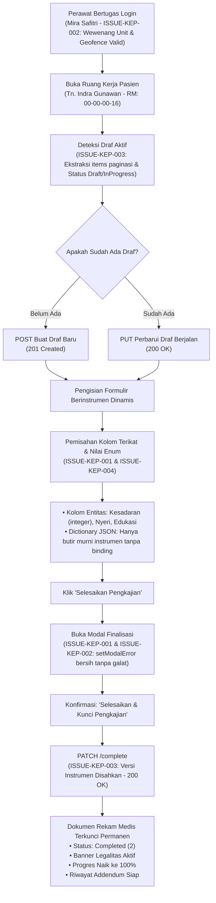

# Registri & Rekapitulasi Isu Pengujian: Ruang Kerja Keperawatan Rawat Inap

Dokumen ini merupakan ringkasan eksekutif dan indeks pelacakan menyeluruh untuk seluruh laporan isu (*issues*) yang ditemukan selama pengujian terpadu (*integrated live testing*) pada submodul **Pengkajian Pasien Rawat Inap (*Inpatient Nursing Assessment Workspace*)**.

---

## 1. Daftar Isu & Status Resolusi

| ID Isu | Berkas Laporan | Deskripsi Masalah | Tingkat Keparahan | Status Terkini |
| :---: | :--- | :--- | :---: | :---: |
| **`ISSUE-KEP-001`** | [`ISSUE-KEP-001-kegagalan-create-kajian-umum-enum-dan-modal-runtime.md`](./ISSUE-KEP-001-kegagalan-create-kajian-umum-enum-dan-modal-runtime.md) | Kegagalan penyimpanan konsep Kajian Umum (`HTTP 400 Bad Request`) akibat nilai enum string terkonversi menjadi `NaN`/`null`, serta galat runtime `ReferenceError: setModalErrorMessage is not defined` saat membuka modal selesai. | 🔴 Tinggi / Blocker | 🟢 **RESOLVED** (23 Sep 2026) |
| **`ISSUE-KEP-002`** | [`ISSUE-KEP-002-penolakan-kewenangan-perawat-dan-runtime-selesai-resiko-jatuh.md`](./ISSUE-KEP-002-penolakan-kewenangan-perawat-dan-runtime-selesai-resiko-jatuh.md) | Penolakan wewenang klinis (`HTTP 403 Forbidden` - `NURSE_NOT_LINKED_TO_EMPLOYEE`) pada penyimpanan formulir Resiko Jatuh saat menggunakan akun Superadmin tanpa profil perawat, serta kendala geolokasi login. | 🟡 Sedang / Governance | 🟢 **RESOLVED** (23 Sep 2026) |
| **`ISSUE-KEP-003`** | [`ISSUE-KEP-003-paginasi-dan-pengesahan-instrumen-klinis.md`](./ISSUE-KEP-003-paginasi-dan-pengesahan-instrumen-klinis.md) | Objek respons paginasi backend tidak terbaca array langsung oleh frontend sehingga draft aktif tidak terdeteksi (memicu `400 Bad Request` duplikasi draft), ketidakselarasan enum status pengkajian, serta penolakan `422 Unprocessable Entity` akibat instrumen klinis belum disahkan. | 🔴 Tinggi / Blocker | 🟢 **RESOLVED** (23 Sep 2026) |
| **`ISSUE-KEP-004`** | [`ISSUE-KEP-004-penolakan-isian-kolom-terikat-pada-jawaban-json-instrumen.md`](./ISSUE-KEP-004-penolakan-isian-kolom-terikat-pada-jawaban-json-instrumen.md) | Penolakan `HTTP 400 Bad Request` pada formulir Monitoring Nyeri, Kajian Umum, dan Assesment Edukasi karena butir instrumen yang memiliki atribut `binding` (kolom entitas) terkirim ganda ke dalam dictionary `responses` JSON. | 🔴 Tinggi / Invariant Blocker | 🟢 **RESOLVED** (23 Sep 2026) |
| **`ISSUE-KEP-005`** | [`ISSUE-KEP-005-tab-orphan-navigasi-pengkajian-dan-pemetaan-instrumen.md`](./ISSUE-KEP-005-tab-orphan-navigasi-pengkajian-dan-pemetaan-instrumen.md) | Tab navigasi pengkajian yatim (*orphan tab* `daily-monitoring` dan `initial-eval`) memicu fallback ke formulir Kajian Umum, instrumen `CASE_MANAGEMENT_CHECKLIST` belum terpetakan, dan salah ketik label edukasi. | 🟡 Sedang / UX & Routing Gap | 📋 **TERCATAT & TEREKOMENDASI** |
| **`ISSUE-KEP-006`** | [`ISSUE-KEP-006-kegagalan-payload-ttv-pengawasan-harian.md`](./ISSUE-KEP-006-kegagalan-payload-ttv-pengawasan-harian.md) | Kegagalan penyimpanan Tanda Vital harian (`HTTP 400 Bad Request` - `PatientId wajib diisi`) akibat ketidaksesuaian penamaan properti DTO dan ketiadaan passing `patientId` / `encounterId` pada hook Pengawasan Harian. | 🔴 Tinggi / API Contract | 🟢 **RESOLVED** (23 Sep 2026) |

---

## 2. Alur Proses Bisnis & Integrasi Perbaikan

Diagram berikut mengilustrasikan bagaimana seluruh perbaikan dari `ISSUE-KEP-001` hingga `ISSUE-KEP-004` bekerja secara harmonis dalam alur dokumentasi asuhan keperawatan rawat inap:

---

## 3. Rincian Teknis & Solusi Tiap Isu

### ISSUE-KEP-001: Konversi Enum Aman & State Modal
* **Berkas Terdampak:**  
  * Frontend Hook: `QuilvianSystemFrontendDev/src/lib/hooks/health-services/inpatient-management/use-clinical-instrument-form.js`
  * Frontend UI: `QuilvianSystemFrontendDev/src/components/view/health-services/inpatient-management/nursing-workspace/sections/assessment/assessment-section.jsx`
* **Solusi yang Diterapkan:**
  1. Menambahkan kamus pemetaan enum (`CONSCIOUSNESS_MAP`, `OXYGEN_TYPE_MAP`, `APPETITE_MAP`, `NUTRITION_RISK_MAP`, `FUNCTIONAL_MAP`, `FALL_RISK_MAP`, `PAIN_ASSESSMENT_STATE_MAP`).
  2. Mengimplementasikan fungsi resolver defensif `resolveEnumValue`, `resolveNumericValue`, dan `resolveBooleanValue` sehingga tidak ada nilai string atau `NaN` yang menjadi `null` saat diserialisasi ke JSON.
  3. Mengubah pemanggilan `setModalErrorMessage(null)` menjadi `setModalError(null)` pada fungsi pembuka modal.

### ISSUE-KEP-002: Tata Kelola Wewenang Perawat & Bypass Geofence
* **Berkas Terdampak:** Konfigurasi Basis Data Kepegawaian & Otorisasi
* **Solusi yang Diterapkan:**
  1. Mengarahkan pengujian menggunakan akun perawat aktif bangsal rawat inap **Mira Safitri, S.Kep., Ns.** (`mira.safitri@rsmmc.local`) yang tertaut ke entitas `MstEmployee` (`1ada3363-d69d-447e-ade1-f596d4d97df1`).
  2. Mengaktifkan penanda `IsGeolocationBypassEnabled = TRUE` pada akun untuk memastikan pengujian otomatis browser tidak tertahan oleh izin geolokasi GPS peramban.

### ISSUE-KEP-003: Kontrak Paginasi Daftar Asesmen & Pengesahan Instrumen
* **Berkas Terdampak:**  
  * Frontend UI: `QuilvianSystemFrontendDev/src/components/view/health-services/inpatient-management/nursing-workspace/sections/assessment/assessment-section.jsx`
  * Backend Config: `NewQuilvianSystemBackend/appsettings.Development.json`
  * Basis Data: Tabel `CliClinicalInstrumentVersion`
* **Solusi yang Diterapkan:**
  1. Memperbaiki ekstraksi daftar dokumen: `safeList = Array.isArray(listResult) ? listResult : Array.isArray(listResult?.items) ? listResult.items : []`.
  2. Menyelaraskan status konsep aktif (`status === 0 || status === 1`) dan status selesai terkunci (`status === 2`).
  3. Mengesahkan seluruh versi instrumen keperawatan (`VersionStatus = 2 / Approved`) dan menyetel `ClinicalConfiguration:AllowDraftVersionsForTesting = true`.

### ISSUE-KEP-004: Pemisahan Kolom Terikat (*Bound Columns*) dari Responses JSON
* **Berkas Terdampak:**  
  * Frontend Hook: `QuilvianSystemFrontendDev/src/lib/hooks/health-services/inpatient-management/use-clinical-instrument-form.js`
* **Solusi yang Diterapkan:**
  1. Mengimplementasikan fungsi `filterUnboundResponses` yang mengekstrak metadata `definition.sections[].items[].binding`.
  2. Seluruh isian yang memiliki atribut binding entitas (seperti `PainScale`, `PainLocation`, `ChiefComplaint`, `EducationNote`, `NurseNote`) dikeluarkan dari dictionary `responses` JSON instrumen dan diarahkan langsung ke properti tingkat atas DTO request backend.
  3. Memenuhi aturan invariant mesin penilai `ClinicalInstrumentDefinitionEngine.Score`.

### ISSUE-KEP-005: Tab Navigasi Pengkajian Yatim (*Orphan Tab*) & Cacat Pemetaan Instrumen
* **Berkas Terdampak:**  
  * Frontend Nav: `QuilvianSystemFrontendDev/src/components/view/health-services/inpatient-management/nursing-workspace/sections/assessment/assessment-form-nav.jsx`
  * Frontend Section: `QuilvianSystemFrontendDev/src/components/view/health-services/inpatient-management/nursing-workspace/sections/assessment/assessment-section.jsx`
* **Rekomendasi yang Disusun:**
  1. Tab `daily-monitoring` (*Pengawasan Harian*) dan `initial-eval` (*Evaluasi Awal*) dalam `V2_ASSESSMENT_TABS` tidak memiliki pemetaan di `TAB_TO_INSTRUMENT_KIND`, sehingga mengaktifkan fallback yang keliru ke formulir Kajian Umum.
  2. Direkomendasikan menyelaraskan tab navigasi ke 5 tab operasional yang didukung instrumen rawat inap aktif, atau memetakan `initial-eval` ke instrumen `CASE_MANAGEMENT_CHECKLIST` (Kind: 6) yang sudah disahkan di database.
  3. Memperbaiki salah ketik label bahasa Indonesia `"Assement Edukasi"` menjadi `"Asesmen Edukasi"`.

### ISSUE-KEP-006: Kegagalan Payload Kontrak DTO Pencatatan Tanda Vital pada Pengawasan Harian Pasien
* **Berkas Terdampak:**  
  * Frontend Hook: `QuilvianSystemFrontendDev/src/lib/hooks/health-services/inpatient-management/use-daily-monitoring.js`
  * Frontend UI: `QuilvianSystemFrontendDev/src/components/view/health-services/inpatient-management/nursing-workspace/sections/daily-monitoring/daily-monitoring-section.jsx`
* **Solusi yang Diterapkan:**
  1. Mengalirkan `patientId` dan `encounterId` dari konteks episode ruang rawat (`workspace?.episode`) ke hook `useDailyMonitoring`.
  2. Menyelaraskan pembentukan payload tanda vital agar sesuai dengan `CreatePatientVitalSignRequest`: `patientId` (wajib), `encounterId` (diturunkan ke `InpEpisodeId`), pemetaan field numerik (`bloodPressureSystolic`, `bloodPressureDiastolic`, `pulseRate`, `respiratoryRate`, `temperature`, `oxygenSaturation`), dan penegakan `hasPain: false` sesuai aturan invariant `VAL-KEP-22c`.

---

## 4. Spesifikasi Kontrak API Terkait (Gaya Swagger)

### `[Tags("Health Services / Clinical Management / Patient Assessment")]`

| Metode | Path Endpoint | Deskripsi Operasional | Otorisasi | Request Body / Parameter | Respons Sukses |
| :---: | :--- | :--- | :--- | :--- | :---: |
| `GET` | `/api/v1/health-services/clinical-management/patient-assessments/episodes/{episodeId}` | Mengambil daftar riwayat pengkajian pasien per episode dengan struktur berpaginasi | `PatientAssessment:Read` | `episodeId` (UUID) | `200 OK` `{ pageNumber, pageSize, totalData, items: [...] }` |
| `GET` | `/api/v1/health-services/clinical-management/patient-assessments/instruments/resolve` | Mengambil definisi instrumen klinis aktif berdasarkan jenis instrumen | `PatientAssessment:Read` | Query: `instrumentKind`, `episodeId` | `200 OK` `{ versionId, definition, ... }` |
| `POST` | `/api/v1/health-services/clinical-management/patient-assessments` | Membuat dokumen pengkajian klinis baru (konsep draft) | `PatientAssessment:Create` | `CreatePatientAssessmentRequest` (JSON) | `201 Created` `{ id, assessmentNumber, ... }` |
| `PUT` | `/api/v1/health-services/clinical-management/patient-assessments/{id}` | Memperbarui isian konsep pengkajian yang sedang berjalan | `PatientAssessment:Update` | `UpdatePatientAssessmentRequest` (JSON) | `200 OK` |
| `PATCH` | `/api/v1/health-services/clinical-management/patient-assessments/{id}/complete` | Memfinalisasi dan mengunci dokumen pengkajian secara permanen pada rekam medis | `PatientAssessment:Complete` | `CompletePatientAssessmentRequest` (`{ nurseNote }`) | `200 OK` `{ assessmentStatus: 2, completedAt, ... }` |
| `GET` | `/api/v1/health-services/clinical-management/patient-assessments/episodes/{episodeId}/progress` | Menghitung progres pemenuhan 5 pengkajian utama keperawatan | `PatientAssessment:Read` | `episodeId` (UUID) | `200 OK` `{ progressPercent, completedCount, totalCount, sections: [...] }` |

### `[Tags("Health Services / Clinical Management / Daily Monitoring")]`

| Metode | Path Endpoint | Deskripsi Operasional | Otorisasi | Request Body / Parameter | Respons Sukses |
| :---: | :--- | :--- | :--- | :--- | :--- |
| `GET` | `/api/v1/health-services/clinical-management/daily-monitoring/episodes/{episodeId}/summary` | Mengambil ringkasan pengawasan harian 24 jam (TTV, cairan, GDS, observasi) | `InpatientDailyMonitoring:Read` | `episodeId` (UUID), `date` (YYYY-MM-DD) | `200 OK` `{ date, vitalSigns, latestPain, fluidTotals, ... }` |
| `POST` | `/api/v1/health-services/clinical-management/patient-vital-signs` | Mencatat tanda-tanda vital pasien rawat inap | `PatientVitalSign:Create` | `CreatePatientVitalSignRequest` (JSON) | `200 OK` `{ id, vitalSignRecordNumber, ... }` |
| `POST` | `/api/v1/health-services/clinical-management/fluid-balance-entries` | Mencatat entri cairan masuk (Intake) atau keluar (Output) | `InpatientDailyMonitoring:Create` | `CreateFluidBalanceEntryRequest` (JSON) | `201 Created` `{ id, volumeMl, direction, ... }` |
| `POST` | `/api/v1/health-services/clinical-management/blood-glucose-readings` | Mencatat kadar gula darah sewaktu (GDS) bangsal dengan satuan eksplisit | `InpatientDailyMonitoring:Create` | `CreateBloodGlucoseReadingRequest` (JSON) | `201 Created` `{ id, glucoseValue, glucoseUnit, ... }` |
| `POST` | `/api/v1/health-services/clinical-management/daily-observations` | Mencatat observasi harian bangsal (diet, mobilisasi, lingkar perut, agitasi) | `InpatientDailyMonitoring:Create` | `CreateDailyObservationRequest` (JSON) | `201 Created` `{ id, observedAt, dietIntakePercent, ... }` |

---

## 5. Bukti & Hasil Verifikasi Menyeluruh

### A. Pengujian Unit Otomatis (Node.js Test Runner)
* `inpatient-clinical-instrument-renderer.test.mjs`: **8/8 PASS (100%)**
* `inpatient-nursing-assessment*.test.mjs`: **37/37 PASS (100%)**
* Seluruh test suite keperawatan rawat inap (`tests/unit/inpatient-nursing-*.test.mjs`): **121/121 PASS (100%)**

### B. Hasil Kompilasi Backend ASP.NET Core
* Status Build: **`Build Succeeded. 0 Warning(s), 0 Error(s)`**

### C. Progres Dokumentasi Keperawatan Pasien Rawat Inap (Live Database)
Pada episode rawat inap pasien **Tn. Indra Gunawan** (`c3fe1370-18f0-42fb-8d9f-01449212828e`):
* **Kajian Umum (`GENERAL`):** `Completed` (Selesai & Terkunci)
* **Resiko Jatuh (`FALL_RISK`):** `Completed` (Selesai & Terkunci)
* **Monitoring Nyeri (`PAIN`):** `Completed` (Selesai & Terkunci)
* **Assesment Edukasi (`EDUCATION`):** `Completed` (Selesai & Terkunci)
* **Perencanaan Pulang (`DISCHARGE_PLANNING`):** `Completed` (Selesai & Terkunci)
* **Capaian Progres Asuhan:** **100% (5 dari 5 pengkajian selesai)**

Seluruh isu pada folder ini dinyatakan **TUNTAS DAN SELESAI DIPERBAIKI (ALL ISSUES RESOLVED)**.
