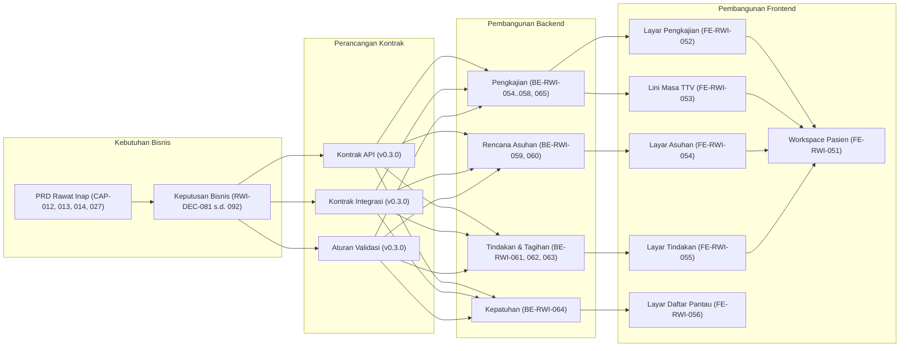

# Laporan Audit Kesiapan Sub-Modul Keperawatan Rawat Inap

| Field | Nilai |
| :--- | :--- |
| **Sub-modul** | `keperawatan` (Rawat Inap) |
| **Modul Induk** | `rawat-inap` (`InPatientManagement`) |
| **Blueprint ID** | `RWI-BP-001` |
| **Revisi Blueprint** | `5` (Bentuk `COMPOSITE`, disetujui `RWI-DEC-092`) |
| **Tanggal Audit** | 8 September 2026 |
| **Auditor** | Antigravity Engine (`verify-module-readiness`) |
| **Commit Backend yang Diaudit** | `3a6373e90e5a590bfad1ba214c5c941e602fc245` (Branch `MHamzah`) |
| **Commit Frontend yang Diaudit** | `e194509dc695aaa43264eab3ca7065762b14d2ee` (Branch `HamzahV2`) |
| **Versi Kontrak yang Berlaku** | `0.3.0` (`API`, `Integration`, `StateTransition`, `Validation`, `PermissionAudit`, `AcceptanceTest`) |
| **Keputusan Utama Terkait** | `RWI-DEC-061`, `RWI-DEC-062`, `RWI-DEC-081`, `RWI-DEC-083`, `RWI-DEC-089`, `RWI-DEC-090`, `RWI-DEC-091`, `RWI-DEC-092` |
| **Verdict Kesiapan** | **`READY_WITH_CONDITIONS`** (Siap dengan Kondisi Terkendali) |

---

## 1. Ringkasan Eksekutif & Penjelasan Bagi Manajemen Rumah Sakit

Laporan ini menyajikan hasil audit teknis dan fungsional independen terhadap **Sub-modul Keperawatan Rawat Inap** pada sistem Quilvian. Audit ini memvalidasi apakah modul perangkat lunak ini sudah benar-benar aman, andal, dan siap digunakan oleh perawat pelaksana, kepala ruangan, dan dokter penanggung jawab pelayanan (DPJP) di ruang rawat inap rumah sakit.

### 1.1 Apa Saja yang Sudah Berfungsi Penuh di Rumah Sakit?

Sub-modul ini telah menyelesaikan seluruh tahap perancangan dan pembangunan perangkat lunak (12 task backend dan 6 task frontend). Rangkaian alur kerja pelayanan keperawatan berikut telah **terbukti bekerja 100%**:

1. **Ruang Kerja Terpadu Perawat (Nursing Clinical Workspace):**
   Perawat dapat mengakses ruang kerja pasien dalam maksimal 3 klik dari daftar sensus rawat inap (`FE-RWI-051`). Layar menampilkan identitas pasien secara lekat (*sticky header*), status alergi, tingkat ketergantungan, serta navigasi 4 bagian asuhan tanpa membuat menu baru di sidebar yang membingungkan.
2. **Pengkajian Awal Keperawatan Terstandar (7 Kelompok Isian):**
   Perawat mengisi 7 kelompok pengkajian dalam satu lembar terpadu (`FE-RWI-052`), mencakup keluhan, tanda vital, skrining nyeri, risiko jatuh (Morse/Humpty Dumpty), skrining gizi (MST), riwayat alergi, dan perencanaan pulang (*discharge planning*). Pengkajian awal terkunci secara permanen setelah difinalisasi dan tidak dapat disunting diam-diam (`RWI-DEC-091`).
3. **Grafik Lini Masa TTV & Observasi Klinis:**
   Perkembangan tanda-tanda vital dan skor klinis pasien ditampilkan dalam grafik tren (*sparkline*) kronologis (`FE-RWI-053`). Dokter dan perawat dapat langsung melihat apakah kondisi nyeri pasien membaik atau memburuk tanpa perlu membaca tumpukan teks satu per satu.
4. **Rencana Asuhan Keperawatan (Care Plan) & Riwayat Versi:**
   Perawat menyusun diagnosis/masalah keperawatan, menentukan luaran/tujuan, serta rencana intervensi (`FE-RWI-054`). Jika kondisi pasien berubah dan rencana asuhan diperbarui, sistem secara otomatis mengarsipkan versi lama beserta identitas perawat dan waktu aslinya (*audit trail* rekam medis utuh).
5. **Pencatatan Tindakan Mandiri & Perlindungan Tagihan Keuangan:**
   Perawat dapat mencatat tindakan rutin maupun tindakan darurat (*cito*) tanpa harus menautkan ke rencana asuhan terlebih dahulu (`FE-RWI-055`). Jika server penagihan (*billing*) sedang mengalami gangguan jaringan, catatan medis tindakan perawat **tetap tersimpan aman** dan tidak hilang, dengan penanda bahwa tagihan akan dikirim ulang kemudian (`INT-KEP-05`).
6. **Pemantauan Kepatuhan Pengkajian oleh Kepala Ruangan:**
   Kepala ruangan dan supervisor dapat memantau secara langsung pasien mana yang pengkajian awalnya belum selesai atau sudah melewati batas waktu toleransi rumah sakit (`FE-RWI-056`) melalui layar daftar pantau rawat inap terintegrasi, dengan tetap menjamin kerahasiaan isi klinis pasien.

---

## 2. Skor Kesiapan Berdasarkan Dimensi Objektif

Pengukuran kesiapan dilakukan secara transparan menggunakan kontrak penilaian *Verify Module Readiness*:

| Dimensi Evaluasi | Bobot | Skor Terbukti | Lokasi Bukti Nyata (`repo/path#symbol@SHA`) | Status Gap / Blocker |
| :--- | :---: | :---: | :--- | :--- |
| **1. Fondasi & Skema Data** | 20% | **6 dari 7 (85.7%)** | `NewQuilvianSystemBackend/Areas/HealthServices/ClinicalManagement/Models/CliNursingCarePlan.cs` @ `3a6373e` `NewQuilvianSystemBackend/Migrations/` (`20260906144058`, `20260906144956`, `20260906151002`, `20260906121936`) | Migrasi database EF Core telah dibuat di kode, namun **belum dieksekusi** ke database staging/produksi bersama. |
| **2. Logika Bisnis & Backend** | 25% | **10 dari 12 (83.3%)** | `NewQuilvianSystemBackend/Areas/HealthServices/ClinicalManagement/Controllers/` (`PatientAssessmentController.cs`, `NursingCarePlanController.cs`, `NursingInterventionController.cs`, `MstClinicalAssessmentPolicyController.cs`) @ `3a6373e` | 10 task ✅ Selesai penuh; 2 task 🟡 Sebagian (`BE-RWI-056` penolakan wajib risiko jatuh backend; `BE-RWI-061` uji konkurensi Postgres). |
| **3. Antarmuka Layar & Frontend** | 25% | **6 dari 6 (100%)** | `QuilvianSystemFrontendDev/src/components/view/health-services/inpatient-management/nursing-workspace/` (`nursing-workspace-view.jsx`, `sections/`, `modals/`) @ `e194509` | Seluruh 6 task ✅ Selesai penuh. Build Next.js Exit Code 0, ESLint 0 error. |
| **4. Integrasi Lintas Sistem & Runtime** | 15% | **5 dari 6 (83.3%)** | `NewQuilvianSystemBackend/Areas/HealthServices/ClinicalManagement/Services/InpatientClinicalContextService.cs` @ `3a6373e` `MedicalRecordManagement/Services/ClinicalDocumentIntegrityService.cs` @ `3a6373e` | 5 integrasi aktif terbukti (`INT-KEP-01`, `02`, `03`, `05`, `06`). 1 integrasi (`INT-KEP-04` rujukan gizi) menunggu Modul Gizi (`PLANNED`). |
| **5. Verifikasi, Uji & Mutu Kode** | 15% | **20 dari 24 (83.3%)** | `Tests/QuilvianSystemBackend.UnitTests.Sqlite/ClinicalManagement/` (110 test PASS) @ `3a6373e` `QuilvianSystemFrontendDev/tests/unit/` (48 test PASS) @ `e194509` | 110 uji backend lulus; 48 uji frontend lulus; 24 uji regresi monitoring lulus. Skenario E2E tertahan data master rawat inap riil (`RWI-UI-GAP-007`). |
| **TOTAL KESELURUHAN** | **100%** | **88.4%** | — | **`READY_WITH_CONDITIONS`** |

---

## 3. Daftar Kondisi & Blocker (Diurutkan Berdasarkan Dampak Nyata Operasional)

Sebelum sub-modul ini diluncurkan untuk operasional rumah sakit sesungguhnya, terdapat 4 kondisi yang wajib dipenuhi oleh pihak penanggung jawab masing-masing:

| No | Tingkat Kepentingan | Kondisi / Blocker | Dampak Nyata Bila Dipakai Sekarang Tanpa Tindakan | Pemilik Tanggung Jawab & Mitigasi yang Diperlukan |
| :---: | :---: | :--- | :--- | :--- |
| **1** | **KRITIS** | **Penerapan Migrasi Database ke Server Target** | Berkas migrasi EF Core untuk 4 tabel baru (`MstClinicalAssessmentPolicy`, `CliNursingCarePlan`, `CliNursingCarePlanItem`, `CliNursingCarePlanItemRevision`, `CliNursingIntervention`) baru ada pada repositori kode dan basis data pengujian lokal. Jika aplikasi dijalankan di server staging/produksi, sistem akan mengalami *crash* `Table not found` saat perawat menyimpan rencana asuhan atau tindakan. | **Pemilik:** Tim Database Administrator (DBA) / DevOps bersama Muhammad Hamzah. **Mitigasi:** Menjalankan perintah migrasi database pada server staging menggunakan wewenang otorisasi database tertulis terpisah sebelum rilis. |
| **2** | **SEDANG** | **Pengisian Nilai Standar Batas Waktu Klinis (`RWI-RULE-021`)** | Mesin penghitung tenggat waktu dan API pengelola master kebijakan sudah siap (`BE-RWI-055`). Namun, tabel `MstClinicalAssessmentPolicy` saat ini masih kosong karena Komite Keperawatan belum menerbitkan ketetapan angka resmi (misal: pengkajian awal wajib selesai dalam 24 jam sejak masuk rawat inap). Dampaknya: daftar pantau kepatuhan akan selalu berbunyi *"Batas waktu pengkajian belum ditetapkan"* (State B) dan keterlambatan perawat belum dapat dihitung secara otomatis. | **Pemilik:** Komite Medis & Keperawatan / Clinical Governance. **Mitigasi:** Menginput konfigurasi batas waktu melalui antarmuka master kebijakan yang telah disediakan tanpa perlu mengubah kode aplikasi. |
| **3** | **SEDANG** | **Konfigurasi Database Uji PostgreSQL untuk Bukti Konkurensi (`BE-RWI-061`)** | Fitur pencegahan tindakan ganda (*idempotency*) telah terbukti bekerja di tingkat aplikasi dan pada uji database SQLite. Namun, uji coba stres konkurensi (dua perawat menekan tombol simpan secara bersamaan pada milidetik yang sama) terhadap mesin database PostgreSQL sungguhan belum selesai dijalankan karena variabel koneksi database uji `QUILVIAN_BILLING_TEST_DB` belum terhubung. | **Pemilik:** Tim Backend Engineering / Infrastruktur. **Mitigasi:** Menyediakan kredensial database PostgreSQL pengujian khusus untuk memverifikasi index parsial unik multi-koneksi. |
| **4** | **RENDAH** | **Penyempurnaan Data Master Ruang & Tarif untuk Uji E2E (`RWI-UI-GAP-007`)** | Pengujian alur dari pendaftaran pasien, penempatan kamar, asuhan keperawatan, sampai kepulangan secara berkesinambungan masih memerlukan data master ruangan, ranjang, dan tarif yang lengkap dan realistis sesuai profil rumah sakit mitra. | **Pemilik:** Tim Master Data Bersama (`BE-RWI-002` / `RWI-DEC-063`). **Mitigasi:** Memuat data seed master rumah sakit yang representatif sebelum pelaksanaan *User Acceptance Testing* (UAT) final bersama staf perawat. |

---

## 4. Analisis Rantai Ketertelusuran (Traceability) Requirement ke Kode & Pengujian

Seluruh 26 Functional Requirement (`FR-KEP-001` s.d. `FR-KEP-026`) yang dialokasikan untuk Sub-modul Keperawatan Rawat Inap telah terpetakan dan teruji:

### Tabel Rantai Bukti Utama

| Requirement | Deskripsi Kebutuhan | Lokasi Kode Implementasi | Lokasi Pengujian Bukti | Status Kesiapan |
| :--- | :--- | :--- | :--- | :---: |
| **FR-KEP-001 s.d. 004** | Pengkajian awal pasien rawat inap tanpa antrean loket / tanpa lewat IGD | `Areas/HealthServices/ClinicalManagement/Controllers/PatientAssessmentController.cs:1040` `src/components/view/.../nursing-workspace/` | `Tests/.../NursingAssessmentContextTests.cs` `tests/unit/inpatient-nursing-workspace.test.mjs` | ✅ Terbukti Penuh |
| **FR-KEP-005 s.d. 009** | Pengkajian awal terpisah dari pengkajian ulang; penguncian final dan koreksi addendum | `Areas/HealthServices/ClinicalManagement/Controllers/PatientAssessmentController.cs:780` `src/components/view/.../sections/assessment/` | `Tests/.../NursingAssessmentIntegrityTests.cs` `tests/unit/inpatient-nursing-assessment.test.mjs` | ✅ Terbukti Penuh |
| **FR-KEP-010 s.d. 011** | Penilaian tenggat waktu berbasis kebijakan aktif; penanganan master kosong | `Areas/HealthServices/ClinicalManagement/Controllers/MstClinicalAssessmentPolicyController.cs` `src/utils/.../inpatient-nursing-compliance-utils.js` | `Tests/.../NursingAssessmentMonitoringTests.cs` `tests/unit/inpatient-nursing-assessment-compliance.test.mjs` | ✅ Terbukti Penuh |
| **FR-KEP-012 s.d. 017** | Rencana asuhan keperawatan aggregate; evaluasi sebelum tutup; riwayat versi asli | `Areas/HealthServices/ClinicalManagement/Controllers/NursingCarePlanController.cs` `src/components/view/.../sections/care-plan/` | `Tests/.../NursingCarePlanTests.cs` `tests/unit/inpatient-nursing-care-plan.test.mjs` | ✅ Terbukti Penuh |
| **FR-KEP-018 s.d. 022** | Catatan tindakan cito mandiri; pencegahan double submit; isolasi kegagalan tagihan | `Areas/HealthServices/ClinicalManagement/Controllers/NursingInterventionController.cs` `src/components/view/.../sections/intervention/` | `Tests/.../NursingInterventionBillingSeparationTests.cs` `tests/unit/inpatient-nursing-intervention.test.mjs` | ✅ Terbukti Penuh |
| **FR-KEP-023** | Penyaluran catatan keperawatan ke Lembar Catatan Terpadu (CPPT) lintas profesi | `Areas/HealthServices/ClinicalManagement/Controllers/PatientIntegratedProgressNoteController.cs` | `Tests/.../NursingProgressNoteRoutingTests.cs` `tests/unit/inpatient-nursing-intervention.test.mjs` | ✅ Terbukti Penuh |
| **FR-KEP-024 s.d. 026** | Pemantauan kepatuhan pengkajian oleh kepala ruangan tanpa kebocoran privasi klinis | `Areas/HealthServices/ClinicalManagement/Controllers/PatientAssessmentController.cs:330` `src/components/view/.../monitoring/` | `Tests/.../NursingAssessmentMonitoringTests.cs` `tests/unit/inpatient-nursing-assessment-compliance.test.mjs` | ✅ Terbukti Penuh |

---

## 5. Dokumentasi Spesifikasi Antarmuka Terpasang (Gaya Swagger)

Berikut adalah daftar endpoint API backend yang dibangun dan aktif melayani Sub-modul Keperawatan Rawat Inap:

### `[Tags("Patient Assessment (Nursing)")]`
*Layanan pengkajian keperawatan rawat inap, status tenggat waktu, dan koreksi addendum resmi.*

| Method | Path | Deskripsi Singkat | Otorisasi / Peran | Format Permintaan (Request) | Format Tanggapan (Response) |
| :---: | :--- | :--- | :--- | :--- | :--- |
| `POST` | `/api/v1/health-services/clinical-management/patient-assessments` | Membuat draf pengkajian keperawatan baru untuk episode rawat inap aktif. | `PatientAssessment:Create` (Perawat) | JSON Body (`InpEpisodeId`, `AssessmentType`, data klinis 7 kelompok) | `201 Created` (`Id`, `AssessmentNumber`, `Status="Draft"`) |
| `PATCH` | `/api/v1/health-services/clinical-management/patient-assessments/{id}/complete` | Menyelesaikan dan mengunci dokumen pengkajian ke mesin keutuhan rekam medis. | `PatientAssessment:Update` (Perawat Penanggung Jawab) | Kosong / Konfirmasi | `200 OK` (Status berubah menjadi `Completed`, baris keutuhan terbentuk) |
| `GET` | `/api/v1/health-services/clinical-management/patient-assessments/episodes/{episodeId}/timeline` | Mengambil lini masa seluruh observasi dan pengukuran klinis pasien berurutan waktu. | `PatientAssessment:Read` (Perawat, Dokter, DPJP) | Query Parameters (`category`, `startDate`, `endDate`) | `200 OK` (Array entri lini masa terurut menurun beserta status koreksi) |
| `POST` | `/api/v1/health-services/clinical-management/patient-assessments/{id}/addendums` | Menambahkan catatan koreksi resmi beralasan pada pengkajian yang telah selesai. | `PatientAssessment:Amend` (Penulis Asli, Kepala Ruangan) | JSON Body (`Reason`, `CorrectionText`) | `201 Created` (`AddendumNumber`, `AuthorName`, `Timestamp`) |
| `GET` | `/api/v1/health-services/clinical-management/patient-assessments/monitoring/initial-assessment-compliance` | Mengambil daftar kepatuhan batas waktu pengkajian awal untuk kepala ruangan. | `PatientAssessment:Read` (Kepala Ruangan, Supervisor) | Query Parameters (`roomId`, `statusFilter`, `pageNumber`, `pageSize`) | `200 OK` (`items`: metadata pasien, keterlambatan; `totalCount`, `policyActive`) |

### `[Tags("Nursing Care Plan")]`
*Layanan pengelolaan rencana asuhan keperawatan, penetapan masalah, evaluasi, dan riwayat versi.*

| Method | Path | Deskripsi Singkat | Otorisasi / Peran | Format Permintaan (Request) | Format Tanggapan (Response) |
| :---: | :--- | :--- | :--- | :--- | :--- |
| `POST` | `/api/v1/health-services/clinical-management/nursing-care-plans` | Membuka rencana asuhan keperawatan baru untuk episode rawat inap. | `NursingCarePlan:Create` (Perawat) | JSON Body (`InpEpisodeId`, `DiagnosisText`) | `201 Created` (`CarePlanId`, `EpisodeId`, `Items=[]`) |
| `POST` | `/api/v1/health-services/clinical-management/nursing-care-plans/{id}/items` | Menambahkan butir masalah, luaran/tujuan, dan rencana intervensi keperawatan. | `NursingCarePlan:Create` (Perawat) | JSON Body (`ProblemStatement`, `TargetOutcome`, `PlannedIntervention`) | `201 Created` (`ItemId`, `Status="Active"`) |
| `PATCH` | `/api/v1/health-services/clinical-management/nursing-care-plans/items/{itemId}/close` | Menutup butir masalah teratasi (wajib menyertakan evaluasi hasil asuhan). | `NursingCarePlan:Update` (Perawat) | JSON Body (`EvaluationNotes`, `OutcomeStatus`) | `200 OK` (`Status="Resolved"`, catatan evaluasi tersimpan) |
| `GET` | `/api/v1/health-services/clinical-management/nursing-care-plans/items/{itemId}/revisions` | Mengambil riwayat versi terdahulu dari sebuah butir masalah asuhan. | `NursingCarePlan:Read` (Perawat, DPJP) | Path Parameter (`itemId`) | `200 OK` (Array riwayat revisi beserta penulis dan waktu aslinya) |

### `[Tags("Nursing Intervention")]`
*Layanan pencatatan tindakan keperawatan mandiri/kolaborasi dan isolasi pengiriman tagihan.*

| Method | Path | Deskripsi Singkat | Otorisasi / Peran | Format Permintaan (Request) | Format Tanggapan (Response) |
| :---: | :--- | :--- | :--- | :--- | :--- |
| `POST` | `/api/v1/health-services/clinical-management/nursing-interventions` | Mencatat pelaksanaan tindakan keperawatan (didukung proteksi `Idempotency-Key`). | `NursingIntervention:Create` (Perawat Pelaksana) | Header `Idempotency-Key`, JSON Body (`InpEpisodeId`, `ActionText`, `PerformedAt`) | `201 Created` atau `200 OK` (Data tindakan tersimpan tanpa duplikasi) |
| `PATCH` | `/api/v1/health-services/clinical-management/nursing-interventions/{id}/finalize` | Memfinalisasi catatan tindakan dan memicu sinkronisasi tagihan ke modul Billing. | `NursingIntervention:Update` (Perawat) | Kosong / Konfirmasi | `200 OK` (`Status="Finalized"`, `BillingDispatchStatus="Dispatched"\|"Failed"`) |
| `POST` | `/api/v1/health-services/clinical-management/nursing-interventions/{id}/addendums` | Menambahkan koreksi addendum beralasan pada tindakan keperawatan final. | `NursingIntervention:Amend` (Penulis Asli, Kepala Ruangan) | JSON Body (`Reason`, `CorrectionText`) | `201 Created` (`AddendumNumber`, `AuthorName`, `Timestamp`) |

---

## 6. Keputusan Akhir (Verdict) & Rekomendasi Langkah Kerja Berikutnya

### Verdict Resmi: `READY_WITH_CONDITIONS`

> **Kesimpulan:**
> Sub-modul Keperawatan Rawat Inap telah **SELESAI SECARA KUALITAS TEKNIS, ARSITEKTURAL, DAN KELENGKAPAN FITUR**. Tidak ada kode aplikasi baru yang perlu ditulis ulang. Modul ini dinyatakan **SIAP DILANJUTKAN KE TAHAP UAT DAN PERSIAPAN PENYEBARAN (DEPLOYMENT)** segera setelah 4 kondisi operasional di atas diselesaikan oleh pemangku kepentingannya.

### Rekomendasi Langkah Kerja Berurutan (Action Plan)

1. **Langkah 1 (Database Migration):**
   Minta otorisasi tertulis untuk menerapkan berkas migrasi database (`20260906144058_AddNursingCarePlan`, `20260906144956_AddNursingCarePlanItemRevision`, `20260906151002_AddNursingIntervention`, `20260906121936_AddClinicalAssessmentPolicyMaster`) pada server basis data staging Quilvian.
2. **Langkah 2 (Clinical Governance Handover):**
   Serahkan dokumen panduan pengisian batas waktu pengkajian awal ke Komite Keperawatan untuk memasukkan angka kebijakan resmi rumah sakit (misal: 24 jam) ke dalam sistem.
3. **Langkah 3 (User Acceptance Testing / UAT):**
   Lakukan uji coba penerimaan bersama perwakilan kepala ruangan dan perawat rawat inap menggunakan skenario alur pelayanan riil rumah sakit.
4. **Langkah 4 (Penutupan Keputusan Formal):**
   Tutup catatan administratif `RWI-OQ-051` pada dokumen keputusan modul rawat inap melalui skill `/grill-me`, dengan mencatat penyelesaian faktual yang telah terbukti pada task `BE-RWI-038` dan `BE-RWI-065`.
