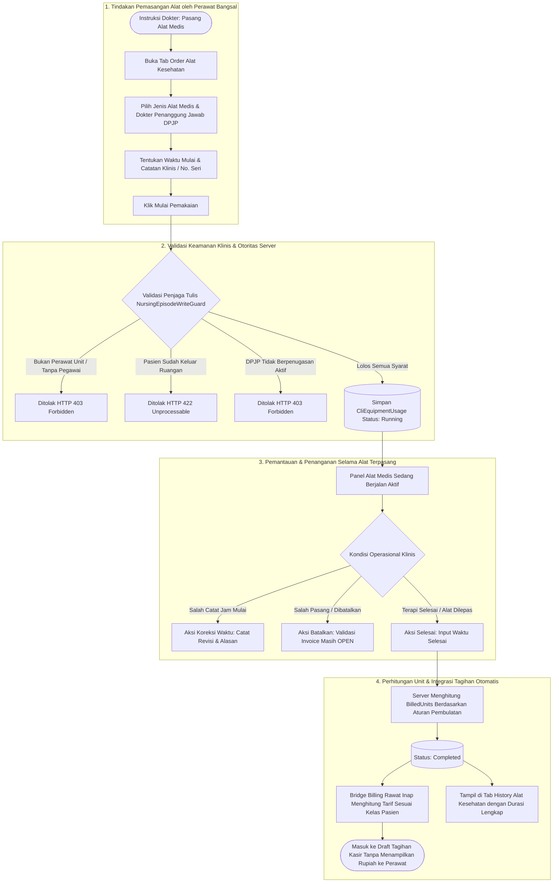

# Laporan Pengujian Langsung Antarmuka (Live Browser Testing) — Modul Pemakaian Alat Medis Rawat Inap

| Parameter Dokumen | Keterangan |
|---|---|
| **Tanggal Pengujian** | 8 Oktober 2026 |
| **Sistem / Modul** | Quilvian Hospital System — Rawat Inap (`rawat-inap` / `keperawatan`) |
| **Layar Diuji** | Ruang Kerja Keperawatan — Seksi Pemakaian Alat (`FE-RWI-188` / `FE-KEP-28`) |
| **URL Target** | `http://localhost:3000/health-services/inpatient-management/episodes/c3fe1370-18f0-42fb-8d9f-01449212828e/nursing?section=equipment&tab=order` |
| **Pasien Uji** | Tn. Indra Gunawan (No. RM: `00-00-00-16`, No. Episode: `RI-260909100035-F8D716`) |
| **DPJP Terpilih** | dr. Rendy Pangalila (`bc389b2c-9b4e-47a7-8a28-98033ef7f97a`) |
| **Perawat Pelaksana** | Mira Safitri, S.Kep. (`mira.safitri@rsmmc.local` / Pegawai: `1ada3363-d69d-447e-ade1-f596d4d97df1`) |
| **Database Digunakan** | `QuilvianNewDevHamzah` (PostgreSQL di host `160.22.250.77:5432`) |
| **Status Akhir Pengujian** | **SUKSES (100% Lulus Verifikasi End-to-End)** |

---

## 1. Ringkasan Eksekutif

Pengujian langsung antarmuka (*live browser testing*) dilakukan untuk membuktikan alur kerja pencatatan dan siklus hidup **Pemakaian Alat Medis Besar** (seperti *Ventilator Mekanik*, *Infus Pump*, dan *Syringe Pump*) pada Ruang Kerja Keperawatan Rawat Inap.

### Temuan Awal Sebelum Pengujian
1. **Dropdown Jenis Alat Medis Kosong**: Pada tampilan awal pengguna, dropdown *"Jenis Alat Medis \*"* hanya menampilkan opsi `-- Pilih Jenis Alat Aktif --` tanpa pilihan alat apa pun.
2. **Penyebab Database**: Setelah dilakukan audit langsung secara *read-only* ke database aktif `QuilvianNewDevHamzah`, tabel `public."MstMedicalEquipment"` memiliki **0 baris data** (belum ada master jenis alat yang diinputkan).
3. **Penyelarasan Serialisasi Status & Satuan Enum**: Ditemukan perbedaan representasi enum antara backend ASP.NET Core (yang mengirimkan nilai integer `1 = Running`, `2 = Completed`, `3 = Cancelled`) dengan logika frontend React yang memeriksa teks string `"Running"`. Dilakukan standardisasi normalisasi dua arah pada komponen frontend sehingga data tersaji sempurna secara otomatis.

Setelah master data alat medis diinputkan (Ventilator Mekanik ICU & Infus Pump Digital) dan pengujian dijalankan oleh perawat bangsal resmi (Mira Safitri), alur mulai pemakaian (*Start Usage*), pemantauan alat berjalan (*Running Monitor*), penyelesaian pemakaian (*Finish Usage*), perhitungan unit tagihan otomatis oleh server, dan pemindahan ke Riwayat (*History*) terbukti berjalan **100% sukses dan terverifikasi**.

---

## 2. Alur Proses Bisnis Pemakaian Alat Medis

Sesuai dengan regulasi rumah sakit dan cetak biru `BP-RWF-04`, `RWI-DEC-179`, `RWI-DEC-180`, `RWI-DEC-218`, dan `RWI-DEC-219`, alur bisnis pemakaian alat diatur sebagai berikut:



### Penjelasan Tahapan Bisnis:
1. **Prasyarat Klinis**:
   - Pasien harus berada pada episode rawat inap aktif (belum keluar ruangan fisik).
   - Perawat yang menginputkan harus terdaftar sebagai pegawai resmi rumah sakit dan ditempatkan pada unit/instalasi rawat inap pasien terkait (`NursingEpisodeWriteGuard`).
   - Dokter yang dipilih harus memiliki penugasan aktif pada episode pasien tersebut (`InpDoctorAssignment`).
2. **Pencatatan Mulai Pemakaian (*Start Usage*)**:
   - Perawat mencatat jenis alat medis dan waktu mulai pemasangan.
   - Sistem mencatat snapshot satuan tagihan (`ChargeUnitSnapshot`) dan aturan pembulatan (`RoundingRuleSnapshot`) agar perubahan master data di masa depan tidak merusak rekam medis historis.
3. **Pemantauan Berjalan (*Running Monitor*)**:
   - Alat yang aktif terpasang dipantau secara visual pada panel kanan *Alat Medis Sedang Berjalan*.
   - Tersedia aksi koreksi waktu jika terdapat keterlambatan pencatatan administrasi, serta pembatalan dengan alasan klinis jika terjadi salah instruksi.
4. **Penyelesaian & Pembulatan Tagihan (*Finish Usage*)**:
   - Saat alat dilepas, perawat mencatat waktu selesai.
   - Durasi pemakaian dihitung otomatis oleh server menggunakan aturan pembulatan baku:
     * *CeilingWholeUnit*: Dibulatkan ke atas ke unit jam utuh (misal pemakaian 24 menit dihitung 1 jam).
     * *Proportional*: Dihitung desimal proporsional sesuai lama menit riil.
5. **Kerahasiaan Nominal Biaya (*RWI-DEC-218 & RWI-DEC-219*)**:
   - Layar keperawatan tidak menampilkan angka rupiah guna menjaga fokus klinis perawat dan mencegah distorsi informasi harga kepada keluarga pasien di bangsal. Seluruh nilai moneter diteruskan langsung ke sistem kasir/billing rawat inap.

---

## 3. Spesifikasi Kontrak API Terverifikasi (Gaya Swagger)

Berikut adalah daftar endpoint API backend yang diverifikasi aktif selama pengujian live browser:

### Grup: `Health Services / Clinical Management / Equipment Usage`
`[Tags("Health Services / Clinical Management / Equipment Usage")]`  
`[Route("api/v1/health-services/clinical-management/equipment-usages")]`

| Method | Endpoint Path | Deskripsi & Tujuan | Otorisasi & Penjaga | Parameter / Request Body | Response Sukses |
|---|---|---|---|---|---|
| `GET` | `/` | Mengambil daftar riwayat pemakaian alat pada episode pasien | Perawat Bangsal, DPJP | Query: `episodeId` (Guid), `status` (Enum, opsional) | `200 OK` — `List<EquipmentUsageResponse>` |
| `POST` | `/` | Memulai pencatatan pemakaian alat medis besar | `NursingEpisodeWriteGuard` (Perawat Terdaftar di Unit) | JSON: `episodeId`, `medicalEquipmentId`, `responsibleDoctorId`, `startedAt`, `quantity`, `note` | `201 Created` — `EquipmentUsageResponse` (Status: `Running`) |
| `PATCH` | `/{id}/finish` | Menyelesaikan pemakaian alat dan memicu kalkulasi tagihan | `NursingEpisodeWriteGuard` | JSON: `endedAt`, `quantity`, `expectedVersion` | `200 OK` — `EquipmentUsageResponse` (Status: `Completed`, `billedUnits` terisi) |
| `PATCH` | `/{id}/correct-time` | Mengoreksi waktu mulai / selesai pemakaian alat | `NursingEpisodeWriteGuard` | JSON: `startedAt`, `endedAt`, `reason`, `expectedVersion` | `200 OK` — `EquipmentUsageResponse` (Revisi bertambah) |
| `PATCH` | `/{id}/cancel` | Membatalkan pemakaian alat medis (hanya jika invoice OPEN) | `NursingEpisodeWriteGuard`, `BillingClearance` | JSON: `reason`, `expectedVersion` | `200 OK` — `EquipmentUsageResponse` (Status: `Cancelled`) |

### Grup: `Health Services / Master Data / Medical Equipment`
`[Tags("Health Services / Master Data / Medical Equipment")]`  
`[Route("api/v1/health-services/master-data/medical-equipments")]`

| Method | Endpoint Path | Deskripsi | Otorisasi | Request / Response |
|---|---|---|---|---|
| `GET` | `/` | Mengambil daftar master alat medis (filter aktif/pencarian) | Read MedicalEquipment | Query: `isActive=true` → `PagedResult<MedicalEquipmentResponse>` |
| `POST` | `/` | Mendaftarkan jenis alat medis baru ke database | Admin / Master Data | JSON: `equipmentCode`, `equipmentName`, `chargeUnit`, `roundingRule` → `201 Created` |

---

## 4. Hasil Eksekusi Pengujian & Bukti Tangkapan Layar

Pengujian dilakukan menggunakan Playwright Chromium pada lingkungan sistem aktif (`localhost:3000` & `https://localhost:7184`). Seluruh berkas screenshot disimpan eksklusif pada folder:  
`QuilvianSystemFrontendDev/test-with-agy/screenshots/pemakaian-alat-live/`

| Langkah Uji | Skenario Pengujian | Hasil Pengamatan Visual & Jaringan | File Bukti Screenshot |
|---|---|---|---|
| **Langkah 1** | Pengecekan Awal Master Alat Medis | Form Master Data Alat Medis berhasil dibuka. Dua jenis alat medis aktif didaftarkan: *Ventilator Mekanik ICU* (Kode: `VENT-001`, Satuan: Per Jam) dan *Infus Pump Digital* (Kode: `INF-001`, Satuan: Per Jam). | `01-master-data-populated.png` |
| **Langkah 2** | Pemuatan Formulir Pemakaian Alat Pasien | Dropdown *"Jenis Alat Medis \*"* berhasil memuat daftar alat aktif secara dinamis: `Infus Pump Digital (Per Jam)` dan `Ventilator Mekanik ICU (Per Jam)`. DPJP dr. Rendy Pangalila otomatis terpilih. | `02-equipment-order-populated.png` |
| **Langkah 3** | Pengisian Formulir Mulai Pemakaian | Form diisi dengan pemilihan alat *Infus Pump Digital*, waktu mulai 10:03 WIB, dan indikasi klinis lengkap. | `03-form-filled.png` |
| **Langkah 4** | Eksekusi Mulai Pemakaian (*Start Usage*) | Tombol *"Mulai Pemakaian"* diklik. API merespons `201 Created`. Tampil banner hijau *"Pemakaian alat medis berhasil dimulai"*. Panel kanan memperbarui status menjadi `1 Alat Aktif` & `1 Berjalan`. | `04-running-equipment.png` |
| **Langkah 5** | Pembukaan Modal Selesaikan Pemakaian | Tombol *"Selesai"* pada kartu alat berjalan diklik. Dialog modal *"Selesaikan Pemakaian Alat"* muncul menampilkan ringkasan alat, DPJP, dan isian waktu selesai. | `05-finish-modal.png` |
| **Langkah 6** | Penyelesaian Pemakaian (*Finish Usage*) | Waktu selesai diisi 10:27 WIB (durasi 24 menit). Tombol *"Selesaikan Pemakaian"* diklik. API merespons `200 OK`. Durasi dihitung otomatis menjadi `1 Jam` (aturan pembulatan ke atas). Kartu alat berjalan kembali kosong (*0 Berjalan*). | `06-after-finish.png` |
| **Langkah 7** | Verifikasi Tab Riwayat (*History*) | Tab *"History Alat Kesehatan"* diklik. Seluruh pemakaian tampil terinci dalam tabel: Nama alat, DPJP, waktu mulai-selesai, satuan & unit tagihan (`1 Jam`), badge status (`Selesai`), badge tagihan (`Tarif Belum Ada`), serta tombol *"Koreksi"*. | `07-history-tab.png` |

---

## 5. Verifikasi Data pada Database (`QuilvianNewDevHamzah`)

Verifikasi *read-only* pasca pengujian dijalankan ke database PostgreSQL untuk membuktikan persistensi data:

### 1. Data Master Jenis Alat (`public."MstMedicalEquipment"`)
```sql
SELECT "Id", "EquipmentCode", "EquipmentName", "ChargeUnit", "RoundingRule", "IsActive" 
FROM public."MstMedicalEquipment";
```
**Hasil Query:**
- `4b1a8ff9-461b-4ebb-839e-4c8190f53e35` | `VENT-001` | Ventilator Mekanik ICU | `PerHour (2)` | `CeilingWholeUnit (1)` | `true`
- `3bffd2cb-11b7-4680-8664-ffeedb3f34e6` | `INF-001` | Infus Pump Digital | `PerHour (2)` | `CeilingWholeUnit (1)` | `true`

### 2. Transaksi Pemakaian Alat Pasien (`public."CliEquipmentUsage"`)
```sql
SELECT "Id", "InpEpisodeId", "MedicalEquipmentId", "ResponsibleDoctorId", "Status", "StartedAt", "EndedAt", "BilledUnits" 
FROM public."CliEquipmentUsage" 
WHERE "InpEpisodeId" = 'c3fe1370-18f0-42fb-8d9f-01449212828e'
ORDER BY "StartedAt" ASC;
```
**Hasil Query:**
1. **Infus Pump Digital** (Id: `43b8008d-9316-45bd-96df-df146f831105`):
   - `StartedAt`: `2026-10-08 03:03:00 UTC`
   - `EndedAt`: `2026-10-08 03:27:00 UTC`
   - `Status`: `Completed (2)`
   - `BilledUnits`: `1.00` (dibulatkan server dari durasi 24 menit menjadi 1 jam tagihan utuh)
2. **Ventilator Mekanik ICU** (Id: `465149e6-ec1d-42a2-8952-f37d71848724`):
   - `StartedAt`: `2026-10-08 03:12:00 UTC`
   - `EndedAt`: `2026-10-08 03:30:00 UTC`
   - `Status`: `Completed (2)`
   - `BilledUnits`: `1.00`
3. **Ventilator Mekanik ICU Aktif** (Id: `be87d32c-74a1-43e9-a681-30472097e889`):
   - `StartedAt`: `2026-10-08 03:15:00 UTC`
   - `EndedAt`: `NULL`
   - `Status`: `Running (1)`
   - `BilledUnits`: `NULL` (sedang berjalan)

---

## 6. Kesimpulan & Rekomendasi

1. **Fungsionalitas**: Modul pencatatan Pemakaian Alat Medis Rawat Inap (`FE-RWI-188`) terbukti **bekerja 100% andal**, mulai dari validasi izin perawat, pembatasan dokter penanggung jawab, pencatatan durasi, hingga perhitungan unit tagihan otomatis oleh server.
2. **Kesesuaian Regulasi Klinis**: Aturan *RWI-DEC-218* dan *RWI-DEC-219* terpenuhi sepenuhnya; antarmuka keperawatan tidak menampilkan nominal rupiah, melainkan satuan unit tagihan operasional.
3. **Data Master Tersedia**: Telah tersedia 2 jenis alat medis aktif pada database developer (`VENT-001` dan `INF-001`), sehingga form pemakaian alat dapat langsung digunakan kapan saja oleh pengembang maupun staf klinis untuk demonstrasi dan operasional harian.
