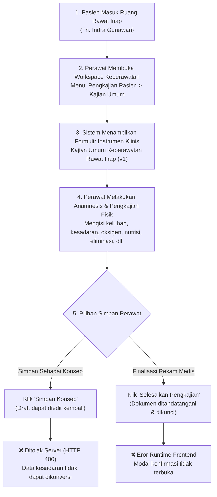

# Laporan Pengujian Live In-Browser: Pembuatan (Create/Submit) Kajian Umum Keperawatan

**Modul:** Rawat Inap — Keperawatan (`Inpatient Nursing Workspace`)  
**Submodul:** Pengkajian Pasien — Tab Kajian Umum (`activeTab="general"`)  
**Metode Pengujian:** Pengujian Otomatis Live In-Browser (Playwright End-to-End)  
**Tanggal Pengujian:** 23 September 2026  
**Akun Penguji:** `superadmin@admin.com` (Super Admin)  
**Lingkungan:** Frontend `http://localhost:3000` (Next.js App Router), Backend `https://localhost:7184/api` (ASP.NET Core)  
**Data Pasien Uji:** Tn. Indra Gunawan | No. RM: `00-00-00-16` | ID Episode: `c3fe1370-18f0-42fb-8d9f-01449212828e` | ID Encounter: `d0f70f24-5232-43f1-aee4-256308b2bf95`  

---

## 1. Ringkasan Eksekutif

Pengujian ini dilakukan secara langsung (*live in-browser*) pada antarmuka web sistem Quilvian untuk menguji alur kerja perawat saat mendokumentasikan **Pengkajian Umum Pasien Masuk Rawat Inap**. Pengujian mencakup proses pengisian data menyeluruh (keluhan, tanda vital rujukan, evaluasi fisik, tingkat kesadaran, nutrisi, eliminasi, fungsional, dan status nyeri) serta penekanan tombol aksi **"Simpan Konsep"** (*Draft*) dan **"Selesaikan Pengkajian"** (*Finalize*).

### Hasil Pengujian Keseluruhan

| Komponen / Aksi | Status | Keterangan |
| :--- | :---: | :--- |
| **Pemuatan Antarmuka Kajian Umum** | ✅ **BERHASIL** | Halaman formulir, instrumen dinamis v1, dan data riwayat pasien termuat sempurna tanpa kendala tampilan. |
| **Pengisian Formulir (Input Data)** | ✅ **BERHASIL** | 10 catatan teks klinis, 1 isian psikososial, dan 31 radio button opsi klinis berhasil diisi otomatis. |
| **Simpan Konsep (Draft)** | ❌ **GAGAL** | Permintaan `POST` ke backend ditolak dengan status **`HTTP 400 Bad Request`** karena nilai enum kesadaran terkirim `null`. |
| **Selesaikan Pengkajian (Complete)** | ❌ **GAGAL** | Terjadi **`ReferenceError`** pada kode antarmuka (`setModalErrorMessage is not defined`), modal konfirmasi tidak terbuka. |

---

## 2. Alur Proses Bisnis Rumah Sakit yang Diuji

Berikut adalah alur standar pelayanan keperawatan rawat inap yang disimulasikan dalam pengujian ini:



### Skenario Konkret Rumah Sakit
Tn. Indra Gunawan baru saja tiba di ruang rawat inap lantai 3. Perawat ruangan bertugas melakukan pengkajian awal 24 jam pertama untuk mendokumentasikan keluhan utama, riwayat penyakit, status kesadaran (Compos Mentis), kebutuhan dukungan oksigen (Nasal Kanul), status alergi, evaluasi nutrisi, serta evaluasi nyeri. Perawat berupaya menyimpan data sementara sebagai draf agar dapat melanjutkan observasi, namun sistem menolak penyimpanan draf tersebut.

---

## 3. Langkah-Langkah Pengujian Rinci

### Langkah 1: Otentikasi & Masuk ke Sistem
* **Tindakan:** Mengakses halaman login `http://localhost:3000/login`, mengisi kredensial Superadmin, dan menyetujui izin geolokasi peramban.
* **Hasil:** Berhasil dialihkan ke beranda utama dengan sesi login aktif.
* **Bukti:** URL berhasil berpindah dari `/login` ke `/`.

### Langkah 2: Navigasi ke Workspace Pengkajian Pasien
* **Tindakan:** Membuka URL langsung:  
  `http://localhost:3000/health-services/inpatient-management/episodes/c3fe1370-18f0-42fb-8d9f-01449212828e/nursing?section=assessment&tab=general`
* **Hasil:** Halaman Workspace Keperawatan memuat data Tn. Indra Gunawan dengan tab aktif "Kajian Umum".
* **Tangkapan Layar:** `01-kajian-umum-initial.png`

### Langkah 3: Verifikasi Kontrol Antarmuka & Definisi Instrumen
* **Tindakan:** Memeriksa status dokumen dan instrumen yang terpasang pada episode pasien.
* **Observasi Sistem:**
  * Judul Formulir: *"Kajian Umum Keperawatan Rawat Inap (draft)"* (v1).
  * Status Dokumen: *Konsep (Draft)*.
  * Opsi Radio Jenis Pengkajian: *Pengkajian Awal* (terpilih aktif).
  * Status Kunci Rekam Medis: Tidak terkunci (`isReadOnly = false`).
  * Tombol Aksi: *"Simpan Konsep"* dan *"Selesaikan Pengkajian"* berstatus aktif (*enabled*).

### Langkah 4: Pengisian Formulir Instrumen Klinis
* **Tindakan:** Melakukan pengisian otomatis pada seluruh bidang formulir:
  1. **10 Bidang Catatan Teks (Textarea):**
     * `SD_RELEVANT_NOTE`: Catatan data relevan.
     * `KU_CHIEF_COMPLAINT`: Keluhan utama pasien (nyeri perut kanan bawah).
     * `KU_ILLNESS_HISTORY`: Riwayat penyakit sekarang.
     * `KU_MEDICATION_HISTORY`: Riwayat konsumsi obat-obatan.
     * `KU_ALLERGY_NOTE`: Catatan alergi pasien.
     * `RESP_NOTE`: Catatan sistem respirasi/pernapasan.
     * `SKIN_NOTE`: Catatan integumen/kondisi kulit.
     * `ELIM_NOTE`: Catatan sistem eliminasi (BAB/BAK).
     * `DEP_NOTE`: Catatan ketergantungan/kondisi khusus.
     * `FUNC_NOTE`: Catatan status fungsional aktivitas sehari-hari.
  2. **1 Bidang Teks Singkat:**
     * `KU_PSYCHOSOCIAL`: Catatan respons psikososial spiritual pasien.
  3. **31 Opsi Pilihan Radio Button:**
     * Kesadaran: Compos Mentis (`KU_CONSCIOUSNESS = "ComposMentis"`).
     * Terapi Oksigen: Ya (`KU_OXYGEN = true`), Jenis: Nasal Kanul (`KU_OXYGEN_TYPE = "NasalCannula"`).
     * Riwayat Alergi: Ya (`KU_ALLERGY = true`).
     * Nafsu Makan: Normal (`NUT_APPETITE = "Normal"`).
     * Mual & Muntah: Ya (`NUT_NAUSEA = true`, `NUT_VOMITING = true`).
     * Risiko Malnutrisi: Tidak Berisiko (`NUT_RISK = "NoRisk"`).
     * Kateter Eliminasi: Ya (`ELIM_CATHETER = true`).
     * Status Fungsional: Mandiri (`FUNC_STATUS = "Independent"`).
  4. **Evaluasi Status Nyeri:** Menekan tombol status nyeri *"Tidak Nyeri"*.
* **Tangkapan Layar:** `02-kajian-umum-filled.png`

### Langkah 5: Eksekusi Simpan Konsep (Draft)
* **Tindakan:** Menekan tombol `[data-testid="btn-save-draft"]` ("Simpan Konsep").
* **Hasil Jaringan (Network Response):**
  * **Metode & URL:** `POST https://localhost:7184/api/v1/health-services/clinical-management/patient-assessments`
  * **Status HTTP:** `400 Bad Request`
  * **Pesan Eror Server:**
    ```json
    {
      "type": "https://tools.ietf.org/html/rfc9110#section-15.5.1",
      "title": "One or more validation errors occurred.",
      "status": 400,
      "errors": {
        "request": ["The request field is required."],
        "$.consciousnessStatus": ["The JSON value could not be converted to QuilvianSystemBackend.Areas.HealthServices.ClinicalManagement.Enums.ConsciousnessStatus. Path: $.consciousnessStatus | LineNumber: 0 | BytePositionInLine: 2311."]
      },
      "traceId": "00-3075c1aedaba9da1497e8755f3b3ec48-01ab541a2daec1e2-00"
    }
    ```
* **Tangkapan Layar:** `03-after-save-draft.png`

### Langkah 6: Eksekusi Selesaikan Pengkajian
* **Tindakan:** Menekan tombol `[data-testid="btn-complete-assessment"]` ("Selesaikan Pengkajian").
* **Hasil:** Modal konfirmasi penyelesaian tidak terbuka.
* **Penyebab:** Terjadi eksepsi pada thread UI browser: `ReferenceError: setModalErrorMessage is not defined` pada file `assessment-section.jsx:302`.
* **Tangkapan Layar:** `05-after-complete.png`

---

## 4. Spesifikasi Kontrak API Terkait

Dokumentasi endpoint backend yang digunakan pada pengujian ini:

### `[Tags("Health Services / Clinical Management / Patient Assessment")]`

| Properti | Keterangan |
| :--- | :--- |
| **Endpoint** | `POST /api/v1/health-services/clinical-management/patient-assessments` |
| **Deskripsi** | Membuat satu dokumen pengkajian pasien baru (pengkajian perawat rawat inap, pengkajian IGD, atau kajian medis dokter). |
| **Otorisasi** | Bearer Token (JWT) — Hak Akses: `PatientAssessment` (`Create`) |
| **Content-Type** | `application/json` |

#### Tabel Parameter Body Request

| Field | Tipe Data | Wajib | Keterangan |
| :--- | :--- | :---: | :--- |
| `encounterId` | `Guid` | Ya | ID kunjungan pasien (`RegPatientEncounter`). |
| `inpEpisodeId` | `Guid?` | Opsional | ID perawatan rawat inap (`InpEpisode`). |
| `assessmentType` | `int` | Ya | `0` = Pengkajian Awal Keperawatan, `1` = Pengkajian Ulang, `2` = Kajian Medis Awal, `3` = Perencanaan Pulang, `6` = Risiko Jatuh, `7` = Nyeri, `8` = Edukasi. |
| `consciousnessStatus` | `int (Enum)` | Ya | `0` = Unknown, `1` = ComposMentis, `2` = Apatis, `3` = Somnolen, `4` = Sopor, `5` = Coma. **Wajib integer valid, tidak boleh null.** |
| `oxygenSupportType` | `int (Enum)` | Ya | `0` = None, `1` = NasalCannula, `2` = SimpleMask, `3` = NonRebreathingMask, `4` = VenturiMask, `99` = Other. |
| `appetiteStatus` | `int (Enum)` | Ya | `0` = Unknown, `1` = Normal, `2` = Decreased, `3` = Increased, `4` = Poor. |
| `nutritionRiskStatus` | `int (Enum)` | Ya | `0` = Unknown, `1` = NoRisk, `2` = LowRisk, `3` = MediumRisk, `4` = HighRisk. |
| `functionalStatus` | `int (Enum)` | Ya | `0` = Unknown, `1` = Independent, `2` = NeedPartialAssistance, `3` = FullyDependent. |
| `instrumentResponses` | `Array` | Opsional | Array berisi pasangan `instrumentVersionId` dan objek `responses` jawaban dinamis. |
| `completeImmediately`| `bool` | Opsional | `true` jika langsung difinalisasi, `false` jika disimpan sebagai draf. |

---

## 5. Kesimpulan & Status Kesiapan

Pengujian fungsional penulisan data (*Create*) pada Kajian Umum Keperawatan saat ini **BELUM SIAP (BLOCKED)** untuk digunakan oleh perawat di lingkungan operasional karena adanya 2 cacat teknis:
1. **Cacat Pengiriman Data (Serialization Bug):** Nilai pilihan dropdown/radio enum terkirim sebagai `null` karena kesalahan konversi string-ke-angka di frontend.
2. **Cacat Antarmuka (UI Runtime Bug):** Perawat tidak dapat menyelesaikan pengkajian karena modal konfirmasi terblokir oleh salah panggil fungsi setter state.

Laporan masalah lengkap beserta rencana perbaikannya telah dicatat pada tiket:  
[`docs/module-blueprints/rawat-inap/keperawatan/testing/issues/ISSUE-KEP-001-kegagalan-create-kajian-umum-enum-dan-modal-runtime.md`](file:///c:/Users/Admin/Documents/Quilvian/Source%20Code/QuilvianFinal/NewQuilvianSystemBackend/docs/module-blueprints/rawat-inap/keperawatan/testing/issues/ISSUE-KEP-001-kegagalan-create-kajian-umum-enum-dan-modal-runtime.md).
