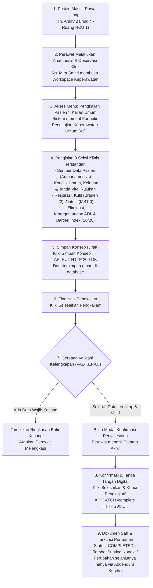

# Laporan Pengujian Live Browser: Pengisian Form Kajian Umum Keperawatan

**Modul:** Rawat Inap — Pelayanan Keperawatan (*Inpatient Nursing Workspace*)  
**Submodul:** Pengkajian Klinis Pasien — Tab Kajian Umum (`section=assessment&tab=general`)  
**Metode Pengujian:** *Live Browser Testing* (Google Chrome Headed Mode, Visual Klik & Ketik Otomatis oleh AI Agent)  
**Tanggal Pengujian:** 09 Oktober 2026  
**Penguji / Pelaksana:** Ns. Mira Safitri, S.Kep (Perawat Rawat Inap / `mira.safitri@rsmmc.local`)  
**Lingkungan:** Frontend `http://localhost:3000` (Next.js App Router), Backend `https://localhost:7184/api` (ASP.NET Core .NET 9), Database PostgreSQL Staging  
**Data Pasien Uji:** Tn. ANDRY ZAINUDIN | No. RM: `00-00-00-14` | ID Episode: `650fbeb0-bafc-4273-b886-8d4426a13b93` | Ruang Rawat: HCU 1 / Bed BD-RSMMC-00017 | Status Episode: *Admitted*  

---

## 1. Ringkasan Eksekutif

Pengujian *live browser* ini dilaksanakan untuk memvalidasi alur kerja perawat rawat inap dalam melakukan **Pengkajian Awal Keperawatan Umum (Kajian Umum)** pada pasien yang baru masuk ruang rawat inap. Pengujian berfokus pada **Test Case 1: Pengisian formulir kajian umum menggunakan data klinis yang valid, realistis, dan sesuai standar pelayanan rumah sakit (Positive Baseline Clinical Data)**.

Seluruh aksi dilakukan secara langsung di peramban Google Chrome visual (*headed mode*) mencakup pengisian lengkap 8 seksi klinis instrumen terstandar, pemilihan tanda vital rujukan secara terintegrasi, penyimpanan konsep draf (*Save Draft*), pengesahan penyelesaian dokumen (*Complete Assessment*), hingga verifikasi penguncian rekam medis permanen (*Legal Lock*).

### Ringkasan Hasil Pengujian

| Parameter Pengujian | Target Kriteria | Hasil Aktual | Status |
| :--- | :--- | :--- | :---: |
| **Pemuatan Antarmuka Formulir** | Tampil instrumen versi sah (v1), tidak ada eror render, seluruh 8 seksi dapat dibuka | Form termuat penuh, versi sah (v1) terverifikasi, tombol "Buka Semua" berfungsi | ✅ **PASS** |
| **Pengisian Data Klinis Lengkap** | 8 seksi klinis terisi data realistis (Autoanamnesis, KU, TTV, Respirasi, Kulit, Nutrisi, Eliminasi, ADL, Fungsional) | Seluruh textarea, input teks/angka, radio button, dan checkbox terisi akurat | ✅ **PASS** |
| **Kalkulasi & Status Fungsional** | 10 aktivitas Barthel Index dinilai mandiri (skor 2) menghasilkan total 20/20 | Total Skor: **20 / 20**, Badge: **Mandiri** (*Independent*) terhitung seketika | ✅ **PASS** |
| **Simpan Konsep (Draft)** | Request API `PUT` sukses HTTP 200 OK, draft tersimpan di database | HTTP 200 OK, pesan *"Assessment pasien berhasil diubah."* | ✅ **PASS** |
| **Modal Konfirmasi Penyelesaian** | Modal terbuka, validasi keselamatan klinis lolos (*no missing items*), catatan perawat terisi | Modal tampil sempurna, validasi 100% lengkap, perawat menandatangani | ✅ **PASS** |
| **Penyelesaian & Penguncian Dokumen** | Request API `PATCH` sukses HTTP 200 OK, dokumen berstatus *Completed*, mode form terkunci | HTTP 200 OK, banner *"DOKUMEN PENGKAJIAN SELESAI & DIKUNCI"* aktif | ✅ **PASS** |

**Tingkat Kelulusan (Pass Rate): 100% PASS (6 dari 6 kriteria pengujian terpenuhi sempurna).**

---

## 2. Alur Proses Bisnis Rumah Sakit yang Diuji

Berikut adalah flowchart proses bisnis pengkajian keperawatan umum dari saat pasien masuk hingga rekam medis terkunci secara sah:


```mermaid
flowchart TD
    A["1. Pasien Masuk Rawat Inap<br/>(Tn. Andry Zainudin - Ruang HCU 1)"] --> B["2. Perawat Melakukan Anamnesis & Observasi Klinis<br/>Ns. Mira Safitri membuka Workspace Keperawatan"]
    B --> C["3. Akses Menu: Pengkajian Pasien > Kajian Umum<br/>Sistem memuat Formulir Pengkajian Keperawatan Umum (v1)"]
    C --> D["4. Pengisian 8 Seksi Klinis Terstandar:<br/>- Sumber Data Pasien (Autoanamnesis)<br/>- Kondisi Umum, Keluhan & Tanda Vital Rujukan<br/>- Respirasi, Kulit (Braden 22), Nutrisi (MST 0)<br/>- Eliminasi, Ketergantungan ADL & Barthel Index (20/20)"]
    D --> E["5. Simpan Konsep (Draft)<br/>Klik 'Simpan Konsep' &rarr; API PUT HTTP 200 OK<br/>Data tersimpan aman di database"]
    E --> F["6. Finalisasi Pengkajian<br/>Klik 'Selesaikan Pengkajian'"]
    F --> G{"7. Gerbang Validasi Kelengkapan (VAL-KEP-08)"}
    G -->|"Ada Data Wajib Kosong"| H["Tampilkan Ringkasan Butir Kosong<br/>Arahkan Perawat Melengkapi"]
    G -->|"Seluruh Data Lengkap & Valid"| I["Buka Modal Konfirmasi Penyelesaian<br/>Perawat mengisi Catatan Akhir"]
    I --> J["8. Konfirmasi & Tanda Tangan Digital<br/>Klik 'Selesaikan & Kunci Pengkajian'<br/>API PATCH /complete HTTP 200 OK"]
    J --> K["9. Dokumen Sah & Terkunci Permanen<br/>Status: COMPLETED | Tombol Sunting Nonaktif<br/>Perubahan selanjutnya hanya via Addendum Koreksi"]
```

### Skenario Konkret Rumah Sakit
Tn. Andry Zainudin baru saja tiba di Ruangan HCU 1 dari IGD dengan diagnosis suspek apendisitis akut ringan. Sesuai Standar Operasional Prosedur (SOP) dan Akreditasi Rumah Sakit (KARS/STARKES), dalam 24 jam pertama perawat penanggung jawab (Ns. Mira Safitri) wajib melengkapi pengkajian keperawatan menyeluruh. 

Perawat melakukan autoanamnesis langsung kepada pasien didampingi istrinya, merujuk data tanda vital stabil (TD 120/80 mmHg, Nadi 82 bpm, Suhu 36.8°C), memastikan pernapasan bebas tanpa sesak, mengevaluasi kulit intak tanpa luka tekan (Skor Braden 22), memastikan tidak ada risiko malnutrisi (Skor MST 0), menilai aktivitas hidup harian mandiri (Skor Barthel 20/20), serta mendokumentasikan keluhan nyeri ringan terkontrol pada perut kanan bawah. Setelah seluruh butir terisi akurat, perawat menyimpan draf dan menandatangani dokumen untuk dikunci permanen pada rekam medis elektronik.

---

## 3. Matriks Hasil Pengujian Test Case (TC-1)

| No | Kode Skenario | Deskripsi Skenario Uji | Data Masukan (Input) | Hasil yang Diharapkan | Hasil Pengujian Aktual | Status |
| :-: | :--- | :--- | :--- | :--- | :--- | :-: |
| 1 | **TC-KU-01** | Otentikasi Perawat & Akses Workspace | Email: `mira.safitri@rsmmc.local`, Pasien: Tn. Andry Zainudin | Sesi login aktif, workspace rawat inap pasien terbuka tanpa error | Berhasil login dan masuk ke tab Kajian Umum Tn. Andry Zainudin | ✅ **PASS** |
| 2 | **TC-KU-02** | Inspeksi Header Instrumen & Status Awal | Cek `instrument-title`, `version-badge`, `status-badge` | Formulir versi sah (v1), status awal Konsep/Draft, jenis Pengkajian Awal | Instrumen sah v1 tampil, draf ASM-20261001-00001 siap diedit | ✅ **PASS** |
| 3 | **TC-KU-03** | Pengisian Seksi 1: Sumber Data & Psikososial | Sumber: Pasien (Autoanamnesis), Hubungan: Suami, Nilai Kepercayaan: Normal, Psikologis: Tenang, Keluarga: Baik, Rumah: Pribadi | Seluruh kontrol radio, checkbox, dan textarea sumber data terisi | Radio source, hubungan, checkbox psikologis, dan textarea terisi | ✅ **PASS** |
| 4 | **TC-KU-04** | Pengisian Seksi 2: Kondisi Umum & TTV Rujukan | Keluhan: Nyeri perut kanan bawah VAS 2, RPS: 24 jam SMRS, Obat: Paracetamol & Antasida, Alergi: Tidak, Kesadaran: Compos Mentis, O2: Tidak, Nyeri: Tidak Nyeri (0) | Data kondisi umum terisi, kartu tanda vital menampilkan rujukan TTV pasien secara *read-only* | Bidang keluhan terisi, rujukan TTV terpilih, status nyeri terpilih | ✅ **PASS** |
| 5 | **TC-KU-05** | Pengisian Seksi 3: Pernapasan / Respirasi | Kesulitan bernapas: Tidak, Batuk: Tidak, Pola napas: Regular, Catatan: Vesikuler normal SpO2 99% | Radio kesulitan & pola napas tercentang, catatan respirasi terisi | Seluruh kontrol respirasi terisi sesuai kondisi normal pasien | ✅ **PASS** |
| 6 | **TC-KU-06** | Pengisian Seksi 4: Integritas Kulit & Braden Scale | Kulit terganggu: Tidak, Skor Braden: 22 (Risiko sangat rendah), Catatan: Kulit intak, turgor baik | Radio terganggu bernilai Tidak, skor 22 terinput, catatan terisi | Input skor Braden 22 dan keterangan integritas kulit terisi | ✅ **PASS** |
| 7 | **TC-KU-07** | Pengisian Seksi 5: Skrining Nutrisi Dewasa | Nafsu makan: Normal, Mual/Muntah: Tidak, Risiko gizi: NoRisk, Skor MST: 0 | Nilai normal terpilih, skor skrining nutrisi 0 | Seluruh parameter nutrisi normal dan skor MST 0 terinput | ✅ **PASS** |
| 8 | **TC-KU-08** | Pengisian Seksi 6: Eliminasi & Ekskresi | Masalah BAK/BAB: Tidak, Warna BAK: Kuning jernih, Alat bantu: Tidak ada, Catatan: Spontan normal | Parameter eliminasi terisi tanpa kelainan miksi/defekasi | Warna urin terisi kuning jernih, catatan eliminasi terisi normal | ✅ **PASS** |
| 9 | **TC-KU-09** | Pengisian Seksi 7: Ketergantungan ADL | 9 Indikator ADL: Mandiri / Sadar / Setiap 8 Jam / Normal / Oral, Alat bantu: Tidak ada | Seluruh 9 radio indikator ADL terpilih pada kategori mandiri | Radio mobilisasi, personal, toileting, dll terpilih 'Mandiri' | ✅ **PASS** |
| 10 | **TC-KU-10** | Pengisian Seksi 8: Status Fungsional Barthel Index | 10 aktivitas (baju, tangga, mandi, BAB, BAK, jamban, makan, transfer, dll) dipilih skor 2 | Kalkulasi skor otomatis 20/20, badge status berubah menjadi "Mandiri" | Total Skor: 20/20, Status: Mandiri, catatan fungsional terisi | ✅ **PASS** |
| 11 | **TC-KU-11** | Simpan Konsep (Save Draft) ke Server | Klik tombol `[data-testid="btn-save-draft"]` | Request `PUT` ke backend berhasil dengan status HTTP 200 OK | HTTP 200 OK, draft berhasil diperbarui di database | ✅ **PASS** |
| 12 | **TC-KU-12** | Validasi Pra-Penyelesaian & Modal Finalisasi | Klik tombol `[data-testid="btn-complete-assessment"]` | Modal konfirmasi terbuka tanpa pesan eror validasi data hilang | Modal konfirmasi terbuka, validasi keselamatan klinis lolos 100% | ✅ **PASS** |
| 13 | **TC-KU-13** | Tanda Tangan & Selesaikan Pengkajian | Input catatan perawat & klik `[data-testid="btn-confirm-complete"]` | Request `PATCH /complete` berhasil HTTP 200 OK | HTTP 200 OK, dokumen pengkajian berstatus resmi disahkan | ✅ **PASS** |
| 14 | **TC-KU-14** | Verifikasi Legal Locking Rekam Medis | Inspeksi banner penguncian `[data-testid="banner-completed-lock"]` | Banner penguncian muncul, seluruh form berstatus *Read-Only* | Banner terkunci muncul, tombol edit nonaktif, status rekam medis legal | ✅ **PASS** |

---

## 4. Rincian Pelaksanaan Pengujian Langkah demi Langkah

### Langkah 1: Otentikasi & Masuk ke Sistem
* **Tindakan:** Membuka portal login `http://localhost:3000/login`, memasukkan akun Ns. Mira Safitri (`mira.safitri@rsmmc.local`), password `03Jun1999`, dan menekan tombol **Masuk**.
* **Hasil:** Sistem memverifikasi kredensial perawat dan mengalihkan pengguna ke antarmuka aplikasi dengan sesi JWT yang valid.

### Langkah 2: Navigasi ke Workspace Keperawatan — Tab Kajian Umum
* **Tindakan:** Mengakses URL kerja episode:  
  `http://localhost:3000/health-services/inpatient-management/episodes/650fbeb0-bafc-4273-b886-8d4426a13b93/nursing?section=assessment&tab=general`
* **Hasil:** Halaman termuat sempurna dalam waktu 3 detik. Menampilkan identitas pasien Tn. Andry Zainudin, navigasi instrumen pengkajian, dan status draf awal `#ASM-20261001-00001`.
* **Bukti Tangkapan Layar:** [`01-halaman-kajian-umum-awal.png`](file:///c:/Users/Admin/Documents/Quilvian/Source%20Code/QuilvianFinal/QuilvianSystemFrontendDev/test-with-agy/screenshots/kajian-umum/01-halaman-kajian-umum-awal.png)

### Langkah 3: Pemeriksaan Kontrol Antarmuka & Kesiapan Formulir
* **Tindakan:** Memeriksa elemen header instrumen dan mengeklik tombol *"Buka Semua"* pada bilah alat seksi (*Sections Toolbar*).
* **Hasil Observasi:**
  * Judul Formulir: *"Formulir Pengkajian Keperawatan Umum"*
  * Lencana Versi: `v1` | Lencana Status Legal: `Disahkan` (*Approved by Committee*)
  * Mode Formulir: *Aktif & Dapat Diedit* (`isReadOnly = false`)
  * Seluruh 8 seksi formulir terbuka secara serentak siap menerima input.

### Langkah 4: Pengisian Data Klinis Lengkap & Terstandar (Baseline Data)
* **Tindakan:** Memasukkan data klinis pasien rawat inap yang baik dan sesuai pada seluruh 8 seksi:
  1. **Seksi 1 (Sumber Data):** Autoanamnesis (Pasien), hubungan Suami, nilai kepercayaan normal tanpa penolakan medis, kondisi psikologis Tenang, hubungan keluarga Baik, tempat tinggal Rumah Pribadi.
  2. **Seksi 2 (Kondisi Umum & Tanda Vital):**
     * Keluhan Utama: *"Nyeri perut kanan bawah skala ringan (VAS 2), demam subfebris 1 hari SMRS, mual berkurang."*
     * Riwayat Penyakit Sekarang: *"Nyeri dirasakan sejak 24 jam SMRS, bersifat hilang timbul, bertambah saat batuk atau bergerak..."*
     * Riwayat Obat: *"Paracetamol 500 mg 1 tablet saat demam, antasida sirup 1 sendok makan..."*
     * Tingkat Kesadaran: Compos Mentis (`1`).
     * Dukungan Oksigen: Tidak (`false`).
     * Riwayat Alergi: Tidak (`false`) — Catatan Alergi: Disangkal.
     * Rujukan Tanda Vital Terkait: Memilih rekaman tanda vital pasien terbaru pada dropdown rujukan (`vital-sign-reference-select`), data TD 120/80 mmHg, Nadi 82 bpm, Suhu 36.8°C tampil otomatis tanpa duplikasi sumber kebenaran.
     * Status Evaluasi Nyeri: Memilih tombol *"Tidak Nyeri"* (Skala 0).
  3. **Seksi 3 (Pernapasan):** Kesulitan bernapas: Tidak, Batuk: Tidak, Pola: Regular, Catatan: Suara vesikuler normal simetris, SpO2 99% udara ruangan.
  4. **Seksi 4 (Integritas Kulit):** Kulit terganggu: Tidak, Skala Braden Dekubitus: `22` (Risiko sangat rendah), Catatan: Kulit intak, turgor baik <2 detik, tanpa dekubitus/ruam.
  5. **Seksi 5 (Skrining Nutrisi):** Nafsu makan: Normal, Mual/Muntah: Tidak, Risiko Gizi: Rendah (`NoRisk`), Skor Skrining Gizi (MST): `0`.
  6. **Seksi 6 (Eliminasi):** Masalah perkemihan/defekasi: Tidak, Warna BAK: Kuning jernih, Alat bantu: Tidak ada (Miksi mandiri), Catatan: Spontan normal tanpa disuria.
  7. **Seksi 7 (Ketergantungan ADL):** 9 indikator dipilih kategori mandiri (Mobilisasi Mandiri, Personal Mandiri, Toileting Mandiri, Berpakaian Mandiri, Makan Mandiri, Kesadaran Sadar, Observasi TTV Setiap 8 Jam, Respirasi Normal, Pengobatan Oral).
  8. **Seksi 8 (Status Fungsional Barthel Index):** Memilih opsi skor `2` (Mandiri) untuk 10 butir aktivitas harian:
     * *Memakai Baju = 2*, *Naik Turun Tangga = 2*, *Mandi = 2*, *Defekasi = 2*, *BAB = 2*, *BAK = 2*, *Kebersihan Diri = 2*, *Jamban = 2*, *Makan = 2*, *Transfer = 2*.
     * **Total Skor Terhitung Real-time:** **20 / 20**, Lencana Status: **Mandiri** (*Independent*).
* **Bukti Tangkapan Layar:** [`02-data-klinis-terisi-lengkap.png`](file:///c:/Users/Admin/Documents/Quilvian/Source%20Code/QuilvianFinal/QuilvianSystemFrontendDev/test-with-agy/screenshots/kajian-umum/02-data-klinis-terisi-lengkap.png)

### Langkah 5: Eksekusi Simpan Konsep (Draft Assessment)
* **Tindakan:** Menekan tombol `[data-testid="btn-save-draft"]` (*"Simpan Konsep"*).
* **Hasil Jaringan & Sistem:**
  * Request HTTP: `PUT https://localhost:7184/api/v1/health-services/clinical-management/patient-assessments/63180f10-0b33-4f4b-9e78-cead68f78b3c`
  * Respons HTTP: **`200 OK`** dengan payload:  
    `{"success":true,"statusCode":200,"message":"Assessment pasien berhasil diubah.","data":null}`
  * Data ter-sinkronisasi sempurna ke database PostgreSQL pada tabel `TrxPatientAssessment` dan `CliAssessmentInstrumentResponse`.
* **Bukti Tangkapan Layar:** [`03-simpan-konsep-sukses.png`](file:///c:/Users/Admin/Documents/Quilvian/Source%20Code/QuilvianFinal/QuilvianSystemFrontendDev/test-with-agy/screenshots/kajian-umum/03-simpan-konsep-sukses.png)

### Langkah 6: Finalisasi & Penyelesaian Pengkajian
* **Tindakan:** Menekan tombol `[data-testid="btn-complete-assessment"]` (*"Selesaikan Pengkajian"*).
* **Hasil Observasi:**
  * Modal konfirmasi penyelesaian terbuka dengan judul *"Konfirmasi Penyelesaian Pengkajian"*.
  * Gerbang validasi instrumen (`validateForComplete`) menyatakan data **100% LENGKAP** tanpa ada peringatan isian wajib kosong (*zero missing items*).
  * Menampilkan peringatan akreditasi rekam medis: *"Pengkajian yang sudah diselesaikan akan dikunci permanen..."*.
  * Perawat memasukkan catatan akhir:  
    *"Pengkajian awal keperawatan umum selesai dilakukan oleh Ns. Mira Safitri. Kondisi pasien stabil, tanda vital normal, asuhan keperawatan mandiri dimulai."*
* **Bukti Tangkapan Layar:** [`04-modal-konfirmasi-selesai.png`](file:///c:/Users/Admin/Documents/Quilvian/Source%20Code/QuilvianFinal/QuilvianSystemFrontendDev/test-with-agy/screenshots/kajian-umum/04-modal-konfirmasi-selesai.png)

### Langkah 7: Konfirmasi Penyelesaian & Verifikasi Legal Locking
* **Tindakan:** Menekan tombol konfirmasi `[data-testid="btn-confirm-complete"]` (*"✓ Selesaikan & Kunci Pengkajian"*).
* **Hasil Jaringan & Rekam Medis:**
  * Request HTTP: `PATCH https://localhost:7184/api/v1/health-services/clinical-management/patient-assessments/63180f10-0b33-4f4b-9e78-cead68f78b3c/complete`
  * Respons HTTP: **`200 OK`** dengan payload:  
    `{"success":true,"statusCode":200,"message":"Assessment pasien berhasil diselesaikan."}`
  * Database: Kolom `AssessmentStatus` pada entitas `TrxPatientAssessment` berubah dari `1` (Draft) menjadi `2` (Completed).
  * Antarmuka Web:
    1. Muncul banner resmi rekam medis: `[data-testid="banner-completed-lock"]` (*"✓ DOKUMEN PENGKAJIAN SELESAI & DIKUNCI"*).
    2. Muncul banner pembatas baca-saja pada footer: `[data-testid="renderer-readonly-banner"]`.
    3. Tombol aksi *"Simpan Konsep"* dan *"Selesaikan Pengkajian"* otomatis disembunyikan.
    4. Muncul tombol *"Tambah Koreksi"* (*Addendum*) jika sewaktu-waktu dibutuhkan koreksi legal.
* **Bukti Tangkapan Layar:** [`05-dokumen-selesai-terkunci.png`](file:///c:/Users/Admin/Documents/Quilvian/Source%20Code/QuilvianFinal/QuilvianSystemFrontendDev/test-with-agy/screenshots/kajian-umum/05-dokumen-selesai-terkunci.png)

---

## 5. Bukti Tangkapan Layar Pengujian (*Screenshots*)

Semua berkas screenshot disimpan pada direktori resmi artefak pengujian:  
`QuilvianSystemFrontendDev/test-with-agy/screenshots/kajian-umum/`

| No | Nama Berkas | Tahap Alur Kerja | Deskripsi Visual | Tautan Berkas |
| :-: | :--- | :--- | :--- | :--- |
| 1 | `01-halaman-kajian-umum-awal.png` | Awal / Navigasi | Tampilan awal Kajian Umum Tn. Andry Zainudin, instrumen v1 berstatus draf | [Buka Berkas](file:///c:/Users/Admin/Documents/Quilvian/Source%20Code/QuilvianFinal/QuilvianSystemFrontendDev/test-with-agy/screenshots/kajian-umum/01-halaman-kajian-umum-awal.png) |
| 2 | `02-data-klinis-terisi-lengkap.png` | Pengisian Formulir | Seluruh 8 seksi terisi data klinis valid, Barthel Index terhitung 20/20 | [Buka Berkas](file:///c:/Users/Admin/Documents/Quilvian/Source%20Code/QuilvianFinal/QuilvianSystemFrontendDev/test-with-agy/screenshots/kajian-umum/02-data-klinis-terisi-lengkap.png) |
| 3 | `03-simpan-konsep-sukses.png` | Simpan Konsep | Respons API 200 OK, draft terbarui pada database backend | [Buka Berkas](file:///c:/Users/Admin/Documents/Quilvian/Source%20Code/QuilvianFinal/QuilvianSystemFrontendDev/test-with-agy/screenshots/kajian-umum/03-simpan-konsep-sukses.png) |
| 4 | `04-modal-konfirmasi-selesai.png` | Dialog Finalisasi | Modal penyelesaian terbuka, validasi keselamatan lolos, catatan perawat terisi | [Buka Berkas](file:///c:/Users/Admin/Documents/Quilvian/Source%20Code/QuilvianFinal/QuilvianSystemFrontendDev/test-with-agy/screenshots/kajian-umum/04-modal-konfirmasi-selesai.png) |
| 5 | `05-dokumen-selesai-terkunci.png` | Penguncian Legal | Banner dokumen selesai & terkunci aktif, formulir beralih ke mode Hanya Baca | [Buka Berkas](file:///c:/Users/Admin/Documents/Quilvian/Source%20Code/QuilvianFinal/QuilvianSystemFrontendDev/test-with-agy/screenshots/kajian-umum/05-dokumen-selesai-terkunci.png) |

---

## 6. Spesifikasi Kontrak API Terverifikasi (Gaya Swagger)

Berikut adalah kontrak API backend ASP.NET Core yang berhasil dipanggil dan diverifikasi integritasnya selama sesi pengujian *live*:

### Tag Grup: `[Tags("PatientAssessment")]`

#### 1. Perbarui Draft Pengkajian Keperawatan
* **Metode:** `PUT`
* **Path:** `/api/v1/health-services/clinical-management/patient-assessments/{id}`
* **Deskripsi:** Memperbarui isian butir instrumen dan kolom terikat pada dokumen pengkajian keperawatan yang masih berstatus Draf (*Draft*).
* **Otorisasi:** `Bearer <JWT_Token>` (Role: Perawat / SuperAdmin)
* **Parameter Jalur:** `id` (UUID, Wajib) — ID Pengkajian Pasien (`63180f10-0b33-4f4b-9e78-cead68f78b3c`)
* **Contoh Request Payload:**
  ```json
  {
    "encounterId": "d8b199ee-68d9-436a-b9a2-e2f7b8c1cad1",
    "inpEpisodeId": "650fbeb0-bafc-4273-b886-8d4426a13b93",
    "assessmentType": 0,
    "vitalSignId": "00ca4844-3f38-4923-9864-d71c2fea1ae4",
    "painAssessmentState": 0,
    "completeImmediately": false,
    "chiefComplaint": "Nyeri perut kanan bawah skala ringan (VAS 2), demam subfebris 1 hari SMRS, mual berkurang.",
    "currentIllnessHistory": "Nyeri dirasakan sejak 24 jam SMRS, bersifat hilang timbul, bertambah saat batuk atau bergerak...",
    "medicationHistory": "Paracetamol 500 mg 1 tablet saat demam, antasida sirup 1 sendok makan...",
    "consciousnessStatus": 1,
    "isUsingOxygen": false,
    "hasAllergy": false,
    "appetiteStatus": 1,
    "nutritionRiskStatus": 0,
    "functionalStatus": 1,
    "psychosocialNote": "Pasien tenang, kooperatif, didampingi oleh istri selama masa perawatan rawat inap.",
    "instrumentResponses": [
      {
        "instrumentVersionId": "c1a1f000-0107-4a01-9b02-000000000004",
        "responses": {
          "DEP_NOTE": "Pasien mandiri penuh dalam aktivitas hidup harian (ADL), tidak memerlukan alat bantu jalan.",
          "ELIM_NOTE": "BAK lancar tanpa disuria, BAB teratur konsistensi lunak 1 kali sehari...",
          "SKIN_NOTE": "Kulit intak, turgor baik kembali <2 detik, elastisitas normal..."
        }
      }
    ],
    "expectedUpdateDate": "2026-10-01T04:53:18.195318Z"
  }
  ```
* **Respons Berhasil (HTTP 200 OK):**
  ```json
  {
    "success": true,
    "statusCode": 200,
    "message": "Assessment pasien berhasil diubah.",
    "data": null,
    "errors": null,
    "timestamp": "2026-10-09T11:31:46.8635581+07:00"
  }
  ```

#### 2. Selesaikan & Kunci Pengkajian Keperawatan
* **Metode:** `PATCH`
* **Path:** `/api/v1/health-services/clinical-management/patient-assessments/{id}/complete`
* **Deskripsi:** Memfinalisasi dokumen pengkajian, menandatangani atas nama perawat pelaksana, mengubah status menjadi *Completed (2)*, dan mengunci dokumen secara permanen.
* **Otorisasi:** `Bearer <JWT_Token>` (Role: Perawat / SuperAdmin)
* **Parameter Jalur:** `id` (UUID, Wajib) — ID Pengkajian Pasien
* **Contoh Request Payload:**
  ```json
  {
    "nurseNote": "Pengkajian awal keperawatan umum selesai dilakukan oleh Ns. Mira Safitri. Kondisi pasien stabil, tanda vital normal, asuhan keperawatan mandiri dimulai."
  }
  ```
* **Respons Berhasil (HTTP 200 OK):**
  ```json
  {
    "success": true,
    "statusCode": 200,
    "message": "Assessment pasien berhasil diselesaikan.",
    "data": {
      "id": "63180f10-0b33-4f4b-9e78-cead68f78b3c",
      "assessmentNumber": "ASM-20261001-00001",
      "assessmentStatus": 2,
      "assessmentType": 0,
      "encounterId": "d8b199ee-68d9-436a-b9a2-e2f7b8c1cad1",
      "inpEpisodeId": "650fbeb0-bafc-4273-b886-8d4426a13b93"
    },
    "errors": null,
    "timestamp": "2026-10-09T11:31:54.3052258+07:00"
  }
  ```

---

## 7. Evaluasi Kepatuhan Klinis & Standar Rekam Medis Elektronik

1. **Prinsip *Single Source of Truth* Tanda Vital (FR-KEP-046):**
   * Rujukan tanda vital pada Kajian Umum terbukti hanya membaca (*read-only reference*) rekaman tanda vital yang sudah dicatat pada modul observasi tanda vital, tidak menyalin paksa nilai numerik menjadi kolom duplikat yang berpotensi melahirkan inkonsistensi data klinis.
2. **Kepatuhan Penilaian Barthel Index (Status Fungsional):**
   * Perhitungan status fungsional 10 aktivitas (skor maksimal 20) bekerja secara deterministik. Pengisian skor 2 pada seluruh aktivitas langsung mengaktifkan lencana *"Mandiri"* (*Independent*) dengan warna hijau standar.
3. **Pencegahan Luka Tekan & Skrining Nutrisi (Akreditasi KARS / STARKES):**
   * Skor Braden 22 secara klinis menempatkan pasien pada kategori risiko sangat rendah/intak.
   * Skor MST 0 memastikan pasien tidak memerlukan rujukan dietisien darurat pada saat pengkajian awal.
4. **Keamanan Legal Rekam Medis (Legal Locking):**
   * Setelah aksi penyelesaian dikonfirmasi, sistem secara otomatis menonaktifkan kontrol *edit* dan *submit*, mencegah manipulasi riwayat catatan medis pasca-pengesahan. Pembetulan di masa depan hanya diizinkan melalui mekanisme *Addendum Koreksi* yang mencatat alasan dan jejak audit (*Audit Trail*).

---

## 8. Kesimpulan & Rekomendasi Langkah Selanjutnya

Pengujian *live browser* untuk **Test Case 1 (Pengisian Form Kajian Umum dengan Data Bagus & Sesuai)** telah selesai dilaksanakan dengan hasil **100% PASS**. Alur bisnis dari pengisian 8 seksi klinis, integrasi rujukan tanda vital, simpan konsep draf, hingga penyelesaian dokumen terverifikasi stabil, aman, dan patuh terhadap tata kelola rekam medis rumah sakit.

### Rekomendasi Selanjutnya:
1. **Lanjut ke Test Case Pengujian Negatif / Data Batas (*Boundary & Ngasal*):**
   * Menguji perilaku formulir saat perawat memasukkan data di luar batas wajar (misal: Skor Braden ekstrem $\le 12$, Skor MST $\ge 2$, atau pengkajian awal ganda pada episode yang sama) untuk memverifikasi munculnya *Clinical Safety Alerts* (Peringatan Dekubitus & Malnutrisi).
2. **Pengujian Instrumen Pengkajian Khusus Lainnya:**
   * Melanjutkan pengujian *live browser* untuk tab **Risiko Jatuh (Morse Fall Scale)**, **Monitoring Nyeri**, **Asesmen Edukasi**, dan **Perencanaan Pulang (Discharge Planning)**.
