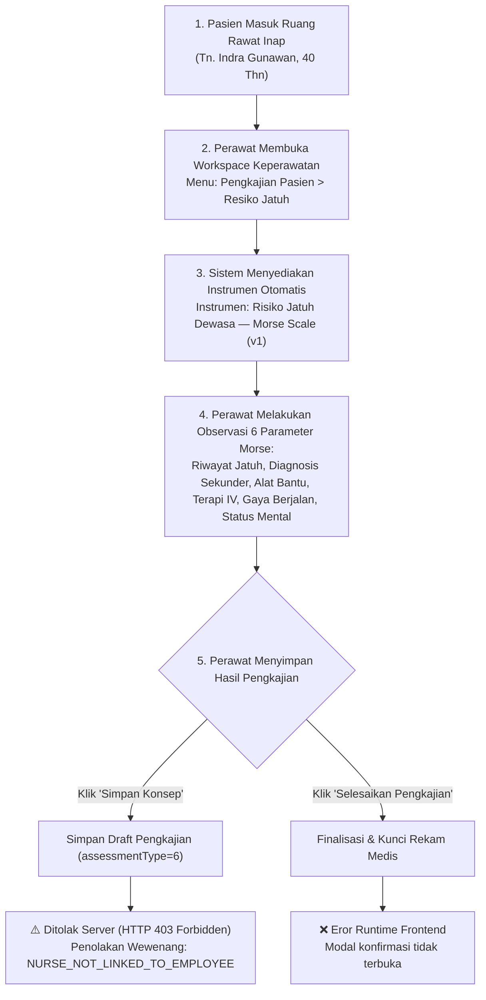

# Laporan Pengujian Live In-Browser: Pembuatan (Create/Submit) Resiko Jatuh Keperawatan

**Modul:** Rawat Inap — Keperawatan (`Inpatient Nursing Workspace`)  
**Submodul:** Pengkajian Pasien — Tab Resiko Jatuh (`activeTab="fall-risk"`)  
**Metode Pengujian:** Pengujian Otomatis Live In-Browser (Playwright End-to-End)  
**Tanggal Pengujian:** 23 September 2026  
**Akun Penguji:** `superadmin@admin.com` (Super Admin)  
**Lingkungan:** Frontend `http://localhost:3000` (Next.js App Router), Backend `https://localhost:7184/api` (ASP.NET Core)  
**Data Pasien Uji:** Tn. Indra Gunawan | No. RM: `00-00-00-16` | ID Episode: `c3fe1370-18f0-42fb-8d9f-01449212828e` | ID Encounter: `d0f70f24-5232-43f1-aee4-256308b2bf95`  
**Lokasi Bukti Gambar:** `QuilvianSystemFrontendDev/test-with-agy/screenshots/create-resiko-jatuh/`  

---

## 1. Ringkasan Eksekutif Pengujian

Pengujian dilakukan secara langsung (*live in-browser*) pada antarmuka web sistem Quilvian untuk menguji alur kerja perawat saat melakukan pengkajian dan pencatatan **Skala Risiko Jatuh Pasien Rawat Inap** menggunakan instrumen berstandar medis **Morse Fall Scale (MFS)**.

Pengujian mencakup pemuatan instrumen dinamis versi server (v1), pengisian 6 kelompok parameter klinis risiko jatuh, pengujian tombol **"Simpan Konsep"** (*Draft*), serta pengujian tombol **"Selesaikan Pengkajian"** (*Finalize*).

### Hasil Pengujian Keseluruhan

| Komponen / Aksi | Status | Keterangan |
| :--- | :---: | :--- |
| **Pemuatan Antarmuka Resiko Jatuh** | ✅ **BERHASIL** | Halaman dan kartu instrumen *Risiko Jatuh Dewasa — Morse (v1)* termuat sempurna dengan 6 kelompok pertanyaan terstruktur. |
| **Pengisian Formulir Morse Scale** | ✅ **BERHASIL** | Seluruh 6 pertanyaan berhasil dipilih opsinya dengan bobot risiko tinggi (skor kalkulasi server = 125 poin). |
| **Simpan Konsep (Draft)** | ⚠️ **DITOLAK (HTTP 403)** | Model data valid (tanpa eror 400), namun ditolak oleh penjaga kewenangan klinis backend (*Clinical Governance Guard*) karena akun `superadmin@admin.com` belum tertaut ke data perawat/pegawai aktif. |
| **Selesaikan Pengkajian (Complete)** | ❌ **GAGAL** | Terjadi **`ReferenceError`** pada kode antarmuka (`setModalErrorMessage is not defined`), modal konfirmasi tidak terbuka. |

---

## 2. Alur Proses Bisnis Pelayanan Rumah Sakit

Berikut adalah alur standar keselamatan pasien (*Patient Safety*) terkait pencegahan risiko jatuh yang disimulasikan pada pengujian ini:



### Skenario Konkret Rumah Sakit
Tn. Indra Gunawan (40 tahun) sedang dirawat dengan infus terpasang dan merasakan lemas serta gangguan keseimbangan saat berjalan dari tempat tidur ke kamar mandi. Sesuai sasaran keselamatan pasien (SKP III: Pengurangan Risiko Pasien Jatuh), perawat ruangan wajib melakukan asesmen risiko jatuh menggunakan Skala Morse:
1. Riwayat jatuh 3 bulan terakhir: Ya (+25)
2. Diagnosis medis sekunder: Ya (+15)
3. Alat bantu berjalan: Berpegangan pada perabot/dinding (+30)
4. Terpasang infus intravena: Ya (+20)
5. Gaya berjalan: Terganggu/lemah (+20)
6. Status mental: Sering lupa keterbatasan diri (+15)
* **Total Estimasi Skor:** **125 Poin (Kategori Risiko Tinggi / High Risk)**. Pasien ini wajib dipasangi pita/gelang kuning penanda risiko jatuh dan penghalang tempat tidur dinaikkan.

---

## 3. Langkah-Langkah Pengujian Rinci

### Langkah 1: Otentikasi & Masuk ke Sistem
* **Tindakan:** Mengakses halaman login `http://localhost:3000/login`, mengisi kredensial Superadmin, dan menyetujui izin geolokasi peramban.
* **Hasil:** Berhasil masuk ke sistem dan dialihkan ke beranda utama.

### Langkah 2: Navigasi ke Tab Resiko Jatuh
* **Tindakan:** Membuka URL langsung:  
  `http://localhost:3000/health-services/inpatient-management/episodes/c3fe1370-18f0-42fb-8d9f-01449212828e/nursing?section=assessment&tab=fall-risk`
* **Hasil:** Halaman Workspace Keperawatan memuat data Tn. Indra Gunawan dengan sub-tab aktif **Resiko Jatuh**.
* **Tangkapan Layar:** `01-fall-risk-initial.png`

### Langkah 3: Inspeksi Kontrol Antarmuka & Definisi Instrumen
* **Tindakan:** Memeriksa informasi instrumen klinis yang aktif.
* **Observasi Sistem:**
  * Judul Instrumen: *"Risiko Jatuh Dewasa — Morse (draft dari V1)"* (v1).
  * Status Dokumen: *Konsep (Draft)*.
  * Tag Status Instrumen: *Konsep (Draft)* dengan banner peringatan keselamatan.
  * Status Kunci: Belum dikunci (`isReadOnly = false`).
  * Tombol Aksi: *"Simpan Konsep"* dan *"Selesaikan Pengkajian"* aktif (*enabled*).

### Langkah 4: Pengisian Formulir Morse Fall Scale
* **Tindakan:** Mengisi seluruh 6 kelompok pertanyaan radio button dengan skenario risiko tinggi:
  1. `single-MORSE_HISTORY`: **Ya (+25)**
  2. `single-MORSE_SECONDARY_DX`: **Ya (+15)**
  3. `single-MORSE_AMBULATORY_AID`: **Berpegangan pada perabot (+30)**
  4. `single-MORSE_IV`: **Ya (+20)**
  5. `single-MORSE_GAIT`: **Terganggu (+20)**
  6. `single-MORSE_MENTAL`: **Lupa keterbatasan diri (+15)**
* **Tangkapan Layar:** `02-fall-risk-filled.png`

### Langkah 5: Eksekusi Simpan Konsep (Draft)
* **Tindakan:** Menekan tombol `[data-testid="btn-save-draft"]` ("Simpan Konsep").
* **Hasil Jaringan (Network Response):**
  * **Metode & URL:** `POST https://localhost:7184/api/v1/health-services/clinical-management/patient-assessments`
  * **Payload yang Terkirim:**
    ```json
    {
      "encounterId": "d0f70f24-5232-43f1-aee4-256308b2bf95",
      "inpEpisodeId": "c3fe1370-18f0-42fb-8d9f-01449212828e",
      "assessmentType": 6,
      "instrumentResponses": [
        {
          "instrumentVersionId": "c1a1f000-0107-4a01-9b02-000000000002",
          "responses": {
            "MORSE_HISTORY": "YES",
            "MORSE_SECONDARY_DX": "YES",
            "MORSE_AMBULATORY_AID": "FURNITURE",
            "MORSE_IV": "YES",
            "MORSE_GAIT": "IMPAIRED",
            "MORSE_MENTAL": "FORGETS_LIMITATIONS"
          }
        }
      ],
      "vitalSignId": null,
      "painAssessmentState": 0,
      "completeImmediately": false,
      "consciousnessStatus": 1,
      "isUsingOxygen": false,
      "oxygenSupportType": 0,
      "appetiteStatus": 1,
      "nutritionRiskStatus": 0,
      "functionalStatus": 1
    }
    ```
  * **Catatan Positif:** Pada sub-tab Resiko Jatuh, nilai enum bawaan (`consciousnessStatus: 1`, `oxygenSupportType: 0`, dll.) terkirim sebagai integer valid sehingga **TIDAK terjadi eror HTTP 400**.
  * **Status HTTP Response:** **`403 Forbidden`**
  * **Respons Server:**
    ```json
    {
      "success": false,
      "statusCode": 403,
      "message": "Akun Anda belum tertaut ke data pegawai, sehingga unit tempat Anda bertugas tidak dapat ditentukan. Hubungi bagian kepegawaian untuk menautkannya.",
      "data": null,
      "errors": {
        "code": "NURSE_NOT_LINKED_TO_EMPLOYEE"
      },
      "timestamp": "2026-09-23T11:37:22.0866253+07:00"
    }
    ```
  * **Tampilan Banner Layar:** Muncul banner merah di atas formulir:  
    *"Akun Anda belum tertaut ke data pegawai, sehingga unit tempat Anda bertugas tidak dapat ditentukan. Hubungi bagian kepegawaian untuk menautkannya."*
  * **Tangkapan Layar:** `03-after-save-draft.png`

### Langkah 6: Eksekusi Selesaikan Pengkajian
* **Tindakan:** Menekan tombol `[data-testid="btn-complete-assessment"]` ("Selesaikan Pengkajian").
* **Hasil:** Modal konfirmasi tidak terbuka karena adanya eksepsi JavaScript yang sama: `ReferenceError: setModalErrorMessage is not defined` pada file `assessment-section.jsx:302`.
* **Tangkapan Layar:** `05-after-complete.png`

---

## 4. Analisis Teknis & Evaluasi Tata Kelola Klinis

1. **Penolakan HTTP 403 (`NURSE_NOT_LINKED_TO_EMPLOYEE`):**
   * Penolakan ini adalah bukti bahwa aturan keselamatan tata kelola klinis Quilvian (*Clinical Safety Guard* `AC-KEP-046` dan `GUARD-INP-07`) **berjalan dengan benar dan sangat ketat**.
   * Backend ASP.NET Core (`EnsureNursingUnitAuthorityAsync`) secara sengaja menolak penulisan dokumen asuhan keperawatan oleh akun yang tidak tertaut ke data pegawai perawat aktif (`ApplicationUser.EmployeeId == null`), meskipun akun tersebut adalah peran `SuperAdmin`.
   * **Solusi Operasional:** Akun `superadmin@admin.com` perlu ditautkan ke data pegawai perawat (`MstEmployee`) dan ditugaskan pada unit rawat inap tempat pasien dirawat (`InpNurseAssignment`).

2. **Cacat Antarmuka (UI Runtime Bug):**
   * Tombol *Selesaikan Pengkajian* tetap terhalang oleh kesalahan nama variabel setter `setModalErrorMessage(null)` di `assessment-section.jsx:302`. Perbaikan baris ini menjadi `setModalError(null)` wajib diterapkan.

---

## 5. Rujukan Dokumen Terkait

* **Laporan Isu Teknis:** [`docs/module-blueprints/rawat-inap/keperawatan/testing/issues/ISSUE-KEP-002-penolakan-kewenangan-perawat-dan-runtime-selesai-resiko-jatuh.md`](file:///c:/Users/Admin/Documents/Quilvian/Source%20Code/QuilvianFinal/NewQuilvianSystemBackend/docs/module-blueprints/rawat-inap/keperawatan/testing/issues/ISSUE-KEP-002-penolakan-kewenangan-perawat-dan-runtime-selesai-resiko-jatuh.md)
* **Skrip Pengujian:** `QuilvianSystemFrontendDev/test-with-agy/scripts/test-create-resiko-jatuh.mjs`
* **Folder Tangkapan Layar:** `QuilvianSystemFrontendDev/test-with-agy/screenshots/create-resiko-jatuh/`
