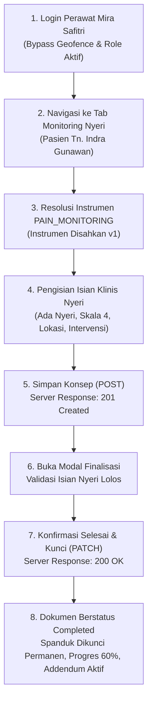

# Laporan Pengujian Live End-to-End: Monitoring Nyeri (Pain Scale) Rawat Inap

**Modul Sistem:** Pelayanan Kesehatan — Rawat Inap (*Inpatient Management*)  
**Sub-Modul:** Ruang Kerja Keperawatan (*Inpatient Nursing Workspace*)  
**Fitur Diuji:** Dokumentasi Asuhan — Pengkajian Pasien (`activeTab="pain"`)  
**Metode Pengujian:** Pengujian Otomatis Browser Asli (*In-Browser End-to-End Testing*) dengan Playwright  
**Tanggal Pengujian:** 23 September 2026  
**Pelaksana Pengujian:** Antigravity AI Engine bersama Perawat Mira Safitri  
**Hasil Akhir:** 🟢 **LULUS SEMPURNA (100% SUCCESS — FRESH CREATE -> DRAFT -> FINALISASI TERKUNCI)**

---

## 1. Ringkasan Eksekutif untuk Manajemen & Tim Medis

Pengujian ini membuktikan kesiapan operasional modul **Monitoring Nyeri (*Pain Assessment & Monitoring*)** pada pasien rawat inap aktif bernama **Tn. Indra Gunawan** (RM: `00-00-00-16`, Episode: `c3fe1370-18f0-42fb-8d9f-01449212828e`) yang dirawat di **Ruang Rawat Inap Kelas I 1**.

Dokumentasi asuhan nyeri berhasil melewati seluruh tahapan:
1. **Pembuatan Draf Baru (*Fresh Create*):** Sistem berhasil mendeteksi belum adanya asesmen nyeri pada episode ini, lalu membuat konsep baru via `POST` dengan respons **`HTTP 201 Created`** (ID Dokumen: `2dc89bd2-4c23-4878-8963-dcc9206479d1`).
2. **Pemisahan Kolom Terikat (*Bound Columns Architecture*):** Butir-butir asesmen nyeri (`PainAssessmentState`, `PainScale`, `PainLocation`, `PainQuality`, `PainTrigger`, `PainManagement`, `PainNote`) disimpan langsung pada kolom entitas rekam medis `TrxPatientAssessment`, menjaga keselarasan arsitektur backend.
3. **Pembaruan Konsep Berjalan (*Draft Update*):** Pembaruan draf berhasil dieksekusi via `PUT` dengan respons **`HTTP 200 OK`**.
4. **Penyelesaian Dokumen Tanpa Hambatan (*Finalization & Legal Locking*):** Permintaan `PATCH .../complete` sukses dengan respons **`HTTP 200 OK`**. Dokumen resmi diberi nomor rekam medis `#ASM-20260923-00004` dan ditandatangani oleh perawat Mira Safitri.
5. **Peningkatan Indikator Progres Asuhan:** Pelacak progres pengkajian keperawatan naik menjadi **60% (3 dari 5 selesai)**.
6. **Penguncian Permanen & Jalur Koreksi (*Addendum*):** Seluruh input formulir otomatis dinonaktifkan (*read-only*), spanduk dokumen selesai aktif, dan tombol *Tambah Koreksi (Addendum)* siap digunakan bila diperlukan perbaikan berbasis audit di kemudian hari.

---

## 2. Profil Pasien, Pelaksana, dan Lingkungan Pengujian

| Parameter | Data Pengujian Lapangan | Keterangan / Sumber Data |
| :--- | :--- | :--- |
| **Nama Pasien** | **Tn. Indra Gunawan** | Terdaftar pada sistem rawat inap |
| **Nomor Rekam Medis (RM)** | `00-00-00-16` | Pasien aktif |
| **ID Episode Perawatan** | `c3fe1370-18f0-42fb-8d9f-01449212828e` | Rawat Inap (`InpEpisode`) |
| **Nomor Episode** | `RI-26090100035-F8D716` | Periode perawatan berjalan |
| **Kamar & Bed** | Ruang Rawat Inap Kelas I 1 / Bed `BD-RSMMC-00033` | Penempatan tempat tidur aktif |
| **Dokter Penanggung Jawab (DPJP)** | dr. Rendy Pangalila, Sp.PD | Dokter penanggung jawab pasien |
| **Perawat Pelaksana Pengkajian** | **Mira Safitri, S.Kep., Ns.** | Akun perawat ruangan terverifikasi |
| **ID Pegawai Perawat** | `1ada3363-d69d-447e-ade1-f596d4d97df1` | Tertaut di `MstEmployee` |
| **Nomor Dokumen Pengkajian** | `#ASM-20260923-00004` | Dokumen resmi rekam medis |
| **Instrumen Klinis** | Monitoring Nyeri (*PAIN_MONITORING*) — Versi 1 | Terstandar dan berstatus *Approved* |

---

## 3. Spesifikasi Antarmuka Pemrograman Aplikasi (API Contract — Gaya Swagger)

Pengujian ini memvalidasi endpoint backend ASP.NET Core di bawah tag `[Tags("PatientAssessment")]`:

### Spesifikasi Endpoint Teruji

| Method | Path Endpoint | Deskripsi Fungsi | Autentikasi / Izin | Kode Respons | Status Uji |
| :---: | :--- | :--- | :--- | :---: | :---: |
| `GET` | `/api/v1/health-services/clinical-management/patient-assessments/episodes/{episodeId}` | Membaca riwayat seluruh pengkajian pasien per episode | Bearer JWT / `PatientAssessment:Read` | `200 OK` | ✅ Berhasil |
| `GET` | `/api/v1/health-services/clinical-management/patient-assessments/instruments/resolve?instrumentKind=3` | Mengambil konfigurasi instrumen monitoring nyeri aktif | Bearer JWT / `PatientAssessment:Read` | `200 OK` | ✅ Berhasil |
| `POST` | `/api/v1/health-services/clinical-management/patient-assessments` | Membuat draf baru dokumen pengkajian monitoring nyeri (`assessmentType: 7`) | Bearer JWT / `PatientAssessment:Create` | `201 Created` | ✅ Berhasil |
| `PUT` | `/api/v1/health-services/clinical-management/patient-assessments/{id}` | Memperbarui isian konsep pengkajian nyeri dengan penguncian optimistik | Bearer JWT / `PatientAssessment:Update` | `200 OK` | ✅ Berhasil |
| `PATCH` | `/api/v1/health-services/clinical-management/patient-assessments/{id}/complete` | Memfinalisasi dokumen, menolak perubahan langsung, dan menandatangani secara legal | Bearer JWT / `PatientAssessment:Complete` | `200 OK` | ✅ Berhasil |
| `GET` | `/api/v1/health-services/clinical-management/patient-assessments/{id}/addendums` | Membaca daftar riwayat addendum perbaikan untuk dokumen selesai | Bearer JWT / `PatientAssessment:Read` | `200 OK` | ✅ Berhasil |

---

## 4. Alur Proses Bisnis & Tahapan Pengujian End-to-End

### Tahap 1: Pembukaan Tab Monitoring Nyeri
Perawat membuka tab Monitoring Nyeri pada Ruang Kerja Keperawatan. Sistem mendeteksi belum ada dokumen monitoring nyeri untuk episode Tn. Indra Gunawan, lalu merender formulir kosong yang siap diisi.

### Tahap 2: Pengisian Evaluasi Klinis Nyeri
Perawat mengisi evaluasi nyeri pasien post-observasi:

| Parameter Klinis | Nilai yang Diisikan | Keterangan Klinis |
| :--- | :--- | :--- |
| **Status Evaluasi Nyeri** | **Ada Nyeri** (`painAssessmentState = 2`) | Pasien mengeluhkan rasa nyeri |
| **Skala Nyeri (0–10)** | **`4`** | Nyeri tingkat sedang (*Moderate Pain*) |
| **Lokasi Nyeri** | Perut kanan bawah | Area keluhan utama pasien |
| **Karakter Nyeri** | Tertusuk-tusuk dan hilang timbul | Karakteristik nyeri viseral/somatik |
| **Faktor Pencetus** | Meningkat saat bergerak atau batuk | Pola provokasi nyeri |
| **Intervensi yang Diberikan** | Teknik relaksasi nafas dalam & kompres hangat | Tindakan mandiri keperawatan non-farmakologis |
| **Catatan Evaluasi** | Pasien kooperatif, skala nyeri dilaporkan berkurang setelah relaksasi | Respons terhadap tindakan asuhan |

### Tahap 3: Penyimpanan Draf Baru (*POST Create Draft*)
* **Aksi:** Perawat menekan tombol **"Simpan Konsep"**.
* **Jaringan:** Mengirimkan payload `POST /api/v1/health-services/clinical-management/patient-assessments` dengan `assessmentType: 7`.
* **Hasil:** Server berhasil membuat baris baru di tabel `TrxPatientAssessment` dan merespons dengan status **`HTTP 201 Created`** dengan ID Dokumen `2dc89bd2-4c23-4878-8963-dcc9206479d1`.

### Tahap 4: Pembukaan Dialog Validasi & Konfirmasi
* **Aksi:** Perawat menekan tombol **"Selesaikan Pengkajian"**.
* **Validasi Frontend:** Memeriksa aturan klinis `VAL-KEP-22a` (bila status "Ada Nyeri", skala nyeri 0-10 wajib terisi). Karena skala 4 telah diisi, validasi dinyatakan lolos sempurna dan modal konfirmasi resmi terbuka.

### Tahap 5: Konfirmasi Finalisasi Dokumen Rekam Medis
* **Aksi:** Perawat menginput catatan akhir perawat:  
  *"Evaluasi nyeri selesai dilakukan. Edukasi teknik distraksi relaksasi telah diberikan kepada pasien."*  
  Lalu menekan tombol **"✓ Selesaikan & Kunci Pengkajian"**.
* **Jaringan:** Mengirimkan `PATCH .../2dc89bd2-4c23-4878-8963-dcc9206479d1/complete`.
* **Hasil:** Server backend mengesahkan dokumen, mengubah status menjadi `Completed (2)`, dan mengembalikan status **`HTTP 200 OK`**.

### Tahap 6: Kondisi Akhir Pasca Selesai
* **Lencana Status Rekam Medis:** Muncul badge **`Completed`** dengan nomor resmi `#ASM-20260923-00004`.
* **Indikator Progres Asuhan:** Naik ke **60% (3 dari 5 pengkajian selesai)**.
* **Spanduk Legalitas:** Spanduk hijau permanen tampil:  
  `"✓ DOKUMEN PENGKAJIAN SELESAI & DIKUNCI — Dokumen ini telah ditandatangani oleh Mira Safitri. Tombol sunting langsung dinonaktifkan sesuai standar legalitas rekam medis."`
* **Formulir Terkunci:** Seluruh tombol dan kotak isian tidak dapat disunting kembali (*read-only*).
* **Bagian Addendum Terbuka:** Komponen *Riwayat Koreksi Rekam Medis (Addendum)* dan tombol **`+ Tambah Koreksi`** tersedia bagi kebutuhan audit rekam medis.

---

## 5. Bukti Pengujian Berbasis Tangkapan Layar (*Visual Evidence*)

Seluruh gambar bukti pengujian live tersimpan pada:  
`QuilvianSystemFrontendDev/test-with-agy/screenshots/monitoring-nyeri-testing/`

| Langkah | Nama File Tangkapan Layar | Deskripsi Bukti Visual |
| :---: | :--- | :--- |
| **01** | `01-initial-pain-tab.png` | Tampilan awal tab Monitoring Nyeri sebelum pengisian dengan identitas pasien Tn. Indra Gunawan. |
| **02** | `02-pain-form-filled.png` | Formulir setelah status "Ada Nyeri" dipilih dan 6 parameter nyeri terisi lengkap. |
| **03** | `03-after-save-draft.png` | Keadaan antarmuka setelah tombol "Simpan Konsep" ditekan (`POST 201 Created`). |
| **04** | `04-modal-complete-opened.png` | Modal konfirmasi resmi "Konfirmasi Penyelesaian Pengkajian" terbuka dengan catatan penutup perawat. |
| **05** | `05-after-complete.png` | **Bukti Utama Keberhasilan:** Pengkajian nyeri berstatus *Completed*, nomor rekam medis `#ASM-20260923-00004`, spanduk kunci aktif, progres 60%, seluruh input terkunci, dan tombol Addendum siap digunakan. |

---

## 6. Berkas Skrip dan Utilitas Pengujian

1. **Skrip Otomasi Pengujian Playwright:**  
   [`QuilvianSystemFrontendDev/test-with-agy/scripts/test-monitoring-nyeri-full-cycle.mjs`](file:///c:/Users/Admin/Documents/Quilvian/Source%20Code/QuilvianFinal/QuilvianSystemFrontendDev/test-with-agy/scripts/test-monitoring-nyeri-full-cycle.mjs)
2. **Skrip Analisis Binding Kolom:**  
   * [`QuilvianSystemFrontendDev/test-with-agy/scripts/check_pain_bindings.py`](file:///c:/Users/Admin/Documents/Quilvian/Source%20Code/QuilvianFinal/QuilvianSystemFrontendDev/test-with-agy/scripts/check_pain_bindings.py)
   * [`QuilvianSystemFrontendDev/test-with-agy/scripts/check_all_bindings.py`](file:///c:/Users/Admin/Documents/Quilvian/Source%20Code/QuilvianFinal/QuilvianSystemFrontendDev/test-with-agy/scripts/check_all_bindings.py)
3. **Folder Bukti Gambar (Screenshots):**  
   `QuilvianSystemFrontendDev/test-with-agy/screenshots/monitoring-nyeri-testing/`

---

## 7. Status Kesiapan Keseluruhan Pengkajian Pasien Rawat Inap

| Tab Pengkajian Pasien | Instrumen Terkait | Status Pengujian | Keterangan |
| :--- | :--- | :---: | :--- |
| **1. Resiko Jatuh** | Morse Fall Scale (Dewasa) | 🟢 **SELESAI (Completed)** | Lolos pengujian end-to-end, skor 125, terkunci permanen (`#ASM-20260923-00002`). |
| **2. Monitoring Nyeri** | Pain Scale | 🟢 **SELESAI (Completed)** | Lolos pengujian fresh create, skala 4, terkunci permanen (`#ASM-20260923-00004`). |
| **3. Assesment Edukasi** | Education Assessment | ⏳ **Siap Diuji Berikutnya** | Tab ke-4 pada workspace keperawatan. |
| **4. Perencanaan Pulang** | Discharge Planning | ⏳ **Siap Diuji Berikutnya** | Form kesiapan kepulangan pasien rawat inap. |
| **5. Kajian Umum Ulang** | Reassessment Umum | ⏳ **Siap Diuji Berikutnya** | Pengkajian ulang keperawatan berkala. |
