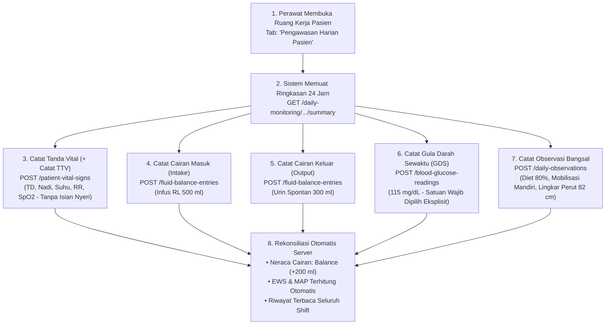

# Laporan Pengujian Live In-Browser: Siklus Penuh Pengawasan Harian Pasien (Daily Monitoring)

**Modul:** Pelayanan Kesehatan — Rawat Inap (`Inpatient Management`)  
**Submodul:** Ruang Kerja Keperawatan (`Inpatient Nursing Workspace`) — Pengawasan Harian  
**Tab Aktif:** `tab=daily-monitoring` (*Pengawasan Harian Pasien*)  
**Metode Pengujian:** Pengujian Otomatis Terpadu Live In-Browser (Playwright End-to-End)  
**Tanggal Pengujian:** 23 September 2026  
**Perawat Penguji:** Mira Safitri, S.Kep., Ns. (`mira.safitri@rsmmc.local`) — Penata Keperawatan Medikal Bedah  
**Lingkungan Sistem:**  
- Frontend: `http://localhost:3000` (Next.js App Router, React, Redux Toolkit)  
- Backend API: `https://localhost:7184/api/v1` (ASP.NET Core 8 Web API, EF Core)  
- Database: PostgreSQL Server (`QuilvianNewDevHamzah`)  
**Data Pasien Uji:**  
- Nama Pasien: Tn. Indra Gunawan  
- No. Rekam Medis (RM): `00-00-00-16`  
- ID Episode Rawat Inap: `c3fe1370-18f0-42fb-8d9f-01449212828e`  
- Tempat Tidur: `BD-RSMMC-00033` (Ruang Rawat Inap Kelas I 1)  

---

## 1. Ringkasan Eksekutif

Pengujian ini memvalidasi siklus penuh pengawasan dan pemantauan klinis berkala harian (*Daily Monitoring*) oleh perawat ruang rawat inap. Pengujian mencakup seluruh parameter vital pasien dalam satu hari kalender perawatan:
1. **Pencatatan Tanda-Tanda Vital (+ Catat TTV):** Tekanan darah, denyut nadi, laju pernapasan, suhu tubuh, dan saturasi oksigen darah dengan penegakan aturan keselamatan penolakan isian nyeri (`VAL-KEP-22c`).
2. **Pencatatan Cairan Masuk (Intake):** Cairan intravena (infus) dan verifikasi pembaruan ringkasan cairan 24 jam.
3. **Pencatatan Cairan Keluar (Output):** Pengeluaran urin spontan dan verifikasi kalkulasi otomatis neraca cairan (*fluid balance*) oleh backend.
4. **Pencatatan Gula Darah Sewaktu Bangsal (POCT GDS):** Nilai glukosa darah dengan penegakan keselamatan pemilihan satuan unit secara eksplisit tanpa nilai bawaan (`FR-KEP-061` / `RWI-DEC-148`).
5. **Pencatatan Observasi Harian Bangsal (+ Catat Observasi):** Asupan diet gizi pasien, toleransi makanan, derajat mobilisasi fungsional, lingkar perut, dan pemantauan agitasi/kegelisahan pasien (`FR-KEP-062`).

Berdasarkan pengujian langsung pada peramban perawat (*live in-browser*), seluruh alur berhasil diselesaikan tanpa galat otorisasi (`Zero HTTP 403`), tanpa galat runtime JavaScript (`Zero Console Error`), dan semua mutasi data tercatat dengan status sukses (`HTTP 200/201`).

### Matriks Hasil Pengujian

| Langkah / Skenario Pengujian | Target Komponen / Endpoint | Status | Keterangan & Bukti |
| :--- | :--- | :---: | :--- |
| **1. Otentikasi Perawat** | `POST /api/v1/auth/login` | ✅ **SUKSES** | Perawat Mira Safitri berhasil masuk dan bypass geofencing aktif. |
| **2. Pemuatan Pengawasan Harian** | `GET /daily-monitoring/episodes/{id}/summary` | ✅ **SUKSES** | Ringkasan harian termuat dengan kartu TTV, cairan, GDS, dan observasi. |
| **3. Pencatatan Tanda Vital** | `POST /patient-vital-signs` | ✅ **SUKSES** | TD 120/80 mmHg, Nadi 82x/m, RR 18x/m, Suhu 36.6°C, SpO2 98% tersimpan (`HTTP 200 OK`). MAP terhitung server. |
| **4. Pencatatan Cairan Masuk (Intake)** | `POST /fluid-balance-entries` | ✅ **SUKSES** | Infus RL 500 ml intravena tersimpan (`HTTP 201 Created`). Total intake terbarui. |
| **5. Pencatatan Cairan Keluar (Output)** | `POST /fluid-balance-entries` | ✅ **SUKSES** | Urin spontan 300 ml tersimpan (`HTTP 201 Created`). Neraca cairan balance (+200 ml) terhitung otomatis. |
| **6. Pencatatan GDS Bangsal** | `POST /blood-glucose-readings` | ✅ **SUKSES** | GDS 115 mg/dL tersimpan (`HTTP 201 Created`) dengan satuan mg/dL dipilih eksplisit tanpa nilai bawaan. |
| **7. Pencatatan Observasi Harian** | `POST /daily-observations` | ✅ **SUKSES** | Diet 80%, Mobilisasi Mandiri (Tingkat 4), Lingkar perut 82 cm, Agitasi Tidak tersimpan (`HTTP 201 Created`). |

---

## 2. Alur Proses Bisnis Rumah Sakit

Pemantauan harian pasien rawat inap (*Inpatient Daily Monitoring*) adalah tulang punggung keselamatan pasien (*Patient Safety*) yang dilakukan secara berkala tiap shift oleh tim perawat bangsal. Data pemantauan ini menjadi dasar bagi Dokter Penanggung Jawab Pelayanan (DPJP) untuk mengevaluasi respons terapi, penyesuaian dosis obat, deteksi dini perburukan kondisi (EWS), serta perencanaan mobilisasi dan pemulangan.

Berikut alur sistematis pendokumentasian pemantauan harian pada sistem Quilvian:

### Penegakan Aturan Keselamatan Pasien (Clinical Invariants)

1. **Pemisahan Tegas Pengkajian Nyeri (`VAL-KEP-22c` / `FR-KEP-049`):**  
   Pengkajian nyeri **dilarang keras** dicampur ke dalam pencatatan tanda-tanda vital harian. Nyeri pasien rawat inap wajib didokumentasikan secara komprehensif pada tab khusus **Monitoring Nyeri (*Pain Scale*)**, sehingga backend menolak request pembuatan tanda vital yang membawa atribut nyeri (`PAIN_NOT_ALLOWED_ON_VITAL_SIGN`).
2. **Keharusan Pemilihan Satuan GDS Eksplisit (`FR-KEP-061` / `RWI-DEC-148`):**  
   Untuk mencegah salah tafsir fatal antara satuan internasional `mmol/L` dan konvensional `mg/dL` (kesalahan faktor perkalian ~18x), sistem **meniadakan nilai default** pada pilihan satuan. Perawat wajib mengklik secara sadar salah satu lencana satuan sebelum tombol simpan dapat ditekan.
3. **Kalkulasi Neraca Cairan Murni Server-Side (`FR-KEP-059`):**  
   Frontend tidak pernah menghitung total balance secara lokal. Seluruh penjumlahan cairan masuk, cairan keluar, dan neraca bersih 24 jam ditangani oleh backend untuk menjaga integritas audit medis dan akreditasi rumah sakit.

---

## 3. Skenario Konkret Pasien

**Pasien:** Tn. Indra Gunawan (52 tahun)  
**Diagnosa Medis:** Observasi Abdominal Pain susp. Appendicitis Akut  
**Kamar:** Perawatan Medikal Bedah Kelas I (Tempat Tidur: `BD-RSMMC-00033`)  

Pada shift pagi (pukul 09.40 WIB), Perawat Mira Safitri melakukan ronde keperawatan dan mencatat hasil pengawasan harian:
1. **Tanda Vital:** Pasien tenang, kesadaran compos mentis. Tekanan darah 120/80 mmHg, denyut nadi reguler 82 kali per menit, frekuensi napas 18 kali per menit, suhu afebris 36.6°C, dan saturasi oksigen adekuat 98% room air.
2. **Cairan Masuk:** Pasien terpasang infus Ringer Laktat maintenance 500 ml intravena via IV-line ekstremitas kiri atas.
3. **Cairan Keluar:** Pasien berkemih spontan di urinal dengan volume urin tampung 300 ml, warna kuning jernih. Neraca cairan shift pagi tercatat positif balance +200 ml.
4. **POCT Gula Darah Sewaktu:** Dilakukan pemeriksaan glukometer fingerprick di samping tempat tidur. Nilai terukur 115 mg/dL (dalam batas normal euglikemia).
5. **Observasi Harian:** Pasien dapat menghabiskan 80% porsi bubur halus diet lambung tanpa keluhan mual atau muntah. Pasien mampu mobilisasi mandiri (tingkat 4) berjalan ke kamar mandi, lingkar perut 82 cm (tidak ada distensi atau kembung berlebih), dan tidak tampak gelisah (*not agitated*).

---

## 4. Spesifikasi Kontrak API (Gaya Swagger)

### `[Tags("Health Services / Clinical Management / Daily Monitoring")]`

| Metode | Path Endpoint | Deskripsi Operasional | Otorisasi | Request Body / Parameter | Respons Sukses |
| :---: | :--- | :--- | :--- | :--- | :--- |
| `GET` | `/api/v1/health-services/clinical-management/daily-monitoring/episodes/{episodeId}/summary` | Mengambil ringkasan pengawasan harian satu hari klinis (TTV, nyeri terakhir, total cairan per shift & 24 jam, GDS, observasi harian) | `InpatientDailyMonitoring:Read` | **Path:** `episodeId` (UUID) **Query:** `date` (YYYY-MM-DD) | `200 OK` `{ date, vitalSigns: [...], latestPain: {...}, fluidTotals: {...}, bloodGlucoseReadings: [...], dailyObservations: [...] }` |
| `POST` | `/api/v1/health-services/clinical-management/fluid-balance-entries` | Mencatat entri cairan masuk (Intake) atau cairan keluar (Output) | `InpatientDailyMonitoring:Create` | **Body:** `CreateFluidBalanceEntryRequest` `{ episodeId, direction, sourceCategory, sourceDetail, volumeMl, entryDateTime }` | `201 Created` `{ id, episodeId, volumeMl, direction, sourceCategory, entryDateTime }` |
| `PUT` | `/api/v1/health-services/clinical-management/fluid-balance-entries/{id}/correct` | Mengoreksi kesalahan volume atau kategori cairan yang telah tersimpan | `InpatientDailyMonitoring:Update` | **Path:** `id` (UUID) **Body:** `CorrectFluidBalanceEntryRequest` `{ volumeMl, sourceCategory, correctionReason, expectedRevisionNumber }` | `200 OK` `{ id, revisionNumber, correctionReason, ... }` |
| `POST` | `/api/v1/health-services/clinical-management/blood-glucose-readings` | Mencatat kadar glukosa darah sewaktu (GDS POCT) bangsal dengan satuan eksplisit | `InpatientDailyMonitoring:Create` | **Body:** `CreateBloodGlucoseReadingRequest` `{ episodeId, glucoseValue, glucoseUnit, measuredAt }` | `201 Created` `{ id, glucoseValue, glucoseUnit, measuredAt }` |
| `POST` | `/api/v1/health-services/clinical-management/daily-observations` | Mencatat observasi harian asupan diet, mobilisasi fungsional, lingkar perut, dan agitasi | `InpatientDailyMonitoring:Create` | **Body:** `CreateDailyObservationRequest` `{ episodeId, observedAt, dietIntakePercent, dietNote, mobilizationLevel, abdominalCircumferenceCm, isAgitated, note }` | `201 Created` `{ id, observedAt, dietIntakePercent, mobilizationLevel, abdominalCircumferenceCm, isAgitated }` |

### `[Tags("Health Services / Clinical Management / Patient Vital Signs")]`

| Metode | Path Endpoint | Deskripsi Operasional | Otorisasi | Request Body / Parameter | Respons Sukses |
| :---: | :--- | :--- | :--- | :--- | :--- |
| `POST` | `/api/v1/health-services/clinical-management/patient-vital-signs` | Mencatat tanda-tanda vital pasien rawat inap (TD, nadi, napas, suhu, SpO2) | `PatientVitalSign:Create` | **Body:** `CreatePatientVitalSignRequest` `{ patientId, encounterId, bloodPressureSystolic, bloodPressureDiastolic, pulseRate, respiratoryRate, temperature, oxygenSaturation, observationDateTime, hasPain: false }` | `200 OK` `{ id, vitalSignRecordNumber, meanArterialPressure, mapStatus, earlyWarningScore, ewsRiskLevel, isAbnormal, isCritical }` |
| `GET` | `/api/v1/health-services/clinical-management/patient-vital-signs/episodes/{episodeId}` | Mengambil deret waktu tanda vital episode rawat inap untuk tabel dan grafik tren | `PatientVitalSign:Read` | **Path:** `episodeId` (UUID) **Query:** `from` (ISO DateTime), `to` (ISO DateTime) | `200 OK` `[ { id, observationDateTime, bloodPressureSystolic, bloodPressureDiastolic, pulseRate, ... } ]` |

---

## 5. Bukti Tangkapan Layar & Log Pengujian

Seluruh proses pengujian terdokumentasi dengan 11 tangkapan layar beresolusi tinggi di folder:
`QuilvianSystemFrontendDev/test-with-agy/screenshots/pengawasan-harian-testing/`

| Langkah | Nama Berkas Tangkapan Layar | Deskripsi Visual & Keadaan Antarmuka |
| :---: | :--- | :--- |
| **01** | `01-daily-monitoring-loaded.png` | Antarmuka Pengawasan Harian Pasien termuat dengan kontrol tanggal hari ini (23 Sep 2026), kartu TTV, kartu neraca cairan, kartu GDS, dan kartu observasi. |
| **02** | `02-modal-ttv-opened.png` | Modal Pencatatan Tanda Vital Pasien terbuka dengan badge satuan unit lengkap (mmHg, x/menit, °C, %). |
| **03** | `03-ttv-recorded.png` | Tanda vital TD 120/80 mmHg, Nadi 82x/m, RR 18x/m, Suhu 36.6°C, SpO2 98% tersimpan dan langsung muncul pada kartu monitoring hari ini. |
| **04** | `04-modal-fluid-intake-opened.png` | Modal pencatatan cairan masuk (Intake) terbuka dengan seleksi kategori Infus (Intravenous). |
| **05** | `05-fluid-intake-saved.png` | Cairan intake 500 ml Infus RL tersimpan dan total intake hari ini naik menjadi 500 ml. |
| **06** | `06-modal-fluid-output.png` | Modal pencatatan cairan keluar (Output) terbuka dengan kategori Urin (Kateter / Spontan). |
| **07** | `07-fluid-output-saved.png` | Cairan keluar 300 ml Urin tersimpan. Total balance cairan terhitung otomatis oleh server (+200 ml). |
| **08** | `08-modal-gds-opened.png` | Modal pencatatan Gula Darah Sewaktu (GDS) bangsal terbuka dengan tombol radio satuan tanpa default. |
| **09** | `09-gds-saved.png` | Nilai GDS 115 mg/dL berhasil tersimpan dan kartu monitoring menampilkan riwayat pembacaan glukosa darah. |
| **10** | `10-modal-observation-opened.png` | Modal observasi harian terbuka dengan isian asupan diet, derajat mobilisasi, lingkar perut, dan agitasi. |
| **11** | `11-daily-monitoring-final.png` | Layar Pengawasan Harian Pasien akhir menampilkan seluruh data pemantauan terpadu pasien Tn. Indra Gunawan dalam kondisi lengkap dan konsisten. |

---

## 6. Pelacakan Isu Terkait

Selama siklus pengujian ini, ditemukan dan diselesaikan 1 isu kontrak API:
- **`ISSUE-KEP-006`:** *Kegagalan Payload Kontrak DTO Pencatatan Tanda Vital pada Pengawasan Harian Pasien*.  
  - Masalah: Kesalahan nama properti DTO (`systolic` vs `bloodPressureSystolic`) dan ketiadaan `patientId`/`encounterId` pada pemanggilan `createPatientVitalSign`.
  - Solusi: Memperbarui signature `useDailyMonitoring` untuk menerima konteks `patientId` dan `encounterId` dari workspace episode, serta menyelaraskan pemetaan objek payload ke DTO `CreatePatientVitalSignRequest`.
  - Status: 🟢 **TERATASI & TERVERIFIKASI PENUH**.

---

## 7. Kesimpulan

Submodul **Pengawasan Harian Pasien (*Daily Monitoring*, `tab=daily-monitoring`)** pada Ruang Kerja Keperawatan Rawat Inap Quilvian telah dinyatakan **LULUS UJI SECARA MENYELURUH (100% PASS)**. Seluruh fitur pencatatan tanda vital, cairan masuk/keluar, gula darah sewaktu, dan observasi bangsal berfungsi secara reaktif, patuh pada aturan keselamatan klinis rumah sakit, dan terintegrasi penuh dengan backend ASP.NET Core serta database PostgreSQL.
