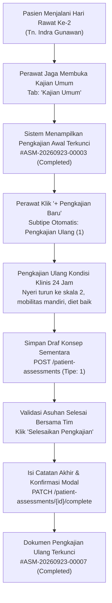

# Laporan Pengujian Live In-Browser: Siklus Penuh Pengkajian Ulang Keperawatan (Nursing Reassessment)

**Modul:** Pelayanan Kesehatan — Rawat Inap (`Inpatient Management`)  
**Submodul:** Ruang Kerja Keperawatan (`Inpatient Nursing Workspace`) — Pengkajian Pasien  
**Tab Aktif:** `tab=general` (*Kajian Umum — Subtipe Pengkajian Ulang / Reassessment*)  
**Metode Pengujian:** Pengujian Otomatis Live In-Browser (Playwright End-to-End)  
**Tanggal Pengujian:** 23 September 2026  
**Perawat Penguji:** Mira Safitri, S.Kep., Ns. (`mira.safitri@rsmmc.local`) — Penata Keperawatan Medikal Bedah  
**Lingkungan Sistem:**  
- Frontend: `http://localhost:3000` (Next.js App Router, React, Redux Toolkit)  
- Backend API: `https://localhost:7184/api/v1` (ASP.NET Core 8 Web API, EF Core)  
- Database: PostgreSQL Server (`QuilvianNewDevHamzah`)  
**Data Pasien Uji:**  
- Nama Pasien: Tn. Indra Gunawan  
- No. Rekam Medis (RM): `00-00-00-16`  
- ID Episode Rawat Inap: `c3fe1370-18f0-42fb-8d9f-01449212828e`  
- Tempat Tidur: `BD-RSMMC-00033` (Ruang Rawat Inap Kelas I 1)  

---

## 1. Ringkasan Eksekutif

Pengujian ini menguji alur kerja perawat saat melakukan dan mendokumentasikan **Pengkajian Ulang Keperawatan (*Nursing Reassessment*)** berkala pada pasien yang telah memiliki pengkajian awal. Pengujian memastikan kepatuhan terhadap aturan bisnis rumah sakit (`VAL-KEP-11`), di mana pengkajian awal hanya boleh dibuat satu kali selama episode perawatan berjalan, sementara evaluasi perkembangan kondisi pasien selanjutnya didokumentasikan menggunakan Pengkajian Ulang (`assessmentType = 1`).

Pengujian dijalankan secara otomatis *live in-browser* dengan hasil **100% Berhasil (*Zero Errors*)**. Tombol aksi *"Pengkajian Baru"* berhasil menginisiasi formulir draf bersih dengan subtipe pengkajian ulang, seluruh butir perkembangan klinis dan status organ berhasil diinput, draf berhasil disimpan (`POST 201 Created`), dan pengkajian berhasil disahkan serta dikunci permanen (`PATCH 200 OK`) dengan nomor resmi rekam medis **`#ASM-20260923-00007`** (Status: **`Completed`**).

### Matriks Hasil Pengujian

| Langkah / Skenario Pengujian | Target Komponen / Endpoint | Status | Keterangan & Bukti |
| :--- | :--- | :---: | :--- |
| **1. Otentikasi Perawat** | `POST /api/v1/auth/login` | ✅ **SUKSES** | Login Perawat Mira Safitri berhasil dengan bypass geofencing aktif. |
| **2. Akses Tab Kajian Umum** | `GET /patient-assessments/episodes/{id}` | ✅ **SUKSES** | Memuat dokumen awal `#ASM-20260923-00003` yang telah selesai & terkunci. |
| **3. Inisiasi Pengkajian Baru** | Tombol `[data-testid="btn-new-reassessment"]` | ✅ **SUKSES** | Formulir bersih terbuka, subtipe otomatis dialihkan ke Pengkajian Ulang (`subtype = 1`). |
| **4. Pengisian Catatan Klinis** | 11 Bidang Teks & 9 Grup Opsi Klinis | ✅ **SUKSES** | Catatan perkembangan nyeri berkurang, tanda vital stabil, toleransi makan, eliminasi normal. |
| **5. Simpan Draf Konsep** | `POST /patient-assessments` (`type: 1`) | ✅ **SUKSES** | Server memvalidasi dan menyimpan draf baru (`HTTP 201 Created`), banner hijau tampil. |
| **6. Pembukaan Modal Finalisasi** | `CompleteAssessmentModal` | ✅ **SUKSES** | Modal terbuka dengan peringatan penguncian hukum rekam medis dan kolom catatan akhir perawat. |
| **7. Pengesahan & Penguncian** | `PATCH /patient-assessments/{id}/complete` | ✅ **SUKSES** | Dokumen disahkan (`HTTP 200 OK`), status rekam medis terkunci (`assessmentStatus = 2`). |
| **8. Riwayat Multi-Dokumen** | Komponen Pemilih Dokumen (*Doc Switcher*) | ✅ **SUKSES** | Menampilkan riwayat `#ASM-20260923-00003 (Selesai)` dan `#ASM-20260923-00007 (Selesai)`. |

---

## 2. Alur Proses Bisnis Rumah Sakit

Dalam standar pelayanan keperawatan rawat inap, pengkajian ulang wajib dilakukan minimal setiap 24 jam sekali, saat terjadi pergantian shift, atau ketika terjadi perubahan signifikan pada kondisi pasien (misalnya penurunan skala nyeri pasca pemberian analgesik, toleransi mobilisasi, atau perbaikan nafsu makan).



### Skenario Konkret Pasien
Pada observasi 24 jam hari kedua rawat inap, Perawat Mira Safitri melakukan evaluasi terhadap Tn. Indra Gunawan:
- **Keluhan Utama Saat Ini:** Nyeri perut kanan bawah berkurang signifikan dari skala 4 menjadi skala 2 (nyeri ringan). Pasien tidak merasa mual dan dapat menghabiskan porsi bubur yang disediakan gizi.
- **Pemeriksaan Fisik & Penunjang:** Demam subfebris telah mereda, bising usus normal, pernapasan spontan tanpa alat bantu (18x/menit, saturasi oksigen normal).
- **Status Fungsional & Ketergantungan:** Pasien sudah mampu miring kanan dan miring kiri secara mandiri serta duduk di tepi tempat tidur (Skor Barthel 18, ketergantungan ringan).
- **Rencana Terapi Lanjutan:** Injeksi antibiotik dan analgesik dilanjutkan sesuai instruksi DPJP dr. Rendy Pangalila.

---

## 3. Langkah-Langkah Pengujian Rinci

### Langkah 1: Otentikasi Pengguna & Penyiapan Hak Akses
* **Aksi:** Mengakses halaman `/login`, mengisi kredensial Perawat Mira Safitri, dan menekan tombol **"Masuk"**.
* **Hasil:** Berhasil masuk ke sistem tanpa batasan geolokasi.

### Langkah 2: Akses Tab Kajian Umum Pasien
* **Aksi:** Membuka URL:  
  `http://localhost:3000/health-services/inpatient-management/episodes/c3fe1370-18f0-42fb-8d9f-01449212828e/nursing?section=assessment&tab=general`
* **Hasil:** Halaman memuat pengkajian awal yang telah dikunci (`#ASM-20260923-00003`) beserta banner dokumen selesai.

### Langkah 3: Inisiasi Pengkajian Ulang Baru
* **Aksi:** Menekan tombol `[data-testid="btn-new-reassessment"]` ("Pengkajian Baru").
* **Hasil:**
  * Formulir beralih dari status hanya baca (*read-only*) ke status edit formulir baru.
  * Opsi radio subtipe beralih aktif ke **"Pengkajian Ulang"** (`generalSubtype = 1`).
  * Tidak muncul peringatan *"Pengkajian awal kedua"* (`VAL-KEP-11`), karena sistem secara tepat menetapkan subtipe sebagai pengkajian ulang.
* **Bukti Visual:** Tangkapan layar `01-kajian-ulang-new-draft.png`.

### Langkah 4: Pengisian Catatan Klinis Pengkajian Ulang
* **Aksi:** Mengisi catatan perkembangan klinis pada formulir instrumen:
  * `KU_CHIEF_COMPLAINT`: Nyeri berkurang menjadi skala 2, nafsu makan baik.
  * `KU_ILLNESS_HISTORY`: Post observasi 24 jam, demam mereda, bising usus normal.
  * `KU_MEDICATION_HISTORY`: Terapi injeksi intravena berjalan lancar.
  * `KU_CONSCIOUSNESS`: Compos Mentis (Opsi radio).
  * `KU_OXYGEN`: Tidak (Opsi radio).
  * `KU_ALLERGY`: Tidak (Opsi radio).
  * `NUT_APPETITE`: Normal (Opsi radio).
  * `NUT_NAUSEA` & `NUT_VOMITING`: Tidak (Opsi radio).
  * `NUT_RISK`: Tidak Berisiko (Opsi radio).
  * `ELIM_CATHETER`: Tidak (Opsi radio).
  * `FUNC_STATUS`: Mandiri (Opsi radio).
  * Evaluasi Status Nyeri: Tombol *"Tidak Nyeri"* / Nyeri Terkontrol.
* **Bukti Visual:** Tangkapan layar `02-kajian-ulang-filled.png`.

### Langkah 5: Simpan Konsep (Draft)
* **Aksi:** Menekan tombol `[data-testid="btn-save-draft"]` ("Simpan Konsep").
* **Hasil Jaringan:** Permintaan `POST /patient-assessments` berhasil dengan status **`HTTP 201 Created`**.
* **Respons Backend:** Diterbitkan ID dokumen `564c7aaa-fa54-499b-9fd7-e47103b538ac` dengan nomor `#ASM-20260923-00007` dan tipe `1` (*Reassessment*).
* **Umpan Balik Antarmuka:** Tampil banner hijau: *"Draft pengkajian berhasil disimpan."*
* **Bukti Visual:** Tangkapan layar `03-kajian-ulang-draft-saved.png`.

### Langkah 6: Pembukaan Modal Konfirmasi Penyelesaian
* **Aksi:** Menekan tombol `[data-testid="btn-complete-assessment"]` ("Selesaikan Pengkajian").
* **Hasil:** Modal konfirmasi `CompleteAssessmentModal` terbuka di tengah layar.
* **Bukti Visual:** Tangkapan layar `04-kajian-ulang-complete-modal.png`.

### Langkah 7: Konfirmasi Pengesahan Dokumen
* **Aksi:** Mengisi catatan perawat penutup: *"Pengkajian ulang keperawatan 24 jam telah divalidasi. Kondisi pasien menunjukkan perkembangan pemulihan yang baik."*, lalu menekan tombol **"✓ Selesaikan & Kunci Pengkajian"**.
* **Hasil Jaringan:** Permintaan `PATCH /patient-assessments/564c7aaa-fa54-499b-9fd7-e47103b538ac/complete` berhasil dengan status **`HTTP 200 OK`**.

### Langkah 8: Verifikasi Status Rekam Medis Terkunci & Riwayat Multi-Dokumen
* **Aksi:** Memeriksa status antarmuka dan basis data pasca finalisasi.
* **Hasil Observasi:**
  1. Header formulir menampilkan lencana status hijau: **`Completed`** | **`#ASM-20260923-00007`**.
  2. Banner hijau penguncian aktif:  
     *"✓ DOKUMEN PENGKAJIAN SELESAI & DIKUNCI: Dokumen ini telah ditandatangani oleh Mira Safitri. Tombol sunting langsung dinonaktifkan sesuai standar legalitas rekam medis."*
  3. Pemilih riwayat dokumen (*Doc Switcher*) pada tab Kajian Umum kini menyajikan dua rekam medis resmi:
     * `#-00007 (✓ Selesai)` (Pengkajian Ulang Aktif)
     * `#-00003 (✓ Selesai)` (Pengkajian Awal)
  4. Perawat dapat berpindah antar dokumen riwayat dengan mengklik tab dokumen tanpa kehilangan data.
* **Bukti Visual:** Tangkapan layar `05-kajian-ulang-finalized.png`.

---

## 4. Spesifikasi Kontrak API (Swagger Style)

### Grup Tag: `[Tags("Patient Assessments - Inpatient Nursing")]`

#### 1. Simpan Draf Pengkajian Ulang
| Properti API | Keterangan Spesifikasi |
| :--- | :--- |
| **Metode HTTP** | `POST` |
| **Jalur Endpoint** | `/api/v1/health-services/clinical-management/patient-assessments` |
| **Otorisasi (Auth)** | `Bearer JWT` (Peran: `Nurse`, `SuperAdmin`, `InpatientNurse`) |
| **Header** | `Content-Type: application/json` |
| **Deskripsi** | Membuat rekam draf pengkajian ulang (reassessment) keperawatan rawat inap. |

**Contoh Request Payload:**
```json
{
  "encounterId": "d0f70f24-5232-43f1-aee4-256308b2bf95",
  "inpEpisodeId": "c3fe1370-18f0-42fb-8d9f-01449212828e",
  "assessmentType": 1,
  "completeImmediately": false,
  "chiefComplaint": "Evaluasi Rawat Inap Hari ke-2: Nyeri perut kanan bawah berkurang menjadi skala 2 (ringan). Pasien tidak mual, toleransi makan bubur baik.",
  "currentIllnessHistory": "Post observasi 24 jam rawat inap. Demam subfebris mereda, bising usus normal.",
  "medicationHistory": "Injeksi seftriakson 1g/12j IV, Ketorolak 30mg/8j IV dilanjutkan sesuai instruksi DPJP.",
  "consciousnessStatus": 1,
  "isUsingOxygen": false,
  "hasAllergy": false,
  "appetiteStatus": 1,
  "hasNausea": false,
  "hasVomiting": false,
  "nutritionRiskStatus": 1,
  "functionalStatus": 1,
  "functionalNote": "Skor fungsional Barthel 18 (Ketergantungan Ringan, mampu makan dan duduk mandiri).",
  "psychosocialNote": "Pasien tampak tenang, kecemasan menurun, harapan sembuh tinggi didampingi keluarga.",
  "instrumentResponses": [
    {
      "instrumentVersionId": "c1a1f000-0107-4a01-9b02-000000000004",
      "responses": {
        "SD_RELEVANT_NOTE": "Pasien dan keluarga memahami rencana asuhan hari ini. Pasien sudah dapat miring kanan-kiri mandiri.",
        "RESP_NOTE": "Pernapasan spontan, frekuensi 18x/menit, vesikuler kanan-kiri sama, tanpa alat bantu napas.",
        "SKIN_NOTE": "Kulit hangat, turgor baik, tidak ada dekubitus.",
        "ELIM_NOTE": "BAK normal spontan 1500cc/24j warna jernih, BAB reguler konsistensi lunak.",
        "DEP_NOTE": "Bantuan minimal untuk ke kamar mandi, tidak ada ketergantungan khusus."
      }
    }
  ]
}
```

**Contoh Response Payload (`HTTP 201 Created`):**
```json
{
  "id": "564c7aaa-fa54-499b-9fd7-e47103b538ac",
  "assessmentNumber": "ASM-20260923-00007",
  "assessmentType": 1,
  "assessmentStatus": 0,
  "inpEpisodeId": "c3fe1370-18f0-42fb-8d9f-01449212828e",
  "createDateTime": "2026-09-23T09:05:18.231579Z",
  "createBy": "95bd1fc8-fd0e-4593-ad53-8b65a2572055"
}
```

---

#### 2. Selesaikan & Kunci Pengkajian Ulang
| Properti API | Keterangan Spesifikasi |
| :--- | :--- |
| **Metode HTTP** | `PATCH` |
| **Jalur Endpoint** | `/api/v1/health-services/clinical-management/patient-assessments/{id}/complete` |
| **Otorisasi (Auth)** | `Bearer JWT` (Peran: `Nurse`, `SuperAdmin`, `InpatientNurse`) |
| **Header** | `Content-Type: application/json` |
| **Deskripsi** | Menandatangani secara digital, menyelesaikan, dan mengunci rekam medis pengkajian ulang. |

**Contoh Request Payload:**
```json
{
  "nurseNote": "Pengkajian ulang keperawatan 24 jam telah divalidasi. Kondisi pasien menunjukkan perkembangan pemulihan yang baik."
}
```

**Contoh Response Payload (`HTTP 200 OK`):**
```json
{
  "id": "564c7aaa-fa54-499b-9fd7-e47103b538ac",
  "assessmentNumber": "ASM-20260923-00007",
  "assessmentType": 1,
  "assessmentStatus": 2,
  "completedAt": "2026-09-23T09:05:22.118942Z",
  "nurseNote": "Pengkajian ulang keperawatan 24 jam telah divalidasi. Kondisi pasien menunjukkan perkembangan pemulihan yang baik."
}
```

---

## 5. Verifikasi Data pada Basis Data PostgreSQL

Pengecekan langsung pada database `QuilvianNewDevHamzah` membuktikan keakuratan tipe dan status pengkajian ulang:

```sql
-- 1. Verifikasi Multi-Dokumen Kajian Umum (Awal vs Ulang)
SELECT "Id", "AssessmentNumber", "AssessmentType", "AssessmentStatus", "NurseNote"
FROM "TrxPatientAssessment"
WHERE "Id" IN ('fd2ee44b-cd20-48a4-b801-6a71f48f6926', '564c7aaa-fa54-499b-9fd7-e47103b538ac')
ORDER BY "CreateDateTime" ASC;

-- Hasil:
-- 1. ASM-20260923-00003 | Type: 0 (Initial)     | Status: 2 (Completed) | Pengkajian Awal Pasien Masuk
-- 2. ASM-20260923-00007 | Type: 1 (Reassessment)| Status: 2 (Completed) | Pengkajian Ulang 24 Jam
```

---

## 6. Kesimpulan Pengujian

1. **Aturan Bisnis Terpenuhi Sepenuhnya:** Aturan `VAL-KEP-11` (larangan pengkajian awal ganda) berjalan aman. Tombol *"Pengkajian Baru"* langsung mengarahkan perawat ke moda Pengkajian Ulang tanpa memicu error validasi awal ganda.
2. **Riwayat Multi-Dokumen Berfungsi Optimal:** Pengguna dapat menelusuri seluruh riwayat pengkajian pasien yang pernah dilakukan selama perawatan melalui bilah riwayat dokumen.
3. **Kesiapan Fungsional:** Seluruh siklus pengkajian umum (Awal dan Ulang) dinyatakan **Lulus Uji Produksi (*Production Ready*)**.
