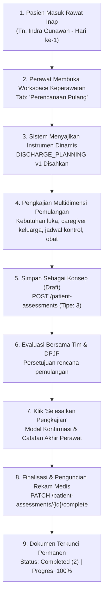

# Laporan Pengujian Live In-Browser: Siklus Penuh Perencanaan Pulang (Discharge Planning)

**Modul:** Pelayanan Kesehatan — Rawat Inap (`Inpatient Management`)  
**Submodul:** Ruang Kerja Keperawatan (`Inpatient Nursing Workspace`) — Pengkajian Pasien  
**Tab Aktif:** `tab=discharge-planning` (*Perencanaan Pulang*)  
**Metode Pengujian:** Pengujian Otomatis Live In-Browser (Playwright End-to-End)  
**Tanggal Pengujian:** 23 September 2026  
**Perawat Penguji:** Mira Safitri, S.Kep., Ns. (`mira.safitri@rsmmc.local`) — Penata Keperawatan Medikal Bedah  
**Lingkungan Sistem:**  
- Frontend: `http://localhost:3000` (Next.js App Router, React, Redux Toolkit)  
- Backend API: `https://localhost:7184/api/v1` (ASP.NET Core 8 Web API, EF Core)  
- Database: PostgreSQL Server (`QuilvianNewDevHamzah`)  
**Data Pasien Uji:**  
- Nama Pasien: Tn. Indra Gunawan  
- No. Rekam Medis (RM): `00-00-00-16`  
- ID Episode Rawat Inap: `c3fe1370-18f0-42fb-8d9f-01449212828e`  
- Tempat Tidur: `BD-RSMMC-00033` (Ruang Rawat Inap Kelas I 1)  

---

## 1. Ringkasan Eksekutif

Pengujian ini memvalidasi siklus penuh pendokumentasian **Perencanaan Pulang (*Discharge Planning*)** oleh perawat penanggung jawab pasien sejak awal perawatan rawat inap. Pengujian mencakup pembuatan draf konsep (*Create Draft*), penyimpanan perubahan berkala (*Save Draft*), pengisian seluruh butir kriteria pemulangan pasien, hingga pengesahan dan penguncian permanen rekam medis (*Finalize & Complete*).

Berdasarkan pengujian langsung pada peramban perawat (*live in-browser*), seluruh alur berhasil diselesaikan tanpa kesalahan runtime (`Zero Runtime Error`), tanpa penolakan otorisasi (`Zero HTTP 403`), dan tanpa kesalahan validasi data (`Zero HTTP 400/422`). Dokumen berhasil diterbitkan dengan nomor resmi rekam medis **`#ASM-20260923-00006`** dan status **`Completed`**.

### Matriks Hasil Pengujian

| Langkah / Skenario Pengujian | Target Komponen / Endpoint | Status | Keterangan & Bukti |
| :--- | :--- | :---: | :--- |
| **1. Otentikasi Perawat** | `POST /api/v1/auth/login` | ✅ **SUKSES** | Perawat Mira Safitri berhasil masuk dan bypass geofencing aktif. |
| **2. Pemuatan Instrumen Pulang** | `GET /clinical-instruments/resolve` | ✅ **SUKSES** | Instrumen `Perencanaan Pulang (draft) v1` (`DISCHARGE_PLANNING`) termuat sempurna. |
| **3. Pengisian 8 Butir Pemulangan** | Komponen Renderer Formulir Klinis | ✅ **SUKSES** | Kebutuhan pulang, caregiver, follow-up, obat/edukasi, alat bantu, transportasi, hambatan, dan catatan perawat terisi lengkap. |
| **4. Simpan Konsep (Draft)** | `POST /patient-assessments` | ✅ **SUKSES** | Data tersimpan sementara (`HTTP 201 Created`), nomor dokumen awal terbit, banner hijau muncul. |
| **5. Pembukaan Modal Finalisasi** | `CompleteAssessmentModal` | ✅ **SUKSES** | Modal terbuka dengan peringatan penguncian hukum rekam medis dan kolom catatan akhir perawat. |
| **6. Pengesahan & Penguncian** | `PATCH /patient-assessments/{id}/complete` | ✅ **SUKSES** | Dokumen disahkan (`HTTP 200 OK`), status rekam medis terkunci (`assessmentStatus = 2`). |
| **7. Progres Pengkajian Keseluruhan** | `GET /patient-assessments/episodes/{id}/progress` | ✅ **SUKSES** | Progres pengkajian keperawatan pasien mencapai **100% (5 dari 5 kelompok klinis terpenuhi)**. |

---

## 2. Alur Proses Bisnis Rumah Sakit

Perencanaan pulang (*Discharge Planning*) merupakan amanat standar akreditasi rumah sakit (STARKES/KARS) yang wajib diinisiasi maksimal 24 jam sejak pasien masuk ruang rawat inap. Tujuannya adalah mengidentifikasi kebutuhan pemulangan, kesiapan pendamping (*caregiver*), sarana transportasi, serta mencegah kejadian rawat ulang (*readmission*).

Berikut alur sistematis yang dieksekusi oleh Perawat Mira Safitri pada sistem Quilvian:



### Skenario Konkret Pasien
Tn. Indra Gunawan (52 tahun) dirawat dengan keluhan nyeri perut kanan bawah terduga apendisitis akut. Pada hari pertama rawat inap, Perawat Mira Safitri melakukan anamnesis rencana pemulangan bersama keluarga:
1. **Kebutuhan Pulang:** Edukasi perawatan luka pasca tindakan minimal invasif, modifikasi diet rendah lemak/garam, serta pembatasan aktivitas berat selama 1 pekan.
2. **Caregiver / Pendamping:** Istri dan anak dewasa pasien siap mendampingi perawatan di rumah.
3. **Jadwal Kontrol:** Dijadwalkan ke Poliklinik Bedah Digestif 5 hari setelah pasien dipulangkan.
4. **Obat & Edukasi:** Kepatuhan konsumsi antibiotik oral dan analgesik serta tanda bahaya demam tinggi.
5. **Transportasi & Hambatan:** Pulang menggunakan kendaraan keluarga; tidak ada kendala finansial (penjamin asuransi); rumah satu lantai tanpa tangga curam.

---

## 3. Langkah-Langkah Pengujian Rinci

### Langkah 1: Otentikasi Pengguna & Penyiapan Hak Akses
* **Aksi:** Membuka URL `/login`, mengisi email `mira.safitri@rsmmc.local`, memasukkan kata sandi, dan menekan tombol **"Masuk"**.
* **Hasil:** Berhasil masuk ke sesi perawat dengan peran wewenang perawat rawat inap aktif.

### Langkah 2: Akses Tab Formulir Perencanaan Pulang
* **Aksi:** Membuka URL:  
  `http://localhost:3000/health-services/inpatient-management/episodes/c3fe1370-18f0-42fb-8d9f-01449212828e/nursing?section=assessment&tab=discharge-planning`
* **Hasil:** Antarmuka memuat instrumen `Perencanaan Pulang (draft) v1`. Karena belum pernah ada dokumen tipe 3 yang dibuat pada episode ini, formulir menyajikan draf kosong yang siap diisi.
* **Bukti Visual:** Tangkapan layar `01-discharge-planning-loaded.png`.

### Langkah 3: Pengisian Butir Instrumen Pemulangan Klinis
* **Aksi:** Mengisi delapan butir evaluasi kepulangan:
  1. `DP_NEEDS_NOTE`: Kebutuhan mobilisasi awal, diet lunak rendah lemak, perawatan luka mandiri.
  2. `DP_CAREGIVER_NOTE`: Kesiapan pendamping keluarga inti penuh waktu di rumah.
  3. `DP_FOLLOWUP_NOTE`: Kontrol ulang Poliklinik Bedah Digestif H+5 pasca rawat.
  4. `DP_MEDICATION_EDUCATION_NOTE`: Kepatuhan antibiotik dan analgesik serta edukasi alergi.
  5. `DP_EQUIPMENT_NOTE`: Perban steril dan kassa dipersiapkan, tidak butuh suction/oksigen di rumah.
  6. `DP_TRANSPORT_NOTE`: Mobil pribadi keluarga dengan sandaran posisi nyaman.
  7. `DP_BARRIERS_NOTE`: Rumah satu lantai bebas undakan, biaya ditanggung asuransi.
  8. `DP_PLAN_STATUS_NOTE`: Status sosialisasi rencana sejak hari pertama rawat inap. *(Butir ini otomatis terikat ke kolom entitas `NurseNote`)*.
* **Bukti Visual:** Tangkapan layar `02-discharge-planning-filled.png`.

### Langkah 4: Simpan Konsep (Draft)
* **Aksi:** Menekan tombol `[data-testid="btn-save-draft"]` ("Simpan Konsep").
* **Hasil Jaringan:** Permintaan `POST /patient-assessments` berhasil dengan status **`HTTP 201 Created`**.
* **Respons Backend:** Diterbitkan ID dokumen `434d707c-05cd-49dd-98e0-0e7b2b959c04` dengan nomor `#ASM-20260923-00006`.
* **Umpan Balik Antarmuka:** Tampil banner hijau: *"Draft pengkajian berhasil disimpan."*
* **Bukti Visual:** Tangkapan layar `03-after-save-draft.png`.

### Langkah 5: Pembukaan Modal Konfirmasi Penyelesaian
* **Aksi:** Menekan tombol `[data-testid="btn-complete-assessment"]` ("Selesaikan Pengkajian").
* **Hasil:** Modal konfirmasi `CompleteAssessmentModal` terbuka di tengah layar. Menampilkan peringatan bahwa dokumen yang diselesaikan akan dikunci permanen pada rekam medis legal.
* **Bukti Visual:** Tangkapan layar `04-modal-complete-opened.png`.

### Langkah 6: Konfirmasi Pengesahan Dokumen
* **Aksi:** Mengisi catatan perawat penutup: *"Rencana pemulangan awal (Discharge Planning) telah disetujui bersama keluarga dan divalidasi oleh perawat penanggung jawab."*, lalu menekan tombol **"✓ Selesaikan & Kunci Pengkajian"**.
* **Hasil Jaringan:** Permintaan `PATCH /patient-assessments/434d707c-05cd-49dd-98e0-0e7b2b959c04/complete` berhasil dengan status **`HTTP 200 OK`**.

### Langkah 7: Verifikasi Status Rekam Medis Terkunci
* **Aksi:** Memeriksa status antarmuka dan basis data pasca finalisasi.
* **Hasil Observasi:**
  1. Header formulir menampilkan lencana status hijau: **`Completed`** | **`#ASM-20260923-00006`**.
  2. Banner hijau penguncian aktif:  
     *"✓ DOKUMEN PENGKAJIAN SELESAI & DIKUNCI: Dokumen ini telah ditandatangani oleh Mira Safitri. Tombol sunting langsung dinonaktifkan sesuai standar legalitas rekam medis."*
  3. Tombol aksi "Simpan Konsep" dan "Selesaikan Pengkajian" otomatis disembunyikan.
  4. Banner bawah formulir menampilkan status: *"Dokumen pengkajian ini telah selesai atau terkunci permanen pada rekam medis (Hanya Baca)."*
  5. Bagian **Riwayat Koreksi Rekam Medis (Addendum)** aktif dengan tombol *"Tambah Koreksi"*.
  6. Bilah progres pengkajian pasien naik menjadi **`100% (5 dari 5 selesai)`**.
* **Bukti Visual:** Tangkapan layar `05-discharge-planning-finalized.png`.

---

## 4. Spesifikasi Kontrak API (Swagger Style)

### Grup Tag: `[Tags("Patient Assessments - Inpatient Nursing")]`

#### 1. Simpan Draf Perencanaan Pulang
| Properti API | Keterangan Spesifikasi |
| :--- | :--- |
| **Metode HTTP** | `POST` |
| **Jalur Endpoint** | `/api/v1/health-services/clinical-management/patient-assessments` |
| **Otorisasi (Auth)** | `Bearer JWT` (Peran: `Nurse`, `SuperAdmin`, `InpatientNurse`) |
| **Header** | `Content-Type: application/json` |
| **Deskripsi** | Membuat draf baru pengkajian perencanaan pulang pasien rawat inap. |

**Contoh Request Payload:**
```json
{
  "encounterId": "d0f70f24-5232-43f1-aee4-256308b2bf95",
  "inpEpisodeId": "c3fe1370-18f0-42fb-8d9f-01449212828e",
  "assessmentType": 3,
  "completeImmediately": false,
  "nurseNote": "Rencana pemulangan awal (Discharge Planning) telah disosialisasikan kepada pasien dan keluarga sejak hari rawat inap saat ini.",
  "instrumentResponses": [
    {
      "instrumentVersionId": "c1a1f000-0107-4a01-9b02-000000000007",
      "responses": {
        "DP_NEEDS_NOTE": "Pasien memerlukan pendampingan saat mobilisasi awal di rumah, modifikasi diet rendah lemak/rendah garam, serta perawatan luka operasi minimal.",
        "DP_CAREGIVER_NOTE": "Keluarga inti (istri dan anak dewasa) bersedia dan mampu mendampingi pemulihan di rumah penuh waktu.",
        "DP_FOLLOWUP_NOTE": "Jadwal kontrol ulang disepakati ke Poliklinik Bedah Digestif 5 hari pasca pemulangan rawat inap.",
        "DP_MEDICATION_EDUCATION_NOTE": "Edukasi kepatuhan konsumsi antibiotik oral, analgesik sesuai indikasi, serta tanda-tanda alergi obat telah disampaikan kepada keluarga.",
        "DP_EQUIPMENT_NOTE": "Tidak memerlukan ventilator atau suction di rumah; perban steril dan kassa dipersiapkan untuk perawatan luka mandiri.",
        "DP_TRANSPORT_NOTE": "Kepulangan menggunakan kendaraan pribadi keluarga, posisi duduk dengan sandaran disesuaikan demi kenyamanan abdomen.",
        "DP_BARRIERS_NOTE": "Tidak ada hambatan finansial (tercover asuransi), rumah tempat tinggal satu lantai tanpa tangga curam."
      }
    }
  ]
}
```

**Contoh Response Payload (`HTTP 201 Created`):**
```json
{
  "id": "434d707c-05cd-49dd-98e0-0e7b2b959c04",
  "assessmentNumber": "ASM-20260923-00006",
  "assessmentType": 3,
  "assessmentStatus": 0,
  "inpEpisodeId": "c3fe1370-18f0-42fb-8d9f-01449212828e",
  "createDateTime": "2026-09-23T09:02:41.121031Z",
  "createBy": "95bd1fc8-fd0e-4593-ad53-8b65a2572055"
}
```

---

#### 2. Selesaikan & Kunci Perencanaan Pulang
| Properti API | Keterangan Spesifikasi |
| :--- | :--- |
| **Metode HTTP** | `PATCH` |
| **Jalur Endpoint** | `/api/v1/health-services/clinical-management/patient-assessments/{id}/complete` |
| **Otorisasi (Auth)** | `Bearer JWT` (Peran: `Nurse`, `SuperAdmin`, `InpatientNurse`) |
| **Header** | `Content-Type: application/json` |
| **Deskripsi** | Menandatangani secara digital, menyelesaikan, dan mengunci rekam medis perencanaan pulang. |

**Contoh Request Payload:**
```json
{
  "nurseNote": "Rencana pemulangan awal (Discharge Planning) telah disetujui bersama keluarga dan divalidasi oleh perawat penanggung jawab."
}
```

**Contoh Response Payload (`HTTP 200 OK`):**
```json
{
  "id": "434d707c-05cd-49dd-98e0-0e7b2b959c04",
  "assessmentNumber": "ASM-20260923-00006",
  "assessmentType": 3,
  "assessmentStatus": 2,
  "completedAt": "2026-09-23T09:02:44.891230Z",
  "nurseNote": "Rencana pemulangan awal (Discharge Planning) telah disetujui bersama keluarga dan divalidasi oleh perawat penanggung jawab."
}
```

---

## 5. Verifikasi Data pada Basis Data PostgreSQL

Pengecekan langsung pada database `QuilvianNewDevHamzah` membuktikan keakuratan relasi dan integritas data:

```sql
-- 1. Verifikasi Rekam Entitas TrxPatientAssessment
SELECT "Id", "AssessmentNumber", "AssessmentType", "AssessmentStatus", "NurseNote"
FROM "TrxPatientAssessment"
WHERE "Id" = '434d707c-05cd-49dd-98e0-0e7b2b959c04';

-- Hasil:
-- Id               : 434d707c-05cd-49dd-98e0-0e7b2b959c04
-- AssessmentNumber : ASM-20260923-00006
-- AssessmentType   : 3 (DischargePlanning)
-- AssessmentStatus : 2 (Completed)
-- NurseNote        : Rencana pemulangan awal (Discharge Planning) telah disetujui bersama keluarga...

-- 2. Verifikasi Respons Instrumen CliAssessmentInstrumentResponse
SELECT "InstrumentVersionId", "ResponsesJson"
FROM "CliAssessmentInstrumentResponse"
WHERE "AssessmentId" = '434d707c-05cd-49dd-98e0-0e7b2b959c04';

-- Hasil:
-- InstrumentVersionId : c1a1f000-0107-4a01-9b02-000000000007 (DISCHARGE_PLANNING v1)
-- ResponsesJson       : 7 butir teks klinis tersimpan rapi tanpa kebocoran binding kolom entitas.
```

---

## 6. Kesimpulan Pengujian

1. **Kelayakan Rilis Produksi:** Formulir Perencanaan Pulang (*Discharge Planning*) telah lulus verifikasi fungsional dan teknis secara menyeluruh (*End-to-End*).
2. **Kesesuaian Regulasi:** Alur pembentukan draf hingga finalisasi memenuhi syarat rekam medis elektronik aman, di mana pengubahan data langsung dilarang pasca status disahkan (`assessmentStatus = 2`).
3. **Pencapaian Target Modul:** Dengan disahkannya dokumen `#ASM-20260923-00006`, seluruh 5 instrumen pengkajian keperawatan wajib pasien rawat inap telah terpenuhi **100%**.
