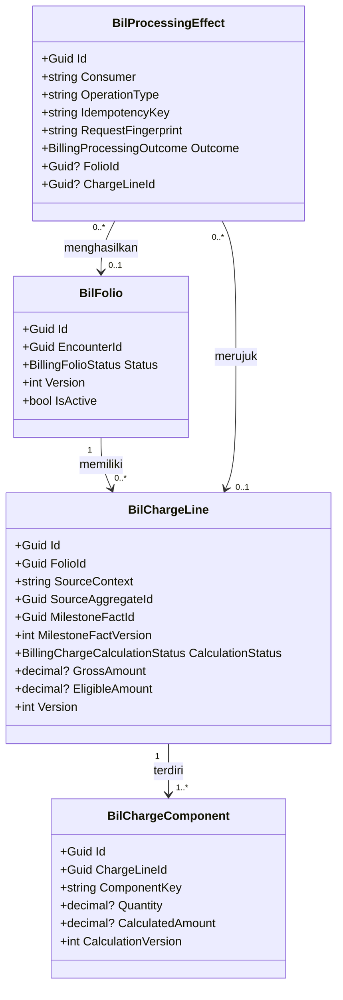
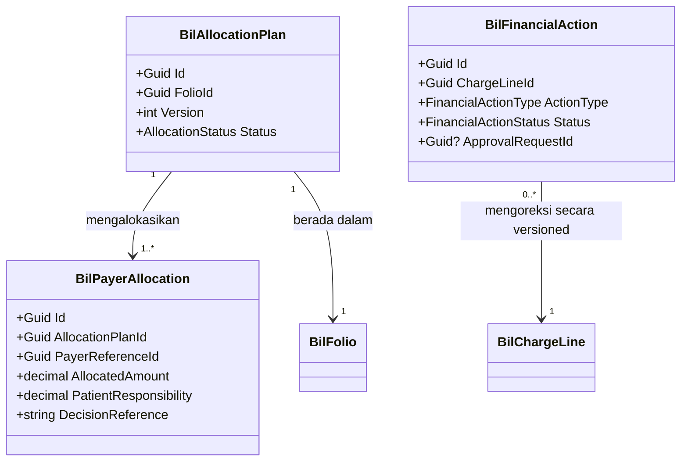

# Arsitektur Backend — Rawat Jalan Billing

| Field | Nilai |
|---|---|
| Blueprint | `RJ-BIL-BP-001` revision `11` |
| Status desain | `draft` — approval manusia belum digantikan |
| Domain architecture | revision `1`, `DOMAIN_ARCHITECTURE_PARTIAL`; core internal/manual independen siap |
| Evidence backend | commit `9b26be3...` + working tree Billing Operational |
| Requirement contract | `RJ-BIL-CONTRACT-001@1.0.0` (`OWNER_APPROVED`) |
| Decision | `RJ-BIL-GATE-DEC-001..009` |
| QBE yang mengikat | `QBE-ENT-001`, `QBE-NAM-002`, `QBE-CFG-001`, `QBE-MOD-001/002`, `QBE-SVC-001`, `QBE-API-001`, `QBE-PERM-001`, `QBE-LOG-001`, `QBE-VAL-001`, `QBE-DTO-001`, `QBE-AUD-001` |

## 1. Batas desain

Desain ini mencakup Billing Folio, Charge, Charge Component, milestone processing,
idempotency, dan batas integrasi dengan Clinical, Pharmacy, Laboratory, Radiology, Payer,
Cashier, Finance, dan Workflow. Allocation multi-payer, financial correction, payment,
claim, serta reconciliation penuh adalah aggregate target yang direncanakan tetapi belum
terbukti lengkap pada source.

Adapter eksternal bernama tetap `Rencana (belum tersedia)` dan tidak boleh diaktifkan.

## 2. Kepemilikan data

| Kelompok data | Modul pemilik | Dipakai modul ini | Dibuat ulang di modul ini |
|---|---|:---:|:---:|
| Pasien dan identitas | Patient Management | Ya, sebagai referensi | Tidak |
| Encounter | Registration Management | Ya, sebagai `EncounterId` | Tidak |
| Clinical order dan procedure fact | Clinical Management | Ya, sebagai source fact | Tidak |
| Prescription dan dispensing fact | Pharmacy Management | Ya, sebagai source fact/projection | Tidak |
| Lab order/specimen/result | Laboratory Management | Ya, sebagai source fact | Tidak |
| Radiology order/study/report | Radiology Management | Ya, sebagai source fact | Tidak; capability target masih baru |
| Billing folio | Billing Management | Ya | Ya, owner canonical Billing |
| Charge line/component | Billing Management | Ya | Ya, owner canonical Billing |
| Processing effect/idempotency | Billing Integration | Ya | Ya, boundary reliability Billing |
| Payer authorization/claim decision | Payer Management | Ya | Tidak; Billing hanya menyimpan reference/result |
| Payment/receipt/refund execution | Cashier | Ya | Tidak |
| Accounting posting/GL | Finance | Ya | Tidak |
| Approval request/maker-checker | Workflow Management | Ya | Tidak; gunakan engine existing |

## 3. Bounded context, aggregate, dan transaksi

| Context | Aggregate root | Invariant | Batas transaksi |
|---|---|---|---|
| Billing Folio | `BilFolio` | Satu folio aktif per `EncounterId`; close tidak boleh melewati unresolved mandatory outcome | Folio + charge reference + version update |
| Charge Recognition | `BilChargeLine` | Source fact/version/effect tidak menghasilkan charge ganda | Processing effect + folio + charge line dalam transaksi serializable |
| Charge Component | `BilChargeComponent` | Component memiliki key unik dalam charge line; snapshot tidak berubah | Bersama pembuatan charge line |
| Processing Reliability | `BilProcessingEffect` | Idempotency key/fingerprint/version conflict menghasilkan satu outcome canonical | Processing record dan efek finansial |
| Payer Allocation | Rencana `BilAllocationPlan` | Total allocation + patient responsibility = net eligible charge | Terpisah dari clinical fact; memakai payer decision |
| Financial Action | Rencana `BilFinancialAction` | Approval sebelum mutation; original charge immutable | Action + approval reference + versioned adjustment |

## 4. Class diagram

### 4.1 Billing operational yang sudah ada di working tree



### 4.2 Target financial boundary



Konsep target pada diagram kedua adalah `Rencana (belum tersedia)`; ia tidak menyatakan class
atau tabel sudah ada di source.

## 5. Penjelasan class dan file

| Class/berkas | Status | Lokasi file | Tanggung jawab dan catatan |
|---|---|---|---|
| `BilFolio` | Provisional, working tree | `Areas/HealthServices/BillingManagement/Operational/Models/BilFolio.cs` | Folio unik per encounter; mewarisi `IdentityModel`; status dan version concurrency |
| `BilChargeLine` | Provisional, working tree | `Areas/HealthServices/BillingManagement/Operational/Models/BilChargeLine.cs` | Menyimpan source fact, milestone, calculation status, dan nominal sementara |
| `BilChargeComponent` | Provisional, working tree | `Areas/HealthServices/BillingManagement/Operational/Models/BilChargeComponent.cs` | Menyimpan quantity, unit, tariff/rule/rounding snapshot, calculated amount |
| `BilProcessingEffect` | Provisional, working tree | `Areas/HealthServices/BillingManagement/Operational/Models/BilProcessingEffect.cs` | Idempotency, fingerprint, outcome, error, correlation, dan reference efek |
| `BillingOperationalEnums` | Provisional, working tree | `Areas/HealthServices/BillingManagement/Operational/Enums/BillingOperationalEnums.cs` | Status folio, calculation, dan processing outcome; nilai enum harus backward-compatible |
| `BillingOperationalDtos` | Provisional, working tree | `Areas/HealthServices/BillingManagement/Operational/DTOs/BillingOperationalDtos.cs` | Request milestone dan response folio/charge; bukan EF entity exposure |
| `BillingOperationalConfigurations` | Provisional, working tree | `Areas/HealthServices/BillingManagement/Operational/Configurations/BillingOperationalConfigurations.cs` | Mapping table, index unique, concurrency, relationship `Restrict` |
| `BillingFolioService` | Provisional, working tree | `Areas/HealthServices/BillingManagement/Operational/Services/BillingFolioService.cs` | Query folio dan recognize milestone; membuka transaksi `Serializable`; retry concurrency maksimal tiga kali |
| `BillingFolioController` | Provisional, working tree | `Areas/HealthServices/BillingManagement/Operational/Controllers/BillingFolioController.cs` | API GET folio dan POST internal milestone; memakai `[Authorize]`, `[AccessAction]`, `[AccessPermission]` |
| `BilAllocationPlan` | Rencana (belum tersedia) | `Areas/HealthServices/BillingManagement/Operational/Models/BilAllocationPlan.cs` | Aggregate allocation multi-payer; registry owner dan migration harus disetujui sebelum implementasi |
| `BilFinancialAction` | Rencana (belum tersedia) | `Areas/HealthServices/BillingManagement/Operational/Models/BilFinancialAction.cs` | Void/adjustment/reversal/refund/FOC/write-off versioned |
| `BillingAllocationService` | Rencana (belum tersedia) | `Areas/HealthServices/BillingManagement/Operational/Services/BillingAllocationService.cs` | Menghitung residual dan mencegah over-allocation |
| `BillingFinancialActionService` | Rencana (belum tersedia) | `Areas/HealthServices/BillingManagement/Operational/Services/BillingFinancialActionService.cs` | Maker-checker dan execution financial action |

## 6. Arsitektur folder target

```text
Areas/HealthServices/BillingManagement/Operational/
├── Controllers/                         # standar folder jamak
│   └── BillingFolioController.cs        # provisional working tree
├── DTOs/
│   └── BillingOperationalDtos.cs        # provisional working tree
├── Enums/
│   └── BillingOperationalEnums.cs       # provisional working tree
├── Models/
│   ├── BilFolio.cs                       # provisional working tree
│   ├── BilChargeLine.cs                  # provisional working tree
│   ├── BilChargeComponent.cs             # provisional working tree
│   ├── BilProcessingEffect.cs            # provisional working tree
│   ├── BilAllocationPlan.cs              # rencana
│   └── BilFinancialAction.cs             # rencana
└── Services/
    ├── BillingFolioService.cs            # provisional working tree
    ├── BillingAllocationService.cs       # rencana
    └── BillingFinancialActionService.cs  # rencana

Repositories/Configurations/HealthServices/BillingManagement/Operational/
└── BillingOperationalConfigurations.cs  # target standard; working tree saat ini berada di Areas/
```

Lokasi configuration working tree saat ini menyimpang dari aturan backend yang mensyaratkan
`Repositories/Configurations/<Domain>/<SubDomain>/`. Penyelarasan lokasi adalah pekerjaan
terpisah dan tidak boleh dilakukan diam-diam bersama task lain.

## 7. Status model dan migration

| Model | Status | Perubahan/kolom penting | Migration |
|---|---|---|---|
| `BilFolio` | Provisional working tree | `Id`, `EncounterId`, `Status`, `Version`, `IsActive`, audit `IdentityModel`; unique active encounter | Migration belum ditemukan pada scan; wajib dibuat/ditinjau terpisah |
| `BilChargeLine` | Provisional working tree | Source identity, milestone ID/version, calculation status, gross/eligible amount, version; unique source/effect index | Migration belum ditemukan |
| `BilChargeComponent` | Provisional working tree | Charge line, component key, quantity/unit, JSON snapshot, calculated amount/version | Migration belum ditemukan |
| `BilProcessingEffect` | Provisional working tree | Consumer/operation/idempotency/fingerprint/source/version/outcome/error/reference | Migration belum ditemukan |
| Allocation/financial action | Baru, rencana | Seluruh kolom harus ditentukan setelah contract review | Belum diizinkan |

Tidak ada migration yang boleh dijalankan berdasarkan blueprint ini. Rollback migration kelak
harus mempertahankan data clinical fact dan tidak menghapus histori financial effect.

## 8. Rencana data master awal

Core folio/charge tidak membutuhkan master baru untuk menerima milestone, tetapi final charge
memerlukan konfigurasi berikut sebelum status `Recognized`/close digunakan untuk operasi nyata:

| Master/configuration | Isi minimum | Status |
|---|---|---|
| Tariff catalogue/version | Service, component, unit price, currency, effective period | Pemilik Finance/Billing; belum tersedia sebagai contract target |
| Partial charge rule | Service/component, formula, rounding, min/max, approval evidence, effective period | Wajib untuk partial; tanpa rule masuk review |
| Financial approval policy | Action, amount/risk threshold, maker/checker capability, effective version | Wajib untuk high-risk; belum diisi |
| Payer master/context | Payer, priority, fund/program, authorization capability | Payer Management; manual Release 1 |

## 9. Endpoint dan service boundary

Endpoint AS-IS working tree dicatat lengkap pada `contracts/api-contract.md`. Endpoint target
allocation, financial action, payment, claim, dan reconciliation diberi label `Rencana (belum tersedia)`.

HTTP 409 berarti request menggunakan identity/version yang bertentangan atau outcome finansial
sebelumnya memerlukan rekonsiliasi. HTTP 400 berarti input fact tidak valid. HTTP 404 berarti
encounter/folio tidak ditemukan. HTTP 401/403 berarti identitas atau hak akses tidak cukup.

## 10. Yang sengaja tidak dibuat

| Yang ditolak | Alasan |
|---|---|
| `BilPatient` atau `BilEncounter` | Patient dan Encounter dimiliki context masing-masing; Billing hanya reference |
| `BilPaid` pada domain clinical/Pharmacy | Paid adalah financial state milik Cashier/Billing, bukan fact klinis |
| `BilPayer` sebagai pengganti Payer Management | Billing menerapkan allocation; payer eligibility/authorization tetap milik Payer context |
| Entity per endpoint atau per status | Aggregate diturunkan dari invariant/lifecycle, bukan layar/API/status |
| Adapter AdMedika/BPJS aktif | Contract eksternal dan production gate belum tersedia |
| Migration eksekusi | Blueprint tidak memberi otorisasi database |
