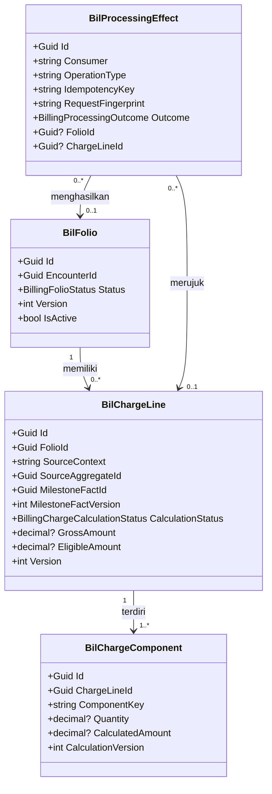
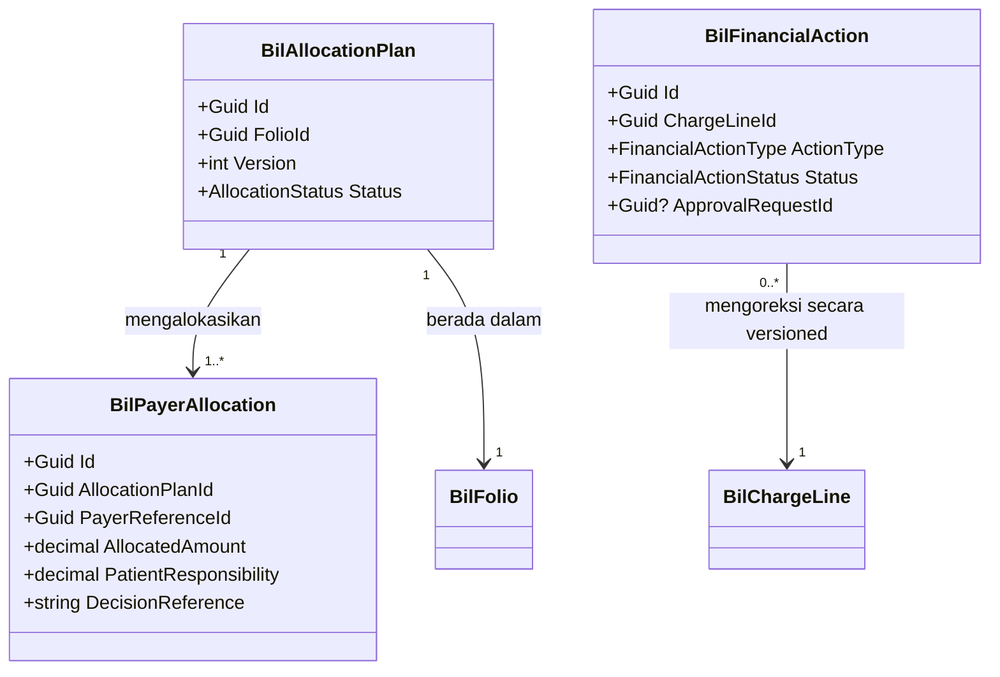
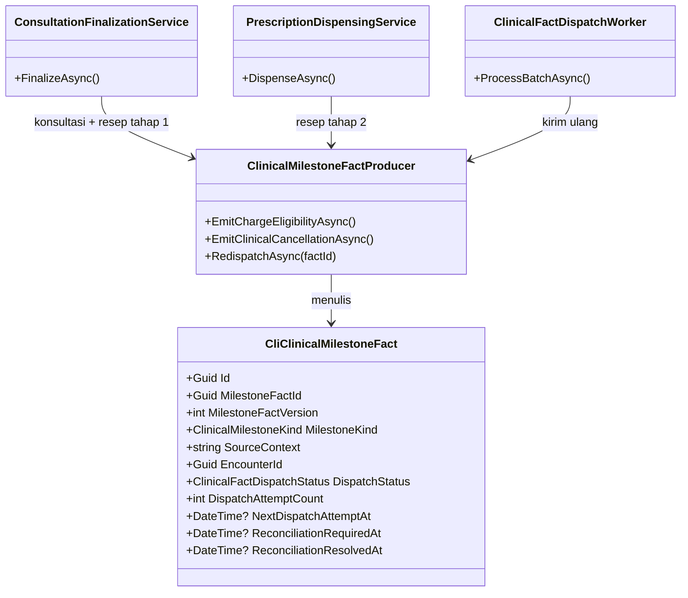
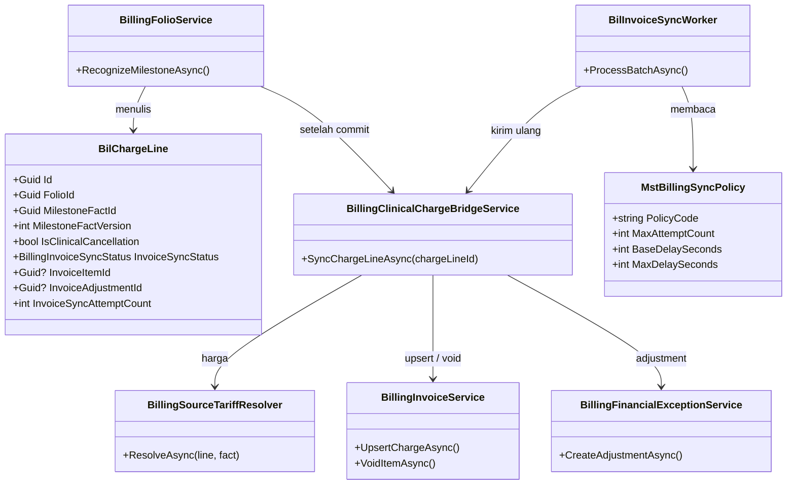
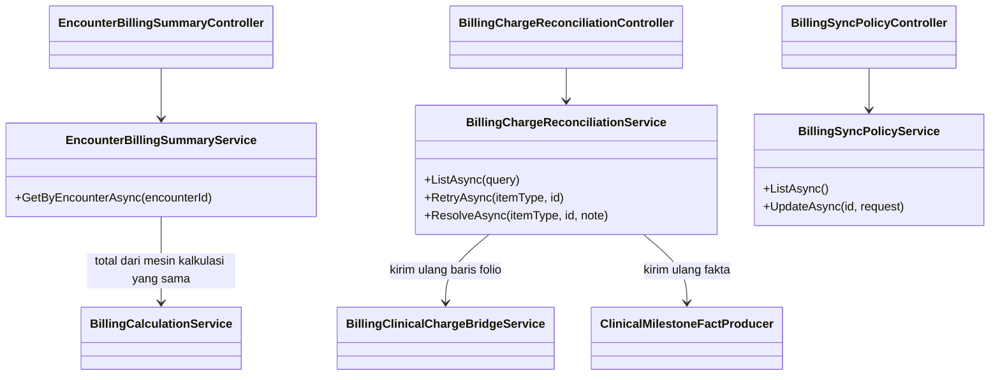

# Arsitektur Backend — Rawat Jalan Billing

> **Revisi `27` (28 September 2026):** amendment **V2 — Rawat Jalan ke invoice canonical** ada di bagian akhir berkas ini dan **berlaku** untuk jalur fakta klinis → tagihan. Isi di atasnya adalah riwayat desain `RJ-BIL`.

| Field | Nilai |
|---|---|
| Blueprint | `RJ-BIL-BP-001` revision `11` |
| Status desain | `draft` — approval manusia belum digantikan |
| Domain architecture | revision `1`, `DOMAIN_ARCHITECTURE_PARTIAL`; core internal/manual independen siap |
| Evidence backend | commit `9b26be3...` + working tree Billing Operational |
| Requirement contract | `RJ-BIL-CONTRACT-001@1.0.0` (`OWNER_APPROVED`) |
| Decision | `RJ-BIL-GATE-DEC-001..009` |
| QBE yang mengikat | `QBE-ENT-001`, `QBE-NAM-002`, `QBE-CFG-001`, `QBE-MOD-001/002`, `QBE-SVC-001`, `QBE-API-001`, `QBE-PERM-001`, `QBE-LOG-001`, `QBE-VAL-001`, `QBE-DTO-001`, `QBE-AUD-001` |

## 1. Batas desain

> **Dokumen ini adalah arsitektur scope Billing.** Ia `DOWNSTREAM` terhadap scope
> Doctor / Clinical dan **bukan** Definition of Done developer Dokter / Rawat Jalan. Arsitektur
> dan roadmap scope Dokter ada pada
> [roadmap/doctor-consultation-roadmap.md](roadmap/doctor-consultation-roadmap.md).
>
> Batas masuknya tunggal: `TrxClinicalMilestoneFact` yang diterbitkan `ClinicalMilestoneFactProducer`.
> Segala sesuatu **sebelum** batas itu — konsultasi dokter, anamnesis, vital, diagnosis, SOAP/CPPT,
> pembuatan resep, pembuatan tindakan, order Lab/Radiologi, dan penyelesaian konsultasi — dimiliki
> Clinical dan **tidak dirancang di sini**.

Desain ini mencakup Billing Folio, Charge, Charge Component, milestone processing,
idempotency, dan batas integrasi dengan Clinical, Pharmacy, Laboratory, Radiology, Payer,
Cashier, Finance, dan Workflow. Allocation multi-payer, financial correction, payment,
claim, serta reconciliation penuh adalah aggregate target yang direncanakan tetapi belum
terbukti lengkap pada source.

Adapter eksternal bernama tetap `Rencana (belum tersedia)` dan tidak boleh diaktifkan.

## 2. Kepemilikan data

| Kelompok data | Modul pemilik | Dipakai modul ini | Dibuat ulang di modul ini |
|---|---|:---:|:---:|
| Pasien dan identitas | Patient Management | Ya, sebagai referensi | Tidak |
| Encounter | Registration Management | Ya, sebagai `EncounterId` | Tidak |
| Clinical order dan procedure fact | Clinical Management | Ya, sebagai source fact | Tidak |
| Prescription dan dispensing fact | Pharmacy Management | Ya, sebagai source fact/projection | Tidak |
| Lab order/specimen/result | Laboratory Management | Ya, sebagai source fact | Tidak |
| Radiology order/study/report | Radiology Management | Ya, sebagai source fact | Tidak; capability target masih baru |
| Billing folio | Billing Management | Ya | Ya, owner canonical Billing |
| Charge line/component | Billing Management | Ya | Ya, owner canonical Billing |
| Processing effect/idempotency | Billing Integration | Ya | Ya, boundary reliability Billing |
| Payer authorization/claim decision | Payer Management | Ya | Tidak; Billing hanya menyimpan reference/result |
| Payment/receipt/refund execution | Cashier | Ya | Tidak |
| Accounting posting/GL | Finance | Ya | Tidak |
| Approval request/maker-checker | Workflow Management | Ya | Tidak; gunakan engine existing |

## 3. Bounded context, aggregate, dan transaksi

| Context | Aggregate root | Invariant | Batas transaksi |
|---|---|---|---|
| Billing Folio | `BilFolio` | Satu folio aktif per `EncounterId`; close tidak boleh melewati unresolved mandatory outcome | Folio + charge reference + version update |
| Charge Recognition | `BilChargeLine` | Source fact/version/effect tidak menghasilkan charge ganda | Processing effect + folio + charge line dalam transaksi serializable |
| Charge Component | `BilChargeComponent` | Component memiliki key unik dalam charge line; snapshot tidak berubah | Bersama pembuatan charge line |
| Processing Reliability | `BilProcessingEffect` | Idempotency key/fingerprint/version conflict menghasilkan satu outcome canonical | Processing record dan efek finansial |
| Payer Allocation | Rencana `BilAllocationPlan` | Total allocation + patient responsibility = net eligible charge | Terpisah dari clinical fact; memakai payer decision |
| Financial Action | Rencana `BilFinancialAction` | Approval sebelum mutation; original charge immutable | Action + approval reference + versioned adjustment |

## 4. Class diagram

### 4.1 Billing operational yang sudah ada di working tree


```mermaid
classDiagram
    class BilFolio {
        +Guid Id
        +Guid EncounterId
        +BillingFolioStatus Status
        +int Version
        +bool IsActive
    }
    class BilChargeLine {
        +Guid Id
        +Guid FolioId
        +string SourceContext
        +Guid SourceAggregateId
        +Guid MilestoneFactId
        +int MilestoneFactVersion
        +BillingChargeCalculationStatus CalculationStatus
        +decimal? GrossAmount
        +decimal? EligibleAmount
        +int Version
    }
    class BilChargeComponent {
        +Guid Id
        +Guid ChargeLineId
        +string ComponentKey
        +decimal? Quantity
        +decimal? CalculatedAmount
        +int CalculationVersion
    }
    class BilProcessingEffect {
        +Guid Id
        +string Consumer
        +string OperationType
        +string IdempotencyKey
        +string RequestFingerprint
        +BillingProcessingOutcome Outcome
        +Guid? FolioId
        +Guid? ChargeLineId
    }
    BilFolio "1" --> "0..*" BilChargeLine : memiliki
    BilChargeLine "1" --> "1..*" BilChargeComponent : terdiri
    BilProcessingEffect "0..*" --> "0..1" BilFolio : menghasilkan
    BilProcessingEffect "0..*" --> "0..1" BilChargeLine : merujuk
```

### 4.2 Target financial boundary


```mermaid
classDiagram
    class BilAllocationPlan {
        +Guid Id
        +Guid FolioId
        +int Version
        +AllocationStatus Status
    }
    class BilPayerAllocation {
        +Guid Id
        +Guid AllocationPlanId
        +Guid PayerReferenceId
        +decimal AllocatedAmount
        +decimal PatientResponsibility
        +string DecisionReference
    }
    class BilFinancialAction {
        +Guid Id
        +Guid ChargeLineId
        +FinancialActionType ActionType
        +FinancialActionStatus Status
        +Guid? ApprovalRequestId
    }
    BilAllocationPlan "1" --> "1..*" BilPayerAllocation : mengalokasikan
    BilAllocationPlan "1" --> "1" BilFolio : berada dalam
    BilFinancialAction "0..*" --> "1" BilChargeLine : mengoreksi secara versioned
```

Konsep target pada diagram kedua adalah `Rencana (belum tersedia)`; ia tidak menyatakan class
atau tabel sudah ada di source.

## 5. Penjelasan class dan file

| Class/berkas | Status | Lokasi file | Tanggung jawab dan catatan |
|---|---|---|---|
| `BilFolio` | Provisional, working tree | `Areas/HealthServices/BillingManagement/Operational/Models/BilFolio.cs` | Folio unik per encounter; mewarisi `IdentityModel`; status dan version concurrency |
| `BilChargeLine` | Provisional, working tree | `Areas/HealthServices/BillingManagement/Operational/Models/BilChargeLine.cs` | Menyimpan source fact, milestone, calculation status, dan nominal sementara |
| `BilChargeComponent` | Provisional, working tree | `Areas/HealthServices/BillingManagement/Operational/Models/BilChargeComponent.cs` | Menyimpan quantity, unit, tariff/rule/rounding snapshot, calculated amount |
| `BilProcessingEffect` | Provisional, working tree | `Areas/HealthServices/BillingManagement/Operational/Models/BilProcessingEffect.cs` | Idempotency, fingerprint, outcome, error, correlation, dan reference efek |
| `BillingOperationalEnums` | Provisional, working tree | `Areas/HealthServices/BillingManagement/Operational/Enums/BillingOperationalEnums.cs` | Status folio, calculation, dan processing outcome; nilai enum harus backward-compatible |
| `BillingOperationalDtos` | Provisional, working tree | `Areas/HealthServices/BillingManagement/Operational/DTOs/BillingOperationalDtos.cs` | Request milestone dan response folio/charge; bukan EF entity exposure |
| `BillingOperationalConfigurations` | Provisional, working tree | `Areas/HealthServices/BillingManagement/Operational/Configurations/BillingOperationalConfigurations.cs` | Mapping table, index unique, concurrency, relationship `Restrict` |
| `BillingFolioService` | Provisional, working tree | `Areas/HealthServices/BillingManagement/Operational/Services/BillingFolioService.cs` | Query folio dan recognize milestone; membuka transaksi `Serializable`; retry concurrency maksimal tiga kali |
| `BillingFolioController` | Provisional, working tree | `Areas/HealthServices/BillingManagement/Operational/Controllers/BillingFolioController.cs` | API GET folio dan POST internal milestone; memakai `[Authorize]`, `[AccessAction]`, `[AccessPermission]` |
| `BilAllocationPlan` | Rencana (belum tersedia) | `Areas/HealthServices/BillingManagement/Operational/Models/BilAllocationPlan.cs` | Aggregate allocation multi-payer; registry owner dan migration harus disetujui sebelum implementasi |
| `BilFinancialAction` | Rencana (belum tersedia) | `Areas/HealthServices/BillingManagement/Operational/Models/BilFinancialAction.cs` | Void/adjustment/reversal/refund/FOC/write-off versioned |
| `BillingAllocationService` | Rencana (belum tersedia) | `Areas/HealthServices/BillingManagement/Operational/Services/BillingAllocationService.cs` | Menghitung residual dan mencegah over-allocation |
| `BillingFinancialActionService` | Rencana (belum tersedia) | `Areas/HealthServices/BillingManagement/Operational/Services/BillingFinancialActionService.cs` | Maker-checker dan execution financial action |

## 6. Arsitektur folder target

```text
Areas/HealthServices/BillingManagement/Operational/
├── Controllers/                         # standar folder jamak
│   └── BillingFolioController.cs        # provisional working tree
├── DTOs/
│   └── BillingOperationalDtos.cs        # provisional working tree
├── Enums/
│   └── BillingOperationalEnums.cs       # provisional working tree
├── Models/
│   ├── BilFolio.cs                       # provisional working tree
│   ├── BilChargeLine.cs                  # provisional working tree
│   ├── BilChargeComponent.cs             # provisional working tree
│   ├── BilProcessingEffect.cs            # provisional working tree
│   ├── BilAllocationPlan.cs              # rencana
│   └── BilFinancialAction.cs             # rencana
└── Services/
    ├── BillingFolioService.cs            # provisional working tree
    ├── BillingAllocationService.cs       # rencana
    └── BillingFinancialActionService.cs  # rencana

Repositories/Configurations/HealthServices/BillingManagement/Operational/
└── BillingOperationalConfigurations.cs  # target standard; working tree saat ini berada di Areas/
```

Lokasi configuration working tree saat ini menyimpang dari aturan backend yang mensyaratkan
`Repositories/Configurations/<Domain>/<SubDomain>/`. Penyelarasan lokasi adalah pekerjaan
terpisah dan tidak boleh dilakukan diam-diam bersama task lain.

## 7. Status model dan migration

| Model | Status | Perubahan/kolom penting | Migration |
|---|---|---|---|
| `BilFolio` | Provisional working tree | `Id`, `EncounterId`, `Status`, `Version`, `IsActive`, audit `IdentityModel`; unique active encounter | Migration belum ditemukan pada scan; wajib dibuat/ditinjau terpisah |
| `BilChargeLine` | Provisional working tree | Source identity, milestone ID/version, calculation status, gross/eligible amount, version; unique source/effect index | Migration belum ditemukan |
| `BilChargeComponent` | Provisional working tree | Charge line, component key, quantity/unit, JSON snapshot, calculated amount/version | Migration belum ditemukan |
| `BilProcessingEffect` | Provisional working tree | Consumer/operation/idempotency/fingerprint/source/version/outcome/error/reference | Migration belum ditemukan |
| Allocation/financial action | Baru, rencana | Seluruh kolom harus ditentukan setelah contract review | Belum diizinkan |

Tidak ada migration yang boleh dijalankan berdasarkan blueprint ini. Rollback migration kelak
harus mempertahankan data clinical fact dan tidak menghapus histori financial effect.

## 8. Rencana data master awal

Core folio/charge tidak membutuhkan master baru untuk menerima milestone, tetapi final charge
memerlukan konfigurasi berikut sebelum status `Recognized`/close digunakan untuk operasi nyata:

| Master/configuration | Isi minimum | Status |
|---|---|---|
| Tariff catalogue/version | Service, component, unit price, currency, effective period | Pemilik Finance/Billing; belum tersedia sebagai contract target |
| Partial charge rule | Service/component, formula, rounding, min/max, approval evidence, effective period | Wajib untuk partial; tanpa rule masuk review |
| Financial approval policy | Action, amount/risk threshold, maker/checker capability, effective version | Wajib untuk high-risk; belum diisi |
| Payer master/context | Payer, priority, fund/program, authorization capability | Payer Management; manual Release 1 |

## 9. Endpoint dan service boundary

Endpoint AS-IS working tree dicatat lengkap pada `contracts/api-contract.md`. Endpoint target
allocation, financial action, payment, claim, dan reconciliation diberi label `Rencana (belum tersedia)`.

HTTP 409 berarti request menggunakan identity/version yang bertentangan atau outcome finansial
sebelumnya memerlukan rekonsiliasi. HTTP 400 berarti input fact tidak valid. HTTP 404 berarti
encounter/folio tidak ditemukan. HTTP 401/403 berarti identitas atau hak akses tidak cukup.

## 10. Yang sengaja tidak dibuat

| Yang ditolak | Alasan |
|---|---|
| `BilPatient` atau `BilEncounter` | Patient dan Encounter dimiliki context masing-masing; Billing hanya reference |
| `BilPaid` pada domain clinical/Pharmacy | Paid adalah financial state milik Cashier/Billing, bukan fact klinis |
| `BilPayer` sebagai pengganti Payer Management | Billing menerapkan allocation; payer eligibility/authorization tetap milik Payer context |
| Entity per endpoint atau per status | Aggregate diturunkan dari invariant/lifecycle, bukan layar/API/status |
| Adapter AdMedika/BPJS aktif | Contract eksternal dan production gate belum tersedia |
| Migration eksekusi | Blueprint tidak memberi otorisasi database |


---

# Amendment V2 — Jembatan Rawat Jalan ke Invoice Canonical (revisi blueprint `27`)

| Field | Nilai |
|---|---|
| Status desain | `approved` — Sukma Giri, 2026-09-28 |
| Kontrak | `RJ-E2E-CONTRACT-001@1.0.0` (`approved`) |
| Masukan | `PRD-RJ-BIL-V2-001`; [00-interview-decisions.md](00-interview-decisions.md) revisi `18` (`RJ-E2E-DEC-000`..`014`); [01-existing-capability-map-prd-v2.md](01-existing-capability-map-prd-v2.md) |
| Backend SHA | `063d38bc306bb6b46bdf088513fa6cdcc80399d8` (`sukmagp`) |
| Frontend SHA | `83b8b72744d4afaaedb3d2af9dd0b83fb272f9d6` (`sukmagpV2`) |
| Bentuk blueprint | `SINGLE` (`RJ-E2E-DEC-000`, `USER_CONFIRMED`) |
| Requirement readiness | Slice *clinical fact handoff* dan *billing folio* `READY_FOR_DOMAIN_DESIGN` ([01-requirement-completeness-gate.md](01-requirement-completeness-gate.md) bagian `5`) |
| Domain architecture | revisi `1`, `DOMAIN_ARCHITECTURE_PARTIAL`; slice ini berada di core internal yang siap secara independen |
| QBE yang mengikat | `QBE-NAM-001/002`, `QBE-MOD-001/002`, `QBE-SVC-001`, `QBE-CFG-001`, `QBE-PERM-001`, `QBE-LOG-001`, `QBE-API-001`, `QBE-DTO-001` |

> **Koreksi kontrak `RJ-E2E-CONTRACT-001@1.0.2` (`RJ-E2E-DEC-016`, 28 September 2026).** Di seluruh amendment V2, setiap penyebutan kolom sinkron/rekonsiliasi pada **`BilChargeLine`** dibaca sebagai **`BilProcessingEffect`**. Sebabnya: folio mencatat setiap versi fakta sebagai satu `BilProcessingEffect` (unik per konteks + fakta + versi + jenis efek) dan tidak membuat `BilChargeLine` baru untuk revisi (`BillingFolioService.cs:183-266`). `BilChargeLine` **tidak diubah**. Tambahan: kolom `InvoiceSyncVersion` (`int`, bawaan `0`) sebagai token konkurensi karena `BilProcessingEffect` tidak punya kolom `Version`. Encounter dicapai lewat `FolioId → BilFolio.EncounterId`. Rincian kolom: `data/data-dictionary.md` bagian 2.2.

> Bagian di atas garis adalah desain `RJ-BIL` revisi `11` dan dipertahankan sebagai riwayat. Bila
> keduanya bertentangan, **amendment ini yang berlaku** untuk jalur fakta klinis → tagihan.
> Terutama: target multi-payer pada bagian lama sudah dicabut `RJ-BIL-DEC-015`.

## V2.1 Masalah yang diselesaikan, dalam satu paragraf

Hari ini setiap pelayanan klinis Rawat Jalan (tindakan, Lab, Radiologi, resep) tercatat di buku
folio Billing (`BilFolio`/`BilChargeLine`), tetapi **tidak pernah sampai** ke invoice yang dibaca
kasir (`BilInvoice`/`BilInvoiceItem`). Akibatnya kasir harus mengetik ulang, harga bisa diketik
bebas, jasa konsultasi tidak pernah tertagih, dan resep terkunci melingkar di farmasi. Amendment
ini menambahkan **satu jembatan** di dalam Billing yang meneruskan setiap baris folio ke invoice
dengan harga dari katalog tarif, lengkap dengan kirim ulang otomatis dan antrean rekonsiliasi.

**Contoh:** Tn. A (samaran) diperiksa dr. B di Poli Penyakit Dalam, mendapat tindakan
*Nebulizer* dan resep *Paracetamol 10 tablet*. Setelah jembatan ada, begitu dokter menekan
Selesai Konsultasi, invoice kunjungan Tn. A otomatis berisi tiga baris: jasa konsultasi, Nebulizer,
dan resep. Harganya diambil dari `MstTariff`. Kasir tinggal menerima pembayaran.

## V2.2 Bounded context, aggregate, dan batas transaksi

| Konteks | Pemilik | Aggregate root | Invariant yang dijaga | Batas transaksi |
|---|---|---|---|---|
| Clinical Integration | ClinicalManagement | `CliClinicalMilestoneFact` | Satu identitas fakta + versi = satu isi (`PayloadFingerprint`); fakta tidak pernah dihapus; pembatalan = versi baru | Transaksi klinis commit **lebih dulu**; fakta ditulis sesudahnya. Kegagalan Billing tidak pernah membatalkan klinis (`AC-RJ-013`) |
| Billing Folio (ledger) | BillingManagement / Operational | `BilFolio` → `BilChargeLine` | Satu folio per encounter; satu baris per (fakta, versi); setiap baris punya status sinkron invoice | Transaksi folio sendiri; status sinkron ditulis di transaksi yang sama dengan baris |
| Billing Invoice (canonical) | BillingManagement / Billing | `BilInvoice` → `BilInvoiceItem` | Satu invoice per encounter (unique index); satu item per (`SourceDomain`, `SourceDetailId`); versi tidak boleh mundur; harga dari tarif | Transaksi invoice sendiri di dalam `UpsertChargeAsync` dengan advisory lock `BIL_ENCOUNTER_{id}` |

Tiga transaksi ini **sengaja terpisah**. Urutannya selalu klinis → fakta → folio → invoice. Bila
satu mata rantai gagal, mata rantai sebelumnya tetap sah, dan pekerja latar mengulang mata rantai
yang gagal dengan identitas yang sama.

**Contoh kegagalan sebagian:** Nebulizer Tn. A berhasil tersimpan di klinis dan folio, tetapi
database sempat terputus saat menulis invoice. Tindakan tetap berstatus dikerjakan, baris folio
berstatus sinkron `Pending`, dan pekerja `BilInvoiceSyncWorker` mengirim ulang 60 detik kemudian
dengan kunci idempotency yang sama. Invoice akhirnya berisi **satu** baris Nebulizer, bukan dua.

## V2.3 Tabel kepemilikan data

| Kelompok data | Modul pemilik | Dipakai amendment ini | Dibuat ulang di sini |
|---|---|:---:|---|
| Pasien | Patient Management | Ya (lewat encounter) | Tidak |
| Kunjungan (`RegPatientEncounter`), tipe dan status kunjungan | Registration Management | Ya | Tidak — hanya satu perubahan titik sentuh (`V2.8`) |
| Kelas pasien (`MstPatientClass`) | Master Data | Ya, untuk mencari tarif | Tidak |
| Konsultasi (`TrxDoctorConsultation`) | Clinical Management | Ya | Tidak |
| Tindakan (`TrxPatientProcedure`) | Clinical Management | Ya | Tidak |
| Resep dan item resep (`PhmPrescription`, `PhmPrescriptionItem`) | Pharmacy Management | Ya | Tidak |
| Pemeriksaan Lab (`LabExamination`) | Laboratory Management | Ya | Tidak |
| Order Radiologi (`RadOrder`, `RadStudy`) | Radiology Management | Ya | Tidak |
| Ledger fakta klinis (`CliClinicalMilestoneFact`) | Clinical Integration | Ya | Tidak — **diperbarui** (kolom rekonsiliasi) |
| Katalog tarif (`MstTariff`), aturan layanan dokter (`MstDoctorServiceRule`) | Master Data | Ya, hanya dibaca | Tidak |
| Folio dan baris folio (`BilFolio`, `BilChargeLine`) | Billing (Operational) | Ya | Tidak — **diperbarui** (kolom sinkron invoice) |
| Invoice dan item invoice (`BilInvoice`, `BilInvoiceItem`, `BilChargeReceipt`) | Billing | Ya | Tidak |
| Adjustment (`BilAdjustment`) | Billing | Ya, dibuat lewat service yang sudah ada | Tidak |
| Kebijakan biaya admin (`MstAdministrationFeePolicy`) | Billing | Ya, dipakai apa adanya | Tidak (`RJ-E2E-DEC-002`) |
| Kebijakan kirim ulang (`MstBillingSyncPolicy`) | Billing | Ya | **Ya — baru**, karena belum ada master kebijakan kirim ulang di mana pun |
| Payer, coverage, pembayaran, settlement | Billing / Kasir | Hanya dibaca untuk ringkasan | Tidak |

## V2.4 Class diagram

### V2.4.1 Clinical Integration


```mermaid
classDiagram
    class CliClinicalMilestoneFact {
        +Guid Id
        +Guid MilestoneFactId
        +int MilestoneFactVersion
        +ClinicalMilestoneKind MilestoneKind
        +string SourceContext
        +Guid EncounterId
        +ClinicalFactDispatchStatus DispatchStatus
        +int DispatchAttemptCount
        +DateTime? NextDispatchAttemptAt
        +DateTime? ReconciliationRequiredAt
        +DateTime? ReconciliationResolvedAt
    }
    class ClinicalMilestoneFactProducer {
        +EmitChargeEligibilityAsync()
        +EmitClinicalCancellationAsync()
        +RedispatchAsync(factId)
    }
    class ClinicalFactDispatchWorker {
        +ProcessBatchAsync()
    }
    class ConsultationFinalizationService {
        +FinalizeAsync()
    }
    class PrescriptionDispensingService {
        +DispenseAsync()
    }
    ConsultationFinalizationService --> ClinicalMilestoneFactProducer : konsultasi + resep tahap 1
    PrescriptionDispensingService --> ClinicalMilestoneFactProducer : resep tahap 2
    ClinicalFactDispatchWorker --> ClinicalMilestoneFactProducer : kirim ulang
    ClinicalMilestoneFactProducer --> CliClinicalMilestoneFact : menulis
```

### V2.4.2 Billing — jembatan folio ke invoice


```mermaid
classDiagram
    class BilChargeLine {
        +Guid Id
        +Guid FolioId
        +Guid MilestoneFactId
        +int MilestoneFactVersion
        +bool IsClinicalCancellation
        +BillingInvoiceSyncStatus InvoiceSyncStatus
        +Guid? InvoiceItemId
        +Guid? InvoiceAdjustmentId
        +int InvoiceSyncAttemptCount
    }
    class BillingFolioService {
        +RecognizeMilestoneAsync()
    }
    class BillingClinicalChargeBridgeService {
        +SyncChargeLineAsync(chargeLineId)
    }
    class BillingSourceTariffResolver {
        +ResolveAsync(line, fact)
    }
    class BilInvoiceSyncWorker {
        +ProcessBatchAsync()
    }
    class BillingInvoiceService {
        +UpsertChargeAsync()
        +VoidItemAsync()
    }
    class BillingFinancialExceptionService {
        +CreateAdjustmentAsync()
    }
    class MstBillingSyncPolicy {
        +string PolicyCode
        +int MaxAttemptCount
        +int BaseDelaySeconds
        +int MaxDelaySeconds
    }
    BillingFolioService --> BilChargeLine : menulis
    BillingFolioService --> BillingClinicalChargeBridgeService : setelah commit
    BilInvoiceSyncWorker --> BillingClinicalChargeBridgeService : kirim ulang
    BillingClinicalChargeBridgeService --> BillingSourceTariffResolver : harga
    BillingClinicalChargeBridgeService --> BillingInvoiceService : upsert / void
    BillingClinicalChargeBridgeService --> BillingFinancialExceptionService : adjustment
    BilInvoiceSyncWorker --> MstBillingSyncPolicy : membaca
```

### V2.4.3 Billing — baca ringkasan dan antrean rekonsiliasi


```mermaid
classDiagram
    class EncounterBillingSummaryController
    class EncounterBillingSummaryService {
        +GetByEncounterAsync(encounterId)
    }
    class BillingChargeReconciliationController
    class BillingChargeReconciliationService {
        +ListAsync(query)
        +RetryAsync(itemType, id)
        +ResolveAsync(itemType, id, note)
    }
    class BillingSyncPolicyController
    class BillingSyncPolicyService {
        +ListAsync()
        +UpdateAsync(id, request)
    }
    EncounterBillingSummaryController --> EncounterBillingSummaryService
    EncounterBillingSummaryService --> BillingCalculationService : total dari mesin kalkulasi yang sama
    BillingChargeReconciliationController --> BillingChargeReconciliationService
    BillingChargeReconciliationService --> BillingClinicalChargeBridgeService : kirim ulang baris folio
    BillingChargeReconciliationService --> ClinicalMilestoneFactProducer : kirim ulang fakta
    BillingSyncPolicyController --> BillingSyncPolicyService
```

## V2.5 Penjelasan setiap class

### Model

| Aspek | `CliClinicalMilestoneFact` |
|---|---|
| **Status** | `Diperbarui` |
| **Lokasi file** | `Areas/HealthServices/ClinicalManagement/Models/CliClinicalMilestoneFact.cs`; configuration `Repositories/Configurations/HealthServices/ClinicalManagement/CliClinicalMilestoneFactConfiguration.cs` |
| Kategori | Transaksi (ledger fakta) |
| Tanggung jawab utama | Mencatat setiap fakta pelayanan yang punya konsekuensi tagihan, beserta hasil penyerahannya ke Billing |
| Kolom yang berubah | **Baru:** `NextDispatchAttemptAt` (`DateTime?`), `ReconciliationRequiredAt` (`DateTime?`), `ReconciliationResolvedAt` (`DateTime?`), `ReconciliationResolvedByUserId` (`Guid?`), `ReconciliationResolutionNote` (`string(500)?`). **Index baru:** (`DispatchStatus`, `NextDispatchAttemptAt`) |
| Pemakaian dalam alur bisnis | Ditulis saat dokter/petugas menyelesaikan pelayanan; dibaca pekerja kirim ulang dan antrean rekonsiliasi |
| Catatan desain | Status penyerahan tetap lima nilai lama (`Pending`, `Dispatched`, `Rejected`, `OutcomeUnknown`, `SuppressedNoPriorCharge`), sesuai PRD §25. *Perlu rekonsiliasi* adalah **penanda waktu**, bukan status keenam, supaya kosakata status tidak bertambah |
| Ekuivalen model lama | — |

| Aspek | `BilChargeLine` |
|---|---|
| **Status** | `Diperbarui` |
| **Lokasi file** | `Areas/HealthServices/BillingManagement/Operational/Models/BilChargeLine.cs`; configuration `Repositories/Configurations/HealthServices/BillingManagement/Operational/BillingOperationalConfigurations.cs` |
| Kategori | Transaksi (ledger folio) |
| Tanggung jawab utama | Satu baris per (fakta, versi) di folio, dan kini juga **status apakah baris ini sudah masuk invoice** |
| Kolom yang berubah | **Baru:** `IsClinicalCancellation` (`bool`, bawaan `false`), `InvoiceSyncStatus` (`BillingInvoiceSyncStatus`, bawaan `NotApplicable`), `InvoiceSourceDomain` (`string(50)?`), `InvoiceSourceDetailId` (`string(100)?`), `InvoiceId` (`Guid?`, FK `BilInvoice`), `InvoiceItemId` (`Guid?`, FK `BilInvoiceItem`), `InvoiceAdjustmentId` (`Guid?`, FK `BilAdjustment`), `InvoiceSyncAttemptCount` (`int`, bawaan `0`), `InvoiceSyncNextAttemptAt` (`DateTime?`), `InvoiceSyncedAt` (`DateTime?`), `InvoiceSyncErrorCode` (`string(100)?`), `InvoiceSyncErrorMessage` (`string(1000)?`), `ReconciliationResolvedAt` (`DateTime?`), `ReconciliationResolvedByUserId` (`Guid?`), `ReconciliationResolutionNote` (`string(500)?`). **Index baru:** (`InvoiceSyncStatus`, `InvoiceSyncNextAttemptAt`), `InvoiceItemId` |
| Pemakaian dalam alur bisnis | Dibuat `BillingFolioService`; diteruskan jembatan; tampil di antrean rekonsiliasi bila gagal |
| Catatan desain | Tidak boleh ada baris ber-`InvoiceSyncStatus = Pending` yang dibiarkan tanpa jadwal kirim ulang atau tanpa antrean. Semua FK memakai `DeleteBehavior.Restrict` |
| Ekuivalen model lama | — |

| Aspek | `MstBillingSyncPolicy` |
|---|---|
| **Status** | `Baru` |
| **Lokasi file** | `Areas/HealthServices/BillingManagement/MasterData/Models/MstBillingSyncPolicy.cs`; configuration `Repositories/Configurations/HealthServices/BillingManagement/MasterData/MstBillingSyncPolicyConfiguration.cs` |
| Kategori | Master |
| Tanggung jawab utama | Menyimpan batas kirim ulang otomatis untuk dua jalur: penyerahan fakta (`FACT_DISPATCH`) dan sinkron invoice (`INVOICE_SYNC`) |
| Field penting | `PolicyCode` (unik), `PolicyName`, `MaxAttemptCount`, `BaseDelaySeconds`, `MaxDelaySeconds`, `IsActive`, `Description`, `RowVersion` |
| Pemakaian dalam alur bisnis | Dibaca pekerja latar setiap siklus; diubah admin Billing tanpa rilis (`RJ-E2E-DEC-009`) |
| Catatan desain | **Fail-closed:** bila baris aktif tidak ada, pekerja **tidak** mengirim ulang dan item langsung masuk antrean rekonsiliasi. Lokasi mengikuti master Billing yang sudah ada (`MstAdministrationFeePolicy` di `BillingManagement/MasterData/Models/`), bukan `Areas/HealthServices/MasterData/Models/` — penyimpangan dari pola standar yang sudah ada sebelum amendment ini, **tidak** dirapikan di sini |
| Ekuivalen model lama | — |

### Enum

| Enum | Status | Lokasi | Nilai | Bawaan |
|---|---|---|---|---|
| `BillingInvoiceSyncStatus` | `Baru` | `Areas/HealthServices/BillingManagement/Operational/Enums/BillingOperationalEnums.cs` | `NotApplicable = 0`, `Pending = 1`, `Synced = 2`, `Failed = 3`, `ReconciliationRequired = 4`, `Resolved = 5` | `NotApplicable` |
| `ClinicalFactDispatchStatus` | `Sudah ada` — tidak berubah | `Areas/HealthServices/ClinicalManagement/Enums/ClinicalMilestoneFactEnums.cs` | `Pending = 1` … `SuppressedNoPriorCharge = 5` | `Pending` |
| `EncounterStatus` | `Sudah ada` — tidak berubah; nilai `Billing = 8` mulai dipakai (`RJ-E2E-DEC-013`) | `Areas/HealthServices/RegistrationManagement/Enums/EncounterStatus.cs` | 0–11 | `Registered` |

Arti `BillingInvoiceSyncStatus` bagi petugas:

| Nilai | Arti | Contoh |
|---|---|---|
| `NotApplicable` | Baris ini memang tidak masuk invoice Rawat Jalan | Fakta Bank Darah, kunjungan rawat inap, atau pengulangan Radiologi karena kesalahan rumah sakit |
| `Pending` | Menunggu dikirim ke invoice | Baru dibuat, atau menunggu giliran kirim ulang |
| `Synced` | Sudah masuk invoice (atau sudah dibuatkan adjustment) | Nebulizer Tn. A tercatat sebagai item invoice |
| `Failed` | Percobaan terakhir gagal, masih akan dicoba lagi | Database terputus saat menulis invoice |
| `ReconciliationRequired` | Berhenti dicoba otomatis; butuh keputusan petugas Billing | Tarif tidak ditemukan, atau percobaan sudah 5 kali |
| `Resolved` | Petugas Billing sudah memutuskan secara manual | Petugas menyatakan baris lama sudah ditagih manual oleh kasir |

### Service

| Aspek | `BillingClinicalChargeBridgeService` |
|---|---|
| **Status** | `Baru` |
| **Lokasi file** | `Areas/HealthServices/BillingManagement/Billing/Services/BillingClinicalChargeBridgeService.cs` |
| Tanggung jawab utama | Meneruskan satu baris folio ke invoice: menilai kelayakan, memetakan domain dan status, meminta harga ke resolver, lalu memanggil `UpsertChargeAsync`, `VoidItemAsync`, atau `CreateAdjustmentAsync` |
| Dipanggil oleh | `BillingFolioService` (segera setelah commit), `BilInvoiceSyncWorker`, `BillingChargeReconciliationService` |
| Membuka transaksi database | Tidak membuka sendiri untuk invoice — memakai transaksi dan lock di dalam `UpsertChargeAsync`. Pembaruan kolom sinkron pada `BilChargeLine` ditulis sesudahnya dengan pemeriksaan `Version` |
| Aturan inti | Lihat `V2.7` |

| Aspek | `BillingSourceTariffResolver` |
|---|---|
| **Status** | `Baru` |
| **Lokasi file** | `Areas/HealthServices/BillingManagement/Billing/Services/BillingSourceTariffResolver.cs` |
| Tanggung jawab utama | Menetapkan `TariffId`, `CategoryId`, `UnitPrice`, dan `DescriptionSnapshot` dari `MstTariff` yang berlaku pada `OccurredAt` fakta. **Jumlah** diambil dari fakta (kebenaran klinis); **harga** dari katalog tarif (kebenaran finansial) |
| Dipanggil oleh | `BillingClinicalChargeBridgeService` |
| Membuka transaksi database | Tidak (baca saja, `AsNoTracking`) |

| Aspek | `BilInvoiceSyncWorker` |
|---|---|
| **Status** | `Baru` |
| **Lokasi file** | `Areas/HealthServices/BillingManagement/Billing/Workers/BilInvoiceSyncWorker.cs`; didaftarkan `builder.Services.AddHostedService<BilInvoiceSyncWorker>()` di `Program.cs` |
| Tanggung jawab utama | Setiap siklus mengambil paling banyak 50 baris `Pending`/`Failed` yang jadwalnya sudah lewat, lalu memanggil jembatan |
| Pola yang ditiru | `Areas/HealthServices/InPatientManagement/Workers/InpatientIntegrationOutboxWorker.cs` (scope per batch, jeda berkala, backoff eksponensial) — bedanya, batasnya dibaca dari `MstBillingSyncPolicy`, bukan konstanta |

| Aspek | `ClinicalFactDispatchWorker` |
|---|---|
| **Status** | `Baru` |
| **Lokasi file** | `Areas/HealthServices/ClinicalManagement/Workers/ClinicalFactDispatchWorker.cs`; didaftarkan di `Program.cs` |
| Tanggung jawab utama | Mengirim ulang fakta `Pending`/`OutcomeUnknown` yang jadwalnya sudah lewat lewat `ClinicalMilestoneFactProducer.RedispatchAsync`, memakai identitas dan `IdempotencyKey` yang sama |

| Service `Diperbarui` | Lokasi | Perubahan |
|---|---|---|
| `ClinicalMilestoneFactProducer` | `Areas/HealthServices/ClinicalManagement/Services/ClinicalMilestoneFactProducer.cs` | Tambah `RedispatchAsync(Guid clinicalMilestoneFactId)`; setiap kegagalan mengisi `NextDispatchAttemptAt`; setelah batas percobaan mengisi `ReconciliationRequiredAt`. Mengirim `IsClinicalCancellation` ke folio |
| `ConsultationFinalizationService` | `Areas/HealthServices/PharmacyManagement/Services/ConsultationFinalizationService.cs` | Setelah commit, menerbitkan fakta **konsultasi** (`SourceContext = Consultation`). Fakta resep tahap 1 membawa `RuleSnapshot.milestone = "ClinicalFinalization"` |
| `PrescriptionDispensingService` | `Areas/HealthServices/PharmacyManagement/Services/PrescriptionDispensingService.cs` | Setelah `DispenseAsync` commit dan status menjadi `Dispensed`/`PartiallyDispensed`, menerbitkan fakta resep versi baru dengan `RuleSnapshot.milestone = "Dispensed"` dan jumlah yang benar-benar diserahkan per item |
| `BillingFolioService` | `Areas/HealthServices/BillingManagement/Operational/Services/BillingFolioService.cs` | Menyimpan `IsClinicalCancellation`; mengisi `InvoiceSyncStatus` awal; memanggil jembatan setelah commit |
| `BillingInvoiceService` | `Areas/HealthServices/BillingManagement/Billing/Services/BillingInvoiceService.cs` | `POST from-source` publik menolak domain klinis Rawat Jalan (`V2.7.6`). Tidak ada perubahan pada `UpsertChargeAsync` |
| `ContractBillingChargeSourceAdapter` | `Areas/HealthServices/BillingManagement/Billing/Services/BillingChargeSourceAdapter.cs` | Kontrak `BIL-INTEGRATION-1.3`: `PHARMACY` menerima `PRESCRIBED`; domain baru `CONSULTATION` (`V2.7.3`) |
| `EncounterBillingSummaryService` | `Areas/HealthServices/BillingManagement/Billing/Services/EncounterBillingSummaryService.cs` | **Baru.** Ringkasan per encounter; total dari `BillingCalculationService.PreviewCalculationAsync` |
| `BillingChargeReconciliationService` | `Areas/HealthServices/BillingManagement/Billing/Services/BillingChargeReconciliationService.cs` | **Baru.** Daftar, kirim ulang, dan penyelesaian manual antrean |
| `BillingSyncPolicyService` | `Areas/HealthServices/BillingManagement/MasterData/Services/BillingSyncPolicyService.cs` | **Baru.** Baca dan ubah `MstBillingSyncPolicy` |

### Controller

| Controller | Status | Lokasi | Service | `[Tags]` | Atribut akses |
|---|---|---|---|---|---|
| `EncounterBillingSummaryController` | `Baru` | `Areas/HealthServices/BillingManagement/Billing/Controllers/EncounterBillingSummaryController.cs` | `EncounterBillingSummaryService` | `Health Services / Billing Management / Encounter Billing Summary` | `[AccessController]` modul `HEALTH_SERVICE_BILLING_MANAGEMENT`; `[AccessPermission("EncounterBillingSummary", "Read")]` |
| `BillingChargeReconciliationController` | `Baru` | `Areas/HealthServices/BillingManagement/Billing/Controllers/BillingChargeReconciliationController.cs` | `BillingChargeReconciliationService` | `Health Services / Billing Management / Billing / Charge Reconciliations` | `BillingChargeReconciliation : Read`, `BillingChargeReconciliation : Update` |
| `BillingSyncPolicyController` | `Baru` | `Areas/HealthServices/BillingManagement/MasterData/Controllers/BillingSyncPolicyController.cs` | `BillingSyncPolicyService` | `Health Services / Billing Management / Master Data / Billing Sync Policy` | `BillingSyncPolicy : Read`, `BillingSyncPolicy : Update` |
| `BillingInvoicesController` | `Diperbarui` | `Areas/HealthServices/BillingManagement/Billing/Controllers/BillingInvoicesController.cs` | `BillingInvoiceService` | tidak berubah | tidak berubah; hanya `FromSource` menambah jawaban `422` |
| `NurseStationQueueController` | `Diperbarui` (titik sentuh Registration) | `Areas/HealthServices/RegistrationManagement/Controllers/NurseStationQueueController.cs` | — (legacy memakai context langsung — utang teknis, **tidak** dirapikan di sini) | tidak berubah | tidak berubah |

Ketiga controller baru mengikuti alur `NEW CODE`: controller → service → `ApplicationDbContext`
(`QBE-SVC-001`). DTO ditaruh di `Areas/HealthServices/BillingManagement/Billing/Dtos/` (folder
Billing yang sudah ada memakai `Dtos`, bukan `DTOs`) dan
`Areas/HealthServices/BillingManagement/MasterData/DTOs/`.

## V2.6 Arsitektur folder

```text
Areas/HealthServices/
├── ClinicalManagement/
│   ├── Models/CliClinicalMilestoneFact.cs                     [Diperbarui]
│   ├── Services/ClinicalMilestoneFactProducer.cs              [Diperbarui]
│   └── Workers/ClinicalFactDispatchWorker.cs                  [Baru — folder baru]
├── PharmacyManagement/Services/
│   ├── ConsultationFinalizationService.cs                     [Diperbarui]
│   └── PrescriptionDispensingService.cs                       [Diperbarui]
├── RegistrationManagement/Controllers/
│   └── NurseStationQueueController.cs                         [Diperbarui — legacy DbContext langsung, utang teknis]
└── BillingManagement/
    ├── Operational/
    │   ├── Constants/BillingSourceContract.cs                 [Diperbarui]
    │   ├── DTOs/BillingOperationalDtos.cs                     [Diperbarui]
    │   ├── Enums/BillingOperationalEnums.cs                   [Diperbarui]
    │   ├── Models/BilChargeLine.cs                            [Diperbarui]
    │   └── Services/BillingFolioService.cs                    [Diperbarui]
    ├── Billing/
    │   ├── BillingManagementServiceCollectionExtensions.cs    [Diperbarui — registrasi service baru]
    │   ├── Controllers/
    │   │   ├── BillingInvoicesController.cs                   [Diperbarui]
    │   │   ├── EncounterBillingSummaryController.cs           [Baru]
    │   │   └── BillingChargeReconciliationController.cs       [Baru]
    │   ├── Dtos/
    │   │   ├── EncounterBillingSummaryDtos.cs                 [Baru]
    │   │   └── BillingChargeReconciliationDtos.cs             [Baru]
    │   ├── Services/
    │   │   ├── BillingChargeSourceAdapter.cs                  [Diperbarui]
    │   │   ├── BillingInvoiceService.cs                       [Diperbarui]
    │   │   ├── BillingClinicalChargeBridgeService.cs          [Baru]
    │   │   ├── BillingSourceTariffResolver.cs                 [Baru]
    │   │   ├── EncounterBillingSummaryService.cs              [Baru]
    │   │   └── BillingChargeReconciliationService.cs          [Baru]
    │   └── Workers/BilInvoiceSyncWorker.cs                    [Baru — folder baru]
    └── MasterData/
        ├── Controllers/BillingSyncPolicyController.cs         [Baru]
        ├── DTOs/BillingSyncPolicyDtos.cs                      [Baru]
        ├── Models/MstBillingSyncPolicy.cs                     [Baru — ikut lokasi master Billing yang ada]
        └── Services/BillingSyncPolicyService.cs               [Baru]

Repositories/Configurations/HealthServices/
├── ClinicalManagement/CliClinicalMilestoneFactConfiguration.cs                 [Diperbarui]
└── BillingManagement/
    ├── Operational/BillingOperationalConfigurations.cs                          [Diperbarui]
    └── MasterData/MstBillingSyncPolicyConfiguration.cs                          [Baru]

Migrations/<timestamp>_AddClinicalChargeInvoiceSync.cs                           [Baru — ditulis tangan, lihat V2.10]
Program.cs                                                                       [Diperbarui — dua AddHostedService]
```

Utang teknis yang terlihat dan **tidak** ditiru: `ConsultationFinalizationService` tinggal di
`PharmacyManagement/Services/` padahal konsultasi milik Clinical; `NurseStationQueueController`
mengakses `ApplicationDbContext` langsung; folder DTO Billing bernama `Dtos` sementara pola standar
`DTOs`. Ketiganya dicatat, tidak dirapikan diam-diam.

## V2.7 Aturan inti jembatan

### V2.7.1 Kelayakan baris folio

Baris diteruskan ke invoice hanya bila **ketiga** syarat terpenuhi. Selain itu baris diberi
`NotApplicable` beserta kode sebabnya.

| Syarat | Bila tidak terpenuhi | Kode |
|---|---|---|
| `RegPatientEncounter.EncounterType = Outpatient` | `NotApplicable` | `NOT_OUTPATIENT` |
| `SourceContext` termasuk `Procedure`, `Laboratory`, `Radiology`, `Prescription`, `Consultation` | `NotApplicable` | `SOURCE_OUT_OF_SCOPE` (mis. `BloodBank`, hemodialisis) |
| Bukan pengulangan Radiologi dengan sebab `InternalHospitalError` (`RJ-BIL-GATE-DEC-004`) dan bukan tindakan ber-`IsFreeOfCharge`/`!IsBillable` | `NotApplicable` | `REPEAT_INTERNAL_ERROR`, `NOT_BILLABLE` |

### V2.7.2 Pemetaan domain, identitas, dan status

| `SourceContext` | `SourceDomain` invoice | `SourceDetailId` | Status tagih | Status pembatalan |
|---|---|---|---|---|
| `Procedure` | `PROCEDURE` | `SourceAggregateId` (tindakan) | `PERFORMED` | `CANCELLED` |
| `Laboratory` | `LABORATORY` | `SourceItemId` (pemeriksaan) | `ACCEPTED` | `CANCELLED` |
| `Radiology` | `RADIOLOGY` | `SourceItemId` (study) | `PERFORMED` | `CANCELLED` |
| `Prescription` | `PHARMACY` | `SourceAggregateId` (resep) — wajib sama dengan yang dibaca `BilConsumerHandoffService` untuk clearance | `PRESCRIBED` bila `RuleSnapshot.milestone = "ClinicalFinalization"` atau kosong; `DISPENSED` bila `"Dispensed"` | `CANCELLED` |
| `Consultation` | `CONSULTATION` | `SourceAggregateId` (konsultasi) | `COMPLETED` | — (koreksi lewat adjustment) |

Nilai lain yang dikirim ke `UpsertChargeAsync`:

| Field | Nilai |
|---|---|
| `SourceVersion` | `MilestoneFactVersion` |
| `ContractVersion` | `BIL-INTEGRATION-1.3` |
| `OccurredAt` | `OccurredAt` fakta |
| `Quantity` | Dari fakta; resep selalu `1` (satu item invoice per resep) |
| `UnitPrice`, `TariffId`, `CategoryId`, `DescriptionSnapshot` | Dari `BillingSourceTariffResolver` |
| `DoctorShare` | `0` — sama dengan `catalog-charges` hari ini. Pembagian jasa medis milik modul medical-fee, di luar scope |
| `CorrelationId` / `CausationId` | Dari fakta |
| Idempotency key | Guid deterministik dari teks `RJ-E2E|{MilestoneFactId}|{MilestoneFactVersion}`, sehingga kirim ulang selalu menghasilkan kunci yang sama |

### V2.7.3 Perubahan kontrak adapter `BIL-INTEGRATION-1.3`

| `SourceDomain` | Status tagih | Boleh void normal dari | Status pembatalan | Berubah? |
|---|---|---|---|---|
| `PROCEDURE`, `LABORATORY`, `RADIOLOGY` | `CONFIRMED`, `ACCEPTED`, `COMPLETED`, `PERFORMED` | `CONFIRMED`, `ACCEPTED` | `CANCELLED`, `VOIDED` | Tidak |
| `PHARMACY` | **`PRESCRIBED`**, `DISPENSED` | **`PRESCRIBED`** | **`CANCELLED`** | **Ya** (`RJ-E2E-DEC-005`) |
| `CONSULTATION` | `COMPLETED` | — | — | **Baru** (`RJ-E2E-DEC-001`) |

Aturan keras yang dihapus: *"PHARMACY hanya boleh `DISPENSED`"* (`BillingChargeSourceAdapter.cs:87-88`).
Penggantinya: `PRESCRIBED` hanya diterima dengan `ContractVersion = BIL-INTEGRATION-1.3`, sehingga
pemanggil lama dengan `0.4`/`1.2` tetap terikat aturan lama.

`IsOrderComplete` tidak dipakai kode mana pun selain adapter itu sendiri (audit `063d38b`), sehingga
item `PRESCRIBED` **tidak** menahan finalisasi maupun pelunasan invoice. Inilah yang memutus
deadlock obat.

### V2.7.4 Aturan harga (`BillingSourceTariffResolver`)

Semua pencarian hanya memakai `MstTariff` yang `IsActive`, tidak `IsDelete`/`IsCancel`, dan berlaku
pada `OccurredAt` (`EffectiveStartDate <= OccurredAt < EffectiveEndDate`, batas kosong berarti
terbuka). Bila lebih dari satu cocok, yang paling spesifik menang: cocok klinik **dan** kelas
pasien > cocok salah satu > umum.

| Domain | Urutan pencarian | Bila tidak ketemu |
|---|---|---|
| `PROCEDURE` | (1) `TrxPatientProcedure.TariffId`; (2) `MstTariff.ProcedureId` = tindakan, klinik dan kelas pasien kunjungan | `ReconciliationRequired`, `TARIFF_NOT_FOUND` |
| `LABORATORY` | (1) `LabExamination.TariffId`; (2) `MstTariff.ProcedureId` = pemeriksaan | sama |
| `RADIOLOGY` | `MstTariff.ProcedureId` = `RadOrder.ProcedureId`, klinik dan kelas pasien | sama |
| `PHARMACY` | Per item resep yang tidak dihentikan: (1) `PhmPrescriptionItem.TariffId`; (2) `MstTariff.DrugId` = obat. `UnitPrice` = Σ(jumlah × `NormalPrice`) | Satu item tanpa tarif → **seluruh resep** `ReconciliationRequired`, `TARIFF_NOT_FOUND` |
| `CONSULTATION` | `RJ-E2E-DEC-012`: (1) `MstDoctorServiceRule` aktif dan berlaku untuk dokter + klinik + kelas pasien yang ber-`TariffId`; (2) `MstTariff.IsConsultationFee` untuk klinik + kelas pasien; (3) `MstTariff.IsConsultationFee` untuk klinik | `ReconciliationRequired`, `TARIFF_NOT_FOUND`. **Tidak pernah Rp0** |

Harga dari `TariffSnapshot` fakta (`unitPrice` yang dikirim modul klinis) **diabaikan** (`RJ-E2E-DEC-006`).

**Contoh resep:** Resep Tn. A memuat Paracetamol 500 mg × 10 (tarif Rp1.500) dan Vitamin C × 10
(tarif Rp2.000). Tahap 1: `UnitPrice` = 10 × 1.500 + 10 × 2.000 = **Rp35.000**, `Quantity` 1,
status `PRESCRIBED`, versi 1. Farmasi hanya punya 8 tablet Vitamin C. Tahap 2 (`DISPENSED`, versi 2):
10 × 1.500 + 8 × 2.000 = **Rp31.000**.

**Contoh konsultasi:** dr. B di Poli Penyakit Dalam, pasien kelas Umum. Ada `MstDoctorServiceRule`
dr. B + Poli Penyakit Dalam + Umum dengan tarif *Konsultasi Spesialis Penyakit Dalam* Rp150.000 →
item `CONSULTATION` Rp150.000. Bila rule itu tidak ada, dipakai tarif `IsConsultationFee` klinik
Poli Penyakit Dalam kelas Umum, misalnya Rp120.000.

### V2.7.5 Keputusan per keadaan invoice

| Jenis baris | Invoice `OPEN` | Invoice `FINAL`/`CLOSED`/`SETTLED_BY_WRITE_OFF` |
|---|---|---|
| Tagih baru / versi naik | `UpsertChargeAsync` | Adjustment `DEBIT` sebesar selisih, status `SUBMITTED` (butuh persetujuan `RJ-BIL-DEC-004`) |
| Resep tahap 2 lebih kecil dari tahap 1 | `UpsertChargeAsync` (harga turun) | Adjustment `CREDIT` sebesar selisih — penyelesaian uangnya milik Billing (`RJ-E2E-OQ-003`) |
| Selisih nol | `UpsertChargeAsync` (replay/no-op) | Tidak ada adjustment; baris `Synced` dengan kode `NO_FINANCIAL_CHANGE` |
| Pembatalan, item masih di status void normal (`CONFIRMED`, `ACCEPTED`, `PRESCRIBED`) | `VoidItemAsync` | Adjustment `CREDIT` |
| Pembatalan, item sudah `PERFORMED`/`COMPLETED`/`DISPENSED` | Adjustment `CREDIT` (`RJ-E2E-DEC-010`) — **tidak** void | Adjustment `CREDIT` |

Adjustment dibuat lewat `BillingFinancialExceptionService.CreateAdjustmentAsync` dengan `RequestedBy`
= aktor fakta, `Reason` memuat nomor pelayanan dan versi fakta, dan idempotency key deterministik
yang sama. `InvoiceAdjustmentId` dicatat di baris folio. Bila service menolak (misalnya invoice
`CLOSED` tidak menerima adjustment), baris masuk `ReconciliationRequired` dengan kode
`ADJUSTMENT_REJECTED` — perilaku ini **wajib dipastikan pada preflight task**, bukan diasumsikan.

### V2.7.6 Pengamanan `POST from-source` (titik sentuh Billing, `RJ-E2E-DEC-006`)

`POST /billing/invoices/from-source` menolak `422` bila `SourceDomain` salah satu dari `PROCEDURE`,
`LABORATORY`, `RADIOLOGY`, `PHARMACY`, `CONSULTATION` **dan** encounter bertipe `Outpatient`. Domain
`ADHOC`, `ADHOC_CATALOG`, `ROOM_STAY`, `INPATIENT`, `EMERGENCY` tidak berubah. Konsumen frontend
satu-satunya (`billing-invoice-slice.jsx:607`, biaya lain-lain kasir) memakai `ADHOC`, sehingga
tidak terdampak.

## V2.8 Titik sentuh status kunjungan (`RJ-E2E-DEC-007`, `RJ-E2E-DEC-013`)

| Jalur | Hari ini | Target |
|---|---|---|
| Skrining selesai, butuh dokter | `WaitingForDoctor` | Tidak berubah |
| Skrining selesai, **tidak** butuh dokter | `Completed` + `CompletedAt` diisi (`NurseStationQueueController.cs:327-329`) | **`Billing`**; `CompletedAt` **tidak** diisi; antrean perawat tetap `Completed` |
| Dokter Selesai Konsultasi | `ConsultationCompleted` | Tidak berubah |
| `PATCH` ubah status kunjungan bebas ke `Completed` | Diizinkan dari status apa pun | **Tidak diubah pada MVP.** Frontend Rawat Jalan tidak memanggilnya (audit `83b8b72`: tidak ada konsumen di `registration-management` services). Pengamanannya ikut `RJ-E2E-DEC-004`, `POST-MVP` |

## V2.9 Status model dan dampak migration

| Model | Status | Kolom berubah | Dampak migration |
|---|---|---|---|
| `CliClinicalMilestoneFact` | `Diperbarui` | 5 kolom nullable baru + 1 index | Aditif, tanpa downtime |
| `BilChargeLine` | `Diperbarui` | 15 kolom baru (2 ber-bawaan, 13 nullable), 3 FK, 2 index | Aditif; backfill `InvoiceSyncStatus` (`V2.10`) |
| `MstBillingSyncPolicy` | `Baru` | seluruh kolom | Tabel baru + seed 2 baris |
| `BilInvoice`, `BilInvoiceItem`, `BilAdjustment`, `BilChargeReceipt` | `Sudah ada` | — | Tidak ada |
| `RegPatientEncounter`, `MstTariff`, `MstDoctorServiceRule` | `Sudah ada` | — | Tidak ada |

## V2.10 Rencana migration

| Urutan | Migration | Isi | Tanpa downtime | Mundur |
|---:|---|---|:---:|---|
| 1 | `<timestamp>_AddClinicalChargeInvoiceSync` | (a) kolom + index `CliClinicalMilestoneFact`; (b) kolom + FK + index `BilChargeLine`; (c) tabel `MstBillingSyncPolicy` + unique `PolicyCode`; (d) seed 2 baris kebijakan; (e) backfill | Ya — seluruhnya aditif; backfill satu `UPDATE` bertarget | `Down()` menghapus tabel, FK, index, dan kolom baru. Aman selama jembatan belum pernah berjalan; bila sudah, jalankan dulu penonaktifan pekerja agar tidak ada baris baru yang bergantung pada kolom |

Backfill (`RJ-E2E-DEC-014`):

| Baris lama | Diisi menjadi |
|---|---|
| Baris folio pada encounter `Outpatient`, `SourceContext` termasuk lima konteks V2.7.1 | `InvoiceSyncStatus = ReconciliationRequired`, `InvoiceSyncErrorCode = LEGACY_PRE_BRIDGE` |
| Baris lain | `NotApplicable` (bawaan kolom) |

**Contoh:** di `QuilvianNewDevSukma` ada 40 baris folio lama; 25 milik kunjungan Rawat Jalan dari
lima konteks. Setelah migration, 25 baris muncul di antrean rekonsiliasi dengan kode
`LEGACY_PRE_BRIDGE`, dan 15 lainnya `NotApplicable`. Tidak ada satu pun item invoice yang terbentuk
otomatis dari baris lama.

**Migration wajib ditulis tangan.** `ApplicationDbContextModelSnapshot` meleset jauh dari model
sebenarnya (`RJ-BIL-DEC-018`), sehingga `dotnet ef migrations add` akan menghasilkan ratusan operasi
milik modul lain. Snapshot tetap diperbarui hanya untuk entitas amendment ini. Migration diterapkan
**hanya** ke `QuilvianNewDevSukma` sampai ada wewenang lain.

## V2.11 Rencana data master awal

| Master | Isi minimum | Sumber nilai |
|---|---|---|
| `MstBillingSyncPolicy` | `FACT_DISPATCH`: `MaxAttemptCount 5`, `BaseDelaySeconds 60`, `MaxDelaySeconds 3600`, aktif. `INVOICE_SYNC`: nilai sama, aktif | **Usulan awal**, bukan kebijakan rumah sakit. Dapat diubah admin tanpa rilis (`RJ-E2E-DEC-009`). Tanpa baris aktif → fail-closed |
| `MstTariff` ber-`IsConsultationFee` per klinik Rawat Jalan | Minimal satu tarif konsultasi per klinik aktif | Data tarif rumah sakit — **bukan** diisi amendment ini. Klinik tanpa tarif menghasilkan antrean `TARIFF_NOT_FOUND`, bukan tagihan Rp0 |
| `MstTariff` untuk tindakan, pemeriksaan Lab, pemeriksaan Radiologi, obat | Sudah dipakai modul masing-masing | Tidak berubah |
| `MstAdministrationFeePolicy` `RAJAL` | Sudah ada | Tidak berubah (`RJ-E2E-DEC-002`) |

Jadwal kirim ulang: percobaan ke-*n* dijadwalkan `min(BaseDelaySeconds × 2^(n−1), MaxDelaySeconds)`.
**Contoh** dengan nilai usulan: gagal ke-1 → coba lagi 60 detik; ke-2 → 120 detik; ke-3 → 240 detik;
ke-4 → 480 detik; setelah percobaan ke-5 gagal → `ReconciliationRequired`.

## V2.12 Otorisasi, privasi, audit, dan pencatatan

- Butir hak akses baru: `EncounterBillingSummary : Read`, `BillingChargeReconciliation : Read`,
  `BillingChargeReconciliation : Update`, `BillingSyncPolicy : Read`, `BillingSyncPolicy : Update`.
  Terdaftar otomatis lewat `[AccessController]`/`[AccessAction]`, sama seperti
  `PatientBillingSummaryController`.
- Fakta ke Billing **tidak** membawa SOAP, diagnosis, anamnesis, hasil Lab/Radiologi, maupun
  instruksi obat lengkap (`SEC-RJ-005`). `RuleSnapshot` resep tahap 2 hanya memuat id item dan
  jumlah yang diserahkan.
- Audit (`SEC-RJ-006`): setiap percobaan jembatan dicatat lewat `LoggerService.AuditAsync` dengan
  `ActorUserId`, aksi (`BillingBridge.Sync`, `BillingBridge.Void`, `BillingBridge.Adjust`,
  `BillingBridge.Reconcile`), `EncounterId`, `SourceDomain`, `SourceDetailId`, `SourceVersion`,
  `InvoiceId`, waktu, `CorrelationId`, dan hasil. Tanpa nama pasien dan tanpa isi klinis.
- Pekerja latar berjalan sebagai aktor sistem, tetapi audit tetap menyimpan `ActorUserId` asli dari
  fakta.

## V2.13 Strategi verifikasi — pola Bank Darah

Repository backend **tidak** memiliki project test dan folder `Tests/` **dilarang dibuat**
(commit `cefd927d`; ditegaskan pemilik 28 September 2026). Verifikasi setiap task mengikuti pola
`docs/module-blueprints/bank-darah/task/report/backend/BE-BD-022.md` bagian `5`:

| Langkah | Perintah atau cara | Lulus bila |
|---|---|---|
| Build produksi | `dotnet build QuilvianSystemBackend.csproj -p:UseSharedCompilation=false -o <scratchpad>/out` | `0 Error(s)`; peringatan tidak bertambah dari baseline |
| Kecocokan model | `dotnet ef migrations has-pending-model-changes --no-build` | Tidak ada perubahan model yang tertinggal |
| QBE | `tooling/qbe/Invoke-QbeConformanceCheck.ps1 -Mode Strict` | `VIOLATION 0` |
| `dotnet test` | — | Ditulis `NOT RUN — tidak ada project test` |
| Validasi runtime | Aplikasi hasil build dijalankan dari scratchpad terhadap **`QuilvianNewDevSukma`**; skenario R0..Rn lewat HTTP sungguhan dengan data samaran | Setiap skenario `PASS` terhadap baris [acceptance-test-matrix.md](testing/acceptance-test-matrix.md) bagian V2 |
| Keadaan database sesudah run | Dicatat per tabel yang tersentuh | Sisa data uji dan dampaknya ke pengujian berikutnya tertulis |

Kolom "Jenis" pada acceptance test matrix menyatakan **sifat skenario**, bukan perintah membuat
test otomatis.

## V2.14 Yang sengaja tidak dibuat

| Yang ditolak | Alasan |
|---|---|
| Producer klinis memanggil `BillingInvoiceService` langsung | Menyentuh modul Bank Darah, hemodialisis, dan rawat inap yang berbagi producer; folio tetap sebagai ledger (`RJ-E2E-DEC-003`) |
| Status keenam `ReconciliationRequired` pada `ClinicalFactDispatchStatus` | Kosakata status penyerahan dikunci PRD §25; cukup penanda waktu `ReconciliationRequiredAt` |
| Sumber `REGISTRATION` / biaya admin sebagai item invoice | Sudah dihitung `MstAdministrationFeePolicy` `RAJAL`; akan menagih ganda (`RJ-E2E-DEC-002`) |
| Pemakaian `MstPatientClass.DefaultConsultationFee` | Bukan `MstTariff`; melanggar `RJ-E2E-DEC-006`/`012` |
| Tabel tarif konsultasi baru | `MstTariff.IsConsultationFee` dan `MstDoctorServiceRule.TariffId` sudah ada |
| Satu item invoice per item obat | Clearance farmasi membaca satu item `PHARMACY` per resep (`BilConsumerHandoffService.cs:301-310`); memecahnya merusak clearance |
| Nilai enum `EncounterStatus` baru untuk kunjungan tanpa dokter | Nilai `Billing` sudah ada dan belum dipakai (`RJ-E2E-DEC-013`) |
| Pengamanan `PATCH` status kunjungan ke `Completed` | Menunggu `RJ-E2E-DEC-004`; frontend Rawat Jalan tidak memanggilnya |
| Producer `CONSUMABLE` | Ditunda (`RJ-E2E-DEC-011`) |
| Memindahkan ringkasan rawat inap dari folio ke invoice | Di luar scope (`RJ-E2E-DEC-003`) |
| Project/folder test otomatis | Dilarang; pola Bank Darah (`V2.13`) |
