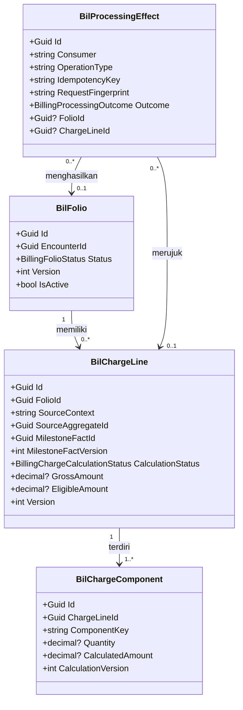
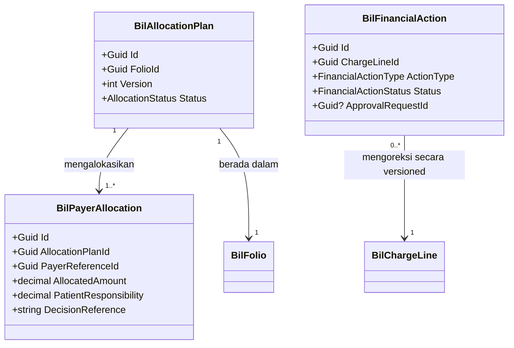
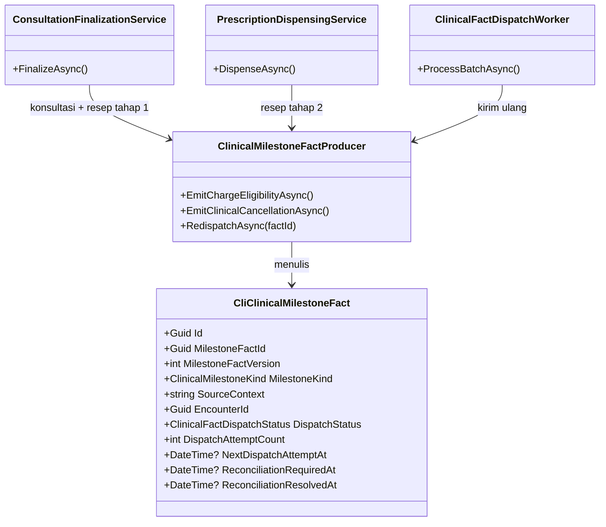
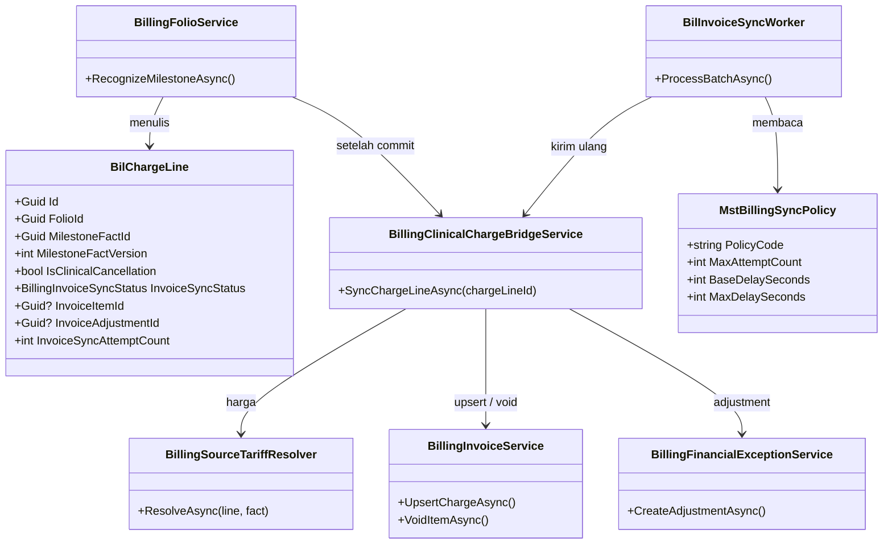
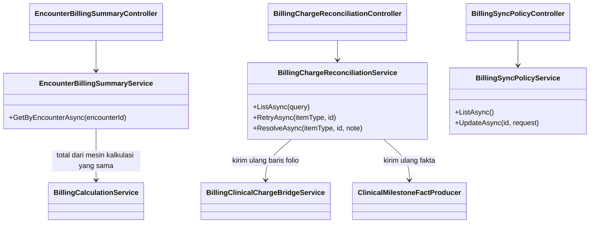
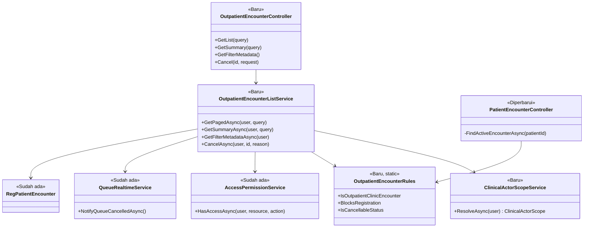
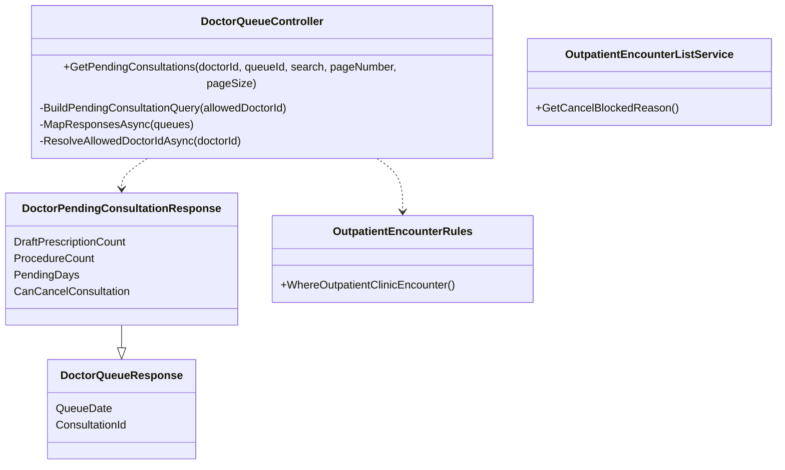
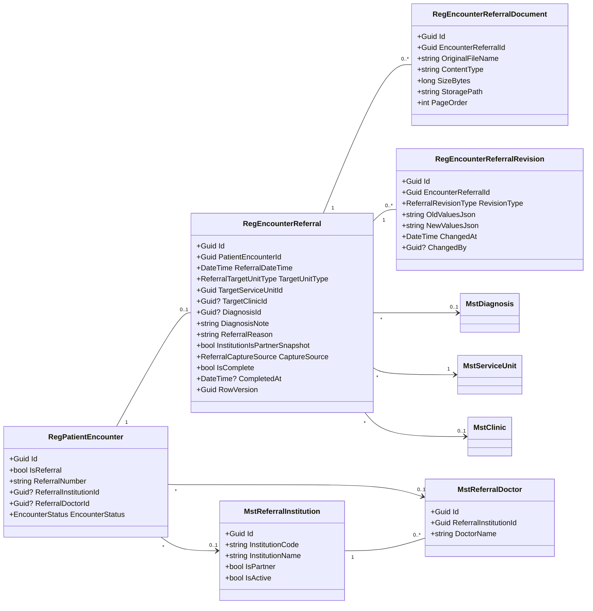

# Arsitektur Backend — Rawat Jalan Billing

> **Revisi `27` (28 September 2026):** amendment **V2 — Rawat Jalan ke invoice canonical** ada di bagian akhir berkas ini dan **berlaku** untuk jalur fakta klinis → tagihan. Isi di atasnya adalah riwayat desain `RJ-BIL`.

| Field | Nilai |
|---|---|
| Blueprint | `RJ-BIL-BP-001` revision `11` |
| Status desain | `draft` — approval manusia belum digantikan |
| Domain architecture | revision `1`, `DOMAIN_ARCHITECTURE_PARTIAL`; core internal/manual independen siap |
| Evidence backend | commit `9b26be3...` + working tree Billing Operational |
| Requirement contract | `RJ-BIL-CONTRACT-001@1.0.0` (`OWNER_APPROVED`) |
| Decision | `RJ-BIL-GATE-DEC-001..009` |
| QBE yang mengikat | `QBE-ENT-001`, `QBE-NAM-002`, `QBE-CFG-001`, `QBE-MOD-001/002`, `QBE-SVC-001`, `QBE-API-001`, `QBE-PERM-001`, `QBE-LOG-001`, `QBE-VAL-001`, `QBE-DTO-001`, `QBE-AUD-001` |

## 1. Batas desain

> **Dokumen ini adalah arsitektur scope Billing.** Ia `DOWNSTREAM` terhadap scope
> Doctor / Clinical dan **bukan** Definition of Done developer Dokter / Rawat Jalan. Arsitektur
> dan roadmap scope Dokter ada pada
> [roadmap/doctor-consultation-roadmap.md](roadmap/doctor-consultation-roadmap.md).
>
> Batas masuknya tunggal: `TrxClinicalMilestoneFact` yang diterbitkan `ClinicalMilestoneFactProducer`.
> Segala sesuatu **sebelum** batas itu — konsultasi dokter, anamnesis, vital, diagnosis, SOAP/CPPT,
> pembuatan resep, pembuatan tindakan, order Lab/Radiologi, dan penyelesaian konsultasi — dimiliki
> Clinical dan **tidak dirancang di sini**.

Desain ini mencakup Billing Folio, Charge, Charge Component, milestone processing,
idempotency, dan batas integrasi dengan Clinical, Pharmacy, Laboratory, Radiology, Payer,
Cashier, Finance, dan Workflow. Allocation multi-payer, financial correction, payment,
claim, serta reconciliation penuh adalah aggregate target yang direncanakan tetapi belum
terbukti lengkap pada source.

Adapter eksternal bernama tetap `Rencana (belum tersedia)` dan tidak boleh diaktifkan.

## 2. Kepemilikan data

| Kelompok data | Modul pemilik | Dipakai modul ini | Dibuat ulang di modul ini |
|---|---|:---:|:---:|
| Pasien dan identitas | Patient Management | Ya, sebagai referensi | Tidak |
| Encounter | Registration Management | Ya, sebagai `EncounterId` | Tidak |
| Clinical order dan procedure fact | Clinical Management | Ya, sebagai source fact | Tidak |
| Prescription dan dispensing fact | Pharmacy Management | Ya, sebagai source fact/projection | Tidak |
| Lab order/specimen/result | Laboratory Management | Ya, sebagai source fact | Tidak |
| Radiology order/study/report | Radiology Management | Ya, sebagai source fact | Tidak; capability target masih baru |
| Billing folio | Billing Management | Ya | Ya, owner canonical Billing |
| Charge line/component | Billing Management | Ya | Ya, owner canonical Billing |
| Processing effect/idempotency | Billing Integration | Ya | Ya, boundary reliability Billing |
| Payer authorization/claim decision | Payer Management | Ya | Tidak; Billing hanya menyimpan reference/result |
| Payment/receipt/refund execution | Cashier | Ya | Tidak |
| Accounting posting/GL | Finance | Ya | Tidak |
| Approval request/maker-checker | Workflow Management | Ya | Tidak; gunakan engine existing |

## 3. Bounded context, aggregate, dan transaksi

| Context | Aggregate root | Invariant | Batas transaksi |
|---|---|---|---|
| Billing Folio | `BilFolio` | Satu folio aktif per `EncounterId`; close tidak boleh melewati unresolved mandatory outcome | Folio + charge reference + version update |
| Charge Recognition | `BilChargeLine` | Source fact/version/effect tidak menghasilkan charge ganda | Processing effect + folio + charge line dalam transaksi serializable |
| Charge Component | `BilChargeComponent` | Component memiliki key unik dalam charge line; snapshot tidak berubah | Bersama pembuatan charge line |
| Processing Reliability | `BilProcessingEffect` | Idempotency key/fingerprint/version conflict menghasilkan satu outcome canonical | Processing record dan efek finansial |
| Payer Allocation | Rencana `BilAllocationPlan` | Total allocation + patient responsibility = net eligible charge | Terpisah dari clinical fact; memakai payer decision |
| Financial Action | Rencana `BilFinancialAction` | Approval sebelum mutation; original charge immutable | Action + approval reference + versioned adjustment |

## 4. Class diagram

### 4.1 Billing operational yang sudah ada di working tree


```mermaid
classDiagram
    class BilFolio {
        +Guid Id
        +Guid EncounterId
        +BillingFolioStatus Status
        +int Version
        +bool IsActive
    }
    class BilChargeLine {
        +Guid Id
        +Guid FolioId
        +string SourceContext
        +Guid SourceAggregateId
        +Guid MilestoneFactId
        +int MilestoneFactVersion
        +BillingChargeCalculationStatus CalculationStatus
        +decimal? GrossAmount
        +decimal? EligibleAmount
        +int Version
    }
    class BilChargeComponent {
        +Guid Id
        +Guid ChargeLineId
        +string ComponentKey
        +decimal? Quantity
        +decimal? CalculatedAmount
        +int CalculationVersion
    }
    class BilProcessingEffect {
        +Guid Id
        +string Consumer
        +string OperationType
        +string IdempotencyKey
        +string RequestFingerprint
        +BillingProcessingOutcome Outcome
        +Guid? FolioId
        +Guid? ChargeLineId
    }
    BilFolio "1" --> "0..*" BilChargeLine : memiliki
    BilChargeLine "1" --> "1..*" BilChargeComponent : terdiri
    BilProcessingEffect "0..*" --> "0..1" BilFolio : menghasilkan
    BilProcessingEffect "0..*" --> "0..1" BilChargeLine : merujuk
```

### 4.2 Target financial boundary


```mermaid
classDiagram
    class BilAllocationPlan {
        +Guid Id
        +Guid FolioId
        +int Version
        +AllocationStatus Status
    }
    class BilPayerAllocation {
        +Guid Id
        +Guid AllocationPlanId
        +Guid PayerReferenceId
        +decimal AllocatedAmount
        +decimal PatientResponsibility
        +string DecisionReference
    }
    class BilFinancialAction {
        +Guid Id
        +Guid ChargeLineId
        +FinancialActionType ActionType
        +FinancialActionStatus Status
        +Guid? ApprovalRequestId
    }
    BilAllocationPlan "1" --> "1..*" BilPayerAllocation : mengalokasikan
    BilAllocationPlan "1" --> "1" BilFolio : berada dalam
    BilFinancialAction "0..*" --> "1" BilChargeLine : mengoreksi secara versioned
```

Konsep target pada diagram kedua adalah `Rencana (belum tersedia)`; ia tidak menyatakan class
atau tabel sudah ada di source.

## 5. Penjelasan class dan file

| Class/berkas | Status | Lokasi file | Tanggung jawab dan catatan |
|---|---|---|---|
| `BilFolio` | Provisional, working tree | `Areas/HealthServices/BillingManagement/Operational/Models/BilFolio.cs` | Folio unik per encounter; mewarisi `IdentityModel`; status dan version concurrency |
| `BilChargeLine` | Provisional, working tree | `Areas/HealthServices/BillingManagement/Operational/Models/BilChargeLine.cs` | Menyimpan source fact, milestone, calculation status, dan nominal sementara |
| `BilChargeComponent` | Provisional, working tree | `Areas/HealthServices/BillingManagement/Operational/Models/BilChargeComponent.cs` | Menyimpan quantity, unit, tariff/rule/rounding snapshot, calculated amount |
| `BilProcessingEffect` | Provisional, working tree | `Areas/HealthServices/BillingManagement/Operational/Models/BilProcessingEffect.cs` | Idempotency, fingerprint, outcome, error, correlation, dan reference efek |
| `BillingOperationalEnums` | Provisional, working tree | `Areas/HealthServices/BillingManagement/Operational/Enums/BillingOperationalEnums.cs` | Status folio, calculation, dan processing outcome; nilai enum harus backward-compatible |
| `BillingOperationalDtos` | Provisional, working tree | `Areas/HealthServices/BillingManagement/Operational/DTOs/BillingOperationalDtos.cs` | Request milestone dan response folio/charge; bukan EF entity exposure |
| `BillingOperationalConfigurations` | Provisional, working tree | `Areas/HealthServices/BillingManagement/Operational/Configurations/BillingOperationalConfigurations.cs` | Mapping table, index unique, concurrency, relationship `Restrict` |
| `BillingFolioService` | Provisional, working tree | `Areas/HealthServices/BillingManagement/Operational/Services/BillingFolioService.cs` | Query folio dan recognize milestone; membuka transaksi `Serializable`; retry concurrency maksimal tiga kali |
| `BillingFolioController` | Provisional, working tree | `Areas/HealthServices/BillingManagement/Operational/Controllers/BillingFolioController.cs` | API GET folio dan POST internal milestone; memakai `[Authorize]`, `[AccessAction]`, `[AccessPermission]` |
| `BilAllocationPlan` | Rencana (belum tersedia) | `Areas/HealthServices/BillingManagement/Operational/Models/BilAllocationPlan.cs` | Aggregate allocation multi-payer; registry owner dan migration harus disetujui sebelum implementasi |
| `BilFinancialAction` | Rencana (belum tersedia) | `Areas/HealthServices/BillingManagement/Operational/Models/BilFinancialAction.cs` | Void/adjustment/reversal/refund/FOC/write-off versioned |
| `BillingAllocationService` | Rencana (belum tersedia) | `Areas/HealthServices/BillingManagement/Operational/Services/BillingAllocationService.cs` | Menghitung residual dan mencegah over-allocation |
| `BillingFinancialActionService` | Rencana (belum tersedia) | `Areas/HealthServices/BillingManagement/Operational/Services/BillingFinancialActionService.cs` | Maker-checker dan execution financial action |

## 6. Arsitektur folder target

```text
Areas/HealthServices/BillingManagement/Operational/
├── Controllers/                         # standar folder jamak
│   └── BillingFolioController.cs        # provisional working tree
├── DTOs/
│   └── BillingOperationalDtos.cs        # provisional working tree
├── Enums/
│   └── BillingOperationalEnums.cs       # provisional working tree
├── Models/
│   ├── BilFolio.cs                       # provisional working tree
│   ├── BilChargeLine.cs                  # provisional working tree
│   ├── BilChargeComponent.cs             # provisional working tree
│   ├── BilProcessingEffect.cs            # provisional working tree
│   ├── BilAllocationPlan.cs              # rencana
│   └── BilFinancialAction.cs             # rencana
└── Services/
    ├── BillingFolioService.cs            # provisional working tree
    ├── BillingAllocationService.cs       # rencana
    └── BillingFinancialActionService.cs  # rencana

Repositories/Configurations/HealthServices/BillingManagement/Operational/
└── BillingOperationalConfigurations.cs  # target standard; working tree saat ini berada di Areas/
```

Lokasi configuration working tree saat ini menyimpang dari aturan backend yang mensyaratkan
`Repositories/Configurations/<Domain>/<SubDomain>/`. Penyelarasan lokasi adalah pekerjaan
terpisah dan tidak boleh dilakukan diam-diam bersama task lain.

## 7. Status model dan migration

| Model | Status | Perubahan/kolom penting | Migration |
|---|---|---|---|
| `BilFolio` | Provisional working tree | `Id`, `EncounterId`, `Status`, `Version`, `IsActive`, audit `IdentityModel`; unique active encounter | Migration belum ditemukan pada scan; wajib dibuat/ditinjau terpisah |
| `BilChargeLine` | Provisional working tree | Source identity, milestone ID/version, calculation status, gross/eligible amount, version; unique source/effect index | Migration belum ditemukan |
| `BilChargeComponent` | Provisional working tree | Charge line, component key, quantity/unit, JSON snapshot, calculated amount/version | Migration belum ditemukan |
| `BilProcessingEffect` | Provisional working tree | Consumer/operation/idempotency/fingerprint/source/version/outcome/error/reference | Migration belum ditemukan |
| Allocation/financial action | Baru, rencana | Seluruh kolom harus ditentukan setelah contract review | Belum diizinkan |

Tidak ada migration yang boleh dijalankan berdasarkan blueprint ini. Rollback migration kelak
harus mempertahankan data clinical fact dan tidak menghapus histori financial effect.

## 8. Rencana data master awal

Core folio/charge tidak membutuhkan master baru untuk menerima milestone, tetapi final charge
memerlukan konfigurasi berikut sebelum status `Recognized`/close digunakan untuk operasi nyata:

| Master/configuration | Isi minimum | Status |
|---|---|---|
| Tariff catalogue/version | Service, component, unit price, currency, effective period | Pemilik Finance/Billing; belum tersedia sebagai contract target |
| Partial charge rule | Service/component, formula, rounding, min/max, approval evidence, effective period | Wajib untuk partial; tanpa rule masuk review |
| Financial approval policy | Action, amount/risk threshold, maker/checker capability, effective version | Wajib untuk high-risk; belum diisi |
| Payer master/context | Payer, priority, fund/program, authorization capability | Payer Management; manual Release 1 |

## 9. Endpoint dan service boundary

Endpoint AS-IS working tree dicatat lengkap pada `contracts/api-contract.md`. Endpoint target
allocation, financial action, payment, claim, dan reconciliation diberi label `Rencana (belum tersedia)`.

HTTP 409 berarti request menggunakan identity/version yang bertentangan atau outcome finansial
sebelumnya memerlukan rekonsiliasi. HTTP 400 berarti input fact tidak valid. HTTP 404 berarti
encounter/folio tidak ditemukan. HTTP 401/403 berarti identitas atau hak akses tidak cukup.

## 10. Yang sengaja tidak dibuat

| Yang ditolak | Alasan |
|---|---|
| `BilPatient` atau `BilEncounter` | Patient dan Encounter dimiliki context masing-masing; Billing hanya reference |
| `BilPaid` pada domain clinical/Pharmacy | Paid adalah financial state milik Cashier/Billing, bukan fact klinis |
| `BilPayer` sebagai pengganti Payer Management | Billing menerapkan allocation; payer eligibility/authorization tetap milik Payer context |
| Entity per endpoint atau per status | Aggregate diturunkan dari invariant/lifecycle, bukan layar/API/status |
| Adapter AdMedika/BPJS aktif | Contract eksternal dan production gate belum tersedia |
| Migration eksekusi | Blueprint tidak memberi otorisasi database |


---

# Amendment V2 — Jembatan Rawat Jalan ke Invoice Canonical (revisi blueprint `27`)

| Field | Nilai |
|---|---|
| Status desain | `approved` — Sukma Giri, 2026-09-28 |
| Kontrak | `RJ-E2E-CONTRACT-001@1.0.0` (`approved`) |
| Masukan | `PRD-RJ-BIL-V2-001`; [00-interview-decisions.md](00-interview-decisions.md) revisi `18` (`RJ-E2E-DEC-000`..`014`); [01-existing-capability-map-prd-v2.md](01-existing-capability-map-prd-v2.md) |
| Backend SHA | `063d38bc306bb6b46bdf088513fa6cdcc80399d8` (`sukmagp`) |
| Frontend SHA | `83b8b72744d4afaaedb3d2af9dd0b83fb272f9d6` (`sukmagpV2`) |
| Bentuk blueprint | `SINGLE` (`RJ-E2E-DEC-000`, `USER_CONFIRMED`) |
| Requirement readiness | Slice *clinical fact handoff* dan *billing folio* `READY_FOR_DOMAIN_DESIGN` ([01-requirement-completeness-gate.md](01-requirement-completeness-gate.md) bagian `5`) |
| Domain architecture | revisi `1`, `DOMAIN_ARCHITECTURE_PARTIAL`; slice ini berada di core internal yang siap secara independen |
| QBE yang mengikat | `QBE-NAM-001/002`, `QBE-MOD-001/002`, `QBE-SVC-001`, `QBE-CFG-001`, `QBE-PERM-001`, `QBE-LOG-001`, `QBE-API-001`, `QBE-DTO-001` |

> **Koreksi kontrak `RJ-E2E-CONTRACT-001@1.0.2` (`RJ-E2E-DEC-016`, 28 September 2026).** Di seluruh amendment V2, setiap penyebutan kolom sinkron/rekonsiliasi pada **`BilChargeLine`** dibaca sebagai **`BilProcessingEffect`**. Sebabnya: folio mencatat setiap versi fakta sebagai satu `BilProcessingEffect` (unik per konteks + fakta + versi + jenis efek) dan tidak membuat `BilChargeLine` baru untuk revisi (`BillingFolioService.cs:183-266`). `BilChargeLine` **tidak diubah**. Tambahan: kolom `InvoiceSyncVersion` (`int`, bawaan `0`) sebagai token konkurensi karena `BilProcessingEffect` tidak punya kolom `Version`. Encounter dicapai lewat `FolioId → BilFolio.EncounterId`. Rincian kolom: `data/data-dictionary.md` bagian 2.2.

> Bagian di atas garis adalah desain `RJ-BIL` revisi `11` dan dipertahankan sebagai riwayat. Bila
> keduanya bertentangan, **amendment ini yang berlaku** untuk jalur fakta klinis → tagihan.
> Terutama: target multi-payer pada bagian lama sudah dicabut `RJ-BIL-DEC-015`.

## V2.1 Masalah yang diselesaikan, dalam satu paragraf

Hari ini setiap pelayanan klinis Rawat Jalan (tindakan, Lab, Radiologi, resep) tercatat di buku
folio Billing (`BilFolio`/`BilChargeLine`), tetapi **tidak pernah sampai** ke invoice yang dibaca
kasir (`BilInvoice`/`BilInvoiceItem`). Akibatnya kasir harus mengetik ulang, harga bisa diketik
bebas, jasa konsultasi tidak pernah tertagih, dan resep terkunci melingkar di farmasi. Amendment
ini menambahkan **satu jembatan** di dalam Billing yang meneruskan setiap baris folio ke invoice
dengan harga dari katalog tarif, lengkap dengan kirim ulang otomatis dan antrean rekonsiliasi.

**Contoh:** Tn. A (samaran) diperiksa dr. B di Poli Penyakit Dalam, mendapat tindakan
*Nebulizer* dan resep *Paracetamol 10 tablet*. Setelah jembatan ada, begitu dokter menekan
Selesai Konsultasi, invoice kunjungan Tn. A otomatis berisi tiga baris: jasa konsultasi, Nebulizer,
dan resep. Harganya diambil dari `MstTariff`. Kasir tinggal menerima pembayaran.

## V2.2 Bounded context, aggregate, dan batas transaksi

| Konteks | Pemilik | Aggregate root | Invariant yang dijaga | Batas transaksi |
|---|---|---|---|---|
| Clinical Integration | ClinicalManagement | `CliClinicalMilestoneFact` | Satu identitas fakta + versi = satu isi (`PayloadFingerprint`); fakta tidak pernah dihapus; pembatalan = versi baru | Transaksi klinis commit **lebih dulu**; fakta ditulis sesudahnya. Kegagalan Billing tidak pernah membatalkan klinis (`AC-RJ-013`) |
| Billing Folio (ledger) | BillingManagement / Operational | `BilFolio` → `BilChargeLine` | Satu folio per encounter; satu baris per (fakta, versi); setiap baris punya status sinkron invoice | Transaksi folio sendiri; status sinkron ditulis di transaksi yang sama dengan baris |
| Billing Invoice (canonical) | BillingManagement / Billing | `BilInvoice` → `BilInvoiceItem` | Satu invoice per encounter (unique index); satu item per (`SourceDomain`, `SourceDetailId`); versi tidak boleh mundur; harga dari tarif | Transaksi invoice sendiri di dalam `UpsertChargeAsync` dengan advisory lock `BIL_ENCOUNTER_{id}` |

Tiga transaksi ini **sengaja terpisah**. Urutannya selalu klinis → fakta → folio → invoice. Bila
satu mata rantai gagal, mata rantai sebelumnya tetap sah, dan pekerja latar mengulang mata rantai
yang gagal dengan identitas yang sama.

**Contoh kegagalan sebagian:** Nebulizer Tn. A berhasil tersimpan di klinis dan folio, tetapi
database sempat terputus saat menulis invoice. Tindakan tetap berstatus dikerjakan, baris folio
berstatus sinkron `Pending`, dan pekerja `BilInvoiceSyncWorker` mengirim ulang 60 detik kemudian
dengan kunci idempotency yang sama. Invoice akhirnya berisi **satu** baris Nebulizer, bukan dua.

## V2.3 Tabel kepemilikan data

| Kelompok data | Modul pemilik | Dipakai amendment ini | Dibuat ulang di sini |
|---|---|:---:|---|
| Pasien | Patient Management | Ya (lewat encounter) | Tidak |
| Kunjungan (`RegPatientEncounter`), tipe dan status kunjungan | Registration Management | Ya | Tidak — hanya satu perubahan titik sentuh (`V2.8`) |
| Kelas pasien (`MstPatientClass`) | Master Data | Ya, untuk mencari tarif | Tidak |
| Konsultasi (`TrxDoctorConsultation`) | Clinical Management | Ya | Tidak |
| Tindakan (`TrxPatientProcedure`) | Clinical Management | Ya | Tidak |
| Resep dan item resep (`PhmPrescription`, `PhmPrescriptionItem`) | Pharmacy Management | Ya | Tidak |
| Pemeriksaan Lab (`LabExamination`) | Laboratory Management | Ya | Tidak |
| Order Radiologi (`RadOrder`, `RadStudy`) | Radiology Management | Ya | Tidak |
| Ledger fakta klinis (`CliClinicalMilestoneFact`) | Clinical Integration | Ya | Tidak — **diperbarui** (kolom rekonsiliasi) |
| Katalog tarif (`MstTariff`), aturan layanan dokter (`MstDoctorServiceRule`) | Master Data | Ya, hanya dibaca | Tidak |
| Folio dan baris folio (`BilFolio`, `BilChargeLine`) | Billing (Operational) | Ya | Tidak — **diperbarui** (kolom sinkron invoice) |
| Invoice dan item invoice (`BilInvoice`, `BilInvoiceItem`, `BilChargeReceipt`) | Billing | Ya | Tidak |
| Adjustment (`BilAdjustment`) | Billing | Ya, dibuat lewat service yang sudah ada | Tidak |
| Kebijakan biaya admin (`MstAdministrationFeePolicy`) | Billing | Ya, dipakai apa adanya | Tidak (`RJ-E2E-DEC-002`) |
| Kebijakan kirim ulang (`MstBillingSyncPolicy`) | Billing | Ya | **Ya — baru**, karena belum ada master kebijakan kirim ulang di mana pun |
| Payer, coverage, pembayaran, settlement | Billing / Kasir | Hanya dibaca untuk ringkasan | Tidak |

## V2.4 Class diagram

### V2.4.1 Clinical Integration


```mermaid
classDiagram
    class CliClinicalMilestoneFact {
        +Guid Id
        +Guid MilestoneFactId
        +int MilestoneFactVersion
        +ClinicalMilestoneKind MilestoneKind
        +string SourceContext
        +Guid EncounterId
        +ClinicalFactDispatchStatus DispatchStatus
        +int DispatchAttemptCount
        +DateTime? NextDispatchAttemptAt
        +DateTime? ReconciliationRequiredAt
        +DateTime? ReconciliationResolvedAt
    }
    class ClinicalMilestoneFactProducer {
        +EmitChargeEligibilityAsync()
        +EmitClinicalCancellationAsync()
        +RedispatchAsync(factId)
    }
    class ClinicalFactDispatchWorker {
        +ProcessBatchAsync()
    }
    class ConsultationFinalizationService {
        +FinalizeAsync()
    }
    class PrescriptionDispensingService {
        +DispenseAsync()
    }
    ConsultationFinalizationService --> ClinicalMilestoneFactProducer : konsultasi + resep tahap 1
    PrescriptionDispensingService --> ClinicalMilestoneFactProducer : resep tahap 2
    ClinicalFactDispatchWorker --> ClinicalMilestoneFactProducer : kirim ulang
    ClinicalMilestoneFactProducer --> CliClinicalMilestoneFact : menulis
```

### V2.4.2 Billing — jembatan folio ke invoice


```mermaid
classDiagram
    class BilChargeLine {
        +Guid Id
        +Guid FolioId
        +Guid MilestoneFactId
        +int MilestoneFactVersion
        +bool IsClinicalCancellation
        +BillingInvoiceSyncStatus InvoiceSyncStatus
        +Guid? InvoiceItemId
        +Guid? InvoiceAdjustmentId
        +int InvoiceSyncAttemptCount
    }
    class BillingFolioService {
        +RecognizeMilestoneAsync()
    }
    class BillingClinicalChargeBridgeService {
        +SyncChargeLineAsync(chargeLineId)
    }
    class BillingSourceTariffResolver {
        +ResolveAsync(line, fact)
    }
    class BilInvoiceSyncWorker {
        +ProcessBatchAsync()
    }
    class BillingInvoiceService {
        +UpsertChargeAsync()
        +VoidItemAsync()
    }
    class BillingFinancialExceptionService {
        +CreateAdjustmentAsync()
    }
    class MstBillingSyncPolicy {
        +string PolicyCode
        +int MaxAttemptCount
        +int BaseDelaySeconds
        +int MaxDelaySeconds
    }
    BillingFolioService --> BilChargeLine : menulis
    BillingFolioService --> BillingClinicalChargeBridgeService : setelah commit
    BilInvoiceSyncWorker --> BillingClinicalChargeBridgeService : kirim ulang
    BillingClinicalChargeBridgeService --> BillingSourceTariffResolver : harga
    BillingClinicalChargeBridgeService --> BillingInvoiceService : upsert / void
    BillingClinicalChargeBridgeService --> BillingFinancialExceptionService : adjustment
    BilInvoiceSyncWorker --> MstBillingSyncPolicy : membaca
```

### V2.4.3 Billing — baca ringkasan dan antrean rekonsiliasi


```mermaid
classDiagram
    class EncounterBillingSummaryController
    class EncounterBillingSummaryService {
        +GetByEncounterAsync(encounterId)
    }
    class BillingChargeReconciliationController
    class BillingChargeReconciliationService {
        +ListAsync(query)
        +RetryAsync(itemType, id)
        +ResolveAsync(itemType, id, note)
    }
    class BillingSyncPolicyController
    class BillingSyncPolicyService {
        +ListAsync()
        +UpdateAsync(id, request)
    }
    EncounterBillingSummaryController --> EncounterBillingSummaryService
    EncounterBillingSummaryService --> BillingCalculationService : total dari mesin kalkulasi yang sama
    BillingChargeReconciliationController --> BillingChargeReconciliationService
    BillingChargeReconciliationService --> BillingClinicalChargeBridgeService : kirim ulang baris folio
    BillingChargeReconciliationService --> ClinicalMilestoneFactProducer : kirim ulang fakta
    BillingSyncPolicyController --> BillingSyncPolicyService
```

## V2.5 Penjelasan setiap class

### Model

| Aspek | `CliClinicalMilestoneFact` |
|---|---|
| **Status** | `Diperbarui` |
| **Lokasi file** | `Areas/HealthServices/ClinicalManagement/Models/CliClinicalMilestoneFact.cs`; configuration `Repositories/Configurations/HealthServices/ClinicalManagement/CliClinicalMilestoneFactConfiguration.cs` |
| Kategori | Transaksi (ledger fakta) |
| Tanggung jawab utama | Mencatat setiap fakta pelayanan yang punya konsekuensi tagihan, beserta hasil penyerahannya ke Billing |
| Kolom yang berubah | **Baru:** `NextDispatchAttemptAt` (`DateTime?`), `ReconciliationRequiredAt` (`DateTime?`), `ReconciliationResolvedAt` (`DateTime?`), `ReconciliationResolvedByUserId` (`Guid?`), `ReconciliationResolutionNote` (`string(500)?`). **Index baru:** (`DispatchStatus`, `NextDispatchAttemptAt`) |
| Pemakaian dalam alur bisnis | Ditulis saat dokter/petugas menyelesaikan pelayanan; dibaca pekerja kirim ulang dan antrean rekonsiliasi |
| Catatan desain | Status penyerahan tetap lima nilai lama (`Pending`, `Dispatched`, `Rejected`, `OutcomeUnknown`, `SuppressedNoPriorCharge`), sesuai PRD §25. *Perlu rekonsiliasi* adalah **penanda waktu**, bukan status keenam, supaya kosakata status tidak bertambah |
| Ekuivalen model lama | — |

| Aspek | `BilChargeLine` |
|---|---|
| **Status** | `Diperbarui` |
| **Lokasi file** | `Areas/HealthServices/BillingManagement/Operational/Models/BilChargeLine.cs`; configuration `Repositories/Configurations/HealthServices/BillingManagement/Operational/BillingOperationalConfigurations.cs` |
| Kategori | Transaksi (ledger folio) |
| Tanggung jawab utama | Satu baris per (fakta, versi) di folio, dan kini juga **status apakah baris ini sudah masuk invoice** |
| Kolom yang berubah | **Baru:** `IsClinicalCancellation` (`bool`, bawaan `false`), `InvoiceSyncStatus` (`BillingInvoiceSyncStatus`, bawaan `NotApplicable`), `InvoiceSourceDomain` (`string(50)?`), `InvoiceSourceDetailId` (`string(100)?`), `InvoiceId` (`Guid?`, FK `BilInvoice`), `InvoiceItemId` (`Guid?`, FK `BilInvoiceItem`), `InvoiceAdjustmentId` (`Guid?`, FK `BilAdjustment`), `InvoiceSyncAttemptCount` (`int`, bawaan `0`), `InvoiceSyncNextAttemptAt` (`DateTime?`), `InvoiceSyncedAt` (`DateTime?`), `InvoiceSyncErrorCode` (`string(100)?`), `InvoiceSyncErrorMessage` (`string(1000)?`), `ReconciliationResolvedAt` (`DateTime?`), `ReconciliationResolvedByUserId` (`Guid?`), `ReconciliationResolutionNote` (`string(500)?`). **Index baru:** (`InvoiceSyncStatus`, `InvoiceSyncNextAttemptAt`), `InvoiceItemId` |
| Pemakaian dalam alur bisnis | Dibuat `BillingFolioService`; diteruskan jembatan; tampil di antrean rekonsiliasi bila gagal |
| Catatan desain | Tidak boleh ada baris ber-`InvoiceSyncStatus = Pending` yang dibiarkan tanpa jadwal kirim ulang atau tanpa antrean. Semua FK memakai `DeleteBehavior.Restrict` |
| Ekuivalen model lama | — |

| Aspek | `MstBillingSyncPolicy` |
|---|---|
| **Status** | `Baru` |
| **Lokasi file** | `Areas/HealthServices/BillingManagement/MasterData/Models/MstBillingSyncPolicy.cs`; configuration `Repositories/Configurations/HealthServices/BillingManagement/MasterData/MstBillingSyncPolicyConfiguration.cs` |
| Kategori | Master |
| Tanggung jawab utama | Menyimpan batas kirim ulang otomatis untuk dua jalur: penyerahan fakta (`FACT_DISPATCH`) dan sinkron invoice (`INVOICE_SYNC`) |
| Field penting | `PolicyCode` (unik), `PolicyName`, `MaxAttemptCount`, `BaseDelaySeconds`, `MaxDelaySeconds`, `IsActive`, `Description`, `RowVersion` |
| Pemakaian dalam alur bisnis | Dibaca pekerja latar setiap siklus; diubah admin Billing tanpa rilis (`RJ-E2E-DEC-009`) |
| Catatan desain | **Fail-closed:** bila baris aktif tidak ada, pekerja **tidak** mengirim ulang dan item langsung masuk antrean rekonsiliasi. Lokasi mengikuti master Billing yang sudah ada (`MstAdministrationFeePolicy` di `BillingManagement/MasterData/Models/`), bukan `Areas/HealthServices/MasterData/Models/` — penyimpangan dari pola standar yang sudah ada sebelum amendment ini, **tidak** dirapikan di sini |
| Ekuivalen model lama | — |

### Enum

| Enum | Status | Lokasi | Nilai | Bawaan |
|---|---|---|---|---|
| `BillingInvoiceSyncStatus` | `Baru` | `Areas/HealthServices/BillingManagement/Operational/Enums/BillingOperationalEnums.cs` | `NotApplicable = 0`, `Pending = 1`, `Synced = 2`, `Failed = 3`, `ReconciliationRequired = 4`, `Resolved = 5` | `NotApplicable` |
| `ClinicalFactDispatchStatus` | `Sudah ada` — tidak berubah | `Areas/HealthServices/ClinicalManagement/Enums/ClinicalMilestoneFactEnums.cs` | `Pending = 1` … `SuppressedNoPriorCharge = 5` | `Pending` |
| `EncounterStatus` | `Sudah ada` — tidak berubah; nilai `Billing = 8` mulai dipakai (`RJ-E2E-DEC-013`) | `Areas/HealthServices/RegistrationManagement/Enums/EncounterStatus.cs` | 0–11 | `Registered` |

Arti `BillingInvoiceSyncStatus` bagi petugas:

| Nilai | Arti | Contoh |
|---|---|---|
| `NotApplicable` | Baris ini memang tidak masuk invoice Rawat Jalan | Fakta Bank Darah, kunjungan rawat inap, atau pengulangan Radiologi karena kesalahan rumah sakit |
| `Pending` | Menunggu dikirim ke invoice | Baru dibuat, atau menunggu giliran kirim ulang |
| `Synced` | Sudah masuk invoice (atau sudah dibuatkan adjustment) | Nebulizer Tn. A tercatat sebagai item invoice |
| `Failed` | Percobaan terakhir gagal, masih akan dicoba lagi | Database terputus saat menulis invoice |
| `ReconciliationRequired` | Berhenti dicoba otomatis; butuh keputusan petugas Billing | Tarif tidak ditemukan, atau percobaan sudah 5 kali |
| `Resolved` | Petugas Billing sudah memutuskan secara manual | Petugas menyatakan baris lama sudah ditagih manual oleh kasir |

### Service

| Aspek | `BillingClinicalChargeBridgeService` |
|---|---|
| **Status** | `Baru` |
| **Lokasi file** | `Areas/HealthServices/BillingManagement/Billing/Services/BillingClinicalChargeBridgeService.cs` |
| Tanggung jawab utama | Meneruskan satu baris folio ke invoice: menilai kelayakan, memetakan domain dan status, meminta harga ke resolver, lalu memanggil `UpsertChargeAsync`, `VoidItemAsync`, atau `CreateAdjustmentAsync` |
| Dipanggil oleh | `BillingFolioService` (segera setelah commit), `BilInvoiceSyncWorker`, `BillingChargeReconciliationService` |
| Membuka transaksi database | Tidak membuka sendiri untuk invoice — memakai transaksi dan lock di dalam `UpsertChargeAsync`. Pembaruan kolom sinkron pada `BilChargeLine` ditulis sesudahnya dengan pemeriksaan `Version` |
| Aturan inti | Lihat `V2.7` |

| Aspek | `BillingSourceTariffResolver` |
|---|---|
| **Status** | `Baru` |
| **Lokasi file** | `Areas/HealthServices/BillingManagement/Billing/Services/BillingSourceTariffResolver.cs` |
| Tanggung jawab utama | Menetapkan `TariffId`, `CategoryId`, `UnitPrice`, dan `DescriptionSnapshot` dari `MstTariff` yang berlaku pada `OccurredAt` fakta. **Jumlah** diambil dari fakta (kebenaran klinis); **harga** dari katalog tarif (kebenaran finansial) |
| Dipanggil oleh | `BillingClinicalChargeBridgeService` |
| Membuka transaksi database | Tidak (baca saja, `AsNoTracking`) |

| Aspek | `BilInvoiceSyncWorker` |
|---|---|
| **Status** | `Baru` |
| **Lokasi file** | `Areas/HealthServices/BillingManagement/Billing/Workers/BilInvoiceSyncWorker.cs`; didaftarkan `builder.Services.AddHostedService<BilInvoiceSyncWorker>()` di `Program.cs` |
| Tanggung jawab utama | Setiap siklus mengambil paling banyak 50 baris `Pending`/`Failed` yang jadwalnya sudah lewat, lalu memanggil jembatan |
| Pola yang ditiru | `Areas/HealthServices/InPatientManagement/Workers/InpatientIntegrationOutboxWorker.cs` (scope per batch, jeda berkala, backoff eksponensial) — bedanya, batasnya dibaca dari `MstBillingSyncPolicy`, bukan konstanta |

| Aspek | `ClinicalFactDispatchWorker` |
|---|---|
| **Status** | `Baru` |
| **Lokasi file** | `Areas/HealthServices/ClinicalManagement/Workers/ClinicalFactDispatchWorker.cs`; didaftarkan di `Program.cs` |
| Tanggung jawab utama | Mengirim ulang fakta `Pending`/`OutcomeUnknown` yang jadwalnya sudah lewat lewat `ClinicalMilestoneFactProducer.RedispatchAsync`, memakai identitas dan `IdempotencyKey` yang sama |

| Service `Diperbarui` | Lokasi | Perubahan |
|---|---|---|
| `ClinicalMilestoneFactProducer` | `Areas/HealthServices/ClinicalManagement/Services/ClinicalMilestoneFactProducer.cs` | Tambah `RedispatchAsync(Guid clinicalMilestoneFactId)`; setiap kegagalan mengisi `NextDispatchAttemptAt`; setelah batas percobaan mengisi `ReconciliationRequiredAt`. Mengirim `IsClinicalCancellation` ke folio |
| `ConsultationFinalizationService` | `Areas/HealthServices/PharmacyManagement/Services/ConsultationFinalizationService.cs` | Setelah commit, menerbitkan fakta **konsultasi** (`SourceContext = Consultation`). Fakta resep tahap 1 membawa `RuleSnapshot.milestone = "ClinicalFinalization"` |
| `PrescriptionDispensingService` | `Areas/HealthServices/PharmacyManagement/Services/PrescriptionDispensingService.cs` | Setelah `DispenseAsync` commit dan status menjadi `Dispensed`/`PartiallyDispensed`, menerbitkan fakta resep versi baru dengan `RuleSnapshot.milestone = "Dispensed"` dan jumlah yang benar-benar diserahkan per item |
| `BillingFolioService` | `Areas/HealthServices/BillingManagement/Operational/Services/BillingFolioService.cs` | Menyimpan `IsClinicalCancellation`; mengisi `InvoiceSyncStatus` awal; memanggil jembatan setelah commit |
| `BillingInvoiceService` | `Areas/HealthServices/BillingManagement/Billing/Services/BillingInvoiceService.cs` | `POST from-source` publik menolak domain klinis Rawat Jalan (`V2.7.6`). Tidak ada perubahan pada `UpsertChargeAsync` |
| `ContractBillingChargeSourceAdapter` | `Areas/HealthServices/BillingManagement/Billing/Services/BillingChargeSourceAdapter.cs` | Kontrak `BIL-INTEGRATION-1.3`: `PHARMACY` menerima `PRESCRIBED`; domain baru `CONSULTATION` (`V2.7.3`) |
| `EncounterBillingSummaryService` | `Areas/HealthServices/BillingManagement/Billing/Services/EncounterBillingSummaryService.cs` | **Baru.** Ringkasan per encounter; total dari `BillingCalculationService.PreviewCalculationAsync` |
| `BillingChargeReconciliationService` | `Areas/HealthServices/BillingManagement/Billing/Services/BillingChargeReconciliationService.cs` | **Baru.** Daftar, kirim ulang, dan penyelesaian manual antrean |
| `BillingSyncPolicyService` | `Areas/HealthServices/BillingManagement/MasterData/Services/BillingSyncPolicyService.cs` | **Baru.** Baca dan ubah `MstBillingSyncPolicy` |

### Controller

| Controller | Status | Lokasi | Service | `[Tags]` | Atribut akses |
|---|---|---|---|---|---|
| `EncounterBillingSummaryController` | `Baru` | `Areas/HealthServices/BillingManagement/Billing/Controllers/EncounterBillingSummaryController.cs` | `EncounterBillingSummaryService` | `Health Services / Billing Management / Encounter Billing Summary` | `[AccessController]` modul `HEALTH_SERVICE_BILLING_MANAGEMENT`; `[AccessPermission("EncounterBillingSummary", "Read")]` |
| `BillingChargeReconciliationController` | `Baru` | `Areas/HealthServices/BillingManagement/Billing/Controllers/BillingChargeReconciliationController.cs` | `BillingChargeReconciliationService` | `Health Services / Billing Management / Billing / Charge Reconciliations` | `BillingChargeReconciliation : Read`, `BillingChargeReconciliation : Update` |
| `BillingSyncPolicyController` | `Baru` | `Areas/HealthServices/BillingManagement/MasterData/Controllers/BillingSyncPolicyController.cs` | `BillingSyncPolicyService` | `Health Services / Billing Management / Master Data / Billing Sync Policy` | `BillingSyncPolicy : Read`, `BillingSyncPolicy : Update` |
| `BillingInvoicesController` | `Diperbarui` | `Areas/HealthServices/BillingManagement/Billing/Controllers/BillingInvoicesController.cs` | `BillingInvoiceService` | tidak berubah | tidak berubah; hanya `FromSource` menambah jawaban `422` |
| `NurseStationQueueController` | `Diperbarui` (titik sentuh Registration) | `Areas/HealthServices/RegistrationManagement/Controllers/NurseStationQueueController.cs` | — (legacy memakai context langsung — utang teknis, **tidak** dirapikan di sini) | tidak berubah | tidak berubah |

Ketiga controller baru mengikuti alur `NEW CODE`: controller → service → `ApplicationDbContext`
(`QBE-SVC-001`). DTO ditaruh di `Areas/HealthServices/BillingManagement/Billing/Dtos/` (folder
Billing yang sudah ada memakai `Dtos`, bukan `DTOs`) dan
`Areas/HealthServices/BillingManagement/MasterData/DTOs/`.

## V2.6 Arsitektur folder

```text
Areas/HealthServices/
├── ClinicalManagement/
│   ├── Models/CliClinicalMilestoneFact.cs                     [Diperbarui]
│   ├── Services/ClinicalMilestoneFactProducer.cs              [Diperbarui]
│   └── Workers/ClinicalFactDispatchWorker.cs                  [Baru — folder baru]
├── PharmacyManagement/Services/
│   ├── ConsultationFinalizationService.cs                     [Diperbarui]
│   └── PrescriptionDispensingService.cs                       [Diperbarui]
├── RegistrationManagement/Controllers/
│   └── NurseStationQueueController.cs                         [Diperbarui — legacy DbContext langsung, utang teknis]
└── BillingManagement/
    ├── Operational/
    │   ├── Constants/BillingSourceContract.cs                 [Diperbarui]
    │   ├── DTOs/BillingOperationalDtos.cs                     [Diperbarui]
    │   ├── Enums/BillingOperationalEnums.cs                   [Diperbarui]
    │   ├── Models/BilChargeLine.cs                            [Diperbarui]
    │   └── Services/BillingFolioService.cs                    [Diperbarui]
    ├── Billing/
    │   ├── BillingManagementServiceCollectionExtensions.cs    [Diperbarui — registrasi service baru]
    │   ├── Controllers/
    │   │   ├── BillingInvoicesController.cs                   [Diperbarui]
    │   │   ├── EncounterBillingSummaryController.cs           [Baru]
    │   │   └── BillingChargeReconciliationController.cs       [Baru]
    │   ├── Dtos/
    │   │   ├── EncounterBillingSummaryDtos.cs                 [Baru]
    │   │   └── BillingChargeReconciliationDtos.cs             [Baru]
    │   ├── Services/
    │   │   ├── BillingChargeSourceAdapter.cs                  [Diperbarui]
    │   │   ├── BillingInvoiceService.cs                       [Diperbarui]
    │   │   ├── BillingClinicalChargeBridgeService.cs          [Baru]
    │   │   ├── BillingSourceTariffResolver.cs                 [Baru]
    │   │   ├── EncounterBillingSummaryService.cs              [Baru]
    │   │   └── BillingChargeReconciliationService.cs          [Baru]
    │   └── Workers/BilInvoiceSyncWorker.cs                    [Baru — folder baru]
    └── MasterData/
        ├── Controllers/BillingSyncPolicyController.cs         [Baru]
        ├── DTOs/BillingSyncPolicyDtos.cs                      [Baru]
        ├── Models/MstBillingSyncPolicy.cs                     [Baru — ikut lokasi master Billing yang ada]
        └── Services/BillingSyncPolicyService.cs               [Baru]

Repositories/Configurations/HealthServices/
├── ClinicalManagement/CliClinicalMilestoneFactConfiguration.cs                 [Diperbarui]
└── BillingManagement/
    ├── Operational/BillingOperationalConfigurations.cs                          [Diperbarui]
    └── MasterData/MstBillingSyncPolicyConfiguration.cs                          [Baru]

Migrations/<timestamp>_AddClinicalChargeInvoiceSync.cs                           [Baru — ditulis tangan, lihat V2.10]
Program.cs                                                                       [Diperbarui — dua AddHostedService]
```

Utang teknis yang terlihat dan **tidak** ditiru: `ConsultationFinalizationService` tinggal di
`PharmacyManagement/Services/` padahal konsultasi milik Clinical; `NurseStationQueueController`
mengakses `ApplicationDbContext` langsung; folder DTO Billing bernama `Dtos` sementara pola standar
`DTOs`. Ketiganya dicatat, tidak dirapikan diam-diam.

## V2.7 Aturan inti jembatan

### V2.7.1 Kelayakan baris folio

Baris diteruskan ke invoice hanya bila **ketiga** syarat terpenuhi. Selain itu baris diberi
`NotApplicable` beserta kode sebabnya.

| Syarat | Bila tidak terpenuhi | Kode |
|---|---|---|
| `RegPatientEncounter.EncounterType = Outpatient` | `NotApplicable` | `NOT_OUTPATIENT` |
| `SourceContext` termasuk `Procedure`, `Laboratory`, `Radiology`, `Prescription`, `Consultation` | `NotApplicable` | `SOURCE_OUT_OF_SCOPE` (mis. `BloodBank`, hemodialisis) |
| Bukan pengulangan Radiologi dengan sebab `InternalHospitalError` (`RJ-BIL-GATE-DEC-004`) dan bukan tindakan ber-`IsFreeOfCharge`/`!IsBillable` | `NotApplicable` | `REPEAT_INTERNAL_ERROR`, `NOT_BILLABLE` |

### V2.7.2 Pemetaan domain, identitas, dan status

| `SourceContext` | `SourceDomain` invoice | `SourceDetailId` | Status tagih | Status pembatalan |
|---|---|---|---|---|
| `Procedure` | `PROCEDURE` | `SourceAggregateId` (tindakan) | `PERFORMED` | `CANCELLED` |
| `Laboratory` | `LABORATORY` | `SourceItemId` (pemeriksaan) | `ACCEPTED` | `CANCELLED` |
| `Radiology` | `RADIOLOGY` | `SourceItemId` (study) | `PERFORMED` | `CANCELLED` |
| `Prescription` | `PHARMACY` | `SourceAggregateId` (resep) — wajib sama dengan yang dibaca `BilConsumerHandoffService` untuk clearance | `PRESCRIBED` bila `RuleSnapshot.milestone = "ClinicalFinalization"` atau kosong; `DISPENSED` bila `"Dispensed"` | `CANCELLED` |
| `Consultation` | `CONSULTATION` | `SourceAggregateId` (konsultasi) | `COMPLETED` | — (koreksi lewat adjustment) |

Nilai lain yang dikirim ke `UpsertChargeAsync`:

| Field | Nilai |
|---|---|
| `SourceVersion` | `MilestoneFactVersion` |
| `ContractVersion` | `BIL-INTEGRATION-1.3` |
| `OccurredAt` | `OccurredAt` fakta |
| `Quantity` | Dari fakta; resep selalu `1` (satu item invoice per resep) |
| `UnitPrice`, `TariffId`, `CategoryId`, `DescriptionSnapshot` | Dari `BillingSourceTariffResolver` |
| `DoctorShare` | `0` — sama dengan `catalog-charges` hari ini. Pembagian jasa medis milik modul medical-fee, di luar scope |
| `CorrelationId` / `CausationId` | Dari fakta |
| Idempotency key | Guid deterministik dari teks `RJ-E2E|{MilestoneFactId}|{MilestoneFactVersion}`, sehingga kirim ulang selalu menghasilkan kunci yang sama |

### V2.7.3 Perubahan kontrak adapter `BIL-INTEGRATION-1.3`

| `SourceDomain` | Status tagih | Boleh void normal dari | Status pembatalan | Berubah? |
|---|---|---|---|---|
| `PROCEDURE`, `LABORATORY`, `RADIOLOGY` | `CONFIRMED`, `ACCEPTED`, `COMPLETED`, `PERFORMED` | `CONFIRMED`, `ACCEPTED` | `CANCELLED`, `VOIDED` | Tidak |
| `PHARMACY` | **`PRESCRIBED`**, `DISPENSED` | **`PRESCRIBED`** | **`CANCELLED`** | **Ya** (`RJ-E2E-DEC-005`) |
| `CONSULTATION` | `COMPLETED` | — | — | **Baru** (`RJ-E2E-DEC-001`) |

Aturan keras yang dihapus: *"PHARMACY hanya boleh `DISPENSED`"* (`BillingChargeSourceAdapter.cs:87-88`).
Penggantinya: `PRESCRIBED` hanya diterima dengan `ContractVersion = BIL-INTEGRATION-1.3`, sehingga
pemanggil lama dengan `0.4`/`1.2` tetap terikat aturan lama.

`IsOrderComplete` tidak dipakai kode mana pun selain adapter itu sendiri (audit `063d38b`), sehingga
item `PRESCRIBED` **tidak** menahan finalisasi maupun pelunasan invoice. Inilah yang memutus
deadlock obat.

### V2.7.4 Aturan harga (`BillingSourceTariffResolver`)

Semua pencarian hanya memakai `MstTariff` yang `IsActive`, tidak `IsDelete`/`IsCancel`, dan berlaku
pada `OccurredAt` (`EffectiveStartDate <= OccurredAt < EffectiveEndDate`, batas kosong berarti
terbuka). Bila lebih dari satu cocok, yang paling spesifik menang: cocok klinik **dan** kelas
pasien > cocok salah satu > umum.

| Domain | Urutan pencarian | Bila tidak ketemu |
|---|---|---|
| `PROCEDURE` | (1) `TrxPatientProcedure.TariffId`; (2) `MstTariff.ProcedureId` = tindakan, klinik dan kelas pasien kunjungan | `ReconciliationRequired`, `TARIFF_NOT_FOUND` |
| `LABORATORY` | (1) `LabExamination.TariffId`; (2) `MstTariff.ProcedureId` = pemeriksaan | sama |
| `RADIOLOGY` | `MstTariff.ProcedureId` = `RadOrder.ProcedureId`, klinik dan kelas pasien | sama |
| `PHARMACY` | Per item resep yang tidak dihentikan: (1) `PhmPrescriptionItem.TariffId`; (2) `MstTariff.DrugId` = obat. `UnitPrice` = Σ(jumlah × `NormalPrice`) | Satu item tanpa tarif → **seluruh resep** `ReconciliationRequired`, `TARIFF_NOT_FOUND` |
| `CONSULTATION` | `RJ-E2E-DEC-012`: (1) `MstDoctorServiceRule` aktif dan berlaku untuk dokter + klinik + kelas pasien yang ber-`TariffId`; (2) `MstTariff.IsConsultationFee` untuk klinik + kelas pasien; (3) `MstTariff.IsConsultationFee` untuk klinik | `ReconciliationRequired`, `TARIFF_NOT_FOUND`. **Tidak pernah Rp0** |

Harga dari `TariffSnapshot` fakta (`unitPrice` yang dikirim modul klinis) **diabaikan** (`RJ-E2E-DEC-006`).

**Contoh resep:** Resep Tn. A memuat Paracetamol 500 mg × 10 (tarif Rp1.500) dan Vitamin C × 10
(tarif Rp2.000). Tahap 1: `UnitPrice` = 10 × 1.500 + 10 × 2.000 = **Rp35.000**, `Quantity` 1,
status `PRESCRIBED`, versi 1. Farmasi hanya punya 8 tablet Vitamin C. Tahap 2 (`DISPENSED`, versi 2):
10 × 1.500 + 8 × 2.000 = **Rp31.000**.

**Contoh konsultasi:** dr. B di Poli Penyakit Dalam, pasien kelas Umum. Ada `MstDoctorServiceRule`
dr. B + Poli Penyakit Dalam + Umum dengan tarif *Konsultasi Spesialis Penyakit Dalam* Rp150.000 →
item `CONSULTATION` Rp150.000. Bila rule itu tidak ada, dipakai tarif `IsConsultationFee` klinik
Poli Penyakit Dalam kelas Umum, misalnya Rp120.000.

### V2.7.5 Keputusan per keadaan invoice

| Jenis baris | Invoice `OPEN` | Invoice `FINAL`/`CLOSED`/`SETTLED_BY_WRITE_OFF` |
|---|---|---|
| Tagih baru / versi naik | `UpsertChargeAsync` | Adjustment `DEBIT` sebesar selisih, status `SUBMITTED` (butuh persetujuan `RJ-BIL-DEC-004`) |
| Resep tahap 2 lebih kecil dari tahap 1 | `UpsertChargeAsync` (harga turun) | Adjustment `CREDIT` sebesar selisih — penyelesaian uangnya milik Billing (`RJ-E2E-OQ-003`) |
| Selisih nol | `UpsertChargeAsync` (replay/no-op) | Tidak ada adjustment; baris `Synced` dengan kode `NO_FINANCIAL_CHANGE` |
| Pembatalan, item masih di status void normal (`CONFIRMED`, `ACCEPTED`, `PRESCRIBED`) | `VoidItemAsync` | Adjustment `CREDIT` |
| Pembatalan, item sudah `PERFORMED`/`COMPLETED`/`DISPENSED` | Adjustment `CREDIT` (`RJ-E2E-DEC-010`) — **tidak** void | Adjustment `CREDIT` |

Adjustment dibuat lewat `BillingFinancialExceptionService.CreateAdjustmentAsync` dengan `RequestedBy`
= aktor fakta, `Reason` memuat nomor pelayanan dan versi fakta, dan idempotency key deterministik
yang sama. `InvoiceAdjustmentId` dicatat di baris folio. Bila service menolak (misalnya invoice
`CLOSED` tidak menerima adjustment), baris masuk `ReconciliationRequired` dengan kode
`ADJUSTMENT_REJECTED` — perilaku ini **wajib dipastikan pada preflight task**, bukan diasumsikan.

### V2.7.6 Pengamanan `POST from-source` (titik sentuh Billing, `RJ-E2E-DEC-006`)

`POST /billing/invoices/from-source` menolak `422` bila `SourceDomain` salah satu dari `PROCEDURE`,
`LABORATORY`, `RADIOLOGY`, `PHARMACY`, `CONSULTATION` **dan** encounter bertipe `Outpatient`. Domain
`ADHOC`, `ADHOC_CATALOG`, `ROOM_STAY`, `INPATIENT`, `EMERGENCY` tidak berubah. Konsumen frontend
satu-satunya (`billing-invoice-slice.jsx:607`, biaya lain-lain kasir) memakai `ADHOC`, sehingga
tidak terdampak.

## V2.8 Titik sentuh status kunjungan (`RJ-E2E-DEC-007`, `RJ-E2E-DEC-013`)

| Jalur | Hari ini | Target |
|---|---|---|
| Skrining selesai, butuh dokter | `WaitingForDoctor` | Tidak berubah |
| Skrining selesai, **tidak** butuh dokter | `Completed` + `CompletedAt` diisi (`NurseStationQueueController.cs:327-329`) | **`Billing`**; `CompletedAt` **tidak** diisi; antrean perawat tetap `Completed` |
| Dokter Selesai Konsultasi | `ConsultationCompleted` | Tidak berubah |
| `PATCH` ubah status kunjungan bebas ke `Completed` | Diizinkan dari status apa pun | **Tidak diubah pada MVP.** Frontend Rawat Jalan tidak memanggilnya (audit `83b8b72`: tidak ada konsumen di `registration-management` services). Pengamanannya ikut `RJ-E2E-DEC-004`, `POST-MVP` |

## V2.9 Status model dan dampak migration

| Model | Status | Kolom berubah | Dampak migration |
|---|---|---|---|
| `CliClinicalMilestoneFact` | `Diperbarui` | 5 kolom nullable baru + 1 index | Aditif, tanpa downtime |
| `BilChargeLine` | `Diperbarui` | 15 kolom baru (2 ber-bawaan, 13 nullable), 3 FK, 2 index | Aditif; backfill `InvoiceSyncStatus` (`V2.10`) |
| `MstBillingSyncPolicy` | `Baru` | seluruh kolom | Tabel baru + seed 2 baris |
| `BilInvoice`, `BilInvoiceItem`, `BilAdjustment`, `BilChargeReceipt` | `Sudah ada` | — | Tidak ada |
| `RegPatientEncounter`, `MstTariff`, `MstDoctorServiceRule` | `Sudah ada` | — | Tidak ada |

## V2.10 Rencana migration

| Urutan | Migration | Isi | Tanpa downtime | Mundur |
|---:|---|---|:---:|---|
| 1 | `<timestamp>_AddClinicalChargeInvoiceSync` | (a) kolom + index `CliClinicalMilestoneFact`; (b) kolom + FK + index `BilChargeLine`; (c) tabel `MstBillingSyncPolicy` + unique `PolicyCode`; (d) seed 2 baris kebijakan; (e) backfill | Ya — seluruhnya aditif; backfill satu `UPDATE` bertarget | `Down()` menghapus tabel, FK, index, dan kolom baru. Aman selama jembatan belum pernah berjalan; bila sudah, jalankan dulu penonaktifan pekerja agar tidak ada baris baru yang bergantung pada kolom |

Backfill (`RJ-E2E-DEC-014`):

| Baris lama | Diisi menjadi |
|---|---|
| Baris folio pada encounter `Outpatient`, `SourceContext` termasuk lima konteks V2.7.1 | `InvoiceSyncStatus = ReconciliationRequired`, `InvoiceSyncErrorCode = LEGACY_PRE_BRIDGE` |
| Baris lain | `NotApplicable` (bawaan kolom) |

**Contoh:** di `QuilvianNewDevSukma` ada 40 baris folio lama; 25 milik kunjungan Rawat Jalan dari
lima konteks. Setelah migration, 25 baris muncul di antrean rekonsiliasi dengan kode
`LEGACY_PRE_BRIDGE`, dan 15 lainnya `NotApplicable`. Tidak ada satu pun item invoice yang terbentuk
otomatis dari baris lama.

**Migration wajib ditulis tangan.** `ApplicationDbContextModelSnapshot` meleset jauh dari model
sebenarnya (`RJ-BIL-DEC-018`), sehingga `dotnet ef migrations add` akan menghasilkan ratusan operasi
milik modul lain. Snapshot tetap diperbarui hanya untuk entitas amendment ini. Migration diterapkan
**hanya** ke `QuilvianNewDevSukma` sampai ada wewenang lain.

## V2.11 Rencana data master awal

| Master | Isi minimum | Sumber nilai |
|---|---|---|
| `MstBillingSyncPolicy` | `FACT_DISPATCH`: `MaxAttemptCount 5`, `BaseDelaySeconds 60`, `MaxDelaySeconds 3600`, aktif. `INVOICE_SYNC`: nilai sama, aktif | **Usulan awal**, bukan kebijakan rumah sakit. Dapat diubah admin tanpa rilis (`RJ-E2E-DEC-009`). Tanpa baris aktif → fail-closed |
| `MstTariff` ber-`IsConsultationFee` per klinik Rawat Jalan | Minimal satu tarif konsultasi per klinik aktif | Data tarif rumah sakit — **bukan** diisi amendment ini. Klinik tanpa tarif menghasilkan antrean `TARIFF_NOT_FOUND`, bukan tagihan Rp0 |
| `MstTariff` untuk tindakan, pemeriksaan Lab, pemeriksaan Radiologi, obat | Sudah dipakai modul masing-masing | Tidak berubah |
| `MstAdministrationFeePolicy` `RAJAL` | Sudah ada | Tidak berubah (`RJ-E2E-DEC-002`) |

Jadwal kirim ulang: percobaan ke-*n* dijadwalkan `min(BaseDelaySeconds × 2^(n−1), MaxDelaySeconds)`.
**Contoh** dengan nilai usulan: gagal ke-1 → coba lagi 60 detik; ke-2 → 120 detik; ke-3 → 240 detik;
ke-4 → 480 detik; setelah percobaan ke-5 gagal → `ReconciliationRequired`.

## V2.12 Otorisasi, privasi, audit, dan pencatatan

- Butir hak akses baru: `EncounterBillingSummary : Read`, `BillingChargeReconciliation : Read`,
  `BillingChargeReconciliation : Update`, `BillingSyncPolicy : Read`, `BillingSyncPolicy : Update`.
  Terdaftar otomatis lewat `[AccessController]`/`[AccessAction]`, sama seperti
  `PatientBillingSummaryController`.
- Fakta ke Billing **tidak** membawa SOAP, diagnosis, anamnesis, hasil Lab/Radiologi, maupun
  instruksi obat lengkap (`SEC-RJ-005`). `RuleSnapshot` resep tahap 2 hanya memuat id item dan
  jumlah yang diserahkan.
- Audit (`SEC-RJ-006`): setiap percobaan jembatan dicatat lewat `LoggerService.AuditAsync` dengan
  `ActorUserId`, aksi (`BillingBridge.Sync`, `BillingBridge.Void`, `BillingBridge.Adjust`,
  `BillingBridge.Reconcile`), `EncounterId`, `SourceDomain`, `SourceDetailId`, `SourceVersion`,
  `InvoiceId`, waktu, `CorrelationId`, dan hasil. Tanpa nama pasien dan tanpa isi klinis.
- Pekerja latar berjalan sebagai aktor sistem, tetapi audit tetap menyimpan `ActorUserId` asli dari
  fakta.

## V2.13 Strategi verifikasi — pola Bank Darah

Repository backend **tidak** memiliki project test dan folder `Tests/` **dilarang dibuat**
(commit `cefd927d`; ditegaskan pemilik 28 September 2026). Verifikasi setiap task mengikuti pola
`docs/module-blueprints/bank-darah/task/report/backend/BE-BD-022.md` bagian `5`:

| Langkah | Perintah atau cara | Lulus bila |
|---|---|---|
| Build produksi | `dotnet build QuilvianSystemBackend.csproj -p:UseSharedCompilation=false -o <scratchpad>/out` | `0 Error(s)`; peringatan tidak bertambah dari baseline |
| Kecocokan model | `dotnet ef migrations has-pending-model-changes --no-build` | Tidak ada perubahan model yang tertinggal |
| QBE | `tooling/qbe/Invoke-QbeConformanceCheck.ps1 -Mode Strict` | `VIOLATION 0` |
| `dotnet test` | — | Ditulis `NOT RUN — tidak ada project test` |
| Validasi runtime | Aplikasi hasil build dijalankan dari scratchpad terhadap **`QuilvianNewDevSukma`**; skenario R0..Rn lewat HTTP sungguhan dengan data samaran | Setiap skenario `PASS` terhadap baris [acceptance-test-matrix.md](testing/acceptance-test-matrix.md) bagian V2 |
| Keadaan database sesudah run | Dicatat per tabel yang tersentuh | Sisa data uji dan dampaknya ke pengujian berikutnya tertulis |

Kolom "Jenis" pada acceptance test matrix menyatakan **sifat skenario**, bukan perintah membuat
test otomatis.

## V2.14 Yang sengaja tidak dibuat

| Yang ditolak | Alasan |
|---|---|
| Producer klinis memanggil `BillingInvoiceService` langsung | Menyentuh modul Bank Darah, hemodialisis, dan rawat inap yang berbagi producer; folio tetap sebagai ledger (`RJ-E2E-DEC-003`) |
| Status keenam `ReconciliationRequired` pada `ClinicalFactDispatchStatus` | Kosakata status penyerahan dikunci PRD §25; cukup penanda waktu `ReconciliationRequiredAt` |
| Sumber `REGISTRATION` / biaya admin sebagai item invoice | Sudah dihitung `MstAdministrationFeePolicy` `RAJAL`; akan menagih ganda (`RJ-E2E-DEC-002`) |
| Pemakaian `MstPatientClass.DefaultConsultationFee` | Bukan `MstTariff`; melanggar `RJ-E2E-DEC-006`/`012` |
| Tabel tarif konsultasi baru | `MstTariff.IsConsultationFee` dan `MstDoctorServiceRule.TariffId` sudah ada |
| Satu item invoice per item obat | Clearance farmasi membaca satu item `PHARMACY` per resep (`BilConsumerHandoffService.cs:301-310`); memecahnya merusak clearance |
| Nilai enum `EncounterStatus` baru untuk kunjungan tanpa dokter | Nilai `Billing` sudah ada dan belum dipakai (`RJ-E2E-DEC-013`) |
| Pengamanan `PATCH` status kunjungan ke `Completed` | Menunggu `RJ-E2E-DEC-004`; frontend Rawat Jalan tidak memanggilnya |
| Producer `CONSUMABLE` | Ditunda (`RJ-E2E-DEC-011`) |
| Memindahkan ringkasan rawat inap dari folio ke invoice | Di luar scope (`RJ-E2E-DEC-003`) |
| Project/folder test otomatis | Dilarang; pola Bank Darah (`V2.13`) |


---

# Amendment DP — Daftar Pasien Rawat Jalan (revisi `28`, `draft`)

| Field | Nilai |
|---|---|
| Status | `draft` — menunggu approval pemilik |
| Keputusan | `RJ-DOC-DEC-011`..`023`, `RJ-DOC-FE-005`..`009` ([00-interview-decisions.md](00-interview-decisions.md), *Amendment Pass 2026-10-02* dan *Closure 2026-10-02*) |
| Capability | [01-capability-impact-scan-daftar-pasien-rj.md](01-capability-impact-scan-daftar-pasien-rj.md) (`CAP-DP-01`..`13`) |
| Snapshot | BE `245f0464`, FE `b7e9b7fd4` |
| Kontrak | `RJ-DOC-ENCLIST-001@1.0.0` (`draft`) — bagian *Amendment DP* pada setiap berkas `contracts/` |
| `requirement_readiness` | `GATE_NOT_RUN` — `requirement-completeness-gate` dilewati atas persetujuan pemilik (2 Okt 2026) karena scope kecil dan seluruh keputusan tertutup berbukti. Dicatat agar terlihat saat approval |
| `domain_architecture_readiness` | `DOMAIN_ARCHITECTURE_NOT_RUN` — tidak ada bounded context, master data, atau dampak billing baru; memakai `RegPatientEncounter` milik Registration |

## DP.1 Tujuan dan batas

Petugas, dokter, dan perawat dapat melihat kunjungan Rawat Jalan yang menjadi tanggung jawabnya,
melihat statusnya, dan membatalkan kunjungan yang menggantung, sehingga pasien tidak lagi
terkunci di pendaftaran tanpa jalan keluar.

**Contoh kasus pemicu:** pasien lama ditolak mendaftar karena ENC-RSMMC-00146 (30 Jul 2026,
status 3 `Menunggu Perawat`) belum ditutup. Setelah fitur ini, petugas pendaftaran pemegang hak
"lihat semua" membuka Daftar Pasien Rawat Jalan, kartu **Menggantung**, menemukan kunjungan itu,
menekan **Batalkan**, mengisi alasan "Pasien tidak kembali sejak 30 Jul", lalu mendaftarkan pasien.

## DP.2 Tabel kepemilikan data

| Kelompok data | Pemilik | Dipakai fitur ini | Dibuat ulang |
|---|---|:---:|---|
| Kunjungan pasien (`RegPatientEncounter`) | Registration | Ya — baca dan batalkan | Tidak |
| Antrean (`TrxQueue`) | Registration | Ya — ikut dibatalkan | Tidak |
| Konsultasi dokter (`TrxDoctorConsultation`) | Clinical | Ya — hanya dibaca (ada konsultasi aktif atau tidak) | Tidak |
| Kunjungan IGD (`EmgVisit`) | Emergency | Ya — hanya dibaca (penyaring) | Tidak |
| Dokter (`MstDoctor`), pegawai (`MstEmployee`) | Master Data / Workforce | Ya — menentukan pengguna yang login | Tidak |
| Cluster perawat (`MstNurseStationCluster`, `MstNurseStationClusterStaff`) | Registration (nurse station) | Ya — cakupan perawat | Tidak |
| Pasien, klinik, penjamin | Master Data / Registration | Ya — kolom tampilan | Tidak |

Tidak ada tabel, kolom, enum, atau migration baru.

## DP.3 Aturan inti

### DP.3.1 Kunjungan Rawat Jalan berklinik

Satu definisi, dipakai daftar **dan** pemblokir pendaftaran (`RJ-DOC-DEC-012`, `RJ-DOC-DEC-022`):

| Syarat | Alasan |
|---|---|
| `EncounterType = Outpatient` (1) | Membuang IGD (2) dan Rawat Inap (3) |
| `ClinicId` terisi | Membuang pasien penunjang langsung (lab/radiologi) yang juga bertipe `Outpatient` |
| Tidak punya baris `EmgVisit` | Membuang kunjungan IGD lama yang tercatat `Outpatient` |
| `IsDelete = false` | Data yang dihapus tidak pernah tampil |

### DP.3.2 Kunjungan yang memblokir pendaftaran (`RJ-DOC-DEC-019`, `RJ-DOC-DEC-022`)

Kunjungan Rawat Jalan berklinik **dan** `IsCancel = false` **dan** `CompletedAt` kosong **dan**
status di bawah 7 (`Draft` sampai `Sedang Konsultasi`).

| Kunjungan aktif pasien | Pendaftaran poliklinik baru |
|---|---|
| RJ berklinik status 3 | Ditolak — pesan `RJ-DOC-REV-BE-007` |
| RJ berklinik status 6 | Ditolak |
| RJ berklinik status 7 atau 8 | **Diterima** |
| Lab walk-in tanpa klinik, status 1 | **Diterima** |
| IGD status 5 | **Diterima** |

`MedicalRecordAccessAuditService.KunjunganMasihBerjalan` **tidak diubah**; definisi itu tetap
menjaga hak akses rekam medis.

### DP.3.3 Cakupan pengguna (`RJ-DOC-DEC-013`, `RJ-DOC-DEC-014`)

| Pengguna | Kunjungan yang terlihat |
|---|---|
| Pemegang `OutpatientEncounter : ReadAll` | Semua kunjungan RJ berklinik; boleh menyaring per klinik dan dokter |
| Terhubung ke data dokter | Kunjungan dengan `DoctorId` = dirinya |
| Terdaftar di cluster nurse station | Kunjungan di klinik cluster tersebut, apa pun dokternya |
| Dokter **dan** perawat | Gabungan keduanya |
| Bukan ketiganya | Ditolak `403`: "Akun Anda belum terhubung ke data dokter atau cluster perawat. Hubungi admin untuk pengaturan akses." |

Parameter `doctorId` dan `clinicId` dari pengguna tanpa `ReadAll` hanya **mempersempit** cakupan.
**Contoh:** dr. A mengirim `doctorId` milik dr. C → hasilnya kosong, bukan pasien dr. C.

Pengguna dikenali dengan urutan yang sama seperti layar antrean (`CAP-DP-03`, `CAP-DP-04`):
klaim `doctor_id`/`employee_id` → `workforce_profile_id` → kecocokan email. Cabang SuperAdmin
berbasis nama role **tidak** dibawa.

### DP.3.4 Boleh dibatalkan (`RJ-DOC-DEC-016`, `RJ-DOC-DEC-021`)

| Keadaan kunjungan | Boleh dibatalkan |
|---|---|
| Status 0-5, belum batal/selesai/tidak hadir | Ya |
| Status 6, **tanpa** konsultasi aktif | Ya |
| Status 6, **dengan** konsultasi aktif | Tidak — dokter menyelesaikan/membatalkan konsultasi dulu |
| Status 7, 8, 9, 10, 11 | Tidak |
| Sudah batal (`IsCancel`) | Tidak — pesan "sudah dibatalkan" |

Konsultasi aktif = baris `TrxDoctorConsultation` untuk kunjungan itu dengan `IsDelete = false`
dan `IsCancel = false` (termasuk yang `Completed`).

## DP.4 Class diagram


```mermaid
classDiagram
    class OutpatientEncounterController {
        <<Baru>>
        +GetList(query)
        +GetSummary(query)
        +GetFilterMetadata()
        +Cancel(id, request)
    }
    class OutpatientEncounterListService {
        <<Baru>>
        +GetPagedAsync(user, query)
        +GetSummaryAsync(user, query)
        +GetFilterMetadataAsync(user)
        +CancelAsync(user, id, reason)
    }
    class ClinicalActorScopeService {
        <<Baru>>
        +ResolveAsync(user) ClinicalActorScope
    }
    class OutpatientEncounterRules {
        <<Baru, static>>
        +IsOutpatientClinicEncounter
        +BlocksRegistration
        +IsCancellableStatus
    }
    class PatientEncounterController {
        <<Diperbarui>>
        -FindActiveEncounterAsync(patientId)
    }
    class AccessPermissionService {
        <<Sudah ada>>
        +HasAccessAsync(user, resource, action)
    }
    class QueueRealtimeService {
        <<Sudah ada>>
        +NotifyQueueCancelledAsync()
    }
    class RegPatientEncounter {
        <<Sudah ada>>
    }
    OutpatientEncounterController --> OutpatientEncounterListService
    OutpatientEncounterListService --> ClinicalActorScopeService
    OutpatientEncounterListService --> OutpatientEncounterRules
    OutpatientEncounterListService --> AccessPermissionService
    OutpatientEncounterListService --> QueueRealtimeService
    OutpatientEncounterListService --> RegPatientEncounter
    PatientEncounterController --> OutpatientEncounterRules
```

## DP.5 Penjelasan class

| Class | Status | Lokasi file | Tugas | Dipanggil oleh | Transaksi DB |
|---|---|---|---|---|---|
| `OutpatientEncounterController` | Baru | `Areas/HealthServices/RegistrationManagement/Controllers/OutpatientEncounterController.cs` | Empat endpoint DP.7. Tanpa akses `ApplicationDbContext` langsung (`QBE-SVC-001`). Atribut: `[AccessController(moduleCode: "HEALTH_SERVICE_REGISTRATION_MANAGEMENT", displayName: "Outpatient Encounter", ControllerName = "OutpatientEncounter")]`, `[Tags("Health Services / Registration Management / Outpatient Encounter")]` | Frontend | Tidak |
| `OutpatientEncounterListService` | Baru | `Areas/HealthServices/RegistrationManagement/Services/OutpatientEncounterListService.cs` | Menyusun query bercakupan, daftar berhalaman, ringkasan, metadata filter, dan pembatalan | Controller di atas | Ya, hanya `CancelAsync` |
| `ClinicalActorScopeService` | Baru | `Areas/HealthServices/RegistrationManagement/Services/ClinicalActorScopeService.cs` | Mengembalikan `ClinicalActorScope { CanReadAll, DoctorId?, ClinicIds[] }` dari pengguna yang login. Logika pengenalan diangkat dari `DoctorQueueController.ResolveAllowedDoctorIdAsync` dan `NurseStationQueueController.GetAllowedClusterIdsAsync` **tanpa** cabang SuperAdmin; `CanReadAll` dari `HasAccessAsync(user, "OutpatientEncounter", "ReadAll")` | `OutpatientEncounterListService` | Tidak |
| `OutpatientEncounterRules` | Baru | `Areas/HealthServices/RegistrationManagement/Services/OutpatientEncounterRules.cs` | Tiga `Expression<Func<RegPatientEncounter, bool>>` statis sesuai DP.3.1, DP.3.2, DP.3.4 (bagian status) — satu sumber aturan | Service di atas, `PatientEncounterController` | — |
| `OutpatientEncounterExplicitPermissions` | Baru | `Areas/HealthServices/RegistrationManagement/OutpatientEncounterExplicitPermissions.cs` | `[assembly: AccessExplicitPermission(moduleCode: "HEALTH_SERVICE_REGISTRATION_MANAGEMENT", resourceName: "OutpatientEncounter", actionName: "ReadAll", ...)]` — pola `RadiologyExplicitPermissions.cs` | Seeder dan verifier hak akses | — |
| `OutpatientEncounterDtos` | Baru | `Areas/HealthServices/RegistrationManagement/DTOS/OutpatientEncounterDtos.cs` (folder `DTOS` mengikuti folder yang sudah ada, lihat DP.6) | DTO pada DP.7 | Controller, service | — |
| `PatientEncounterController` | Diperbarui | `Areas/HealthServices/RegistrationManagement/Controllers/PatientEncounterController.cs` | **Hanya** `FindActiveEncounterAsync` (baris 1311-1318): `.Where(KunjunganMasihBerjalan)` diganti `.Where(OutpatientEncounterRules.BlocksRegistration)`. Endpoint lain, termasuk `PATCH /{id}/cancel`, tidak diubah (`RJ-DOC-DEC-017`/`023`) | — | Tidak berubah |
| `Program.cs` | Diperbarui | `Program.cs` (dekat baris 418-431, blok service Registration) | `AddScoped<OutpatientEncounterListService>()`, `AddScoped<ClinicalActorScopeService>()` | — | — |

## DP.6 Arsitektur folder

```text
Areas/HealthServices/RegistrationManagement/
├── OutpatientEncounterExplicitPermissions.cs      Baru
├── Controllers/
│   ├── OutpatientEncounterController.cs           Baru
│   ├── PatientEncounterController.cs              Diperbarui (FindActiveEncounterAsync saja)
│   ├── DoctorQueueController.cs                   Sudah ada, tidak disentuh
│   └── NurseStationQueueController.cs             Sudah ada, tidak disentuh
├── DTOS/
│   └── OutpatientEncounterDtos.cs                 Baru
└── Services/
    ├── OutpatientEncounterListService.cs          Baru
    ├── ClinicalActorScopeService.cs               Baru
    └── OutpatientEncounterRules.cs                Baru
```

**Utang teknis yang tidak dirapikan diam-diam:** folder `DTOS` (huruf besar) menyimpang dari pola
`DTOs`; berkas baru mengikuti folder yang ada agar namespace tetap konsisten. Logika pengenal
dokter/perawat tetap ganda di dua controller antrean sampai ada task refactor tersendiri.

## DP.7 Endpoint (ringkas — rincian di `contracts/api-contract.md` *Amendment DP*)

Grup Swagger `Health Services / Registration Management / Outpatient Encounter`,
base `api/v1/health-services/registration-management/outpatient-encounters`. **Rencana (belum tersedia).**

| Method | Path | Hak akses |
|---|---|---|
| `GET` | `/` | `OutpatientEncounter : Read` |
| `GET` | `/summary` | `OutpatientEncounter : Read` |
| `GET` | `/filters/metadata` | `OutpatientEncounter : Read` |
| `PATCH` | `/{id}/cancel` | `OutpatientEncounter : Cancel` |

## DP.8 Pembatalan — transaksi dan kegagalan

1. Service memastikan pengguna memegang `Cancel` dan kunjungan ada di cakupannya; bila tidak →
   `404` (kunjungan di luar cakupan diperlakukan seolah tidak ada, agar tidak membocorkan
   keberadaan data).
2. Membuka transaksi, mengunci baris kunjungan (`SELECT … FOR UPDATE`), lalu memeriksa ulang
   DP.3.4 di dalam transaksi — termasuk konsultasi aktif.
3. Mengisi `IsCancel`, `CancelledAt`, `CancelledByUserId`, `CancelReason`, `CancelDateTime`,
   `CancelBy`, `IsActive = false`, `EncounterStatus` **tetap** seperti adanya (sama dengan endpoint
   lama), `UpdateDateTime`, `UpdateBy`.
4. Membatalkan antrean kunjungan yang belum selesai/batal/tidak hadir (perilaku
   `CancelQueuesByEncounterAsync` disalin ke service; versi di controller lama tidak disentuh).
5. `SaveChanges`, commit, lalu mengirim notifikasi antrean batal **setelah** commit. Gagal
   notifikasi tidak membatalkan pembatalan; hanya dicatat di log.
6. Mencatat log: `EntityId`, controller, action `Cancel`, status hasil. **Tanpa** alasan batal,
   nama pasien, atau keluhan.

| Kejadian | Hasil |
|---|---|
| Dua petugas membatalkan bersamaan | Yang kedua menunggu kunci, lalu mendapat `400` "Kunjungan sudah dibatalkan." |
| Dokter memulai konsultasi tepat saat dibatalkan | Bila konsultasi tercatat lebih dulu → pembatalan `400`. Bila pembatalan lebih dulu → antrean sudah batal; risiko sisa dicatat `R-DP-1` |
| Gagal database di tengah | Seluruh perubahan dibatalkan (rollback); petugas mencoba lagi |

## DP.9 Status model dan dampak migration

| Model | Status | Kolom berubah | Migration |
|---|---|---|---|
| `RegPatientEncounter` | Sudah ada | Tidak ada | Tidak ada |
| `TrxQueue` | Sudah ada | Tidak ada | Tidak ada |

Index yang dibutuhkan sudah ada: `(EncounterStatus, EncounterType, IsActive, …)`, `ClinicId`,
`DoctorId`, `(PatientId, EncounterDate, IsDelete)` (`RegPatientEncounterConfiguration.cs:368-430`).

## DP.10 Rencana migration

Tidak ada migration. Rilis dapat dilakukan tanpa mematikan layanan. **Langkah mundur:** kembalikan
deploy sebelumnya; tidak ada data yang perlu dipulihkan karena pembatalan memakai kolom yang sudah
ada.

## DP.11 Rencana data master awal

Tidak ada master baru. **Konfigurasi hak akses awal** (lewat layar Akses Role, bukan seed):

| Peran (contoh) | Butir yang disarankan |
|---|---|
| Petugas pendaftaran | `OutpatientEncounter : Read`, `ReadAll`, `Cancel` |
| Kepala ruangan / perawat poli | `Read`, `Cancel` |
| Dokter | `Read` (`Cancel` sesuai kebijakan RS) |
| Super Admin | `Read`, `ReadAll`, `Cancel` |

Pegawai perawat wajib terdaftar di `MstNurseStationClusterStaff`, dan dokter wajib terhubung lewat
klaim/`WorkforceProfileId`/email; bila tidak, mereka menerima `403` (lihat DP.3.3).

## DP.12 Otorisasi, privasi, audit

- Penyaringan cakupan **selalu** di server; frontend hanya menyembunyikan tombol.
- Respons daftar memuat nama pasien dan no. RM (sensitif) — hanya untuk kunjungan dalam cakupan.
- `GET` tidak dicatat di log; `PATCH cancel` dicatat tanpa data medis.
- Jejak pembatalan tetap di baris kunjungan (`CancelledByUserId`, `CancelledAt`, `CancelReason`).

## DP.13 Strategi verifikasi

Pola Bank Darah (`V2.13`), tanpa project test: build Release, QBE Strict pada berkas yang disentuh,
dan uji runtime HTTP terhadap `QuilvianNewDevSukma` sesuai `testing/acceptance-test-matrix.md`
*Amendment DP*.

## DP.14 Yang sengaja tidak dibuat

| Yang ditolak | Alasan |
|---|---|
| Tombol/endpoint **Selesaikan** kunjungan | Melanggar `RJ-E2E-DEC-007`; penutupan `Completed` milik Registration + Billing (`RJ-E2E-OQ-004`) |
| Mengubah `PATCH /patient-encounters/{id}/cancel` | `RJ-DOC-DEC-017`/`023`; pengetatannya `RJ-DOC-OQ-008` (later slice) |
| Mengubah `KunjunganMasihBerjalan` | Menjaga akses rekam medis; pemblokir pendaftaran memakai definisi sendiri |
| Penyaringan cakupan pada `GET /patient-encounters` lama | Di luar scope; dicatat sebagai temuan `CAP-DP-02` |
| Refactor `DoctorQueueController`/`NurseStationQueueController` agar memakai `ClinicalActorScopeService` | Menyentuh perilaku antrean (di luar scope); kandidat task terpisah |
| Master alasan pembatalan | `RJ-DOC-DEC-018` |
| Pembatalan massal | Di luar scope (`RJ-DOC-OQ-011`) |
| Mengubah status kunjungan ke `Cancelled` (10) saat batal | Endpoint lama tidak melakukannya; seluruh pembaca memakai `IsCancel`. Menyamakan keduanya adalah keputusan Registration tersendiri |

**Risiko sisa:** `R-DP-1` — `DoctorQueueController` memulai konsultasi tanpa memeriksa
`IsCancel` kunjungan; bila panggilan dokter dan pembatalan terjadi pada milidetik yang sama,
kunjungan batal dapat menerima konsultasi. Peluangnya kecil karena antrean ikut batal; dicatat
untuk penguatan di task antrean.

---

# Amendment KT — Konsultasi Tertunda di Klinis Dokter (revisi `29`, `draft`)

| Field | Nilai |
|---|---|
| Status | `draft` — menunggu approval pemilik |
| Keputusan | `RJ-DOC-DEC-028`..`031`, `RJ-DOC-FE-010`..`012` ([00-interview-decisions.md](00-interview-decisions.md), *Amendment Pass 2026-10-05*) |
| Capability | Fakta `F-KT-1`..`5` pada decision log, ditambah penelusuran desain ini (BE `bb46ccc8`, FE `d232feb2b`). Tidak ada capability map baru |
| Kontrak | `RJ-DOC-PENDCONS-001@1.0.0` (`draft`) — bagian *Amendment KT* pada setiap berkas `contracts/` |
| `requirement_readiness` | `GATE_NOT_RUN` — scope kecil dan keputusan tertutup berbukti, sama seperti Amendment DP |
| `domain_architecture_readiness` | `DOMAIN_ARCHITECTURE_NOT_RUN` — tanpa bounded context, master data, atau dampak billing baru |

## KT.1 Tujuan dan batas

Dokter dapat melihat dan membuka konsultasinya yang **tertunda**, yaitu konsultasi dari hari
sebelumnya yang belum diselesaikan atau dibatalkan. Dengan begitu kunjungan pasien tidak lagi
tertahan di status `Sedang Konsultasi` (6) tanpa jalan keluar.

Yang **tidak** berubah: aturan finalisasi konsultasi, aturan batal konsultasi, antrean hari ini,
aturan pemblokir pendaftaran, dan Daftar Pasien Rawat Jalan (selain bunyi satu pesan, KT.3.4).

**Contoh:** 5 Okt 2026, dr. Arif Lesmana membuka Klinis Dokter. Antrean hari ini kosong.
Bagian Konsultasi tertunda berisi IKBAL YULIYANTO, ENC-RSMMC-00172, 30 Sep 2026, Poli Anak,
tertunda 5 hari. dr. Arif membukanya, melengkapi SOAP, lalu menekan Simpan. Kunjungan menjadi
`Konsultasi Selesai` (7) dan IKBAL dapat didaftarkan lagi.

## KT.2 Tabel kepemilikan data

| Kelompok data | Pemilik | Dipakai fitur ini | Dibuat ulang |
|---|---|:---:|---|
| Antrean (`TrxQueue`) | Registration | Ya — dibaca (dasar daftar) | Tidak |
| Kunjungan pasien (`RegPatientEncounter`) | Registration | Ya — dibaca (penyaring status) | Tidak |
| Konsultasi dokter (`TrxDoctorConsultation`) | Clinical | Ya — dibaca (konsultasi aktif); diselesaikan/dibatalkan lewat endpoint lama | Tidak |
| Resep (`PhmPrescription`) | Pharmacy | Ya — hanya dihitung (resep draf yang diteruskan saat finalisasi) | Tidak |
| Tindakan (`TrxPatientProcedure`) | Clinical | Ya — hanya dihitung | Tidak |
| Kunjungan IGD (`EmgVisit`) | Emergency | Ya — hanya dibaca (penyaring, lewat `OutpatientEncounterRules`) | Tidak |
| Dokter (`MstDoctor`) | Master Data / Workforce | Ya — menentukan dokter yang login | Tidak |

Tidak ada tabel, kolom, atau entity baru.

## KT.3 Aturan inti

### KT.3.1 Konsultasi tertunda (`RJ-DOC-DEC-029`, `RJ-DOC-DEC-030`; menjawab `RJ-DOC-OQ-012`)

Satu antrean masuk daftar Konsultasi tertunda bila **semua** syarat berikut terpenuhi:

| Syarat | Alasan |
|---|---|
| Antrean tidak dihapus, aktif, butuh dokter, `DoctorId` terisi | Sama dengan antrean dokter hari ini |
| `QueueDate` **sebelum** tanggal operasional hari ini (`AppDateTimeHelper.OperationalDate()`) | Antrean hari ini tetap di daftar biasa; tidak tampil dua kali |
| Status antrean `InConsultation` | Syarat endpoint `finish-consultation` (`DoctorQueueController.cs:459`). Antrean berstatus lain tidak dapat diselesaikan lewat jalur ini |
| Kunjungan adalah Rawat Jalan berklinik (`WhereOutpatientClinicEncounter`) | Definisi tunggal `RJ-DOC-DEC-022` |
| Kunjungan belum batal, `CompletedAt` kosong, status `InConsultation` (6) | Hanya kunjungan yang memang tertahan |
| Ada konsultasi untuk antrean itu yang belum dihapus, belum batal, dan berstatus `Draft` (0) atau `InProgress` (1) | Hanya konsultasi yang dapat diselesaikan atau dibatalkan dokter |

Urutan: tanggal antrean paling lama lebih dulu.

**Jawaban `RJ-DOC-OQ-012`:** syarat status antrean `InConsultation` dipertahankan karena jalur
finalisasi menuntutnya. Bila data ternyata memuat kunjungan status 6 dengan konsultasi aktif
tetapi antreannya bukan `InConsultation`, kunjungan itu **tidak** tertangkap. Task backend wajib
menghitung jumlahnya di DB uji dengan query baca-saja dan melaporkannya. Bila jumlahnya lebih dari
nol, pemilik memutuskan penanganannya di amandemen terpisah. Ini bukan blocker desain.

| Keadaan | Masuk daftar? |
|---|---|
| Antrean 30 Sep, `InConsultation`, kunjungan 6, konsultasi `InProgress` | **Ya** |
| Antrean hari ini, `InConsultation` | Tidak — sudah ada di antrean hari ini |
| Antrean 30 Sep, `WaitingForDoctor`, kunjungan 5 | Tidak — petugas membatalkannya di Daftar Pasien Rawat Jalan |
| Antrean 30 Sep, `InConsultation`, konsultasinya sudah `Cancelled` | Tidak — petugas membatalkan kunjungannya (`RJ-DOC-DEC-021`) |
| Antrean 30 Sep, kunjungan 7 | Tidak — sudah selesai |
| Antrean 30 Sep milik dr. B | Tidak, bagi dr. Arif |

### KT.3.2 Cakupan dokter

Cakupan sama persis dengan `GET /doctor-queues`: memakai `ResolveAllowedDoctorIdAsync` yang sudah
ada. Dokter hanya melihat antreannya sendiri; mengirim `doctorId` dokter lain tidak melebarkan
hasil. Jalur `IsCurrentUserSuperAdminAsync` yang sudah ada di controller ini ikut berlaku apa
adanya. Jalur itu utang teknis existing; `RJ-DOC-DEC-014` melarang meniru pola nama role untuk
fitur **baru**. Fitur ini tidak menambah pemeriksaan role baru. Ia memakai ulang penentu cakupan
yang sama agar dua daftar di satu layar tidak punya aturan berbeda.

### KT.3.3 Hitungan untuk peringatan (`RJ-DOC-FE-011` b)

Setiap baris membawa field tambahan berikut, dibaca saat permintaan:

| Field | Isi | Sumber aturan |
|---|---|---|
| `draftPrescriptionCount` | Resep konsultasi itu yang aktif, belum batal/dihapus, dan berstatus `Draft`. Resep inilah yang diteruskan ke farmasi saat finalisasi | `ConsultationFinalizationService.cs:99-138` |
| `procedureCount` | Tindakan konsultasi itu yang aktif dan belum batal/dihapus | `ConsultationFinalizationService.cs:164-165` |
| `pendingDays` | Selisih hari antara tanggal operasional hari ini dan `QueueDate` | — |
| `canCancelConsultation` | `true` bila pengguna memegang `DoctorConsultation : Cancel`, dihitung sekali per permintaan dengan `AccessPermissionService.HasAccessAsync`. Hanya penanda tampilan; endpoint batal tetap memeriksa sendiri | Pola `canCancel` Amendment DP (`CAP-DP-05`) |

Frontend membaca ulang hitungan saat modal Simpan dibuka (parameter `queueId`, KT.7), sebab
dokter dapat menambah resep setelah daftar dimuat.

### KT.3.4 Pesan petunjuk Daftar Pasien Rawat Jalan (`RJ-DOC-FE-012`)

`OutpatientEncounterListService.GetCancelBlockedReason` memakai satu kalimat untuk petunjuk baris
dan untuk pesan `400` saat batal. Kalimat diganti agar menunjuk tempat yang benar, untuk kunjungan
hari ini maupun hari sebelumnya:

| Lama | Baru |
|---|---|
| "Konsultasi masih aktif. Selesaikan atau batalkan konsultasi lewat workspace dokter." | "Konsultasi masih aktif. Dokter penanggung jawab menyelesaikan atau membatalkannya di Klinis Dokter (antrean hari ini, atau Konsultasi tertunda untuk kunjungan hari sebelumnya)." |

Hanya bunyi yang berubah; kondisi penolakan tidak berubah.

### KT.3.5 Selesaikan dan Batalkan (`RJ-DOC-DEC-031`)

Tidak ada endpoint aksi baru.

| Aksi | Endpoint lama | Efek pada data |
|---|---|---|
| Simpan (finalisasi) | `POST /doctor-queues/{id}/finish-consultation` | Konsultasi `Completed`, antrean `Completed`, kunjungan 7, resep draf diteruskan. Waktu selesai = saat tombol ditekan |
| Batalkan konsultasi | `PATCH /doctor-consultations/{id}/cancel` (alasan wajib, maks 250) | Konsultasi `Cancelled`. Antrean tetap `InConsultation` dan kunjungan tetap 6 (perilaku lama). Kunjungan keluar dari Konsultasi tertunda; petugas membatalkannya di Daftar Pasien Rawat Jalan |

Kedua aksi tetap melewati penjaga penulis tunggal dan penjaga keutuhan dokumen. Aksi berdasarkan
id tidak memeriksa tanggal (`F-KT-3`), jadi keduanya sudah berlaku untuk antrean lampau.

## KT.4 Class diagram


```mermaid
classDiagram
    class DoctorQueueController {
        +GetPendingConsultations(doctorId, queueId, search, pageNumber, pageSize)
        -BuildPendingConsultationQuery(allowedDoctorId)
        -MapResponsesAsync(queues)
        -ResolveAllowedDoctorIdAsync(doctorId)
    }
    class DoctorQueueResponse {
        QueueDate
        ConsultationId
    }
    class DoctorPendingConsultationResponse {
        DraftPrescriptionCount
        ProcedureCount
        PendingDays
        CanCancelConsultation
    }
    class OutpatientEncounterRules {
        +WhereOutpatientClinicEncounter()
    }
    class OutpatientEncounterListService {
        +GetCancelBlockedReason()
    }
    DoctorPendingConsultationResponse --|> DoctorQueueResponse
    DoctorQueueController ..> DoctorPendingConsultationResponse
    DoctorQueueController ..> OutpatientEncounterRules
```

## KT.5 Penjelasan class

| Class | Status | Lokasi file | Tugas | Dipanggil oleh | Transaksi DB |
|---|---|---|---|---|---|
| `DoctorQueueController` | Diperbarui | `Areas/HealthServices/RegistrationManagement/Controllers/DoctorQueueController.cs` | Endpoint baru `GET pending-consultations` dan method privat `BuildPendingConsultationQuery`. Memakai ulang `ResolveAllowedDoctorIdAsync`, `IsCurrentUserSuperAdminAsync`, dan `MapResponsesAsync`. Menambah dependency `AccessPermissionService` lewat konstruktor bila belum ada | Frontend Klinis Dokter | Tidak (baca-saja, `AsNoTracking`) |
| `DoctorPendingConsultationResponse` | Baru | `Areas/HealthServices/RegistrationManagement/DTOS/DoctorQueueDtos.cs` | Turunan `DoctorQueueResponse` ditambah empat field KT.3.3, supaya kartu dan workspace frontend memakai bentuk yang sama dengan antrean hari ini | Controller | — |
| `OutpatientEncounterRules` | Sudah ada | `Areas/HealthServices/RegistrationManagement/Services/OutpatientEncounterRules.cs` | `WhereOutpatientClinicEncounter` dipakai pada kunjungan antrean | Controller | — |
| `OutpatientEncounterListService` | Diperbarui | `Areas/HealthServices/RegistrationManagement/Services/OutpatientEncounterListService.cs` | Hanya bunyi pesan di `GetCancelBlockedReason` (KT.3.4) | — | — |

## KT.6 Arsitektur folder

```text
Areas/HealthServices/RegistrationManagement/
├── Controllers/
│   └── DoctorQueueController.cs            Diperbarui — endpoint pending-consultations
├── DTOS/
│   └── DoctorQueueDtos.cs                  Diperbarui — DoctorPendingConsultationResponse
└── Services/
    ├── OutpatientEncounterRules.cs         Sudah ada — dipakai ulang
    └── OutpatientEncounterListService.cs   Diperbarui — bunyi pesan saja
```

Logika query di controller mengikuti pola `DoctorQueueController` yang sudah ada. Ini utang teknis
existing (query di controller, bukan service) dan tidak dirapikan di amandemen ini.

## KT.7 Endpoint (ringkas — rincian di `contracts/api-contract.md` *Amendment KT*)

Base URL `api/v1/health-services/registration-management/doctor-queues`.

| Method | Path | Hak akses | Status |
|---|---|---|---|
| `GET` | `/pending-consultations` | `DoctorQueue : Read` | Rencana (belum tersedia) |

**Jawaban `RJ-DOC-OQ-013`:** endpoint terpisah, bukan parameter baru pada `GET /doctor-queues`.
Alasannya: (1) syaratnya berbeda (lintas tanggal, wajib ada konsultasi aktif, membawa hitungan),
sehingga parameter tambahan membuat satu endpoint punya dua arti; (2) kontrak `GET /doctor-queues`
beserta ringkasan dan call-lock yang dipakai layar hari ini tidak tersentuh. Hak akses memakai
`DoctorQueue : Read` yang sudah dimiliki dokter pengguna Klinis Dokter; tidak ada butir hak akses
baru.

## KT.8 Status model dan dampak migration

Tidak ada model yang berubah. Tidak ada migration.

## KT.9 Rencana migration

Tidak berlaku — tidak ada perubahan schema.

## KT.10 Rencana data master awal

Tidak berlaku — tidak ada master baru. Dokter memerlukan `DoctorQueue : Read` (sudah dipakai layar
hari ini). Untuk Batalkan konsultasi, dokter memerlukan `DoctorConsultation : Cancel`. Task backend
wajib memeriksa apakah jabatan dokter di DB uji sudah memilikinya, lalu melaporkannya.

## KT.11 Otorisasi, privasi, audit

| Hal | Aturan |
|---|---|
| Cakupan | KT.3.2. Antrean dokter lain tidak pernah dikembalikan kepada dokter |
| Privasi | Field sama dengan `GET /doctor-queues`; tidak ada data klinis tambahan selain dua hitungan |
| Audit | Membaca daftar tidak dicatat (sama dengan daftar antrean hari ini). Selesaikan dan Batalkan dicatat oleh endpoint lama |
| Logging | Tidak mencatat nama pasien atau no. RM ke custom logger |

## KT.12 Strategi verifikasi

Pola Bank Darah: tanpa project/folder test. Bukti berupa `dotnet build`, QBE Strict pada berkas yang
disentuh, dan uji runtime HTTP terhadap `QuilvianNewDevSukma` sesuai
`testing/acceptance-test-matrix.md` *Amendment KT*. Data uji dibuat dan dibersihkan lewat endpoint
aplikasi.

## KT.13 Yang sengaja tidak dibuat

| Yang dipertimbangkan | Alasan ditolak |
|---|---|
| Parameter `includePastPending` pada `GET /doctor-queues` | Satu endpoint dua arti; menyentuh kontrak layar hari ini (KT.7) |
| Pemilih tanggal | Ditolak pemilik (`RJ-DOC-DEC-029`) |
| Service baru `DoctorPendingConsultationService` | Mapping `MapResponsesAsync` dan penentu cakupan bersifat privat di controller; memindahkannya adalah refactor di luar scope |
| Membatalkan kunjungan otomatis saat konsultasi dibatalkan | Mengubah perilaku endpoint batal konsultasi dan `RJ-DOC-DEC-021`; di luar scope |
| Penjaga backend khusus konsultasi lampau | Pemilik memutuskan aturan finalisasi tidak berubah (`RJ-DOC-DEC-031`); peringatan cukup di frontend |

## KT.14 Perilaku existing yang terlihat selama desain

1. Batal konsultasi tidak membatalkan resep draf milik konsultasi itu. Perilaku lama, di luar
   scope; dicatat sebagai `RJ-DOC-OQ-015`.
2. Batal konsultasi membiarkan antrean tetap `InConsultation`. Bila terjadi pada hari yang sama,
   antrean tetap tampil di antrean hari ini tanpa konsultasi aktif. Perilaku lama, di luar scope.
3. Frontend belum punya tombol Batalkan konsultasi sama sekali; `cancelDoctorConsultation` di
   `doctor-consultation.service.js` belum dipanggil di mana pun. Amendment ini menambahkannya
   khusus untuk konsultasi tertunda (`03` *Amendment KT*). Perluasan ke antrean hari ini dicatat
   sebagai `RJ-DOC-OQ-014`.

# Amendment MT — Menu Konsultasi Tertunda (revisi `30`, `draft`)

Keputusan `RJ-DOC-DEC-045`..`049`, `RJ-DOC-FE-014`..`016`. Snapshot backend `85962dc4` (`sukmagp`).

**Tidak ada perubahan backend.** Amendment ini hanya memindahkan letak layar di frontend
(`03-frontend-architecture.md` *Amendment MT*). Seluruh kebutuhan data sudah dipenuhi kontrak
`RJ-DOC-PENDCONS-001@1.0.0` dari *Amendment KT*:

| Kebutuhan layar baru | Dipenuhi oleh | Bukti |
|---|---|---|
| Daftar, pencarian, pagination | `GET /doctor-queues/pending-consultations` (`search`, `pageNumber`, `pageSize`) | `DoctorQueueController.cs:211` |
| Membuka satu konsultasi tertunda di Klinis Dokter | Parameter `queueId` pada endpoint yang sama | `DoctorQueueController.cs:237` |
| Jumlah untuk pengingat | `totalData` dengan `pageSize=1` | KT.7 |
| Batalkan Konsultasi | `PATCH /doctor-consultations/{id}/cancel`, `DoctorConsultation : Cancel` | *Amendment KT* KT.7 |
| Tampil/tidaknya tombol batal | Field `canCancelConsultation` | KT.3.3 |
| Simpan Konsultasi | `POST /doctor-queues/{id}/finish-consultation`, aturan tidak berubah | `RJ-DOC-DEC-031` |

| Hal | Status |
|---|---|
| Tabel, kolom, migration, seed | Tidak ada |
| Endpoint, DTO, service, controller | Tidak ada yang baru maupun berubah |
| Butir hak akses | Tidak ada yang baru. Butir menu baru dijaga `DoctorQueue : Read` yang sudah ada |
| Petunjuk Daftar Pasien Rawat Jalan (`OutpatientEncounterListService.cs:384`) | Tidak diubah. Bunyinya ("…atau Konsultasi tertunda untuk kunjungan hari sebelumnya") tetap menunjuk tempat yang benar karena menu barunya bernama Konsultasi Tertunda |
| Task backend | Tidak ada |

# Amendment PM-B — Pendaftaran Rujukan dan Pencocokan Kartu Asuransi (revisi `31`, `approved` 2026-10-08)

| Field | Nilai |
|---|---|
| Status | `approved` — Sukma Giri, 2026-10-08 |
| Keputusan | `RJ-DOC-DEC-068`..`082`, `KSK-DEC-025` ([00-interview-decisions.md](00-interview-decisions.md), *Amendment PM-B*) |
| Capability | Fakta `F-PM-5`..`13` pada decision log (BE `77caf434`, FE `de323430`). Tidak ada capability map baru |
| Kontrak | `RJ-DOC-REFERRAL-001@1.0.0` (`draft`) — bagian *Amendment PM-B* pada setiap berkas `contracts/` |
| `requirement_readiness` | `GATE_NOT_RUN` — keputusan tertutup berbukti; tidak ada keputusan klinis atau billing baru |
| `domain_architecture_readiness` | `DOMAIN_ARCHITECTURE_NOT_RUN` — rujukan tetap milik Registration; master perujuk sudah global milik Health Service Master Data (`F-PM-5`); tidak ada dampak billing |

## PM.1 Tujuan dan batas

Petugas dan Kiosk dapat mencatat **rujukan** pasien secara lengkap: nomor dan tanggal rujukan,
fasilitas perujuk (dengan tanda mitra), dokter perujuk, unit tujuan, diagnosa, alasan, dan surat
rujukan. Unit tujuan menentukan kunjungan: poliklinik atau Laboratorium. Saat penjamin asuransi
baru ditambahkan, hasil scan kartu dicocokkan dengan asuransi dan No. polis yang dipilih.

Yang **tidak** berubah: aturan antrean, klasifikasi member, penjaminan dan billing, alur
konsultasi dokter, registrasi Laboratorium (dipakai lewat kontrak yang ada), dan Radiologi.

**Contoh:** 8 Okt 2026 pukul 09.10, IKBAL YULIYANTO datang membawa surat rujukan No.
`RJK/2026/0991` dari *Klinik Sehat Sentosa* (bermitra) oleh dr. Rina. Petugas memilih Jenis
Kunjungan *Rujukan*. Di step Rujukan ia memilih unit tujuan *Poli Penyakit Dalam*, jadwal
dr. Bagus Purnama Sanjaya, diagnosa `E11.9 Diabetes melitus tipe 2`, alasan "Kontrol gula darah
tidak stabil", lalu mengunggah foto surat. Muncul alert "Fasilitas Perujuk Bermitra dengan Rumah
Sakit". Kunjungan terbentuk dengan rujukan **lengkap**.

## PM.2 Tabel kepemilikan data

| Kelompok data | Pemilik | Dipakai fitur ini | Dibuat ulang |
|---|---|---|---|
| Kunjungan (`RegPatientEncounter`) | Registration | Ya — `IsReferral`, `ReferralNumber`, `ReferralInstitutionId`, `ReferralDoctorId` tetap sumber kebenaran untuk keempat ruas itu | Tidak |
| Rincian rujukan (`RegEncounterReferral`) | Registration | Ya — **baru**, 1:1 dengan kunjungan | — |
| Surat rujukan (`RegEncounterReferralDocument`) | Registration | Ya — **baru**, 1:N | — |
| Riwayat koreksi rujukan (`RegEncounterReferralRevision`) | Registration | Ya — **baru**, jejak audit `RJ-DOC-DEC-078` | — |
| Institusi Perujuk (`MstReferralInstitution`) | Health Service Master Data | Ya — **diperbarui** (`IsPartner`), CRUD baru | Tidak |
| Dokter Perujuk (`MstReferralDoctor`) | Health Service Master Data | Ya — CRUD baru | Tidak |
| Diagnosis (`MstDiagnosis`) | Health Service Master Data | Ya — dibaca (pilihan) | Tidak |
| Poliklinik, Jadwal Dokter, Service Unit | Master Data | Ya — dibaca | Tidak |
| Penjamin asuransi pasien (`MstPatientInsurance`) | Patient Management | Ya — validasi baru saat create; tanpa kolom baru | Tidak |
| Asuransi (`MstInsuranceProvider`) | Administrator Master Data | Ya — dibaca (nama, kode, grup) | Tidak |
| Registrasi Laboratorium | Laboratorium | Ya — dipanggil lewat `POST /lab-patient-registrations/external-referral` yang ada | Tidak |

**Kenapa tabel rincian terpisah, bukan kolom baru di `RegPatientEncounter`:** sebagian besar kunjungan
bukan rujukan. Lima kolom baru yang hampir selalu kosong akan menebalkan tabel terpanas modul.
Status kelengkapan, berkas, dan riwayat koreksi juga punya siklus hidup sendiri.

## PM.3 Aturan inti

### PM.3.1 Isian rujukan dan kelengkapan (`RJ-DOC-DEC-075`, `076`, `077`)

| Isian | Disimpan di | Petugas | Kiosk |
|---|---|---|---|
| No. rujukan (maks 250) | `RegPatientEncounter.ReferralNumber` | Wajib | Wajib |
| Tanggal/jam rujukan | `RegEncounterReferral.ReferralDateTime` | Wajib, default saat ini, tidak boleh di masa depan | Wajib, default saat ini |
| Fasilitas perujuk | `RegPatientEncounter.ReferralInstitutionId` | Wajib | Wajib |
| Dokter perujuk | `RegPatientEncounter.ReferralDoctorId` | Opsional; wajib milik institusi terpilih | Opsional |
| Unit tujuan | `RegEncounterReferral.TargetUnitType` + `TargetServiceUnitId` (+ `TargetClinicId`) | Wajib | Wajib — hanya poliklinik (`RJ-DOC-DEC-082`) |
| Diagnosa | `DiagnosisId` (+ `DiagnosisNote` opsional) | Wajib | Tidak ditampilkan |
| Alasan rujukan (maks 1000) | `ReferralReason` | Wajib | Tidak ditampilkan |
| Surat rujukan | `RegEncounterReferralDocument` | Wajib ≥ 1 berkas | Scan surat lewat scanner Kiosk; wajib ≥ 1 halaman |

`IsComplete = true` bila **seluruh** isian wajib kolom Petugas terisi **dan** ada ≥ 1 berkas aktif.
Nilai ini dihitung ulang di service setiap kali rujukan atau berkasnya berubah, lalu disimpan
supaya Daftar Kunjungan RJ dapat menyaring tanpa join berat.

| Keadaan | `IsComplete` | Tanda di Daftar Kunjungan RJ |
|---|:---:|---|
| Petugas mengisi semua + 1 surat | `true` | — |
| Kiosk: No. rujukan, institusi, poli, scan 2 halaman; tanpa diagnosa/alasan | `false` | "Rujukan belum lengkap" |
| Petugas: kunjungan tersimpan, unggah surat gagal karena jaringan | `false` | "Rujukan belum lengkap" |
| Petugas melengkapi diagnosa + alasan untuk rujukan Kiosk di atas | `true` | — |

Layar petugas menolak lanjut bila isian wajib kosong (`RJ-AC-PM-08`). `IsComplete = false` dari
layar petugas hanya mungkin bila unggahan berkas gagal sesudah kunjungan terbentuk.

### PM.3.2 Unit tujuan menentukan kunjungan (`RJ-DOC-DEC-071`, `072`)

| Unit tujuan | Kunjungan yang dibuat | Endpoint |
|---|---|---|
| Poliklinik | Kunjungan Rawat Jalan berklinik ke poli itu, jadwal dokter dipilih di step Rujukan | `POST /patient-encounters/admin` (atau `/kiosk`) dengan blok `referral` — **satu transaksi** |
| Laboratorium (petugas saja) | Kunjungan Laboratorium lewat registrasi lab yang ada | `POST /lab-patient-registrations/external-referral` lalu `PUT /patient-encounters/{id}/referral` |
| Radiologi | Tidak dapat dipilih — "belum tersedia" (`RJ-DOC-OQ-PM-02`) | — |

Jalur Laboratorium tidak atomik karena registrasi lab adalah kontrak modul lain. Bila langkah kedua
gagal, kunjungan lab tetap ada tanpa rincian. Layar menampilkan "Rincian rujukan belum tersimpan"
beserta tombol *Coba lagi*. Kunjungan itu tampil "Rujukan belum lengkap" karena
`RegEncounterReferral` belum ada dan `IsReferral = true`. Jalur Laboratorium hanya untuk tanggal
kunjungan **hari ini** dan **tidak** menerima penjamin perusahaan, mengikuti batas kontrak lab
(`RegisterLabExternalReferralRequest` hanya Tunai/Asuransi).

### PM.3.3 Koreksi dan penguncian (`RJ-DOC-DEC-078`)

| Status kunjungan | Boleh ubah rincian & berkas? |
|---|---|
| `Draft` (0) s.d. `WaitingForDoctor` (5) | Ya, oleh pemegang `PatientEncounter : Update` |
| `InConsultation` (6) ke atas, `Cancelled`, `NoShow` | Tidak — `409` `RJ-VAL-PM-09` |

Unit tujuan (`TargetUnitType`, `TargetServiceUnitId`, `TargetClinicId`) **tidak pernah** dapat
diubah sesudah kunjungan terbentuk (`RJ-VAL-PM-10`). Setiap perubahan menulis satu baris
`RegEncounterReferralRevision` berisi nilai lama dan baru dalam JSON, pengubah, waktu, dan jenis
perubahan (`Completed` atau `Corrected`). Penghapusan berkas adalah soft delete, juga tercatat.
Perubahan memakai `ExpectedRowVersion`; nilai yang basi ditolak `409` `RJ-VAL-PM-11`.

### PM.3.4 Pencocokan scan kartu asuransi (`RJ-DOC-DEC-068`..`070`)

Berlaku pada **create** penjamin asuransi pasien (admin dan Kiosk), **hanya** bila request membawa
`cardScan` (hasil OCR agent). Tanpa `cardScan`, perilaku lama tetap berlaku (`RJ-DOC-DEC-070`,
masa transisi).

| Langkah | Aturan |
|---|---|
| Normalisasi No. polis | Huruf besar; buang semua selain huruf dan angka. `AZ-123 456` → `AZ123456` |
| Cocok No. polis | `normalize(cardScan.policyNumber) == normalize(request.PolicyNumber)` |
| Normalisasi nama | Huruf besar; spasi beruntun jadi satu |
| Cocok nama | Nama hasil scan **memuat** salah satu dari `InsuranceProviderName`, `InsuranceProviderCode`, `InsuranceGroupName` asuransi terpilih (yang tidak kosong) |
| Salah satu tidak cocok | `400` `RJ-VAL-PM-01` "Data tidak match", penjamin **tidak** dibuat |
| `cardScan` ada tetapi salah satu nilainya kosong | `400` `RJ-VAL-PM-02` "Kartu tidak terbaca lengkap, scan ulang" |

| Contoh | Hasil |
|---|---|
| Pilih Allianz (`InsuranceProviderName = Allianz`), No. polis `AZ-123 456`; scan `PT ASURANSI ALLIANZ LIFE` / `AZ123456` | Cocok, tersimpan |
| Pilih Allianz `AZ123456`; scan No. polis `AZ123457` | `RJ-VAL-PM-01` |
| Pilih Allianz `AZ123456`; scan `PRUDENTIAL LIFE` | `RJ-VAL-PM-01` |
| Pilih Allianz; scan tanpa No. polis | `RJ-VAL-PM-02` |

Pemeriksaan di backend menjamin aturan yang sama untuk layar petugas dan Kiosk. Layar tetap
memeriksa lebih dulu agar alert muncul tanpa round-trip. Penjamin yang sudah tersimpan tidak
pernah melewati pemeriksaan ini lagi (`RJ-AC-PM-03`). Nilai `cardScan` tidak disimpan.

### PM.3.5 Surat rujukan privat (`RJ-DOC-DEC-081`, `082`)

| Aturan | Nilai |
|---|---|
| Format | `application/pdf`, `image/jpeg`, `image/png`; dicek dari isi berkas (magic bytes), bukan nama |
| Ukuran | Maks 5 MB per berkas (`FileStorage:MaxReferralDocumentSizeMb`, bawaan 5) |
| Jumlah | Maks 10 berkas aktif per rujukan |
| Lokasi | `FileStorage:PrivateRootPath/referral-documents/{encounterId}/{documentId}.{ext}` — **di luar** folder yang dilayani static files |
| Unduh | Hanya `GET …/referral/documents/{documentId}/content` dengan `PatientEncounter : Read`; `Content-Disposition: inline`, `Cache-Control: no-store` |
| Kiosk | Unggah lewat jalur Kiosk hanya untuk kunjungan `IsFromKiosk`, dibuat ≤ 30 menit, dan status ≤ `Queued` (2). Kiosk tidak dapat mengunduh |
| Log | Nama berkas, isi, dan diagnosa tidak masuk custom logger |

### PM.3.6 Master Institusi dan Dokter Perujuk (`RJ-DOC-DEC-073`, `080`)

Mengikuti standar master data (sembilan endpoint: `filters/metadata`, `summary`, list, `options`,
detail, create, update, `status`, delete). `IsPartner` (bawaan `false`) ada di list, detail, create,
update, dan respons `options`. Kode institusi tetap unik. Dokter perujuk wajib menunjuk institusi
aktif. Hapus = soft delete, ditolak `409` bila sudah dirujuk kunjungan. Endpoint `options` yang ada
**tidak berubah perilakunya**, hanya menambah ruas `isPartner`. Ditambah jalur
`kiosk/options` untuk Institusi dan Dokter Perujuk dengan policy `KioskRead`, mengikuti pola
`InsuranceProviderController`.

## PM.4 Class diagram


```mermaid
classDiagram
  direction LR
  class RegPatientEncounter {
    +Guid Id
    +bool IsReferral
    +string ReferralNumber
    +Guid? ReferralInstitutionId
    +Guid? ReferralDoctorId
    +EncounterStatus EncounterStatus
  }
  class RegEncounterReferral {
    +Guid Id
    +Guid PatientEncounterId
    +DateTime ReferralDateTime
    +ReferralTargetUnitType TargetUnitType
    +Guid TargetServiceUnitId
    +Guid? TargetClinicId
    +Guid? DiagnosisId
    +string DiagnosisNote
    +string ReferralReason
    +bool InstitutionIsPartnerSnapshot
    +ReferralCaptureSource CaptureSource
    +bool IsComplete
    +DateTime? CompletedAt
    +Guid RowVersion
  }
  class RegEncounterReferralDocument {
    +Guid Id
    +Guid EncounterReferralId
    +string OriginalFileName
    +string ContentType
    +long SizeBytes
    +string StoragePath
    +int PageOrder
  }
  class RegEncounterReferralRevision {
    +Guid Id
    +Guid EncounterReferralId
    +ReferralRevisionType RevisionType
    +string OldValuesJson
    +string NewValuesJson
    +DateTime ChangedAt
    +Guid? ChangedBy
  }
  class MstReferralInstitution {
    +Guid Id
    +string InstitutionCode
    +string InstitutionName
    +bool IsPartner
    +bool IsActive
  }
  class MstReferralDoctor {
    +Guid Id
    +Guid ReferralInstitutionId
    +string DoctorName
  }
  RegPatientEncounter "1" -- "0..1" RegEncounterReferral
  RegEncounterReferral "1" -- "0..*" RegEncounterReferralDocument
  RegEncounterReferral "1" -- "0..*" RegEncounterReferralRevision
  RegPatientEncounter "*" --> "0..1" MstReferralInstitution
  RegPatientEncounter "*" --> "0..1" MstReferralDoctor
  MstReferralInstitution "1" -- "0..*" MstReferralDoctor
  RegEncounterReferral "*" --> "0..1" MstDiagnosis
  RegEncounterReferral "*" --> "1" MstServiceUnit
  RegEncounterReferral "*" --> "0..1" MstClinic
```

## PM.5 Penjelasan class

| Class | Status | Lokasi file | Peran |
|---|---|---|---|
| `RegEncounterReferral` | Baru | `Areas/HealthServices/RegistrationManagement/Models/RegEncounterReferral.cs` | Rincian rujukan 1:1 kunjungan |
| `RegEncounterReferralDocument` | Baru | `…/RegistrationManagement/Models/RegEncounterReferralDocument.cs` | Metadata berkas surat rujukan privat |
| `RegEncounterReferralRevision` | Baru | `…/RegistrationManagement/Models/RegEncounterReferralRevision.cs` | Jejak koreksi |
| `ReferralTargetUnitType` | Baru (enum) | `…/RegistrationManagement/Enums/ReferralTargetUnitType.cs` | `Clinic = 1`, `Laboratory = 2`, `Radiology = 3` (disiapkan, ditolak `RJ-VAL-PM-05` selama `RJ-DOC-OQ-PM-02` terbuka) |
| `ReferralCaptureSource` | Baru (enum) | `…/Enums/ReferralCaptureSource.cs` | `Staff = 1`, `Kiosk = 2` |
| `ReferralRevisionType` | Baru (enum) | `…/Enums/ReferralRevisionType.cs` | `Completed = 1`, `Corrected = 2`, `DocumentAdded = 3`, `DocumentRemoved = 4` |
| `EncounterReferralService` | Baru | `…/RegistrationManagement/Services/EncounterReferralService.cs` | Validasi isian, hitung `IsComplete`, upsert, revisi, penguncian status. Dipanggil `CreateEncounterCoreAsync` (dalam transaksinya) dan `EncounterReferralController`. Membuka transaksi sendiri hanya pada upsert lepas |
| `ReferralDocumentStorageService` | Baru | `…/RegistrationManagement/Services/ReferralDocumentStorageService.cs` | Tulis/baca/hapus berkas privat, validasi magic bytes dan ukuran. Tanpa transaksi DB; berkas yatim dibersihkan bila insert metadata gagal |
| `EncounterReferralController` | Baru | `…/RegistrationManagement/Controllers/EncounterReferralController.cs` | `GET/PUT …/{id}/referral`, berkas (admin + Kiosk unggah) |
| `PatientEncounterController` | Diperbarui | `…/RegistrationManagement/Controllers/PatientEncounterController.cs` | `CreateEncounterCoreAsync` menerima `ReferralInstitutionId`, `ReferralDoctorId`, `Referral`; validasi dokter-milik-institusi sama dengan `EncounterIntakeService` |
| `PatientEncounterDtos` | Diperbarui | `…/RegistrationManagement/DTOS/PatientEncounterDtos.cs` | Lihat PM.7 |
| `OutpatientEncounterController` | Diperbarui | `…/RegistrationManagement/Controllers/OutpatientEncounterController.cs` | Respons list menambah `referralStatus`; query `referralStatus` |
| `PatientInsuranceController` | Diperbarui | `Areas/HealthServices/PatientManagement/MasterData/Controllers/PatientInsuranceController.cs` (`[HttpPost]`, `kiosk`, `admin`; logika create ada di controller) | Memanggil `InsuranceCardScanMatcher` sebelum insert bila `cardScan` diisi (PM.3.4) |
| `InsuranceCardScanMatcher` | Baru | `Areas/HealthServices/PatientManagement/MasterData/Services/InsuranceCardScanMatcher.cs` | Fungsi murni normalisasi + pencocokan; tanpa DB |
| `CreatePatientInsuranceRequest` | Diperbarui | DTO penjamin asuransi pasien | Ruas opsional `CardScan { ScannedProviderName, ScannedPolicyNumber }` |
| `MstReferralInstitution` | Diperbarui | `Areas/HealthServices/MasterData/Models/MstReferralInstitution.cs` | Kolom `IsPartner` |
| `ReferralInstitutionController`, `ReferralDoctorController` | Diperbarui | `Areas/HealthServices/MasterData/Controllers/` | Ditambah 8 endpoint standar + `kiosk/options` |
| `ReferralMasterDataService` | Diperbarui | `Areas/HealthServices/MasterData/Services/ReferralMasterDataService.cs` | CRUD institusi dan dokter |
| `ReferralMasterDataDtos` | Diperbarui | `Areas/HealthServices/MasterData/DTOs/ReferralMasterDataDtos.cs` | DTO standar master |
| Konfigurasi EF | Baru/Diperbarui | `Repositories/Configurations/HealthServices/RegEncounterReferralConfiguration.cs` (Baru, tiga entity), `…/MasterData/MstReferralInstitutionConfiguration.cs` (Diperbarui) | Lihat PM.8 |

## PM.6 Arsitektur folder

```text
Areas/HealthServices/RegistrationManagement/
  Controllers/
    EncounterReferralController.cs            Baru
    PatientEncounterController.cs             Diperbarui
    OutpatientEncounterController.cs          Diperbarui
  DTOS/
    EncounterReferralDtos.cs                  Baru
    PatientEncounterDtos.cs                   Diperbarui
  Enums/
    ReferralTargetUnitType.cs                 Baru
    ReferralCaptureSource.cs                  Baru
    ReferralRevisionType.cs                   Baru
  Models/
    RegEncounterReferral.cs                   Baru
    RegEncounterReferralDocument.cs           Baru
    RegEncounterReferralRevision.cs           Baru
  Services/
    EncounterReferralService.cs               Baru
    ReferralDocumentStorageService.cs         Baru
Areas/HealthServices/MasterData/
  Controllers/ReferralInstitutionController.cs  Diperbarui
  Controllers/ReferralDoctorController.cs       Diperbarui
  DTOs/ReferralMasterDataDtos.cs                Diperbarui
  Models/MstReferralInstitution.cs              Diperbarui
  Services/ReferralMasterDataService.cs         Diperbarui
Areas/HealthServices/PatientManagement/MasterData/Services/
  InsuranceCardScanMatcher.cs                   Baru
Repositories/Configurations/HealthServices/
  RegEncounterReferralConfiguration.cs          Baru
  MasterData/MstReferralInstitutionConfiguration.cs  Diperbarui
```

Utang teknis yang terlihat dan **tidak** dirapikan: folder `DTOS` (huruf besar) di
RegistrationManagement, dan konfigurasi `RegPatientEncounterConfiguration.cs` yang berada di akar
`Configurations/HealthServices/`. Berkas baru mengikuti letak tetangganya.

## PM.7 Endpoint (ringkas — rincian di `contracts/api-contract.md` *Amendment PM-B*)

| Method | Path | Kegunaan | Hak akses |
|---|---|---|---|
| `POST` | `/patient-encounters/admin`, `/patient-encounters/kiosk` | Diperbarui: blok `referral`, `referralInstitutionId`, `referralDoctorId` | Existing |
| `GET` | `/patient-encounters/{id}/referral` | Rincian rujukan + daftar berkas | `PatientEncounter : Read` |
| `PUT` | `/patient-encounters/{id}/referral` | Buat/lengkapi/koreksi rincian | `PatientEncounter : Update` |
| `POST` | `/patient-encounters/{id}/referral/documents` | Unggah berkas (multipart) | `PatientEncounter : Update` |
| `POST` | `/patient-encounters/kiosk/{id}/referral/documents` | Unggah hasil scan dari Kiosk | Policy `KioskRead` + batas PM.3.5 |
| `GET` | `/patient-encounters/{id}/referral/documents/{documentId}/content` | Unduh berkas privat | `PatientEncounter : Read` |
| `DELETE` | `/patient-encounters/{id}/referral/documents/{documentId}` | Soft delete berkas | `PatientEncounter : Update` |
| `GET` | `/outpatient-encounters` | Diperbarui: `referralStatus` di respons dan query | Existing |
| `POST` | `/patient-insurances`, `/admin`, `/kiosk` | Diperbarui: `cardScan` opsional | Existing |
| CRUD standar | `/master-data/referral-institutions`, `/master-data/referral-doctors` | Master + `isPartner` | `ReferralInstitution`/`ReferralDoctor` : Read/Create/Update/Delete |
| `GET` | `/master-data/referral-institutions/kiosk/options`, `/referral-doctors/kiosk/options` | Pilihan untuk Kiosk | Policy `KioskRead` |

## PM.8 Status model dan dampak migration

| Tabel | Status | Perubahan |
|---|---|---|
| `RegEncounterReferral` | Baru | Seluruh kolom (lihat `data/data-dictionary.md` *PM-B*). Unique `PatientEncounterId` (difilter `IsDeleted = false`), index `IsComplete`, FK Restrict ke kunjungan, clinic, service unit, diagnosis |
| `RegEncounterReferralDocument` | Baru | FK Cascade ke `RegEncounterReferral`; index `(EncounterReferralId, IsDeleted)` |
| `RegEncounterReferralRevision` | Baru | FK Cascade ke `RegEncounterReferral`; index `(EncounterReferralId, ChangedAt)` |
| `MstReferralInstitution` | Diperbarui | Tambah `IsPartner boolean not null default false` |
| `RegPatientEncounter` | Sudah ada | Tanpa kolom baru |

## PM.9 Rencana migration

| Urutan | Migration | Isi | Tanpa downtime? | Mundur |
|---:|---|---|---|---|
| 1 | `AddEncounterReferralAndReferralInstitutionPartner` | Tiga tabel baru + kolom `IsPartner` | Ya — hanya tambah tabel dan kolom ber-default | `Down()` hapus tiga tabel dan kolom; tidak ada data lama yang diubah |

Data lama: kunjungan `IsReferral = true` tanpa `RegEncounterReferral` dianggap "Rujukan belum
lengkap" **hanya** bila `EncounterDate` ≥ tanggal rilis (konfigurasi
`Registration:ReferralDetailRequiredFrom`). Kunjungan lama tidak ditandai. Migration dibuat dan
diterapkan ke `QuilvianNewDevSukma` saja, dengan izin terpisah.

## PM.10 Rencana data master awal

| Tabel | Isi minimum |
|---|---|
| `MstReferralInstitution` | Data yang ada tetap; `IsPartner = false`. Pemilik menandai mitra lewat layar master |
| Konfigurasi | `FileStorage:PrivateRootPath` (wajib di setiap lingkungan; aplikasi menolak unggah bila kosong), `FileStorage:MaxReferralDocumentSizeMb = 5`, `Registration:ReferralDetailRequiredFrom` |
| Data uji (`RJ-DOC-DEC-079`) | Lewat endpoint master ke `QuilvianNewDevSukma`: 4 dokter `PMTEST` beserta jadwal aktif di Poli Penyakit Dalam, 1 institusi `PMTEST` bermitra, 1 tidak bermitra, 2 dokter perujuk |

## PM.11 Otorisasi, privasi, audit

| Aspek | Aturan |
|---|---|
| Resource | Tidak ada resource baru. `PatientEncounter`, `ReferralInstitution`, `ReferralDoctor` mendapat action Create/Update/Delete lewat atribut `[AccessAction]` pada endpoint baru |
| Kiosk | Hanya: create kunjungan dengan rujukan (endpoint lama), `kiosk/options` perujuk, unggah berkas dengan batas PM.3.5. Kiosk tidak dapat membaca, mengubah, atau mengunduh rujukan |
| Sensitif | `DiagnosisId`, `DiagnosisNote`, `ReferralReason`, berkas surat. Tidak masuk log, tidak ada di URL |
| Audit | `RegEncounterReferralRevision` + kolom audit `IdentityModel` |

## PM.12 Strategi verifikasi

Pola Bank Darah (tanpa project test): build Release, EF tanpa perubahan model tertunda sesudah
migration, QBE Strict, runtime HTTP ke `QuilvianNewDevSukma`. Skenario wajib: `RJ-AC-PM-01`..`10`,
berkas privat tidak dapat diakses lewat `/uploads/...` (`404`), Kiosk tidak dapat unggah ke
kunjungan lama (`403`), unit tujuan tidak berubah lewat `PUT` (`400`), `ExpectedRowVersion` basi
(`409`).

## PM.13 Yang sengaja tidak dibuat

| Dipertimbangkan | Alasan ditolak |
|---|---|
| Kolom rujukan baru di `RegPatientEncounter` | Lihat PM.2 |
| Tabel audit generik | Belum ada polanya; riwayat khusus rujukan cukup dan dapat diuji |
| Menyimpan `cardScan` | Tidak dibutuhkan sesudah validasi; mengurangi data sensitif |
| Endpoint OCR di backend | `RJ-DOC-DEC-068` memilih agent Plustek |
| Registrasi Radiologi | `RJ-DOC-OQ-PM-02` |
| Base64 untuk surat rujukan | Multipart lebih hemat untuk berkas sampai 5 MB × 10 |
