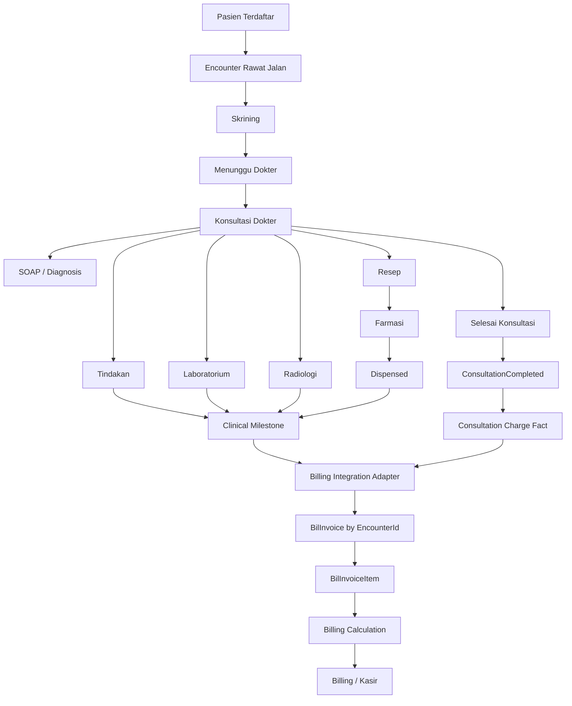
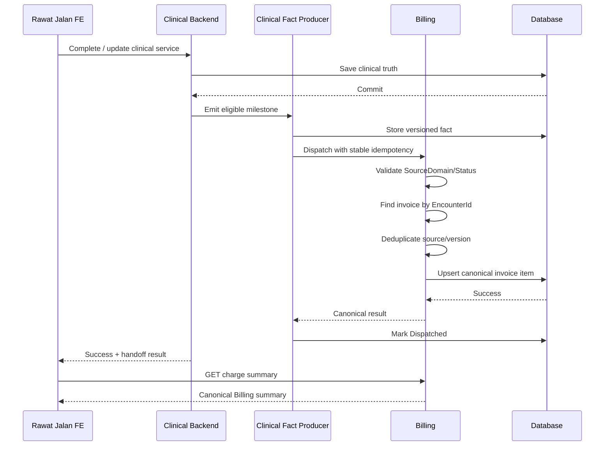

# PRD — Integrasi Rawat Jalan sampai Billing V2

**Product:** Quilvian Hospital Information System  
**Module:** Rawat Jalan  
**Scope:** Pendaftaran/Kunjungan → Pelayanan Dokter → Order Klinis → Selesai Konsultasi → Handoff Billing  
**Document ID:** `PRD-RJ-BIL-V2-001`  
**Status:** Draft for Owner Review  
**Tanggal:** 28 September 2026

---

# 1. Evidence Snapshot

PRD ini disusun berdasarkan kondisi source berikut.

| Layer | Repository | Branch | SHA |
|---|---|---|---|
| Backend | `DevBenari/NewQuilvianSystemBackend` | `sukmagp` | `063d38bc306bb6b46bdf088513fa6cdcc80399d8` |
| Frontend | `DevBenari/QuilvianSystemFrontendDev` | `sukmagpV2` | `83b8b72744d4afaaedb3d2af9dd0b83fb272f9d6` |

Catatan:

- `sukmagpV2` saat pemeriksaan identik dengan `QuilvianDevV2`.
- Backend `sukmagp` sudah jauh berkembang dibanding `master`, termasuk implementasi Billing/Kasir.
- Status Billing **diposisikan sebagai EXISTING/REUSE** sesuai informasi terbaru Product Owner bahwa Billing sudah selesai.
- Dokumen Rawat Jalan lama yang menyebut Billing masih `PARTIAL` merupakan snapshot lama dan tidak digunakan sebagai status Billing saat ini.

---

# 2. Latar Belakang

Rawat Jalan saat ini sudah mempunyai fondasi klinis utama:

- Encounter pasien;
- antrean dokter;
- konsultasi dokter;
- anamnesis;
- vital sign/pemeriksaan;
- diagnosis;
- SOAP/CPPT;
- resep;
- tindakan;
- order Laboratorium;
- order Radiologi;
- penyelesaian konsultasi;
- clinical milestone handoff.

Backend juga sudah memiliki mekanisme:

`ClinicalMilestoneFactProducer`

yang menegaskan bahwa:

> modul klinis hanya menyatakan fakta pelayanan, sedangkan konsekuensi finansial ditentukan oleh Billing.

Di sisi lain, modul Billing terbaru telah memiliki:

- `BilInvoice`;
- `BilInvoiceItem`;
- invoice berdasarkan `EncounterId`;
- kalkulasi Billing;
- coverage;
- payer/penjamin;
- settlement;
- payment history;
- cashier overview;
- idempotent source charge;
- void/correction;
- consumer handoff;
- integrasi Finance;
- integrasi Pharmacy financial clearance.

Dengan demikian pekerjaan berikutnya bukan membuat sistem Billing baru, tetapi **menghubungkan lifecycle Rawat Jalan secara utuh ke Billing yang sekarang sudah tersedia**.

---

# 3. Product Goal

Membangun alur Rawat Jalan end-to-end sehingga:

```text
Pasien Terdaftar
      ↓
Encounter Rawat Jalan
      ↓
Antrean / Skrining
      ↓
Konsultasi Dokter
      ↓
SOAP + Diagnosis
      ↓
Resep / Tindakan / Lab / Radiologi
      ↓
Fakta Pelayanan
      ↓
Billing
      ↓
Running Invoice berdasarkan Encounter
```

Semua pelayanan yang mempunyai konsekuensi finansial harus dapat diterima Billing **tanpa input ulang oleh kasir**.

Billing kemudian melanjutkan proses:

```text
Invoice
→ Coverage
→ Diskon
→ Payer Allocation
→ Pembayaran
→ Settlement
→ Final / Closed
```

Bagian tersebut tetap menjadi tanggung jawab modul Billing/Kasir.

---

# 4. Prinsip Utama Arsitektur

## 4.1 Rawat Jalan bukan Financial Source of Truth

Rawat Jalan **MUST NOT** menentukan:

- harga akhir;
- subtotal;
- pajak;
- diskon;
- patient responsibility;
- nilai ditanggung asuransi;
- status `Paid`;
- status `Settled`;
- status `Closed`;
- metode pembayaran;
- settlement.

Semua nilai tersebut berasal dari Billing.

---

## 4.2 Rawat Jalan hanya menerbitkan fakta pelayanan

Contoh:

```text
Procedure performed
Laboratory accepted/completed
Radiology accepted/completed
Prescription dispensed
Consultation completed
```

Rawat Jalan mengirim identitas pelayanan dan lifecycle-nya.

Billing menentukan konsekuensi finansial.

---

## 4.3 Satu Encounter = Satu Invoice

Source saat ini sudah mengunci:

```text
BilInvoice.EncounterId UNIQUE
```

Maka target Rawat Jalan V2 adalah:

```text
1 Encounter Rawat Jalan
        ↓
1 Running Billing Invoice
        ↓
N Billing Invoice Item
```

Tidak boleh terbentuk beberapa invoice aktif untuk satu Encounter karena retry atau double click.

---

# 5. Scope PRD

## IN SCOPE

1. Context pasien dan Encounter Rawat Jalan.
2. Konsultasi dokter.
3. SOAP/diagnosis/vital sign.
4. Resep.
5. Tindakan.
6. Laboratorium.
7. Radiologi.
8. Consumable yang terkait pelayanan bila tersedia.
9. Finalisasi konsultasi.
10. Clinical milestone handoff.
11. Relasi dengan canonical Billing.
12. Running invoice berdasarkan Encounter.
13. Ringkasan Billing read-only di Rawat Jalan.
14. Status sinkronisasi Rawat Jalan → Billing.
15. Retry/idempotency/reconciliation.
16. Cancellation/correction pelayanan.
17. Permission dan audit.

## OUT OF SCOPE

Tetap menjadi tanggung jawab modul Billing:

- pembayaran kasir;
- tender;
- EDC;
- QRIS;
- transfer;
- refund finansial;
- discount approval;
- write-off;
- settlement;
- invoice asuransi;
- reminder pembayaran;
- AR/AP;
- Finance;
- rekonsiliasi pembayaran.

---

# 6. Aktor

| Aktor | Tanggung Jawab |
|---|---|
| Petugas Pendaftaran | Membentuk Encounter Rawat Jalan |
| Perawat | Skrining dan data awal |
| Dokter | Pelayanan klinis dan finalisasi konsultasi |
| Laboratorium | Menjalankan order Lab |
| Radiologi | Menjalankan order Radiologi |
| Farmasi | Memproses dan menyerahkan obat |
| Billing | Membentuk dan menghitung invoice |
| Kasir | Menyelesaikan pembayaran |
| Supervisor | Menangani exception sesuai kewenangan |

---

# 7. Data Ownership

| Data | Owner |
|---|---|
| Pasien | Patient Management |
| Encounter | Registration Management |
| Penjamin Encounter | Registration Management |
| Konsultasi | Clinical Management |
| SOAP | Clinical Management |
| Diagnosis | Clinical Management |
| Tindakan | Clinical Management |
| Prescription clinical order | Pharmacy/Clinical |
| Lab order/result | Laboratory |
| Radiology order/result | Radiology |
| `CliClinicalMilestoneFact` | Clinical Integration |
| Tarif | Master Data/Billing |
| `BilInvoice` | Billing |
| `BilInvoiceItem` | Billing |
| Coverage | Billing/Payer |
| Payment | Billing/Kasir |
| Settlement | Billing |
| Financial clearance | Billing |

Tidak boleh dibuat duplikasi patient, encounter, invoice, payer, atau financial state di Rawat Jalan.

---

# 8. Target Module Hierarchy

Tidak diperlukan menu Billing kedua di Rawat Jalan.

Struktur existing Rawat Jalan dipertahankan.

```text
MODULE
Rawat Jalan

└── Pelayanan Rawat Jalan
    │
    ├── Daftar Pasien / Encounter
    │
    ├── Skrining
    │
    └── Konsultasi Dokter
        │
        ├── Ringkasan Pasien
        ├── Vital Sign
        ├── Anamnesis
        ├── Diagnosis
        ├── SOAP / CPPT
        ├── Resep
        ├── Tindakan
        ├── Laboratorium
        ├── Radiologi
        ├── Ringkasan Billing        ← NEW / READ ONLY
        └── Selesai Konsultasi
```

`Ringkasan Billing` bukan pengganti menu Billing.

Tujuannya hanya memberi dokter/petugas informasi bahwa pelayanan sudah berhasil masuk ke Billing.

---

# 9. Functional Requirements

## `RJ-E2E-FR-001` — Encounter menjadi correlation root

Seluruh pelayanan Rawat Jalan yang dikirim ke Billing MUST membawa:

```text
EncounterId
```

`EncounterId` menjadi korelasi utama antara:

- konsultasi;
- tindakan;
- resep;
- Lab;
- Radiologi;
- Billing Invoice.

---

## `RJ-E2E-FR-002` — Running Invoice otomatis

Billing MUST dapat menemukan atau membentuk invoice berdasarkan `EncounterId`.

Tidak boleh diperlukan kasir membuat invoice manual untuk pelayanan Rawat Jalan normal.

Target:

```text
Encounter
   ↓
Billing Invoice
```

dengan constraint:

```text
EncounterId UNIQUE
```

---

## `RJ-E2E-FR-003` — Harga tidak berasal dari frontend Rawat Jalan

Frontend Rawat Jalan MUST NOT mengirim canonical:

```text
UnitPrice
TotalPrice
CoveredAmount
PatientPayAmount
DiscountAmount
```

Backend Billing mengambil harga dari katalog tarif dan aturan Billing.

Hal ini mencegah manipulasi harga melalui client.

---

## `RJ-E2E-FR-004` — Tindakan terhubung ke Billing

Source domain:

```text
PROCEDURE
```

Billing saat ini sudah mengenali:

```text
CONFIRMED
ACCEPTED
COMPLETED
PERFORMED
```

dan pembatalan:

```text
CANCELLED
VOIDED
```

Tindakan yang sama MUST menggunakan:

```text
SourceDetailId
SourceVersion
```

yang stabil.

Retry tidak boleh menghasilkan item tambahan.

---

## `RJ-E2E-FR-005` — Laboratorium terhubung ke Billing

Source domain:

```text
LABORATORY
```

Order Lab yang mencapai milestone yang diizinkan kontrak Billing dapat membentuk/update charge.

Perubahan lifecycle harus memakai source identity yang sama dan version baru.

---

## `RJ-E2E-FR-006` — Radiologi terhubung ke Billing

Source domain:

```text
RADIOLOGY
```

Perilakunya mengikuti pola versioned source charge yang sama dengan Laboratory.

---

## `RJ-E2E-FR-007` — Pharmacy hanya menagihkan obat aktual

Source contract Billing saat ini menetapkan Pharmacy billable pada:

```text
DISPENSED
```

Artinya:

```text
Dokter membuat resep
       ↓
BELUM menjadi jumlah final obat
       ↓
Farmasi dispensing
       ↓
PHARMACY / DISPENSED
       ↓
Billing
```

Jumlah obat final harus berasal dari apa yang benar-benar diserahkan Farmasi, bukan sekadar resep dokter.

---

## `RJ-E2E-FR-008` — Consultation fee memiliki source resmi

Current `ContractBillingChargeSourceAdapter` belum mempunyai domain:

```text
CONSULTATION
```

Karena itu integrasi consultation fee MUST mempunyai kontrak eksplisit.

### Target yang direkomendasikan

Tambahkan source:

```text
CONSULTATION
```

dengan source identity berasal dari:

```text
ConsultationId
EncounterId
DoctorId
ClinicId
TariffId / tariff reference
SourceVersion
```

Milestone billable:

```text
COMPLETED
```

Sehingga:

```text
ConsultationCompleted
        ↓
Consultation Charge
        ↓
Billing Invoice
```

Consultation fee **tidak direkomendasikan disamarkan sebagai `PROCEDURE`** karena akan mengaburkan provenance dan audit.

---

## `RJ-E2E-FR-009` — Registration/Admin charge

Jika rumah sakit mengenakan biaya:

- registrasi;
- administrasi;
- poli;

maka perlu source contract tersendiri.

Target:

```text
REGISTRATION
```

Namun implementasinya hanya aktif apabila tarif/configuration Billing menyatakan biaya tersebut berlaku.

Tidak boleh hardcoded dari Rawat Jalan.

---

# 10. Consultation Completion

Backend saat ini sudah memiliki canonical flow:

```text
PATCH /doctor-consultations/{id}/complete
```

melalui:

```text
ConsultationFinalizationService
```

Finalisasi konsultasi harus:

1. flush draft/autosave;
2. validasi SOAP;
3. validasi diagnosis;
4. validasi clinical order;
5. finalisasi prescription clinical lifecycle;
6. set consultation `Completed`;
7. isi `CompletedAt`;
8. isi `CompletedByUserId`;
9. commit clinical transaction;
10. menerbitkan eligible clinical fact;
11. mengembalikan hasil handoff Billing;
12. encounter menjadi `ConsultationCompleted`.

---

# 11. Encounter Lifecycle

Status backend sekarang:

```text
Draft
  ↓
Registered
  ↓
Queued
  ↓
WaitingForNurse
  ↓
InNurseScreening
  ↓
WaitingForDoctor
  ↓
InConsultation
  ↓
ConsultationCompleted
  ↓
Billing
  ↓
Completed
```

Untuk PRD ini batas tanggung jawab Rawat Jalan berhenti di:

```text
ConsultationCompleted
       ↓
Billing handoff ready
```

Rawat Jalan **tidak boleh langsung mengubah Encounter menjadi `Completed`** setelah dokter selesai.

Tahap pembayaran berikutnya adalah responsibility Billing/Registration integration.

---

# 12. Clinical → Billing Handoff

Existing producer:

```text
ClinicalMilestoneFactProducer
```

memiliki dua aksi utama:

```text
EmitChargeEligibilityAsync()
EmitClinicalCancellationAsync()
```

dan menyimpan:

```text
CliClinicalMilestoneFact
```

dengan:

- stable identity;
- version;
- idempotency;
- correlation;
- causation;
- dispatch status;
- audit actor.

Target alur:

```text
Clinical Transaction
        │
        ├── COMMIT
        │
        ▼
CliClinicalMilestoneFact
        │
        ▼
Canonical Billing Adapter
        │
        ▼
BilInvoice
        │
        ▼
BilInvoiceItem
```

---

# 13. P0 Architecture Decision — Satukan Jalur Folio dan Invoice

Ini adalah temuan teknis paling penting dari audit source terbaru.

Saat ini producer klinis masih mengirim ke:

```text
BillingFolioService
```

yang menghasilkan:

```text
BilFolio
BilChargeLine
BilChargeComponent
BilProcessingEffect
```

Sementara Billing terbaru memiliki canonical operational invoice:

```text
BilInvoice
BilInvoiceItem
BillingInvoiceService
ContractBillingChargeSourceAdapter
BillingCalculationService
```

Karena itu **MUST NOT** dibuat pola:

```text
Clinical
   ├── BilFolio
   └── BilInvoice
```

sebagai dua financial truth terpisah.

## Target

Harus ada **satu adapter/convergence layer**:

```text
ClinicalMilestoneFact
        ↓
Billing Integration Adapter
        ↓
Canonical Billing Invoice Pipeline
```

Adapter boleh mempertahankan `BilFolio` sebagai processing/reconciliation ledger apabila masih dibutuhkan, tetapi:

> canonical tagihan pasien tetap `BilInvoice/BilInvoiceItem`.

Tidak boleh terjadi satu pelayanan menghasilkan `BilChargeLine` tetapi tidak pernah masuk invoice yang dibaca kasir.

---

# 14. Source Mapping

| Pelayanan | Source Domain | Milestone | Target |
|---|---|---|---|
| Konsultasi Dokter | `CONSULTATION` | `COMPLETED` | NEW CONTRACT |
| Tindakan | `PROCEDURE` | `CONFIRMED/ACCEPTED/PERFORMED/COMPLETED` | REUSE |
| Laboratorium | `LABORATORY` | sesuai lifecycle contract | REUSE |
| Radiologi | `RADIOLOGY` | sesuai lifecycle contract | REUSE |
| Obat | `PHARMACY` | `DISPENSED` | REUSE |
| Consumable | `CONSUMABLE` | `USED` | REUSE |
| Registrasi/Admin | `REGISTRATION` | configuration dependent | NEW/OPTIONAL |

Untuk status non-final seperti `CONFIRMED/ACCEPTED`, invoice tetap harus dapat dikoreksi oleh source version berikutnya.

Status tersebut **tidak berarti pelayanan telah dibayar**.

---

# 15. Idempotency Contract

Semua handoff MUST mempunyai stable identity.

Minimal:

```text
EncounterId
SourceDomain
SourceDetailId
SourceVersion
ContractVersion
SourceStatus
OccurredAt
IdempotencyKey
CorrelationId
CausationId
```

Contoh:

```text
PROCEDURE
+ ProcedureId
+ Version 3
```

dikirim dua kali.

Expected:

```text
1 Billing Item
```

bukan:

```text
2 Billing Items
```

---

# 16. Correction & Cancellation

## Case A — dibatalkan sebelum charge pernah terbentuk

```text
Clinical Cancellation
        ↓
No prior charge
        ↓
SuppressedNoPriorCharge
```

Tidak perlu membuat financial reversal.

---

## Case B — pelayanan sudah pernah masuk Billing

```text
Charge Version 1
       ↓
Clinical correction/cancellation
       ↓
Fact Version 2
       ↓
Billing correction / void
```

Riwayat lama tidak boleh dihapus.

---

## Case C — hasil dispatch tidak diketahui

```text
OutcomeUnknown
```

Sistem MUST:

- tidak menyimpulkan sukses;
- tidak menyimpulkan gagal;
- tidak mengirim ulang menggunakan identity baru;
- menjalankan reconciliation/retry dengan identity yang sama.

---

# 17. Billing Summary di Rawat Jalan

Tambahkan satu panel/tab **read-only**.

## Informasi minimum

```text
Status Billing
Nomor Invoice
Total Item
Gross Amount
Tanggungan Penjamin
Tanggungan Pasien
Status Coverage
Last Updated
```

Jika diperlukan dapat ditambahkan detail:

| Pelayanan | Qty | Status Pelayanan | Status Billing |
|---|---:|---|---|
| Konsultasi Dokter | 1 | Selesai | Tercatat |
| Darah Lengkap | 1 | Diproses | Tercatat |
| X-Ray Thorax | 1 | Menunggu | Pending |
| Obat A | 10 | Belum Dispensing | Belum Ditagihkan |

---

# 18. Endpoint Billing yang Direuse

Current base endpoint:

```text
/api/v1/health-services/billing-management/billing/invoices
```

Beberapa existing capability yang relevan:

```text
GET  /{id}
GET  /encounters/{encounterId}/charge-summary
GET  /{id}/calculation-preview
POST /from-source
POST /catalog-charges
GET  /catalog-charges/coverage-preview
```

### Rule

Frontend Rawat Jalan hanya menggunakan endpoint **read** untuk menampilkan Billing.

Mutation charge seharusnya:

```text
Backend Clinical
      ↓
Backend Billing
```

bukan:

```text
Frontend Rawat Jalan
      ↓
POST Billing Charge
```

Hal ini mencegah manipulasi finansial dari browser.

---

# 19. UI/UX Requirement

Rawat Jalan tidak perlu meniru Menu Pembayaran.

Cukup tampilkan:

```text
┌──────────────────────────────────────────────┐
│ Ringkasan Billing                           │
│                                              │
│ Status Invoice             OPEN             │
│ Nomor Invoice              INV-...          │
│ Total Pelayanan            6                │
│ Total Tagihan              Rp xxx.xxx       │
│ Ditanggung Penjamin        Rp xxx.xxx       │
│ Tanggungan Pasien          Rp xxx.xxx       │
│                                              │
│ [Refresh]            [Buka Detail Billing]  │
└──────────────────────────────────────────────┘
```

Dokter tidak boleh mendapatkan tombol:

- Bayar;
- Diskon;
- Void finansial;
- Finalisasi invoice;
- Settlement.

Kecuali user memang memiliki permission Billing dan berpindah ke modul Billing.

---

# 20. Frontend Engineering Requirement

Gunakan base components Quilvian yang sudah ada:

- `Hero`
- `DataTable`
- `DataFilter`
- `StatusBadge`
- `BaseButton`
- `AccessDeniedGate`
- `ToastStack`
- `FilterSelect`
- `FilterDatePicker`

`DataTable` existing sudah menyediakan loading, empty state, pagination, row interaction, dan safe defaults.

Hak akses frontend harus melalui mekanisme access gate yang sudah ada, bukan hanya hide button.

Input/filter select existing juga sudah membatasi panjang keyword dan menormalisasi opsi, sehingga sebaiknya direuse daripada membuat dropdown baru.

---

# 21. Security Requirements

## `SEC-RJ-001` — Server-side authorization

Semua endpoint tetap harus memiliki:

```text
[Authorize]
[AccessPermission(...)]
```

UI hide/show bukan security boundary.

---

## `SEC-RJ-002` — No client price authority

Frontend tidak boleh menentukan harga final.

---

## `SEC-RJ-003` — Input validation

Semua:

- UUID;
- quantity;
- source status;
- version;
- string;
- filter;
- search;

harus divalidasi server-side.

---

## `SEC-RJ-004` — XSS Protection

Clinical text dan Billing description:

- ditampilkan sebagai plain text;
- tidak memakai `dangerouslySetInnerHTML`;
- tidak mengeksekusi HTML dari backend.

---

## `SEC-RJ-005` — Sensitive data minimization

Billing handoff tidak perlu membawa:

- SOAP;
- diagnosis narrative;
- anamnesis;
- medication instruction lengkap;
- hasil Laboratorium;
- hasil Radiologi.

Hanya data yang diperlukan untuk billing.

---

## `SEC-RJ-006` — Auditability

Minimal log:

```text
ActorUserId
Action
EncounterId
SourceDomain
SourceDetailId
SourceVersion
InvoiceId
Timestamp
CorrelationId
Outcome
```

---

# 22. Error Handling

## Loading

Tampilkan loading tanpa membuang state sebelumnya yang masih valid.

## `401`

Session tidak valid.

## `403`

Tampilkan Access Denied.

## `404`

Encounter atau Invoice tidak ditemukan.

## `409`

Tampilkan:

> Data telah berubah pada proses lain. Muat ulang keadaan terbaru.

Jangan auto-submit dengan idempotency key baru.

## `422`

Tampilkan business validation dari Billing.

## Network timeout

Pertahankan operation identity.

Jangan membuat charge kedua.

---

# 23. Main Business Flow



---

# 24. Sequence Flow



---

# 25. State Separation

Tiga state berikut tidak boleh dicampur.

## Clinical State

```text
Ordered
Confirmed
Accepted
Performed
Completed
Cancelled
```

## Handoff State

```text
Pending
Dispatched
Rejected
OutcomeUnknown
SuppressedNoPriorCharge
```

## Billing State

```text
OPEN
FINAL
CLOSED
SETTLED_BY_WRITE_OFF
```

Contoh:

```text
Lab = COMPLETED
```

tidak berarti:

```text
Invoice = CLOSED
```

dan:

```text
Prescription = DISPENSED
```

tidak berarti:

```text
Payment = PAID
```

---

# 26. Acceptance Criteria

## `AC-RJ-001`

Satu Encounter hanya mempunyai satu `BilInvoice`.

## `AC-RJ-002`

Satu source version hanya mempunyai satu financial effect efektif.

## `AC-RJ-003`

Double click atau retry tidak menghasilkan duplicate charge.

## `AC-RJ-004`

Tindakan yang dieksekusi masuk invoice encounter yang benar.

## `AC-RJ-005`

Lab tidak masuk ke invoice pasien lain walaupun request diretry.

## `AC-RJ-006`

Radiologi menggunakan source identity yang stabil.

## `AC-RJ-007`

Resep dokter belum dianggap jumlah obat final.

Charge Pharmacy baru final setelah `DISPENSED`.

## `AC-RJ-008`

Selesai konsultasi menghasilkan consultation fee apabila tariff/configuration mengharuskannya.

## `AC-RJ-009`

Rawat Jalan tidak menghitung ulang total invoice di frontend.

## `AC-RJ-010`

Semua nominal pada Ringkasan Billing berasal dari Billing API.

## `AC-RJ-011`

Clinical cancellation sebelum charge tidak menimbulkan reversal palsu.

## `AC-RJ-012`

Cancellation setelah charge tidak menghapus histori.

## `AC-RJ-013`

Billing down tidak membatalkan clinical truth yang sudah committed.

## `AC-RJ-014`

`OutcomeUnknown` tidak boleh diretry menggunakan idempotency identity baru.

## `AC-RJ-015`

User tanpa permission Billing tidak dapat mengakses detail Billing hanya dengan memanggil API secara manual.

---

# 27. Definition of Done

Rawat Jalan sampai Billing dianggap selesai ketika seluruh kondisi berikut terpenuhi:

1. Pasien dapat menyelesaikan flow Rawat Jalan sampai `ConsultationCompleted`.
2. Consultation finalization menggunakan satu canonical flow.
3. Consultation fee mempunyai source contract yang jelas.
4. Procedure terhubung ke Billing.
5. Laboratory terhubung ke Billing.
6. Radiology terhubung ke Billing.
7. Pharmacy `DISPENSED` terhubung ke Billing.
8. Tidak ada duplikasi invoice.
9. Tidak ada duplikasi charge akibat retry.
10. Satu Encounter menghasilkan satu canonical `BilInvoice`.
11. Billing menggunakan tarif server-side.
12. Payer/coverage diproses Billing.
13. Rawat Jalan dapat membaca Ringkasan Billing.
14. Rawat Jalan tidak mempunyai financial mutation.
15. Cancellation/correction memakai source version.
16. `OutcomeUnknown` mempunyai jalur rekonsiliasi.
17. Authorization diuji `401/403`.
18. E2E happy path tunai lulus.
19. E2E happy path asuransi lulus.
20. E2E retry/double-submit lulus.

---

# 28. Delivery Priority

## P0 — Freeze Integration Contract

Sebelum FE ditambah:

1. tentukan `CONSULTATION` source;
2. tentukan optional `REGISTRATION` source;
3. putuskan hubungan `BilFolio` → canonical `BilInvoice`;
4. pastikan tidak ada dual financial source of truth;
5. freeze source identity + version + lifecycle.

---

## P1 — Backend Rawat Jalan → Canonical Billing

Implementasi:

```text
ClinicalMilestoneFact
        ↓
Billing adapter
        ↓
BilInvoice/BilInvoiceItem
```

Prioritas:

1. Consultation
2. Procedure
3. Laboratory
4. Radiology
5. Pharmacy
6. Consumable

---

## P2 — Correction & Reliability

Tambahkan/verifikasi:

- idempotency;
- replay;
- source version;
- cancellation;
- correction;
- concurrency;
- reconciliation;
- audit.

---

## P3 — Billing Summary FE

Tambahkan read-only Billing Summary pada workspace Rawat Jalan.

Tidak boleh ada mutation finansial dari halaman ini.

---

## P4 — End-to-End UAT

Minimum scenario:

```text
Tunai
Asuransi
Procedure
Lab
Radiology
Prescription
Multiple service
Cancellation before charge
Cancellation after charge
Retry
Double click
Billing timeout
403 permission
```

---

# 29. Open Product Decisions

Hanya beberapa keputusan yang masih perlu dikunci saat masuk implementasi.

### `RJ-E2E-DEC-001`
**Consultation fee memakai SourceDomain apa?**

Rekomendasi:

```text
CONSULTATION
```

### `RJ-E2E-DEC-002`
**Registration/admin fee otomatis atau tidak?**

Jika iya, gunakan contract terpisah:

```text
REGISTRATION
```

dan sumber tarif dari Billing.

### `RJ-E2E-DEC-003`
**Apakah `BilFolio` tetap dipertahankan sebagai integration/reconciliation ledger?**

Boleh, tetapi:

```text
Canonical Patient Billing = BilInvoice/BilInvoiceItem
```

harus tetap tunggal.

### `RJ-E2E-DEC-004`
**Siapa yang mengubah Encounter dari `Billing → Completed`?**

Tidak perlu ditutup untuk menyelesaikan handoff Rawat Jalan → Billing, tetapi perlu diputuskan saat lifecycle encounter ingin diselesaikan end-to-end sampai pasien pulang dari sistem.

---

# 30. Target Architecture

```text
┌─────────────────────────────┐
│       RAWAT JALAN           │
│                             │
│ Encounter                   │
│ Consultation                │
│ Procedure                   │
│ Lab Order                   │
│ Radiology Order             │
│ Prescription                │
└─────────────┬───────────────┘
              │
              │ Clinical Fact
              │ source + version
              ▼
┌─────────────────────────────┐
│ ClinicalMilestoneFact       │
│                             │
│ Durable                     │
│ Idempotent                  │
│ Versioned                   │
│ Auditable                   │
└─────────────┬───────────────┘
              │
              ▼
┌─────────────────────────────┐
│ Billing Integration Adapter │
│                             │
│ Validate Source Contract    │
│ Deduplicate                 │
│ Normalize                   │
│ Reconcile                   │
└─────────────┬───────────────┘
              │
              ▼
┌─────────────────────────────┐
│       BILLING               │
│                             │
│ BilInvoice                  │
│ BilInvoiceItem              │
│ Calculation                 │
│ Coverage                    │
│ Payer                       │
│ Discount                    │
│ Settlement                  │
└─────────────┬───────────────┘
              │
              ▼
        Kasir / Finance
```

---

# 31. Kesimpulan Produk

Fondasi Rawat Jalan **tidak perlu dibangun ulang**, dan modul Billing **tidak perlu diduplikasi**.

Fokus lanjutan adalah membuat sambungan:

```text
RAWAT JALAN
Clinical Fact
      ↓
CANONICAL BILLING
BilInvoice
BilInvoiceItem
```

Titik paling penting yang harus diselesaikan pertama adalah konvergensi antara:

```text
ClinicalMilestoneFactProducer
        ↓
BillingFolioService
```

yang sekarang sudah berjalan,

dengan jalur Billing terbaru:

```text
ContractBillingChargeSourceAdapter
        ↓
BillingInvoiceService
        ↓
BilInvoice / BilInvoiceItem
```

Setelah titik ini dikunci, Procedure, Lab, Radiology, Pharmacy, dan Consultation dapat masuk ke satu invoice yang sama berdasarkan `EncounterId`, sedangkan frontend Rawat Jalan cukup menampilkan **Ringkasan Billing read-only**.

Dengan arsitektur tersebut tidak ada duplikasi logika finansial, tidak ada harga dari frontend, dan seluruh pembayaran tetap diselesaikan oleh Billing/Kasir.