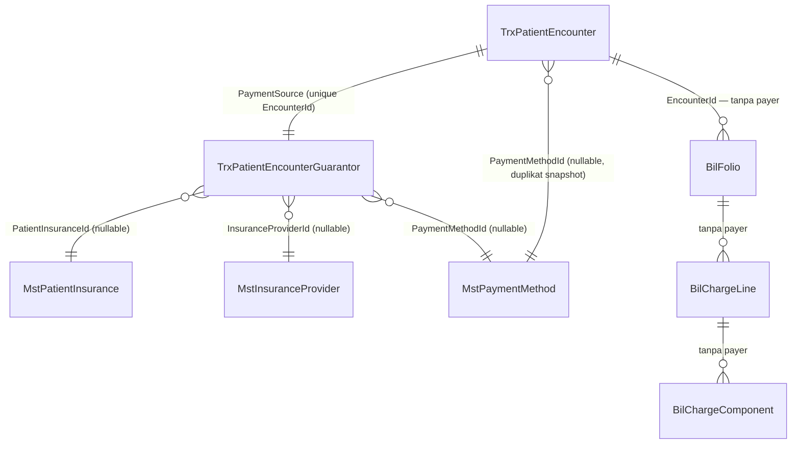

# RJ-BIL-CONFLICT-001 — Payment Source / Multi-Payer Source Audit

| Field | Nilai |
|---|---|
| Blocker | `RJ-BIL-CONFLICT-001` |
| Jenis pekerjaan | Source audit, **read-only** |
| Tanggal audit awal | `2026-08-24` |
| Terakhir diverifikasi ulang | `2026-08-24`, setelah `RJ-BIL-BE-002` dan `RJ-BIL-BE-003` |
| Revisi dokumen | `2` |
| Backend commit audit awal | `36456ead5d8d116e5631aef859df3d55b0ec7e81` cabang `sukmagp` |
| Backend commit verifikasi ulang | `6b25e6049e60e055593968abe463262b59842527` cabang `sukmagp` |
| Frontend commit | `29422c83eaf6fd231cbb72f2ba04e306367934e1` cabang `QuilvianDevV2` |
| Source aplikasi diubah | `TIDAK` |
| Migration dijalankan | `TIDAK` |
| Database diubah | `TIDAK` |

Dokumen ini hanya melaporkan keadaan source. Tidak ada keputusan bisnis yang diambil di sini.
Setiap kesimpulan diberi label `FACT`, `INFERENCE`, `NOT FOUND`, atau `OWNER DECISION REQUIRED`.

---

## 1. Executive Summary

```text
Current model:
Single payer — dikunci di tiga lapisan sekaligus

Encounter-level payer:
Tepat satu. TrxPatientEncounterGuarantor one-to-one dengan unique index database

Billing-level payer:
Tidak ada sama sekali. Entity Billing Operational tidak memiliki field payer apa pun

Multi-payer support:
MISSING — dan bukan sekadar belum dibangun, melainkan DIBONGKAR pada migration
20260712123508 yang menghapus 44 kolom multi-payer dari tabel guarantor

Main blocker:
Keputusan owner tentang di lapisan mana pembagian payer hidup. Source saat ini tidak
menyediakan tempat untuk allocation di lapisan mana pun
```

Temuan paling menentukan: sistem ini **pernah memiliki model multi-payer yang cukup lengkap**,
lalu model itu dihapus pada `2026-07-12`. Empat enum sisa desain lama masih tertinggal di
source tanpa dipakai satu baris kode pun, termasuk `PatientEncounterGuarantorRole` yang berisi
`Primary`, `Secondary`, `Tertiary`, `ExcessPayer`, `CoPaymentPayer`, dan `Backup`.

Nuansa penting yang mudah terlewat: pembagian **dua pihak** — satu asuransi dan pasien — justru
**sudah dihitung dan sudah dipersist**, tetapi di lapisan klinis, bukan billing. Ini membuat
pernyataan "sistem belum mendukung patient responsibility" menjadi tidak akurat.

---

## 2. Source Evidence

| Area | File | Symbol | Evidence | Interpretation |
|---|---|---|---|---|
| Entity | `Areas/HealthServices/RegistrationManagement/Models/TrxPatientEncounter.cs` | `PaymentSource` | Baris `202-206`: komentar *"Satu encounter wajib mempunyai tepat satu sumber pembayaran"*, tipe `TrxPatientEncounterGuarantor?` tunggal | `FACT` — navigasi tunggal, bukan koleksi |
| Entity | `.../Models/TrxPatientEncounter.cs` | `PaymentType` | Baris `98-102`: komentar *"Registrasi hanya menerima Cash atau satu Insurance"* | `FACT` — batas dinyatakan eksplisit di source |
| Entity | `.../Models/TrxPatientEncounterGuarantor.cs` | class doc | Baris `11-13`: *"Sumber pembayaran satu-ke-satu milik encounter"* | `FACT` |
| Entity | `.../Models/TrxPatientEncounterGuarantor.cs` | `PatientInsuranceId`, `InsuranceProviderId`, `PaymentMethodId` | Ketiganya `Guid?` tunggal; tidak ada koleksi | `FACT` — satu payer per baris, satu baris per encounter |
| EF config | `Repositories/Configurations/HealthServices/TrxPatientEncounterGuarantorConfiguration.cs` | relasi | Baris `123-126`: `HasOne(x => x.Encounter).WithOne(x => x.PaymentSource).HasForeignKey<TrxPatientEncounterGuarantor>(x => x.EncounterId)` | `FACT` — one-to-one di level EF |
| EF config | file yang sama | index | Baris `156-157`: `HasIndex(x => x.EncounterId).IsUnique()` | `FACT` — dikunci database, bukan sekadar konvensi |
| Snapshot | `Migrations/ApplicationDbContextModelSnapshot.cs` | `TrxPatientEncounterGuarantor` | Baris `54814-54816`: `.IsUnique().HasFilter("\"IsDelete\" = false")` | `FACT` — unique parsial atas baris hidup |
| Enum | `.../Enums/EncounterPaymentType.cs` | seluruh isi | Hanya `Cash = 1` dan `Insurance = 2` | `FACT` — tidak ada nilai campuran |
| Validasi | `.../Controllers/PatientEncounterController.cs` | `ValidateAsync` | Baris `1190-1194`: menolak selain Cash/Insurance dengan pesan *"Tipe pembayaran registrasi hanya mendukung Tunai atau Asuransi."* | `FACT` |
| Pembuatan | `.../Controllers/PatientEncounterController.cs` | `BuildPaymentSourceAsync` | Baris `585`: tepat satu `Add(paymentSource)` per encounter | `FACT` |
| DTO | `.../DTOS/PatientEncounterDtos.cs` | request create | Baris `426` `PaymentMethodId`, baris `433` `PatientInsuranceId`; keduanya `Guid?` tunggal, tidak ada `payers[]` | `FACT` |
| Migration | `Migrations/20260602173235_changeEncounterPatientEntity.cs` | index | Baris `2099-2108`: index atas `EncounterId, CoveragePriority, IsDelete` dan `EncounterId, IsPrimary, IsActive, IsDelete` | `FACT` — model lama mendukung banyak guarantor berprioritas |
| Migration | `Migrations/20260712123508_initializePrescriptionComponent.cs` | drop | `44` `DropColumn` pada `TrxPatientEncounterGuarantor`, plus drop index `CoveragePriority` dan `IsPrimary` | `FACT` — multi-payer dibongkar |
| Enum yatim | `.../Enums/PatientEncounterGuarantorRole.cs` | seluruh isi | `Primary`, `Secondary`, `Tertiary`, `ExcessPayer`, `CoPaymentPayer`, `Backup`; dipakai `0` file selain definisinya | `FACT` — sisa desain yang dihapus |
| Perhitungan | `Areas/HealthServices/ClinicalManagement/Services/InsuranceCoverageService.cs` | `InsuranceCoverageResult` | Baris `755-764`: `CoveragePercent`, `CoveredAmount`, `PatientPayAmount`, `CoPaymentAmount` | `FACT` — split dua pihak dihitung |
| Persistence | `Areas/HealthServices/ClinicalManagement/Models/TrxPatientProcedure.cs` | kolom | Baris `140-144`: `CoveragePercent`, `CoveredAmount`, `PatientPayAmount` | `FACT` — split dua pihak dipersist di lapisan klinis |
| Persistence | `Areas/HealthServices/PharmacyManagement/Models/TrxPrescription.cs` | kolom | Baris `131-133`: `CoveredAmount`, `PatientPayAmount` | `FACT` — pola sama di farmasi |
| Billing | `Areas/HealthServices/BillingManagement/Operational/Models/*.cs` | seluruh entity | Pencarian `Payer|Insurance|Guarantor|PaymentSource|Coverage` menghasilkan nol hasil | `FACT` — Billing tidak menyimpan payer sama sekali |
| Frontend | `V2QuilvianSystemFrontendDev/src/lib/services/kiosk/registration/kiosk-old-patient-registration.service.js` | payload | Baris `241-243` dan `1367`: `patientInsuranceId: paymentForm.selectedInsurance.id` | `FACT` — konsumen mengirim satu asuransi terpilih |

---

## 3. Current Data Model



Rincian kardinalitas `TrxPatientEncounterGuarantor`:

| Aspek | Nilai |
|---|---|
| Table | `public."TrxPatientEncounterGuarantor"` |
| Primary key | `Id` (`uuid`) |
| FK ke encounter | `EncounterId`, `Required`, `DeleteBehavior.Restrict` |
| Kardinalitas EF | `HasOne(Encounter).WithOne(PaymentSource)` — one-to-one |
| Unique constraint | `IX_TrxPatientEncounterGuarantor_EncounterId` `IsUnique`, filter `"IsDelete" = false` |
| Unique tambahan | `PaymentSourceNumber` unique |
| FK payer | `PatientInsuranceId`, `InsuranceProviderId`, `PaymentMethodId` — seluruhnya nullable tunggal, `Restrict` |
| Kolom nominal | **Tidak ada satu pun** — tidak ada persentase, limit, deductible, maupun estimasi |

`INFERENCE`: karena unique index berada pada `EncounterId` dengan filter baris hidup, database
menolak baris payment source kedua untuk encounter yang sama. Batas ini tidak dapat dilewati
dari lapisan aplikasi tanpa mengubah schema.

---

## 4. Current Registration Contract

Encounter dibuat melalui `POST` pada `PatientEncounterController`. Bagian pembayaran pada request:

| Field | Tipe | Aturan yang tertulis pada source |
|---|---|---|
| `PaymentType` | `EncounterPaymentType` | Hanya `Cash` atau `Insurance`; selain itu ditolak validasi baris `1190` |
| `PaymentMethodId` | `Guid?` | Komentar DTO baris `424`: *"Diisi hanya ketika PaymentType = Tunai"* |
| `PatientInsuranceId` | `Guid?` | Komentar DTO baris `430-432`: *"Diisi hanya ketika PaymentType = Asuransi dan harus merupakan MstPatientInsurance aktif milik PatientId yang sama"* |

Bentuk kontraknya adalah **XOR tunggal**, bukan koleksi:

```json
{
  "paymentType": 2,
  "paymentMethodId": null,
  "patientInsuranceId": "..."
}
```

`NOT FOUND`: tidak ditemukan bentuk `payers[]`, `guarantors[]`, `allocations[]`, atau field
koleksi payer lain pada request maupun response registrasi.

Kiosk registration pada frontend mengirim bentuk yang sama. Baris `1367` memakai
`paymentForm.selectedInsurance.id` — kata `selectedInsurance` dalam bentuk tunggal.

---

## 5. Encounter → Billing Trace

| Tahap | Payer diwariskan? | Bukti | Catatan |
|---|---|---|---|
| Registration | Dipilih satu | `PatientEncounterController.cs:466-470`, `531-549` | `PaymentType` menentukan field mana yang boleh terisi |
| Encounter | Disnapshot satu | `PatientEncounterController.cs:585` | Satu baris `TrxPatientEncounterGuarantor` per encounter |
| Clinical item | **Dihitung ulang**, disimpan sebagai dua bagian | `TrxPatientProcedure.cs:140-144`, `TrxPrescription.cs:131-133` | `CoveredAmount` dan `PatientPayAmount`; sumbernya tetap satu asuransi dari encounter |
| Billing Charge | **Tidak diwariskan sama sekali** | `Areas/.../BillingManagement/Operational/Models/*.cs` | Nol field payer pada `BilFolio`, `BilChargeLine`, `BilChargeComponent`, `BilProcessingEffect` |
| Invoice | — | — | `NOT FOUND` |
| AR / Receivable | — | — | `NOT FOUND` |
| Claim | — | — | `NOT FOUND` untuk konteks pasien |
| Payment | — | — | `NOT FOUND` untuk konteks pasien |

Catatan negatif yang penting: pencarian entity bernama `*Invoice*`, `*Receivable*`, dan
`*Allocation*` di seluruh `Areas` hanya menghasilkan `TrxWorkforceAllocation`, yaitu milik
Human Resource dan tidak berkaitan dengan billing pasien. `MstPaymentSettlementMethod` juga
milik HR — propertinya `IsForTravelAdvance`, `IsForExpenseReimbursement`, dan
`RequiresPayrollCycle` — sehingga bukan bukti kemampuan settlement pasien.

Terdapat pula entity klaim bernama `TrxBenefitClaim` dan `TrxExpenseClaim`, keduanya milik
Corporate/Human Resource, bukan klaim asuransi pasien.

---

## 6. Multi-Payer Capability Matrix

| Capability | Status | Evidence | Notes |
|---|---|---|---|
| Single encounter payer | `EXISTING` | `TrxPatientEncounterGuarantorConfiguration.cs:123-126, 156-157` | Ditegakkan unique index database |
| Multiple encounter payer | `CONFLICT` | Unique index `EncounterId`; `EncounterPaymentType` hanya dua nilai; validasi `PatientEncounterController.cs:1190` | Bukan sekadar absen; secara struktural ditolak |
| Multiple invoice payer | `MISSING` | `NOT FOUND` entity invoice | Tidak ada invoice sama sekali |
| Payer allocation | `MISSING` | Nol field payer pada entity Billing | Kolom allocation pernah ada lalu dihapus, lihat §7 |
| Patient responsibility | `PARTIAL` | `TrxPatientProcedure.cs:140-144`, `TrxPrescription.cs:131-133`, `InsuranceCoverageService.cs:760-767` | Dihitung dan dipersist, tetapi di lapisan klinis dan hanya versus satu asuransi |
| Guarantor responsibility | `MISSING` | `DropColumn CompanyGuarantorId`, `PatientCompanyGuarantorId` pada `20260712123508` | Penjamin perusahaan tidak lagi terhubung ke encounter |
| Multi-insurance | `CONFLICT` | Satu `PatientInsuranceId` dan satu `InsuranceProviderId` per baris, satu baris per encounter | Dua asuransi pada satu encounter mustahil direpresentasikan |
| Split payment method | `PARTIAL` | `TrxPatientEncounter.PaymentMethodId` tunggal; `MstPaymentMethod` sebagai master | Master metode ada, tetapi encounter hanya menyimpan satu metode |
| Separate AR per payer | `MISSING` | `NOT FOUND` entity AR | — |

---

## 7. Confirmed Conflicts

### `RJ-BIL-CONFLICT-001-A` — Unique index database mengunci satu payment source per encounter

```text
Finding:
TrxPatientEncounterGuarantor memiliki unique index atas EncounterId dengan filter baris hidup,
dan relasinya dikonfigurasi one-to-one.

Evidence:
Repositories/Configurations/HealthServices/TrxPatientEncounterGuarantorConfiguration.cs:123-126
Repositories/Configurations/HealthServices/TrxPatientEncounterGuarantorConfiguration.cs:156-157
Migrations/ApplicationDbContextModelSnapshot.cs:54814-54816

Current behavior:
Percobaan menyisipkan payment source kedua untuk encounter yang sama ditolak database.

Why it conflicts:
Skenario dua asuransi pada satu kunjungan tidak dapat direpresentasikan pada lapisan encounter,
berapa pun perubahan yang dilakukan pada lapisan aplikasi.

Potential affected area:
Database, entity, DbContext, migration.
```

### `RJ-BIL-CONFLICT-001-B` — Kontrak registrasi hanya menerima satu payer

```text
Finding:
Request pembuatan encounter memakai bentuk XOR tunggal, dan validasi menolak tipe pembayaran
selain Tunai atau Asuransi.

Evidence:
Areas/HealthServices/RegistrationManagement/DTOS/PatientEncounterDtos.cs:426
Areas/HealthServices/RegistrationManagement/DTOS/PatientEncounterDtos.cs:433
Areas/HealthServices/RegistrationManagement/Controllers/PatientEncounterController.cs:1190-1194
Areas/HealthServices/RegistrationManagement/Enums/EncounterPaymentType.cs

Current behavior:
Petugas pendaftaran memilih Tunai atau satu asuransi. Tidak ada jalan memasukkan kombinasi.

Why it conflicts:
Bila pembagian payer harus ditentukan sejak registrasi, kontrak dan enum ikut berubah.
Bila pembagian ditentukan belakangan, konflik ini tidak mengikat.

Potential affected area:
DTO, validation, controller, frontend kiosk dan pendaftaran.
```

### `RJ-BIL-CONFLICT-001-C` — Billing tidak memiliki tempat untuk menyimpan payer

```text
Finding:
Keempat entity Billing Operational tidak memiliki satu pun field payer, insurance, guarantor,
maupun coverage.

Evidence:
Areas/HealthServices/BillingManagement/Operational/Models/BilFolio.cs
Areas/HealthServices/BillingManagement/Operational/Models/BilChargeLine.cs
Areas/HealthServices/BillingManagement/Operational/Models/BilChargeComponent.cs
Areas/HealthServices/BillingManagement/Operational/Models/BilProcessingEffect.cs

Current behavior:
Charge dicatat tanpa menyebut siapa yang menanggung.

Why it conflicts:
Opsi "pembagian dilakukan di billing" belum memiliki fondasi apa pun pada source. Ini bukan
penghalang keputusan, melainkan penanda bahwa opsi tersebut memerlukan pekerjaan baru.

Potential affected area:
Billing entity, migration, service, kontrak API Billing.
```

### `RJ-BIL-CONFLICT-001-D` — Multi-payer pernah ada lalu dihapus

```text
Finding:
Migration 20260712123508 menghapus 44 kolom dari TrxPatientEncounterGuarantor, termasuk seluruh
perangkat multi-payer: CoveragePercent, CoPaymentAmount, CoPaymentPercent, DeductibleAmount,
EstimatedCoveredAmount, EstimatedPatientPayAmount, IsPrimary, GuarantorRole, GuarantorType,
GuarantorStatus, CompanyGuarantorId, PatientCompanyGuarantorId, PatientMembershipId,
AnnualLimitAmount, RemainingLimitAmount, UsedLimitAmount, RoomLimitPerDayAmount, dan
IsAllowExcessPaymentByPatient. Index EncounterId+CoveragePriority dan EncounterId+IsPrimary
ikut dihapus.

Evidence:
Migrations/20260712123508_initializePrescriptionComponent.cs:52-98 dan blok DropColumn
Migrations/20260602173235_changeEncounterPatientEntity.cs:2099-2108

Current behavior:
Schema sekarang hanya menyimpan identitas satu payer beserta snapshot polis, tanpa nominal.

Why it conflicts:
Bila owner memilih multi-payer, ini bukan penambahan fitur baru melainkan pemulihan sebagian
model yang pernah dihapus. Alasan penghapusan tidak tercatat pada source.

Potential affected area:
Database, migration, backward compatibility, dan kejelasan sejarah keputusan.
```

### `RJ-BIL-CONFLICT-001-E` — Empat enum multi-payer tertinggal tanpa pemakai

```text
Finding:
PatientEncounterGuarantorRole, PatientEncounterGuarantorType, PatientEncounterGuarantorStatus,
dan PatientEncounterGuarantorCheckMethod masih ada di source dan tidak dipakai satu file pun
selain definisinya. Role berisi Primary, Secondary, Tertiary, ExcessPayer, CoPaymentPayer,
dan Backup.

Evidence:
Areas/HealthServices/RegistrationManagement/Enums/PatientEncounterGuarantorRole.cs
Areas/HealthServices/RegistrationManagement/Enums/PatientEncounterGuarantorType.cs
Areas/HealthServices/RegistrationManagement/Enums/PatientEncounterGuarantorStatus.cs
Areas/HealthServices/RegistrationManagement/Enums/PatientEncounterGuarantorCheckMethod.cs
Pencarian pemakaian: 0 file untuk keempatnya

Current behavior:
Kode mati yang menyesatkan pembaca berikutnya, karena isinya menyiratkan multi-payer didukung.

Why it conflicts:
Pembaca source dapat menyimpulkan kemampuan yang sebenarnya tidak ada.

Potential affected area:
Kebersihan source; tidak berdampak runtime.
```

### `RJ-BIL-CONFLICT-001-F` — Patient responsibility hidup di lapisan klinis, bukan finansial

```text
Finding:
CoveredAmount dan PatientPayAmount dihitung InsuranceCoverageService lalu dipersist pada entity
klinis dan farmasi, bukan pada entity Billing.

Evidence:
Areas/HealthServices/ClinicalManagement/Services/InsuranceCoverageService.cs:755-764
Areas/HealthServices/ClinicalManagement/Models/TrxPatientProcedure.cs:140-144
Areas/HealthServices/PharmacyManagement/Models/TrxPrescription.cs:131-133
Areas/HealthServices/PharmacyManagement/Models/TrxPrescriptionCompound.cs:96-98
Areas/HealthServices/ClinicalManagement/Controllers/PatientProcedureController.cs:539-541 (pembuatan) dan :789-791 (perubahan)

Current behavior:
Pembagian dua pihak sudah nyata dan tersimpan, tetapi dimiliki modul klinis.

Why it conflicts:
Ini bertentangan dengan keputusan ownership finansial RJ-BIL-GATE-DEC-001, dan berkerabat
dengan RJ-BIL-CONFLICT-006. Bila allocation kelak dibangun di Billing, akan ada dua sumber
kebenaran untuk angka yang sama.

Potential affected area:
Ownership data, Billing, Clinical, Pharmacy, pelaporan.
```

---

## 8. Important Distinction: Multi-Payer vs Split Payment

Source membedakan keduanya dengan jelas, dan tidak satu pun didukung penuh.

| Konsep | Arti | Keadaan source |
|---|---|---|
| **Multi-payer** | Satu tagihan dibagi ke beberapa pihak penanggung, misalnya Asuransi A `70%`, Asuransi B `20%`, pasien `10%` | `MISSING`. Satu encounter hanya boleh punya satu payment source |
| **Split payment** | Satu pihak yang sama membayar memakai beberapa metode, misalnya tunai `Rp500.000` dan debit `Rp500.000` | `PARTIAL`. `MstPaymentMethod` ada sebagai master, tetapi encounter hanya menyimpan satu `PaymentMethodId` |

`FACT`: `TrxPatientEncounter.PaymentMethodId` bertipe `Guid?` tunggal dengan komentar
*"Hanya diisi untuk Cash"*. Tidak ada tabel detail pembayaran yang menyimpan beberapa metode.

`INFERENCE`: keberadaan `MstPaymentMethod` dan `MstPaymentSettlementMethod` tidak boleh dibaca
sebagai bukti split payment pasien sudah didukung. `MstPaymentSettlementMethod` bahkan milik
Human Resource, terlihat dari properti `IsForTravelAdvance` dan `IsForExpenseReimbursement`.

---

## 9. Impact Surface if Multi-Payer Is Required

Analisis dampak, **bukan rencana implementasi**.

| Area | Current Assumption | Potential Impact | Risk |
|---|---|---|---|
| Database | Unique index `EncounterId` pada tabel guarantor | Unique constraint harus dilonggarkan atau allocation ditempatkan di tabel lain | `CRITICAL` |
| Entity | `PaymentSource` navigasi tunggal | Berubah menjadi koleksi, atau tetap tunggal dengan allocation terpisah | `HIGH` |
| DbContext | `HasOne().WithOne()` | Konfigurasi relasi berubah | `HIGH` |
| Migration | Kolom multi-payer sudah dihapus `2026-07-12` | Pemulihan sebagian kolom; perlu keputusan apakah mengembalikan bentuk lama atau merancang ulang | `HIGH` |
| DTO | `patientInsuranceId` tunggal | Penambahan bentuk koleksi; lihat §10 backward compatibility | `MEDIUM` |
| Validation | XOR Cash atau Insurance | Aturan baru untuk kombinasi, total alokasi, dan sisa tanggungan | `HIGH` |
| Registration | Petugas memilih satu sumber | Perubahan alur dan layar bila pembagian ditentukan sejak awal | `MEDIUM` |
| Encounter | Satu payer melekat sepanjang kunjungan | Perlu aturan bila payer berubah di tengah kunjungan | `HIGH` |
| Billing | Charge tanpa payer | Penambahan entity allocation; ini memang cakupan `RJ-BIL-BE-005` | `HIGH` |
| Invoice | Tidak ada | Harus dibangun bila allocation berbasis invoice | `CRITICAL` |
| Claim | Tidak ada untuk pasien | Harus dibangun bila klaim per payer dibutuhkan | `CRITICAL` |
| AR | Tidak ada | Harus dibangun bila piutang dipisah per payer | `CRITICAL` |
| Payment | Tidak ada untuk pasien | Belum dapat dinilai | `UNCLEAR` |
| Reporting | Laporan menghitung `CashEncounter` dan `InsuranceEncounter` sebagai dua kategori terpisah, `PatientEncounterController.cs:176-177` | Kategori campuran membuat angka lama tidak sebanding | `MEDIUM` |
| Frontend | Kiosk dan pendaftaran mengirim satu asuransi terpilih | Layar pemilihan payer berubah | `MEDIUM` |
| Backward compatibility | Kontrak tunggal sudah dipakai kiosk | Lihat §10 | `HIGH` |

---

## 10. Backward Compatibility

Endpoint dan konsumen yang terdampak bila kontrak berubah dari tunggal ke koleksi:

| Konsumen | Bukti | Dampak |
|---|---|---|
| Kiosk pasien lama | `kiosk-old-patient-registration.service.js:241-243`, `1367` | Mengirim `patientInsuranceId` tunggal |
| Kiosk pasien baru | `kiosk-new-patient-registration.service.js:152-154`, `576` | Pola sama |
| Response encounter | `PatientEncounterDtos.cs:199-207` | `PaymentType`, `PaymentMethodId`, `PatientInsuranceId` tunggal |
| Antrean dokter | `DoctorQueueDtos.cs:102-107` | Menampilkan payment tunggal |
| Antrean nurse station | `NurseStationQueueDtos.cs:81-86` | Pola sama |
| Filter dan ringkasan | `PatientEncounterController.cs:176-177`, `1120`, `1151-1153` | Filter dan pencarian berdasarkan satu payment source |

`Candidate implication — bukan keputusan.` Bila kelak dibutuhkan koleksi payer, bentuk tunggal
dapat dipertahankan sebagai representasi payer primer agar konsumen lama tidak rusak, dengan
koleksi sebagai tambahan. Strategi ini hanya catatan teknis dan belum disetujui siapa pun.

---

## 11. Open Questions for Domain Owner

### `RJ-BIL-OQ-001` — Apakah satu encounter boleh memiliki lebih dari satu penjamin?

```text
Context:
Encounter saat ini dikunci satu payment source oleh unique index database.

Source evidence:
TrxPatientEncounterGuarantorConfiguration.cs:123-126, 156-157

Question:
Apakah satu kunjungan rawat jalan boleh memiliki lebih dari satu pihak penanggung?

Option A:
Satu encounter tetap satu primary payer. Pembagian dilakukan saat billing.
Technical consequence: encounter, registrasi, kiosk, dan laporan tidak berubah.
Pekerjaan terpusat pada Billing, sejalan dengan cakupan RJ-BIL-BE-005.

Option B:
Satu encounter boleh memiliki beberapa payer sejak registrasi.
Technical consequence: unique index dilonggarkan, kontrak registrasi berubah,
kiosk dan layar pendaftaran ikut berubah, laporan kategori pembayaran harus didefinisikan ulang.

Option C:
Tidak ada multi-payer sama sekali. Satu encounter dan satu tagihan selalu satu payer.
Technical consequence: RJ-BIL-BE-005 perlu ditinjau ulang karena judulnya menyebut
allocation multi-payer.

Option D:
Other.

Lowest-change option: A.
Ini pernyataan teknis tentang jumlah perubahan source, bukan rekomendasi kebijakan bisnis.
```

### `RJ-BIL-OQ-002` — Bila multi-payer dipakai, kapan pembagiannya ditentukan?

```text
Context:
Saat ini payer melekat pada encounter sejak registrasi dan tidak pernah dibagi.

Source evidence:
PatientEncounterController.cs:585 membuat satu payment source bersamaan dengan encounter.

Question:
Pada titik mana pembagian tanggungan ditetapkan?

Option A: Saat registrasi.
Option B: Saat pelayanan berlangsung.
Option C: Saat billing atau finalisasi tagihan.
Option D: Saat verifikasi klaim.
Option E: Other.

Technical consequence:
A menuntut perubahan kontrak registrasi dan frontend kiosk.
C paling selaras dengan struktur source sekarang karena tidak menyentuh registrasi.
D memerlukan entity klaim yang saat ini NOT FOUND.
```

### `RJ-BIL-OQ-003` — Apakah pasien otomatis menjadi penanggung sisa?

```text
Context:
Sistem sudah menghitung dan menyimpan PatientPayAmount, tetapi hanya versus satu asuransi
dan disimpan pada entity klinis.

Source evidence:
InsuranceCoverageService.cs:760-767
TrxPatientProcedure.cs:140-144

Question:
Bila total tagihan Rp10.000.000 dan coverage asuransi Rp8.000.000, apakah Rp2.000.000 otomatis
menjadi tanggungan pasien, atau memerlukan keputusan manual?

Option A: Otomatis menjadi tanggungan pasien.
Option B: Memerlukan keputusan atau alokasi manual.
Option C: Bergantung pada kontrak payer.
Option D: Other.

Technical consequence:
A selaras dengan perilaku perhitungan yang sudah ada sekarang.
B dan C memerlukan penyimpanan keputusan beserta actor dan alasannya.
```

### `RJ-BIL-OQ-004` — Apakah dua asuransi boleh membayar encounter yang sama?

```text
Context:
Enum PatientEncounterGuarantorRole yang tertinggal memuat Primary, Secondary, Tertiary,
ExcessPayer, CoPaymentPayer, dan Backup. Tidak satu pun dipakai kode.

Source evidence:
Areas/HealthServices/RegistrationManagement/Enums/PatientEncounterGuarantorRole.cs
Pemakaian: 0 file

Question:
Apakah kombinasi Asuransi A ditambah Asuransi B ditambah pasien merupakan kasus nyata di
rumah sakit ini, atau enum tersebut memang tidak pernah dipakai karena kasusnya tidak ada?

Option A: Kasus nyata dan harus didukung.
Option B: Tidak pernah terjadi; enum sisa boleh dibersihkan.
Option C: Terjadi tetapi ditangani manual di luar sistem.
Option D: Other.

Technical consequence:
B membuat RJ-BIL-CONFLICT-001 menyusut drastis dan sebagian besar dampak pada tabel §9 gugur.
```

### `RJ-BIL-OQ-005` — Allocation berlaku pada level apa?

```text
Context:
Billing menyimpan charge per baris dan per komponen, tanpa payer.

Source evidence:
BilChargeLine.cs, BilChargeComponent.cs — nol field payer.

Question:
Bila pembagian dilakukan, apakah berlaku per item atau atas total?

Option A: Persentase atas total tagihan.
Option B: Per item, misalnya laboratorium ke Asuransi A, obat ke Asuransi B, administrasi ke pasien.
Option C: Kombinasi keduanya.
Option D: Other.

Technical consequence:
A lebih sederhana dan cukup dengan allocation di tingkat folio.
B menuntut allocation di tingkat charge line, sehingga menyentuh struktur yang baru dibangun
pada RJ-BIL-BE-001.
```

### `RJ-BIL-OQ-006` — Apakah payer boleh berubah setelah encounter dibuat?

```text
Context:
Payment source disnapshot saat registrasi dan tidak ditemukan alur perubahan payer.

Source evidence:
PatientEncounterController.cs:585
NOT FOUND: endpoint atau service yang mengganti payment source setelah encounter dibuat.

Question:
Bila pasien terdaftar sebagai Tunai lalu ditemukan asuransi aktif, apakah payer encounter boleh
diubah? Bila charge sudah terbentuk, apakah charge lama ikut berpindah, hanya charge berikutnya,
atau memerlukan penyesuaian finansial?

Option A: Tidak boleh berubah setelah encounter dibuat.
Option B: Boleh berubah dan seluruh charge ikut berpindah.
Option C: Boleh berubah, hanya berlaku untuk charge berikutnya.
Option D: Other.

Technical consequence:
B bertentangan dengan invariant #4 decision log yang melarang penghapusan histori finansial,
sehingga kemungkinan memerlukan mekanisme koreksi, bukan penulisan ulang.
```

### `RJ-BIL-OQ-007` — Bagaimana hubungan multi-payer dengan piutang?

```text
Context:
Tidak ada entity AR, invoice, maupun klaim pasien pada source.

Source evidence:
NOT FOUND untuk *Invoice*, *Receivable*, dan klaim konteks pasien.
TrxBenefitClaim dan TrxExpenseClaim adalah milik Human Resource.

Question:
Bila satu tagihan dibagi ke pasien, Asuransi A, dan Asuransi B, apakah sistem harus membentuk
piutang terpisah per pihak?

Option A: Piutang terpisah per payer.
Option B: Satu piutang dengan rincian per payer.
Option C: Piutang tidak dikelola sistem ini.
Option D: Other.

Technical consequence:
A dan B sama-sama memerlukan lapisan yang saat ini belum ada sama sekali.
C membatasi cakupan modul secara signifikan.
```

---

## 12. Decision Dependency

| Task | Status | Alasan |
|---|---|---|
| `RJ-BIL-BE-005` | `BLOCKED` | Cakupannya adalah allocation multi-payer dan patient responsibility. Bentuk allocation bergantung pada `RJ-BIL-OQ-001`, `OQ-002`, dan `OQ-005` |
| `RJ-BIL-BE-006` | Terdampak tidak langsung | Financial action dan approval bekerja di atas hasil allocation |
| `RJ-BIL-BE-008` | Terdampak tidak langsung | Claim dan settlement per payer bergantung pada `OQ-007` |
| `RJ-BIL-BE-002` | Tidak terdampak — **selesai** | Blocker-nya `RJ-BIL-CONFLICT-006`, yang sudah `CLOSED`. Konflik ini tidak pernah menahannya |
| `RJ-BIL-BE-003` | Tidak terdampak — **selesai** | Prediksi audit awal terbukti. Lab menghasilkan fakta klinis dan tidak menyentuh alokasi finansial sama sekali |
| `RJ-BIL-BE-004` | Tidak terdampak | Menghasilkan fakta klinis, bukan alokasi finansial |

Status backlog tidak diubah oleh dokumen ini.

---

## 13. Final Verdict

```text
RJ-BIL-CONFLICT-001 STATUS:
CONFIRMED — diverifikasi ulang pada commit 6b25e604, seluruh temuan bertahan

Source confidence:
HIGH

Code change required now:
NO

Domain decision required:
YES — RJ-BIL-OQ-001 s.d. OQ-007 belum dijawab

BE-005 readiness:
BLOCKED
```

Konflik terkonfirmasi dan tidak ambigu. Encounter dikunci satu payment source di tiga lapisan
sekaligus: dokumentasi entity, konfigurasi EF, dan unique index database. Kontrak registrasi
serta konsumen frontend mengikuti bentuk tunggal yang sama. Keyakinan atas kesimpulan ini
tinggi karena pembuktiannya tidak bergantung pada satu sumber, melainkan pada navigation
property, konfigurasi EF, snapshot model, migration, DTO, validasi controller, dan payload
frontend yang seluruhnya konsisten.

Dua temuan mengubah bentuk keputusan dibanding rumusan blocker semula. Pertama, multi-payer
bukan kemampuan yang belum sempat dibangun, melainkan kemampuan yang **dihapus** pada migration
`20260712123508` beserta `44` kolom pendukungnya. Alasan penghapusan tidak tercatat pada source,
sehingga pertanyaan pertama kepada owner sebaiknya bukan *"apakah kita butuh multi-payer"*
melainkan *"mengapa dulu dihapus, dan apakah alasan itu masih berlaku"*.

Kedua, pembagian dua pihak antara satu asuransi dan pasien **sudah berjalan dan sudah tersimpan**
melalui `CoveredAmount` dan `PatientPayAmount` pada entity klinis dan farmasi. Artinya kebutuhan
patient responsibility mungkin sudah terpenuhi sebagian, dan yang benar-benar belum ada adalah
**lebih dari satu penanggung sekaligus**. Bila jawaban `RJ-BIL-OQ-004` ternyata bahwa dua
asuransi pada satu kunjungan tidak pernah terjadi di rumah sakit ini, maka sebagian besar dampak
pada tabel §9 gugur dan `RJ-BIL-BE-005` menyusut menjadi pemindahan kepemilikan angka dari
lapisan klinis ke Billing — pekerjaan yang jauh lebih kecil.

Perlu dicatat pula bahwa `RJ-BIL-CONFLICT-001-F` beririsan dengan `RJ-BIL-CONFLICT-006`. Keduanya
adalah gejala dari sebab yang sama, yaitu angka finansial yang dimiliki dan ditulis oleh modul
klinis. Menyelesaikan keduanya secara terpisah berisiko menghasilkan dua solusi yang tidak
sejalan.

**Pembaruan revisi `2`.** Verifikasi ulang setelah `RJ-BIL-BE-002` dan `RJ-BIL-BE-003` tidak
menggugurkan satu pun temuan, tetapi menambah satu fakta yang mempersempit masalah:
`RJ-BIL-CONFLICT-001-F` **tidak meluas**. Modul Laboratorium yang baru dibangun sengaja tidak
memiliki kolom tanggungan pasien, dan penyerahan fakta klinis ke Billing sengaja tidak mengirim
angka pembagian penjamin. Pola yang benar sudah berjalan; yang tersisa adalah membersihkan tiga
tabel warisan, dan itu menunggu `RJ-BIL-OQ-005`. Rinciannya pada bagian `14`.

---

## 14. Verifikasi Ulang Setelah `RJ-BIL-BE-002` dan `RJ-BIL-BE-003`

Audit awal dibuat pada commit `36456ead`. Sejak itu dua task selesai dan dua merge tim masuk,
sehingga seluruh bukti diperiksa ulang pada commit `6b25e604`.

### 14.1 Hasil pemeriksaan ulang

| Konflik | Status semula | Status sekarang | Catatan |
|---|---|---|---|
| `RJ-BIL-CONFLICT-001-A` | `CONFIRMED` | `CONFIRMED` | Unique index `EncounterId` masih ada, baris `156-157` |
| `RJ-BIL-CONFLICT-001-B` | `CONFIRMED` | `CONFIRMED` | `EncounterPaymentType` masih hanya `Cash` dan `Insurance` |
| `RJ-BIL-CONFLICT-001-C` | `CONFIRMED` | `CONFIRMED` | Pencarian `Payer|Insurance|Guarantor|PaymentSource|Coverage` pada entity Billing Operational tetap nol hasil |
| `RJ-BIL-CONFLICT-001-D` | `CONFIRMED` | `CONFIRMED` | Migration `20260712123508` tidak dibatalkan |
| `RJ-BIL-CONFLICT-001-E` | `CONFIRMED` | `CONFIRMED` | `PatientEncounterGuarantorRole` masih dipakai `0` file selain definisinya |
| `RJ-BIL-CONFLICT-001-F` | `CONFIRMED` | `CONFIRMED — tidak meluas` | Lihat bagian `14.2` |

Tidak ada satu pun fakta audit awal yang gugur. Yang berubah hanya nomor baris pada tiga bukti,
dan sudah dikoreksi pada bagian `2` dan `7`.

### 14.2 Temuan baru yang membatasi `RJ-BIL-CONFLICT-001-F`

Konflik `F` menyatakan angka tanggungan pasien dimiliki modul klinis, bukan Billing. Kekhawatiran
wajar berikutnya adalah pola itu menyebar ke setiap modul penunjang baru.

**Itu tidak terjadi.** `RJ-BIL-BE-003` membangun modul Laboratorium tanpa satu pun kolom
tanggungan.

| Modul | Menyimpan `CoveredAmount` / `PatientPayAmount`? | Bukti |
|---|---|---|
| Tindakan klinis | **Ya** | `TrxPatientProcedure.cs:140-144` |
| Resep | **Ya** | `TrxPrescription.cs:131-133` |
| Racikan resep | **Ya** | `TrxPrescriptionCompound.cs:96-98` |
| **Laboratorium** | **Tidak** | `LabSpecimen.cs` — pencarian `covered|patientpay|copayment|coverage` nol hasil |

Laboratorium hanya menyimpan `UnitPriceSnapshot`, yaitu tarif rujukan tanpa pembagian penjamin.
Pembagiannya diserahkan kepada Billing.

Lebih jauh, penyerahan fakta klinis yang dibangun `RJ-BIL-BE-002` **sengaja tidak mengirim**
`CoveredAmount` maupun `PatientPayAmount` ke Billing. Pencarian kedua nama itu pada
`Areas/HealthServices/ClinicalBillingIntegration/` dan `Areas/HealthServices/LaboratoryManagement/`
menghasilkan nol hasil.

Artinya batas yang benar sudah ditegakkan pada jalur baru, sementara jalur lama belum dibersihkan.

### 14.3 Mengapa temuan ini penting bagi pemilik keputusan

Sebelum verifikasi ulang, `RJ-BIL-CONFLICT-001-F` terbaca sebagai masalah yang membesar seiring
waktu. Sekarang terbukti sebaliknya: masalahnya **terkurung pada tiga tabel warisan**, dan pola
penggantinya sudah berjalan di produksi kode pada dua modul.

Dampaknya terhadap pertanyaan terbuka:

| Pertanyaan | Perubahan setelah verifikasi ulang |
|---|---|
| `RJ-BIL-OQ-005` — allocation berlaku pada level apa | Menjadi lebih mudah dijawab. Pola "modul klinis mengirim tarif rujukan, Billing menentukan pembagian" sudah terbukti berjalan pada Laboratorium dan tidak perlu dirancang dari nol |
| `RJ-BIL-OQ-003` — apakah pasien otomatis penanggung sisa | Tidak berubah. Tetap memerlukan keputusan |
| `RJ-BIL-OQ-001`, `OQ-002`, `OQ-004` | Tidak berubah. Tetap memblokir `RJ-BIL-BE-005` |

### 14.4 Yang masih tidak dapat diperbaiki tanpa keputusan pemilik

| Hal | Mengapa code tidak dapat memutuskannya |
|---|---|
| Melonggarkan unique index `EncounterId` | Menentukan apakah satu kunjungan boleh punya lebih dari satu penjamin adalah kebijakan rumah sakit, bukan kesimpulan teknis |
| Memindahkan `CoveredAmount` dan `PatientPayAmount` dari tiga tabel warisan ke Billing | Memerlukan `RJ-BIL-OQ-005`. Memindahkannya lebih dulu berisiko harus dibongkar ulang bila bentuk allocation ternyata berbeda |
| Menghapus empat enum yatim | Enum itu adalah satu-satunya jejak desain multi-payer yang dihapus. Menghapusnya menutup bukti sebelum `T-01` dijawab |
| Membangun entity allocation di Billing | Cakupan `RJ-BIL-BE-005`, dan bentuknya ditentukan `OQ-001`, `OQ-002`, `OQ-005` |

Keempatnya bukan pekerjaan yang tertunda karena kurang waktu. Keempatnya tertunda karena
jawabannya memang belum ada, dan menebaknya akan menghasilkan angka tagihan yang salah bagi
pasien nyata.
