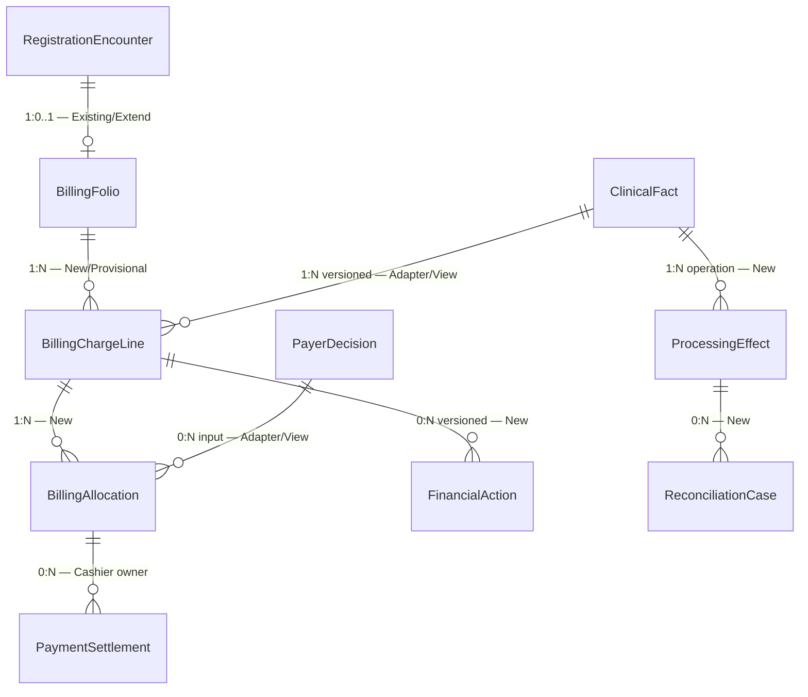

# Context ERD — Rawat Jalan Billing

Diagram ini menunjukkan relasi logis antar bounded context. Ia bukan DDL dan bukan instruksi
migration.

Patient, Encounter, clinical order, payer master, payment, dan accounting tetap dimiliki
context asalnya; Billing tidak membuat salinan owner.

