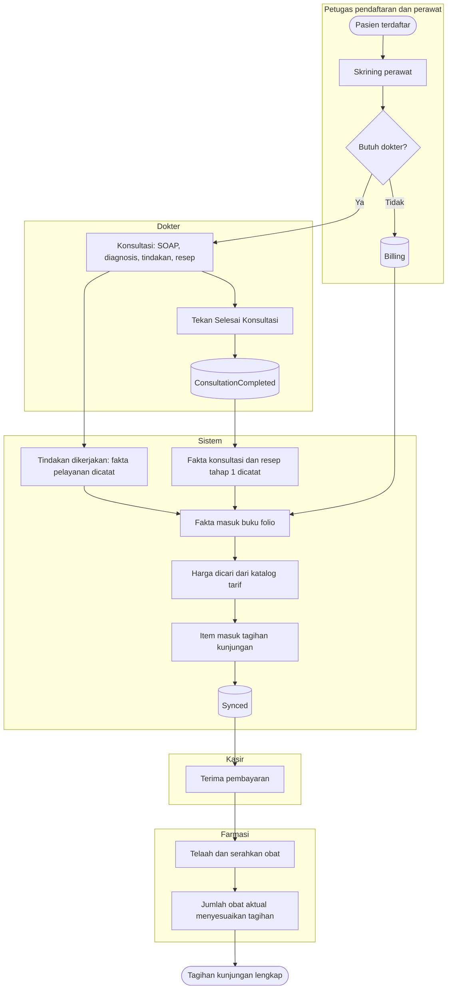

# Alur Utama — Rawat Jalan sampai Tagihan

| Field | Nilai |
|---|---|
| Blueprint | `RJ-BIL-BP-001` revisi `27` · `RJ-E2E-CONTRACT-001@1.0.0` (`approved`) |
| Jalur | Normal saja. Jalur gagal ada di berkas proses: [penagihan-otomatis.md](penagihan-otomatis.md), [obat-dua-tahap.md](obat-dua-tahap.md), [pembatalan-dan-koreksi.md](pembatalan-dan-koreksi.md), [rekonsiliasi.md](rekonsiliasi.md) |

**Tujuan:** setiap pelayanan Rawat Jalan yang berbiaya masuk ke satu tagihan kunjungan tanpa
diketik ulang kasir, dengan harga dari katalog tarif.

| Langkah | Pelaku | Masukan yang dibutuhkan | Keluaran | Bila gagal |
|---|---|---|---|---|
| Skrining perawat | Perawat | Kunjungan Rawat Jalan | Kunjungan menunggu dokter, atau berstatus `Billing` bila tidak butuh dokter | Perawat melengkapi skrining |
| Konsultasi | Dokter | Kunjungan `WaitingForDoctor` | SOAP, diagnosis, tindakan, resep | Dokter memperbaiki isian yang ditolak |
| Tindakan dikerjakan | Dokter / perawat | Tindakan terpilih | Fakta pelayanan tindakan | Tindakan tetap tersimpan; penyerahan ke tagihan diulang otomatis |
| Selesai Konsultasi | Dokter | Catatan dan order lengkap | Konsultasi selesai; fakta konsultasi dan resep tahap 1 | Dokter melihat pemberitahuan bila penyerahan ke tagihan bermasalah; konsultasi **tetap** selesai |
| Masuk folio dan tagihan | Sistem | Fakta pelayanan | Item tagihan dengan harga katalog | Dicoba ulang otomatis; bila tetap gagal masuk antrean rekonsiliasi Billing |
| Pembayaran | Kasir | Tagihan kunjungan | Pembayaran tercatat; resep boleh diproses farmasi | Di luar scope — alur Billing/Kasir |
| Serah obat | Farmasi | Resep yang sudah lunas | Obat diserahkan; jumlah aktual menyesuaikan tagihan | Lihat [obat-dua-tahap.md](obat-dua-tahap.md) |

**Hasil akhir:** kunjungan Rawat Jalan berhenti di `ConsultationCompleted` (dengan dokter) atau
`Billing` (tanpa dokter). Satu tagihan kunjungan berisi konsultasi, tindakan, Lab, Radiologi, dan
resep. Penutupan kunjungan menjadi `Completed` **bukan** bagian alur ini (`RJ-E2E-DEC-004`).
