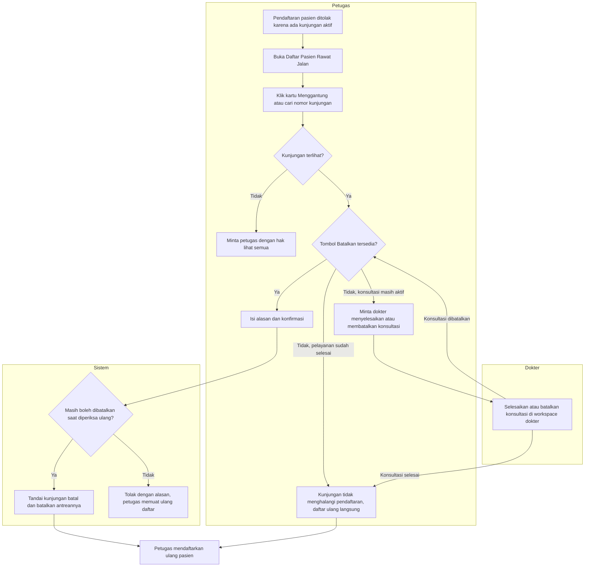

# Proses — Daftar Pasien Rawat Jalan dan Pembatalan Kunjungan

| Field | Nilai |
|---|---|
| Revisi | `28` — Amendment DP, `draft` |
| Keputusan | `RJ-DOC-DEC-013`, `016`, `019`, `021`, `022` |

## Tujuan

Petugas menemukan kunjungan Rawat Jalan yang menggantung dan menutupnya dengan pembatalan, supaya
pasien dapat didaftarkan kembali.

## Pelaku

| Pelaku | Peran dalam proses |
|---|---|
| Petugas pendaftaran | Melihat semua klinik, membatalkan |
| Perawat poli | Melihat klinik clusternya, membatalkan bila berhak |
| Dokter | Melihat pasiennya; menyelesaikan atau membatalkan konsultasi di workspace dokter |
| Sistem | Menyaring cakupan, memeriksa aturan batal, membatalkan antrean |

## Alur

## Tabel langkah

| No | Langkah | Pelaku | Masukan | Keluaran | Bila gagal |
|---:|---|---|---|---|---|
| 1 | Membuka layar | Petugas | — | Daftar hari ini + summary | Pesan akun belum terhubung → minta admin mengatur akses |
| 2 | Menyaring kunjungan menggantung | Petugas | Klik kartu | Daftar aktif lintas tanggal | Daftar gagal dimuat → Coba lagi |
| 3 | Memilih kunjungan | Petugas | Nomor kunjungan dari pesan penolakan | Baris kunjungan | Tidak ditemukan → kunjungan di luar cakupan; minta petugas berhak lihat semua |
| 4 | Membatalkan | Petugas | Alasan 1-250 karakter | Kunjungan batal, antrean batal | Ditolak karena keadaan berubah → muat ulang daftar dan nilai lagi |
| 5 | Konsultasi masih aktif | Dokter | — | Konsultasi selesai atau batal | Dokter tidak tersedia → kunjungan tetap memblokir; eskalasi ke kepala ruangan |
| 6 | Mendaftar ulang | Petugas | Data pasien | Kunjungan baru | Masih ditolak → ada kunjungan aktif lain; ulangi dari langkah 3 |

## Hasil akhir

Kunjungan lama tercatat batal beserta siapa, kapan, dan alasannya. Status layanan terakhirnya tetap
terbaca. Antreannya hilang dari layar antrean. Pasien dapat didaftarkan ke poliklinik.
