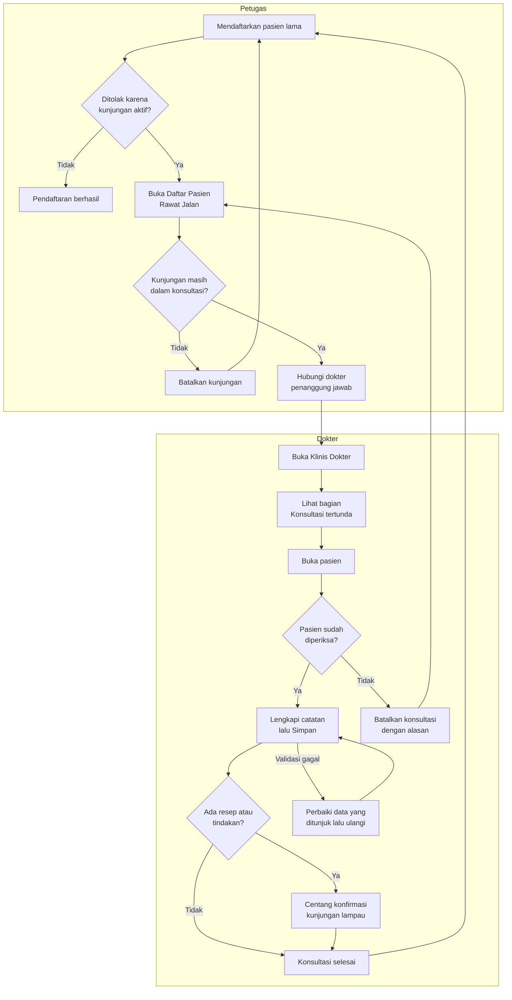
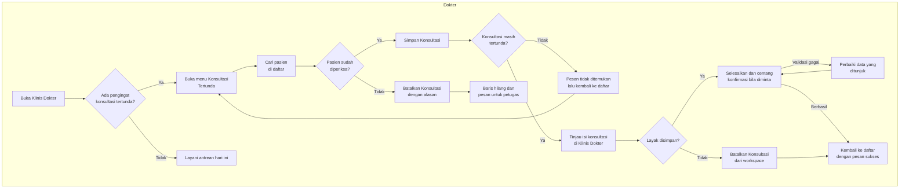

# Alur Konsultasi Tertunda di Klinis Dokter

| Field | Nilai |
|---|---|
| Revisi | `29` — Amendment KT (`approved`); `30` — Amendment MT, `draft` (bagian akhir) |
| Keputusan | `RJ-DOC-DEC-028`..`031`, `RJ-DOC-FE-010`..`012` |
| Rujukan | `02-backend-architecture.md` *Amendment KT*, `03-frontend-architecture.md` *Amendment KT* |

Konsultasi tertunda adalah konsultasi dokter dari hari sebelumnya yang belum disimpan atau
dibatalkan, sehingga kunjungan pasien masih tertahan di tahap Sedang Konsultasi.

## Alur

## Tabel langkah

| Langkah | Pelaku | Masukan | Keluaran | Bila gagal |
|---|---|---|---|---|
| P1 | Petugas | Data pasien lama | Kunjungan baru, atau penolakan dengan nomor kunjungan lama | Baca nomor dan tanggal kunjungan lama di pesan |
| P4–P5 | Petugas | Nomor kunjungan lama | Petunjuk baris di Daftar Pasien Rawat Jalan | Bila kunjungan tidak terlihat, minta pemegang hak "lihat semua" |
| P6 | Petugas | Alasan pembatalan | Kunjungan batal | Pesan penolakan menjelaskan sebabnya |
| D2 | Dokter | — | Daftar konsultasi tertunda miliknya | Bila daftar gagal dimuat, tekan Coba lagi; antrean hari ini tetap bisa dipakai |
| D5 | Dokter | Catatan klinis lengkap | Konsultasi selesai; pasien dapat didaftarkan lagi | Perbaiki bagian yang ditunjuk pesan validasi |
| D7 | Dokter | Centang konfirmasi | Resep diteruskan ke farmasi, tindakan ditagihkan | Bila resep tidak lagi diperlukan, hapus dulu resepnya, lalu Simpan |
| D9 | Dokter | Alasan, maks 250 karakter | Konsultasi batal; kunjungan menunggu dibatalkan petugas | Bila ditolak karena bukan penulis, konsultasi harus dibatalkan oleh dokter penulisnya |

**Contoh:** IKBAL YULIYANTO ditolak saat didaftarkan pada 5 Okt 2026 karena ENC-RSMMC-00172
(30 Sep). Petugas melihat petunjuk "Konsultasi masih aktif…" lalu menghubungi dr. Arif Lesmana.
dr. Arif membuka Konsultasi tertunda, memastikan IKBAL memang sudah diperiksa, lalu menekan
Simpan. Pendaftaran IKBAL kemudian diterima.

## Amendment MT — alur dokter sesudah menu Konsultasi Tertunda (revisi `30`, `draft`)

Keputusan `RJ-DOC-DEC-045`..`049`, `RJ-DOC-FE-014`..`016`. Bagian Dokter pada alur di atas
**digantikan** alur berikut. Bagian Petugas tidak berubah.

| Langkah | Pelaku | Masukan | Keluaran | Bila gagal |
|---|---|---|---|---|
| K1 | Dokter | — | Pengingat jumlah tertunda bila ada | Bila jumlah gagal dimuat, pengingat tidak tampil; menu Konsultasi Tertunda tetap bisa dibuka |
| M1–M2 | Dokter | Kata kunci pencarian | Daftar konsultasi tertunda miliknya | Daftar gagal dimuat: tekan Coba lagi |
| M4 | Dokter | Alasan, 1–250 karakter | Konsultasi batal; kunjungan menunggu dibatalkan petugas | Pesan server tampil di modal; modal tetap terbuka |
| M5–W3 | Dokter | Pilihan baris | Klinis Dokter terbuka pada konsultasi itu, tanpa modal Simpan | Konsultasi sudah diproses di tempat lain: pesan tidak ditemukan dan tautan kembali |
| W6 | Dokter | Catatan klinis lengkap, centang konfirmasi | Konsultasi selesai; kunjungan status 7 | Perbaiki bagian yang ditunjuk pesan validasi; tetap di Klinis Dokter |
| W5 | Dokter | Alasan | Konsultasi batal | Sama dengan M4 |
| M6 | Sistem | Hasil aksi | Daftar dimuat ulang dengan pesan sukses | — |

**Contoh:** pada 7 Okt 2026 dr. Arif melihat "Ada 8 konsultasi tertunda" di Klinis Dokter. Ia
membuka Konsultasi Tertunda dan membatalkan konsultasi AGNES (pasien pulang sebelum diperiksa).
Lalu ia memilih Simpan Konsultasi pada IKBAL, meninjau resepnya di Klinis Dokter, menekan
Selesaikan, dan kembali ke daftar yang kini berisi 6 baris.
