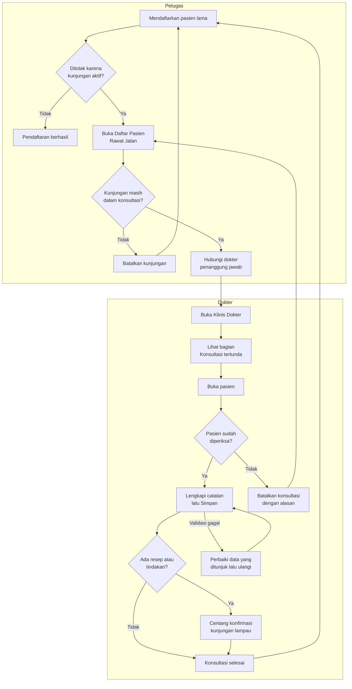

# Alur Konsultasi Tertunda di Klinis Dokter

| Field | Nilai |
|---|---|
| Revisi | `29` — Amendment KT, `draft` |
| Keputusan | `RJ-DOC-DEC-028`..`031`, `RJ-DOC-FE-010`..`012` |
| Rujukan | `02-backend-architecture.md` *Amendment KT*, `03-frontend-architecture.md` *Amendment KT* |

Konsultasi tertunda adalah konsultasi dokter dari hari sebelumnya yang belum disimpan atau
dibatalkan, sehingga kunjungan pasien masih tertahan di tahap Sedang Konsultasi.

## Alur

## Tabel langkah

| Langkah | Pelaku | Masukan | Keluaran | Bila gagal |
|---|---|---|---|---|
| P1 | Petugas | Data pasien lama | Kunjungan baru, atau penolakan dengan nomor kunjungan lama | Baca nomor dan tanggal kunjungan lama di pesan |
| P4–P5 | Petugas | Nomor kunjungan lama | Petunjuk baris di Daftar Pasien Rawat Jalan | Bila kunjungan tidak terlihat, minta pemegang hak "lihat semua" |
| P6 | Petugas | Alasan pembatalan | Kunjungan batal | Pesan penolakan menjelaskan sebabnya |
| D2 | Dokter | — | Daftar konsultasi tertunda miliknya | Bila daftar gagal dimuat, tekan Coba lagi; antrean hari ini tetap bisa dipakai |
| D5 | Dokter | Catatan klinis lengkap | Konsultasi selesai; pasien dapat didaftarkan lagi | Perbaiki bagian yang ditunjuk pesan validasi |
| D7 | Dokter | Centang konfirmasi | Resep diteruskan ke farmasi, tindakan ditagihkan | Bila resep tidak lagi diperlukan, hapus dulu resepnya, lalu Simpan |
| D9 | Dokter | Alasan, maks 250 karakter | Konsultasi batal; kunjungan menunggu dibatalkan petugas | Bila ditolak karena bukan penulis, konsultasi harus dibatalkan oleh dokter penulisnya |

**Contoh:** IKBAL YULIYANTO ditolak saat didaftarkan pada 5 Okt 2026 karena ENC-RSMMC-00172
(30 Sep). Petugas melihat petunjuk "Konsultasi masih aktif…" lalu menghubungi dr. Arif Lesmana.
dr. Arif membuka Konsultasi tertunda, memastikan IKBAL memang sudah diperiksa, lalu menekan
Simpan. Pendaftaran IKBAL kemudian diterima.
