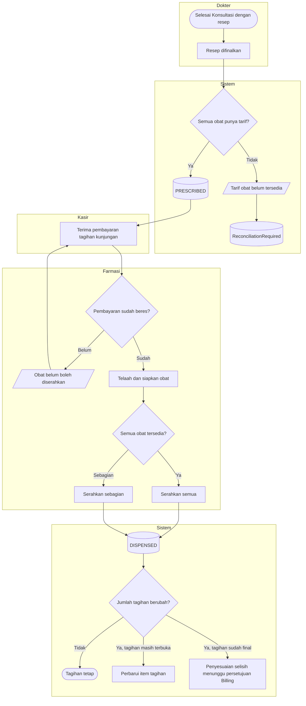

# Proses — Tagihan Obat Dua Tahap

| Field | Nilai |
|---|---|
| Blueprint | `RJ-BIL-BP-001` revisi `27` · `RJ-E2E-CONTRACT-001@1.0.0` (`approved`) |
| Keputusan | `RJ-E2E-DEC-005`; menyempurnakan `RJ-BIL-DEC-002` dan `RJ-BIL-DEC-005` |

**Tujuan:** pasien bisa membayar obat sebelum diserahkan (gerbang farmasi tetap berlaku), dan
tagihan akhirnya mengikuti jumlah obat yang benar-benar diserahkan.

**Pelaku:** dokter, kasir, farmasi, sistem.

**Pemicu:** dokter menekan Selesai Konsultasi dengan resep di dalamnya.

**Prasyarat:** setiap obat pada resep punya tarif berlaku.

| Langkah | Pelaku | Masukan yang dibutuhkan | Keluaran | Bila gagal |
|---|---|---|---|---|
| Finalisasi resep | Dokter | Resep dalam konsultasi | Item obat tahap 1 (`PRESCRIBED`) di tagihan | Tarif obat hilang → antrean rekonsiliasi; kasir belum bisa menagih obat itu |
| Bayar | Kasir | Tagihan kunjungan | Resep dinyatakan lunas untuk farmasi | Alur Billing/Kasir |
| Telaah dan serah | Farmasi | Resep lunas | Obat diserahkan | Belum lunas → farmasi menolak dan mengarahkan pasien ke kasir |
| Sesuaikan tagihan | Sistem | Jumlah aktual per obat | Item `DISPENSED` atau penyesuaian | Penyesuaian ditolak → antrean rekonsiliasi |

**Contoh:** Resep Tn. A: Paracetamol 10 × Rp1.500 dan Vitamin C 10 × Rp2.000 → tahap 1 Rp35.000.
Tn. A membayar Rp35.000. Farmasi hanya punya 8 Vitamin C → tahap 2 Rp31.000. Karena tagihan sudah
final, sistem membuat penyesuaian kredit Rp4.000 yang menunggu persetujuan Billing. Cara uang
Rp4.000 dikembalikan adalah keputusan Billing (`RJ-E2E-OQ-003`).

**Jalur tidak normal:** resep dibatalkan dokter sebelum dibayar → item obat dibatalkan dari
tagihan. Resep dibatalkan setelah obat diserahkan → penyesuaian kredit, bukan pembatalan item
(`RJ-E2E-DEC-010`).

**Hasil akhir:** tagihan obat = jumlah diserahkan × tarif; riwayat tahap 1 tetap tersimpan.
