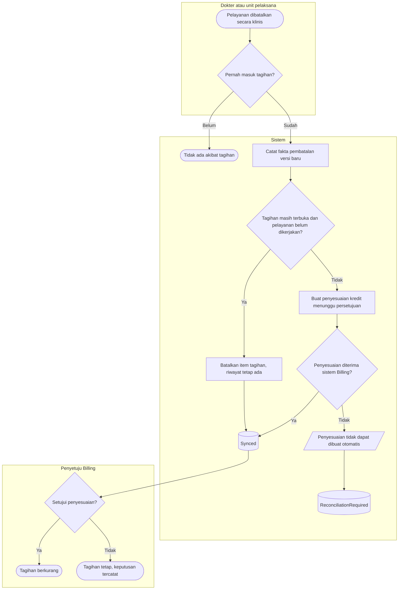

# Proses — Pembatalan dan Koreksi Pelayanan

| Field | Nilai |
|---|---|
| Blueprint | `RJ-BIL-BP-001` revisi `27` · `RJ-E2E-CONTRACT-001@1.0.0` (`approved`) |
| Keputusan | `RJ-E2E-DEC-010`, `RJ-BIL-DEC-004`; PRD §16 kasus A dan B |

**Tujuan:** pembatalan klinis tidak pernah menghapus riwayat tagihan dan tidak pernah menimbulkan
pembatalan palsu.

**Pelaku:** dokter / unit pelaksana (membatalkan), sistem, penyetuju Billing.

**Pemicu:** tindakan, Lab, Radiologi, atau resep dibatalkan secara klinis.

| Langkah | Pelaku | Masukan yang dibutuhkan | Keluaran | Bila gagal |
|---|---|---|---|---|
| Batalkan pelayanan | Dokter / unit | Alasan pembatalan klinis | Pelayanan batal | Aturan klinis modul masing-masing |
| Nilai riwayat tagihan | Sistem | Riwayat fakta pelayanan | Tanpa akibat (kasus A) atau fakta pembatalan (kasus B) | Hasil sebelumnya belum pasti → pembatalan ditahan sampai rekonsiliasi |
| Batalkan item | Sistem | Item masih bisa dibatalkan normal | Item batal, riwayat tetap | — |
| Penyesuaian | Sistem | Selisih | Penyesuaian menunggu persetujuan | Ditolak → antrean rekonsiliasi |
| Persetujuan | Penyetuju Billing | Penyesuaian | Tagihan berubah atau tetap | Alur persetujuan Billing |

**Contoh kasus A:** Lab *Darah Lengkap* dibatalkan sebelum spesimen diterima. Tidak pernah ada item
tagihan → tidak ada pembatalan maupun penyesuaian.

**Contoh kasus B:** Nebulizer Tn. A sudah dikerjakan dan tertagih Rp75.000, lalu ternyata salah
pasien. Item tidak dibatalkan; sistem membuat penyesuaian kredit Rp75.000 yang menunggu persetujuan
Billing. Item lama tetap terbaca di riwayat tagihan.

**Hasil akhir:** riwayat tagihan utuh; setiap pengurangan tagihan atas pelayanan yang sudah
dikerjakan melewati persetujuan manusia.
