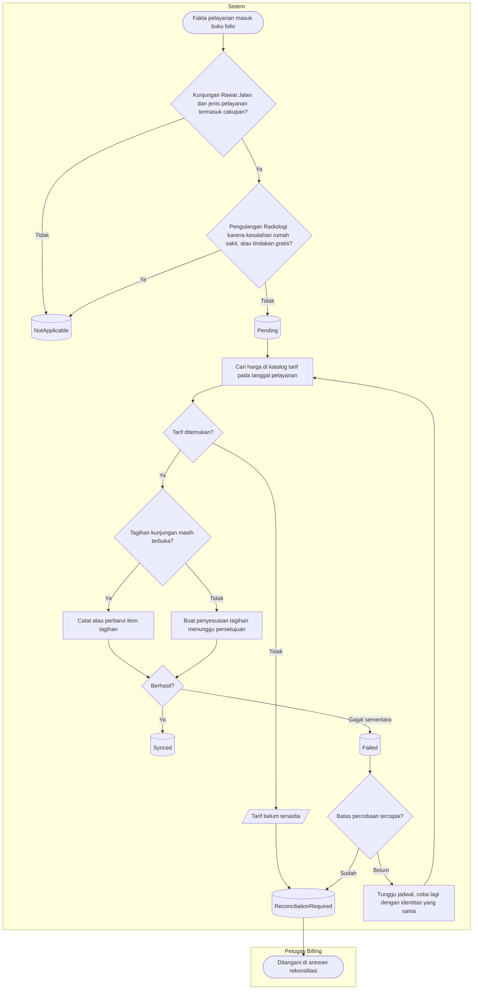

# Proses — Penagihan Otomatis dari Pelayanan Klinis

| Field | Nilai |
|---|---|
| Blueprint | `RJ-BIL-BP-001` revisi `27` · `RJ-E2E-CONTRACT-001@1.0.0` (`approved`) |
| Keputusan | `RJ-E2E-DEC-001`, `003`, `006`, `012` |

**Tujuan:** satu pelayanan menghasilkan tepat satu item tagihan berharga katalog, atau tercatat
jelas mengapa tidak.

**Pelaku:** sistem; petugas Billing saat butuh keputusan manual.

**Pemicu:** tindakan dikerjakan, spesimen Lab diterima, mutu study Radiologi diterima, konsultasi
selesai, resep difinalkan atau diserahkan.

| Langkah | Pelaku | Masukan yang dibutuhkan | Keluaran | Bila gagal |
|---|---|---|---|---|
| Nilai kelayakan | Sistem | Jenis kunjungan, jenis pelayanan, keterangan pengulangan | `Pending` atau `NotApplicable` | — |
| Cari harga | Sistem | Pelayanan, klinik, kelas pasien, tanggal pelayanan | Harga dan kategori tarif | Tarif tidak ada → antrean rekonsiliasi; admin tarif melengkapi, petugas Billing menekan Kirim Ulang |
| Catat item | Sistem | Harga, jumlah, identitas pelayanan dan versinya | Item tagihan | Gagal sementara → dicoba ulang otomatis |
| Penyesuaian pasca-final | Sistem | Selisih tagihan | Penyesuaian berstatus menunggu persetujuan | Ditolak → antrean rekonsiliasi |
| Coba ulang | Sistem | Jadwal dari kebijakan kirim ulang | Percobaan berikutnya | Batas tercapai → antrean rekonsiliasi |

**Aturan bisnis:** harga selalu dari katalog tarif, tidak pernah dari layar atau modul klinis;
tidak pernah Rp0 karena tarif hilang; kirim ulang selalu memakai identitas yang sama sehingga
tidak ada item ganda.

**Contoh:** Ny. C (samaran) konsultasi di Poli Gigi. Tarif konsultasi Poli Gigi belum diisi. Item
konsultasi tidak dibuat; baris langsung masuk antrean dengan sebab *tarif belum tersedia*. Esok
paginya admin tarif mengisi tarif Rp100.000, petugas Billing menekan Kirim Ulang, dan item
konsultasi Rp100.000 muncul di tagihan Ny. C.

**Hasil akhir:** setiap baris folio yang layak berakhir di `Synced`, `ReconciliationRequired`,
atau `Resolved`. Tidak ada baris yang diam tanpa diketahui.
