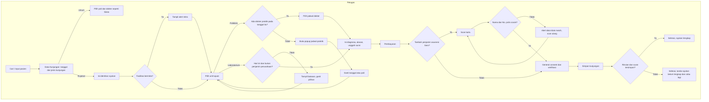
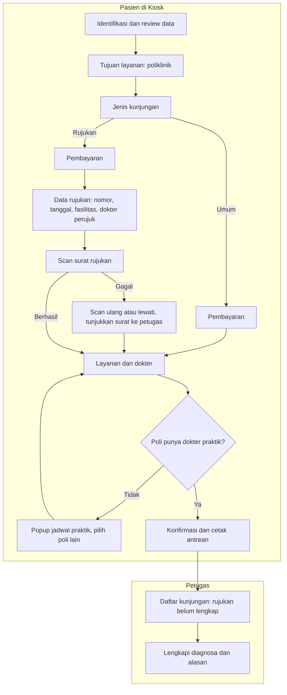

# Alur Pendaftaran Pasien Rujukan (Amendment PM-B, `approved` 2026-10-08)

Keputusan `RJ-DOC-DEC-068`..`082`, `KSK-DEC-025`.

## 1. Petugas pendaftaran

| Langkah | Pelaku | Masukan | Keluaran | Bila gagal |
|---|---|---|---|---|
| Isi identitas rujukan | Petugas | Surat rujukan | No., tanggal, fasilitas, dokter perujuk | Fasilitas belum ada di master → minta petugas master data menambahkannya |
| Pilih unit tujuan | Petugas | Surat rujukan | Poli/Lab | Poli tanpa dokter → popup jadwal, ganti tanggal/poli |
| Scan kartu asuransi baru | Petugas | Kartu fisik | Penjamin tersimpan | Tidak cocok → scan ulang atau perbaiki pilihan |
| Simpan | Sistem | Semua isian | Kunjungan + rujukan | Surat gagal tersimpan → tombol coba lagi; kunjungan tetap ada |

## 2. Kiosk

| Langkah | Pelaku | Masukan | Keluaran | Bila gagal |
|---|---|---|---|---|
| Data rujukan | Pasien | Surat rujukan | Identitas rujukan | Fasilitas tidak ditemukan → hubungi petugas |
| Scan surat | Pasien | Surat fisik | Gambar halaman | Scanner gagal → lewati, tiket menyarankan menunjukkan surat |
| Lengkapi rujukan | Petugas | Surat dari pasien | Rujukan lengkap | Konsultasi sudah dimulai → terkunci, tidak dapat diubah |

## 3. Koreksi rujukan

| Kondisi | Hasil |
|---|---|
| Sebelum konsultasi dokter dimulai | Petugas dapat mengoreksi; riwayat tersimpan |
| Sesudah konsultasi dimulai | Terkunci |
| Unit tujuan salah | Tidak dapat dikoreksi; kunjungan dibatalkan lalu didaftarkan ulang |
