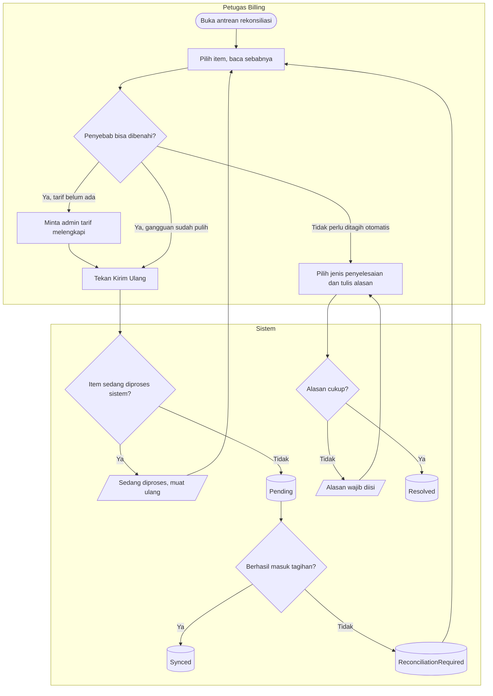

# Proses — Rekonsiliasi Tagihan Klinis

| Field | Nilai |
|---|---|
| Blueprint | `RJ-BIL-BP-001` revisi `27` · `RJ-E2E-CONTRACT-001@1.0.0` (`approved`) |
| Keputusan | `RJ-E2E-DEC-009`, `RJ-E2E-DEC-014`; PRD §16 kasus C |

**Tujuan:** pelayanan yang gagal masuk tagihan secara otomatis diputuskan manusia, dengan jejak
yang tertelusur.

**Pelaku:** petugas Billing; admin tarif bila penyebabnya tarif.

**Pemicu:** item masuk antrean karena tarif tidak ada, percobaan habis, kebijakan kirim ulang
dimatikan, penyesuaian ditolak, atau baris lama sebelum penagihan otomatis.

| Langkah | Pelaku | Masukan yang dibutuhkan | Keluaran | Bila gagal |
|---|---|---|---|---|
| Buka antrean | Petugas Billing | Hak akses baca antrean | Daftar item beserta sebab dan jumlah percobaan | Tanpa hak akses → layar akses ditolak |
| Kirim ulang | Petugas Billing | Penyebab sudah dibenahi | Item `Pending` lalu diproses | Masih gagal → kembali ke antrean dengan sebab terbaru |
| Selesaikan manual | Petugas Billing | Jenis penyelesaian (sudah ditagih manual, tidak ditagihkan, duplikat) dan alasan minimal 10 karakter | Item `Resolved`, final | Alasan kurang → ditolak |

**Contoh:** Setelah migration ada 25 baris lama (`LEGACY_PRE_BRIDGE`). Petugas Billing mencocokkan
dengan tagihan lama: 20 sudah ditagih manual oleh kasir → *sudah ditagih manual*; 3 duplikat →
*duplikat*; 2 belum pernah ditagih → petugas menekan Kirim Ulang dan item masuk tagihan
kunjungannya (bila tagihan sudah final, menjadi penyesuaian debit yang menunggu persetujuan).

**Hasil akhir:** antrean hanya berisi item yang benar-benar menunggu keputusan; setiap keputusan
manual menyimpan petugas, waktu, jenis, dan alasan.
