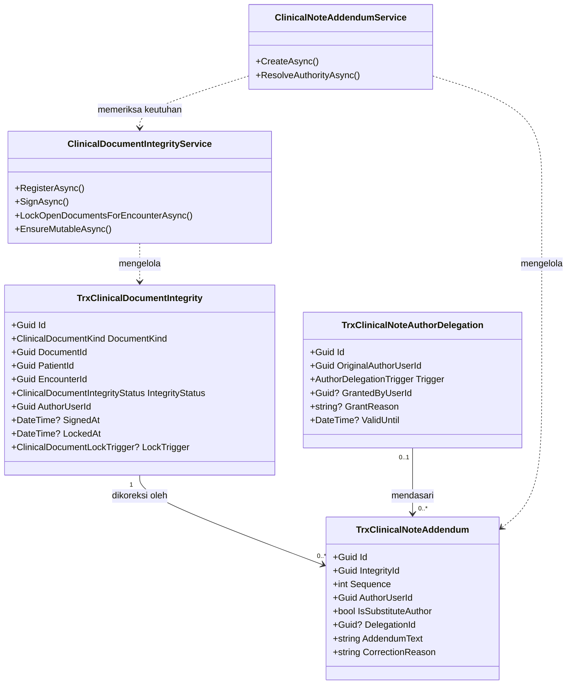
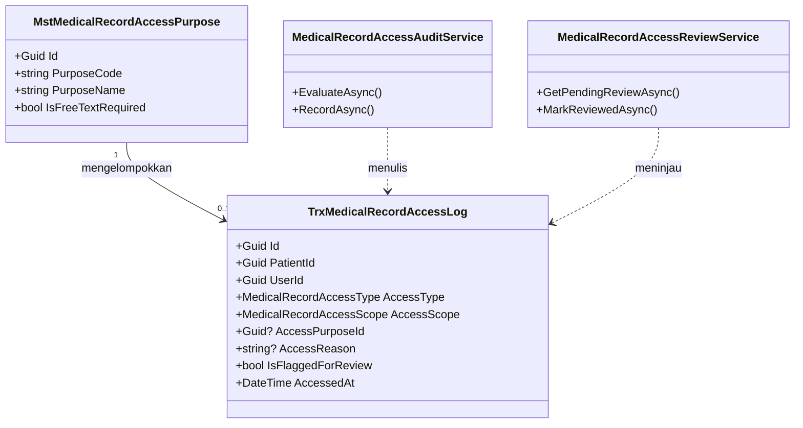
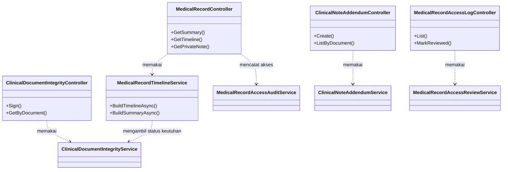

# Rekam Medis — Arsitektur Backend

| Field | Value |
|---|---|
| Blueprint ID | `RM-BP-001` |
| Revision | `1` |
| Status | `draft` |
| Contract version | `0.1.0` |
| Backend SHA | `ab37e3a2e80f0e34efe22ec0f6a8c9b90a3ae45e` |
| Frontend SHA | `c4e2ef2a6080f3ce328d2faad79be1893ac13e22` |
| Input revisions | `00-interview-decisions.md` revision `3`; `01-existing-capability-map.md` revision `2` |
| Owners | Product/domain, clinical governance, security/privacy: **seluruhnya `OPEN`** |

> **PERINGATAN DASAR DESAIN.** Dokumen ini disusun di atas keputusan yang **belum disetujui
> owner mana pun**. Seluruh `RM-DEC-001` sampai `RM-DEC-026` berstatus `draft`. Ini pilihan
> sadar yang tercatat pada `RM-DEC-025`. Dua keputusan paling rawan ditolak adalah
> `RM-DEC-017` (kewenangan `SuperAdmin`, berdampak ke seluruh aplikasi) dan `RM-DEC-014`
> (perlakuan catatan lama). Bila salah satunya berubah, bagian desain yang bergantung padanya
> ikut berubah. Dokumen ini **bukan** izin untuk mulai membangun.

---

## 1. Gagasan inti desain

Ada satu pilihan yang menentukan seluruh bentuk desain ini, dan sebaiknya dipahami lebih dulu
sebelum membaca sisanya.

**Status keutuhan tidak ditempelkan ke tiga belas tabel klinis, melainkan disimpan di satu
tabel daftar tersendiri.**

Bayangkan buku tamu di depan ruang arsip. Buku itu tidak mengubah isi map mana pun. Ia hanya
mencatat, untuk setiap map: sudah ditandatangani siapa, kapan dikunci, dan apakah masih boleh
diubah. Tabel `TrxClinicalDocumentIntegrity` berperan seperti buku tamu itu.

Akibat langsung dari pilihan ini, dan inilah alasan utamanya:

| Akibat | Penjelasan |
|---|---|
| **Nol perubahan kolom pada 13 tabel klinis** | Tidak ada satu pun kolom ditambah atau diubah pada `TrxPatientIntegratedProgressNote`, `TrxDoctorConsultation`, dan sebelas tabel klinis lainnya. Alur IGD, antrean dokter, dan farmasi yang memakai tabel-tabel itu tidak tersentuh sama sekali |
| **Satu aturan, satu tempat** | Aturan penguncian ditulis sekali di satu service, bukan tiga belas kali di tiga belas controller. Ini menutup `RM-CAP-010` yang temuannya justru "aturan tersebar dan mudah terlewat" |
| **Empat model status lama dibiarkan hidup** | Persis yang diminta `RM-DEC-013`: status keutuhan berdampingan, bukan menggantikan |
| **Pengisian data lama menjadi sisipan baris, bukan pengubahan tabel** | `RM-DEC-014` dijalankan dengan menambah baris ke tabel daftar, bukan memutakhirkan tiga belas tabel yang sedang dipakai |

Risiko yang harus diterima dari pilihan ini juga perlu dinyatakan terbuka: karena status
keutuhan berada di tabel terpisah, **penegakannya sepenuhnya bergantung pada disiplin memanggil
service**. Sebuah controller yang lupa memanggil pemeriksa keutuhan tetap dapat mengubah
catatan terkunci. Cara menutupnya dijelaskan pada bagian 7.

---

## 2. Bounded context dan ownership

| Konteks | Owner | Aggregate root | Invariant utama |
|---|---|---|---|
| **Keutuhan Catatan Klinis** | `MedicalRecordManagement` (baru) | `TrxClinicalDocumentIntegrity` | Satu dokumen klinis memiliki tepat satu baris keutuhan. Setelah `Signed` atau `LockedUnsigned`, isi dokumen tidak dapat berubah |
| **Jejak dan Kewenangan Akses** | `MedicalRecordManagement` (baru) | `TrxMedicalRecordAccessLog` | Setiap pembukaan berkas rekam medis menghasilkan tepat satu baris jejak, sebelum isi dikembalikan |
| **Penelusuran Berkas** | `MedicalRecordManagement` (baru) | — (hanya baca) | Tidak memiliki data sendiri. Membaca milik `ClinicalManagement` tanpa menyalinnya |

Batas transaksi:

| Operasi | Batas transaksi | Alasan |
|---|---|---|
| Menandatangani dokumen | Satu transaksi mencakup pembaruan baris keutuhan saja | Isi dokumen tidak ikut berubah, jadi tidak perlu mengunci tabel klinis |
| Menutup kunjungan | Satu transaksi mencakup pembaruan status kunjungan **dan** penguncian seluruh dokumen terbuka di dalamnya | Bila penguncian gagal, penutupan kunjungan ikut dibatalkan. Kunjungan yang tertutup dengan dokumen masih terbuka adalah keadaan yang dilarang `RM-DEC-003` |
| Membuat addendum | Satu transaksi mencakup penyisipan addendum saja | Dokumen induk tidak berubah — itulah inti addendum |
| Mencatat jejak akses | Transaksi tersendiri, **selesai sebelum** isi rekam medis dikembalikan | Bila pencatatan gagal, isi tidak boleh dikembalikan. Membaca tanpa jejak adalah kegagalan, bukan gangguan kecil |

Baris terakhir perlu ditegaskan: pada modul ini, **gagal mencatat jejak berarti gagal
membaca**. Ini pilihan yang menutup rapat, bukan yang melonggarkan. Konsekuensinya, gangguan
pada tabel jejak akan menghambat pembacaan rekam medis — dan itu memang risiko yang dipilih
dengan sadar, karena membaca diam-diam lebih berbahaya daripada tidak bisa membaca.

---

## 3. Tabel kepemilikan data

Ini pertahanan langsung terhadap duplikasi entity. Kolom terakhir adalah yang paling penting.

| Kelompok data | Modul pemilik | Dipakai modul ini | Dibuat ulang di modul ini |
|---|---|:---:|---|
| Pasien dan nomor rekam medis | `PatientManagement` | Ya | **Tidak.** Dirujuk lewat `PatientId` |
| Kunjungan | `RegistrationManagement` | Ya | **Tidak.** Dirujuk lewat `EncounterId` |
| Antrean | `RegistrationManagement` | Tidak | Tidak |
| Isi klinis: asesmen, SOAP, CPPT, diagnosis, tindakan, tanda vital, alergi, riwayat | `ClinicalManagement` | Ya | **Tidak.** Dibaca apa adanya, sesuai `RM-DEC-001` |
| Dokumen klinis dan lampiran berkas | `ClinicalManagement` | Ya | **Tidak** |
| Surat keterangan medis dan persetujuan tindakan | `ClinicalManagement` | Ya | **Tidak** |
| Resep dan penyerahan obat | `PharmacyManagement` | Ya, hanya untuk ditampilkan | **Tidak** |
| Dokter, pegawai, dan pengguna | `Corporate/HumanResource` dan Identity | Ya | **Tidak** |
| Diagnosis dan tindakan master | `HealthServices/MasterData` | Ya | **Tidak** |
| Unit pelayanan dan klinik | `HealthServices/MasterData` | Ya | **Tidak** |
| **Status keutuhan dokumen klinis** | `MedicalRecordManagement` | Ya | **Ya, karena belum ada pemiliknya.** Konsep ini tidak ada di modul mana pun |
| **Addendum catatan klinis** | `MedicalRecordManagement` | Ya | **Ya, karena belum ada pemiliknya** |
| **Jejak akses rekam medis** | `MedicalRecordManagement` | Ya | **Ya, karena belum ada pemiliknya** |
| **Penetapan penulis berhalangan** | `MedicalRecordManagement` | Ya | **Ya, karena belum ada pemiliknya** |
| **Keperluan akses (master)** | `HealthServices/MasterData` | Ya | **Ya, master baru** |

---

## 4. Class diagram

Dipecah tiga agar setiap diagram muat dibaca dalam satu layar.

### 4.1 Konteks Keutuhan Catatan Klinis



### 4.2 Konteks Jejak dan Kewenangan Akses



### 4.3 Konteks Penelusuran Berkas dan controller



---

## 5. Penjelasan setiap class

### 5.1 `TrxClinicalDocumentIntegrity`

| Aspek | Penjelasan |
|---|---|
| **Status** | `Baru` |
| **Lokasi file** | `Areas/HealthServices/MedicalRecordManagement/Models/TrxClinicalDocumentIntegrity.cs` |
| Kategori | Transaksi |
| Tanggung jawab utama | Menyimpan keadaan keutuhan satu dokumen klinis: siapa penulisnya, sudah ditandatangani atau belum, sudah terkunci atau belum, dan karena apa terkuncinya. Tabel ini tidak menyimpan isi klinis apa pun — hanya keterangan tentang dokumennya |
| Field penting | `DocumentKind`, `DocumentId`, `PatientId`, `EncounterId`, `IntegrityStatus`, `AuthorUserId`, `SignedAt`, `SignedByUserId`, `LockedAt`, `LockTrigger`, `SignatureDeviceInfo` |
| Navigation property dan relasi | Menunjuk `MstPatient` dan `TrxPatientEncounter`; memiliki banyak `TrxClinicalNoteAddendum`. **Tidak** memiliki navigation property ke tiga belas tabel klinis, karena `DocumentId` bersifat polimorfik |
| Pemakaian dalam alur bisnis | Baris dibuat otomatis saat dokumen klinis pertama kali disimpan. Diperbarui saat penulis menandatangani, atau saat kunjungan ditutup |
| Catatan desain | `AuthorUserId` **tidak pernah** boleh diubah setelah baris dibuat. Inilah yang menutup `RM-CAP-012`, karena kepemilikan penulis dipindahkan ke tabel yang tidak bisa disentuh permintaan ubah dokumen. `DocumentKind` dan `DocumentId` wajib unik bersama |
| Ekuivalen model lama | — |

### 5.2 `TrxClinicalNoteAddendum`

| Aspek | Penjelasan |
|---|---|
| **Status** | `Baru` |
| **Lokasi file** | `Areas/HealthServices/MedicalRecordManagement/Models/TrxClinicalNoteAddendum.cs` |
| Kategori | Transaksi |
| Tanggung jawab utama | Menyimpan koreksi atau tambahan terhadap dokumen yang sudah terkunci. Addendum tidak pernah menimpa isi lama; ia menempel di bawahnya |
| Field penting | `IntegrityId`, `Sequence`, `AuthorUserId`, `IsSubstituteAuthor`, `DelegationId`, `AddendumText`, `CorrectionReason` |
| Navigation property dan relasi | Milik `TrxClinicalDocumentIntegrity`; boleh menunjuk `TrxClinicalNoteAuthorDelegation` bila dibuat penulis pengganti |
| Pemakaian dalam alur bisnis | Dibuat ketika penulis menyadari kesalahan pada catatan yang sudah ditandatangani, atau ketika kepala unit membetulkan catatan penulis yang berhalangan |
| Catatan desain | `Sequence` unik bersama `IntegrityId` supaya urutan koreksi terbaca pasti. Addendum **tidak dapat** dihapus maupun diubah; koreksi atas addendum dibuat sebagai addendum berikutnya. `IsSubstituteAuthor` bernilai benar **hanya** bila `DelegationId` terisi |
| Ekuivalen model lama | — |

### 5.3 `TrxClinicalNoteAuthorDelegation`

| Aspek | Penjelasan |
|---|---|
| **Status** | `Baru` |
| **Lokasi file** | `Areas/HealthServices/MedicalRecordManagement/Models/TrxClinicalNoteAuthorDelegation.cs` |
| Kategori | Transaksi |
| Tanggung jawab utama | Mencatat bahwa seorang penulis dinyatakan berhalangan, sehingga kepala unit atau DPJP boleh membuat addendum menggantikannya. Menjawab `RM-DEC-020` |
| Field penting | `OriginalAuthorUserId`, `Trigger`, `GrantedByUserId`, `GrantReason`, `ValidFrom`, `ValidUntil`, `IsActive` |
| Navigation property dan relasi | Menunjuk `ApplicationUser` dua kali: penulis asli dan pemberi penetapan |
| Pemakaian dalam alur bisnis | Untuk `Trigger = InactiveAccount`, baris tidak perlu dibuat manusia — sistem menyimpulkannya dari keadaan akun. Untuk `Trigger = UnitHeadGrant`, kepala unit membuat baris ini disertai alasan |
| Catatan desain | Penetapan manual wajib punya masa berlaku. Penetapan tanpa batas waktu adalah pintu belakang permanen, dan itu justru yang harus dihindari. Setiap penetapan manual ikut menjadi bahan tinjauan unit rekam medis |
| Ekuivalen model lama | — |

### 5.4 `TrxMedicalRecordAccessLog`

| Aspek | Penjelasan |
|---|---|
| **Status** | `Baru` |
| **Lokasi file** | `Areas/HealthServices/MedicalRecordManagement/Models/TrxMedicalRecordAccessLog.cs` |
| Kategori | Transaksi |
| Tanggung jawab utama | Menyimpan satu baris untuk setiap pembukaan berkas rekam medis: siapa, pasien siapa, kapan, dengan keperluan apa, dan apakah perlu ditinjau |
| Field penting | `PatientId`, `UserId`, `AccessType`, `AccessScope`, `AccessPurposeId`, `AccessReason`, `IsFlaggedForReview`, `ReviewedAt`, `ReviewedByUserId`, `AccessedAt`, `IpAddress`, `ClientInfo` |
| Navigation property dan relasi | Menunjuk `MstPatient`, `ApplicationUser`, dan `MstMedicalRecordAccessPurpose` |
| Pemakaian dalam alur bisnis | Ditulis setiap kali layar rekam medis dibuka, sebelum isinya dikembalikan |
| Catatan desain | Tabel ini **tumbuh paling cepat di seluruh sistem**. Pembagian tabel per periode wajib dirancang sejak migration pertama, memakai masa simpan 25 tahun yang ditetapkan `RM-DEC-024`, terbagi per tahun berdasarkan `AccessedAt`. Tabel ini **tidak** boleh memuat isi klinis apa pun — hanya keterangan tentang siapa membuka apa. Baris pada tabel ini **tidak** boleh dihapus lewat `IsDelete` biasa |
| Ekuivalen model lama | — |

### 5.5 `MstMedicalRecordAccessPurpose`

| Aspek | Penjelasan |
|---|---|
| **Status** | `Baru` |
| **Lokasi file** | `Areas/HealthServices/MasterData/Models/MstMedicalRecordAccessPurpose.cs` |
| Kategori | Master |
| Tanggung jawab utama | Daftar keperluan akses yang dapat dipilih pengguna saat membuka rekam medis pasien di luar rawatannya |
| Field penting | `PurposeCode`, `PurposeName`, `IsFreeTextRequired`, `RequiresReview`, `SortOrder`, `IsActive` |
| Navigation property dan relasi | Dipakai banyak `TrxMedicalRecordAccessLog` |
| Pemakaian dalam alur bisnis | Muncul sebagai pilihan pada kotak isian alasan |
| Catatan desain | Menyediakan pilihan jauh lebih baik daripada kotak teks bebas saja: alasan menjadi dapat dihitung dan dibandingkan saat ditinjau. Tetap sediakan satu pilihan "Lainnya" dengan `IsFreeTextRequired` bernilai benar. Letak file mengikuti aturan struktur: master tinggal di `MasterData/Models/`, **bukan** di folder submodulnya |
| Ekuivalen model lama | — |

### 5.6 `ClinicalDocumentIntegrityService`

| Aspek | Penjelasan |
|---|---|
| **Status** | `Baru` |
| **Lokasi file** | `Areas/HealthServices/MedicalRecordManagement/Services/ClinicalDocumentIntegrityService.cs` |
| Kategori | Service |
| Tanggung jawab utama | Satu-satunya tempat aturan keutuhan ditegakkan: mendaftarkan dokumen baru, menandatangani, mengunci saat kunjungan ditutup, dan menolak perubahan pada dokumen terkunci |
| Dipanggil oleh | `ClinicalDocumentIntegrityController`, `ClinicalNoteAddendumService`, `MedicalRecordTimelineService`, `PatientEncounterController`, dan controller `ClinicalManagement` yang mengubah dokumen |
| Membuka transaksi database | Ya, pada `SignAsync` dan `LockOpenDocumentsForEncounterAsync` |
| Catatan desain | `EnsureMutableAsync` adalah metode yang wajib dipanggil setiap controller sebelum mengubah dokumen klinis. Bila metode ini tidak dipanggil, aturan penguncian tidak berlaku — lihat bagian 7 tentang cara menutup risiko itu |

### 5.7 `MedicalRecordAccessAuditService`

| Aspek | Penjelasan |
|---|---|
| **Status** | `Baru` |
| **Lokasi file** | `Areas/HealthServices/MedicalRecordManagement/Services/MedicalRecordAccessAuditService.cs` |
| Kategori | Service |
| Tanggung jawab utama | Menentukan apakah pengguna sedang membuka pasien rawatannya atau bukan, lalu menuliskan baris jejak akses |
| Dipanggil oleh | `MedicalRecordController` |
| Membuka transaksi database | Ya, transaksi tersendiri yang selesai sebelum isi dikembalikan |
| Catatan desain | Penentuan "pasien rawatan" mengikuti `RM-DEC-016`: pasien memiliki kunjungan yang belum ditutup. Aturan ini diletakkan di satu metode agar mudah diperketat pada rilis berikutnya tanpa menyentuh controller |

### 5.8 `MedicalRecordTimelineService`

| Aspek | Penjelasan |
|---|---|
| **Status** | `Baru` |
| **Lokasi file** | `Areas/HealthServices/MedicalRecordManagement/Services/MedicalRecordTimelineService.cs` |
| Kategori | Service |
| Tanggung jawab utama | Menggabungkan tiga belas sumber dokumen klinis menjadi satu daftar berurut waktu, lengkap dengan status keutuhan masing-masing |
| Dipanggil oleh | `MedicalRecordController` |
| Membuka transaksi database | Tidak. Hanya membaca, memakai `AsNoTracking` |
| Catatan desain | Menggabungkan tiga belas sumber berpotensi menghasilkan tiga belas query. Pembatasan wajib: penyaringan rentang tanggal, batas jumlah baris, dan pengambilan hanya jenis dokumen yang diminta. Pola penggabungan mencontoh `PrescriptionWorkspaceService` yang sudah terbukti |

### 5.9 `MedicalRecordController`

| Aspek | Penjelasan |
|---|---|
| **Status** | `Baru` |
| **Lokasi file** | `Areas/HealthServices/MedicalRecordManagement/Controllers/MedicalRecordController.cs` |
| Kategori | Controller |
| Service yang dipakai | `MedicalRecordTimelineService`, `MedicalRecordAccessAuditService` |
| Endpoint yang diurus | Ringkasan berkas, riwayat berurut waktu, dan pembukaan `PrivateNote` |
| Catatan desain | Controller ini **wajib** memakai service, bukan `ApplicationDbContext` langsung, karena setiap pembacaan harus melewati pencatatan jejak akses lebih dulu |

### 5.10 `PatientIntegratedProgressNoteController`

| Aspek | Penjelasan |
|---|---|
| **Status** | `Diperbarui` |
| **Lokasi file** | `Areas/HealthServices/ClinicalManagement/Controllers/PatientIntegratedProgressNoteController.cs` |
| Kategori | Controller |
| Service yang dipakai | Bertambah: `ClinicalDocumentIntegrityService` |
| Tanggung jawab utama | Tidak berubah. Yang berubah hanya tiga celah keutuhan yang ditutup |
| Catatan desain | Tiga perubahan wajib, seluruhnya pada perilaku, **bukan pada skema tabel**: (1) memanggil `EnsureMutableAsync` sebelum mengubah, menutup `RM-CAP-011`; (2) **menghapus** penetapan `entity.ProviderUserId` dari isi permintaan pada baris 533, menutup `RM-CAP-012`; (3) **menghapus** penetapan `entity.IsReadOnlyGenerated` dari isi permintaan pada baris 550, menutup `RM-CAP-013`. Selain itu memanggil `RegisterAsync` saat CPPT dibuat |
| Ekuivalen model lama | — |

### 5.11 `PatientEncounterController`

| Aspek | Penjelasan |
|---|---|
| **Status** | `Diperbarui` |
| **Lokasi file** | `Areas/HealthServices/RegistrationManagement/Controllers/PatientEncounterController.cs` |
| Kategori | Controller |
| Service yang dipakai | Bertambah: `ClinicalDocumentIntegrityService` |
| Catatan desain | Pada endpoint `PATCH /{id}/status`, ketika status berpindah ke `Completed`, panggil `LockOpenDocumentsForEncounterAsync` di dalam transaksi yang sama. Ini menjalankan lapis kedua `RM-DEC-003`. Perlu diketahui: endpoint ini **tidak memiliki validasi perpindahan status** (`RM-CAP-019`), sehingga status dapat melompat dari nilai mana pun ke `Completed`. Penguncian karena itu dipicu oleh perpindahan **menuju** `Completed`, bukan oleh urutan tertentu |
| Ekuivalen model lama | — |

---

## 6. Arsitektur folder

```text
Areas/HealthServices/MedicalRecordManagement/          # BARU
├── Controllers/
│   ├── MedicalRecordController.cs                     # Baru
│   ├── ClinicalDocumentIntegrityController.cs         # Baru
│   ├── ClinicalNoteAddendumController.cs              # Baru
│   ├── ClinicalNoteAuthorDelegationController.cs      # Baru
│   └── MedicalRecordAccessLogController.cs            # Baru
├── DTOs/
│   ├── MedicalRecordDtos.cs                           # Baru
│   ├── ClinicalDocumentIntegrityDtos.cs               # Baru
│   ├── ClinicalNoteAddendumDtos.cs                    # Baru
│   ├── ClinicalNoteAuthorDelegationDtos.cs            # Baru
│   └── MedicalRecordAccessLogDtos.cs                  # Baru
├── Enums/
│   ├── ClinicalDocumentKind.cs                        # Baru
│   ├── ClinicalDocumentIntegrityStatus.cs             # Baru
│   ├── ClinicalDocumentLockTrigger.cs                 # Baru
│   ├── AuthorDelegationTrigger.cs                     # Baru
│   ├── MedicalRecordAccessType.cs                     # Baru
│   └── MedicalRecordAccessScope.cs                    # Baru
├── Models/
│   ├── TrxClinicalDocumentIntegrity.cs                # Baru
│   ├── TrxClinicalNoteAddendum.cs                     # Baru
│   ├── TrxClinicalNoteAuthorDelegation.cs             # Baru
│   └── TrxMedicalRecordAccessLog.cs                   # Baru
└── Services/
    ├── ClinicalDocumentIntegrityService.cs            # Baru
    ├── ClinicalNoteAddendumService.cs                 # Baru
    ├── MedicalRecordAccessAuditService.cs             # Baru
    ├── MedicalRecordAccessReviewService.cs            # Baru
    └── MedicalRecordTimelineService.cs                # Baru

Areas/HealthServices/MasterData/
├── Models/
│   └── MstMedicalRecordAccessPurpose.cs               # Baru
├── DTOs/
│   └── MedicalRecordAccessPurposeDtos.cs              # Baru
└── Controllers/
    └── MedicalRecordAccessPurposeController.cs        # Baru

Areas/HealthServices/ClinicalManagement/Controllers/
└── PatientIntegratedProgressNoteController.cs         # Diperbarui — 3 celah ditutup

Areas/HealthServices/RegistrationManagement/Controllers/
└── PatientEncounterController.cs                      # Diperbarui — pemicu penguncian

Repositories/Configurations/HealthService/             # nama domain tunggal — utang teknis, jangan ditiru di tempat lain
└── MedicalRecordManagement/                           # BARU
    ├── TrxClinicalDocumentIntegrityConfiguration.cs   # Baru
    ├── TrxClinicalNoteAddendumConfiguration.cs        # Baru
    ├── TrxClinicalNoteAuthorDelegationConfiguration.cs # Baru
    ├── TrxMedicalRecordAccessLogConfiguration.cs      # Baru
    └── MstMedicalRecordAccessPurposeConfiguration.cs  # Baru

Migrations/                                            # 3 migration baru, lihat bagian 8
Program.cs                                             # Diperbarui — 5 AddScoped baru
```

Dua hal yang wajib diperhatikan implementer:

1. **File configuration tidak berada di dalam `Areas/`.** Letaknya di
   `Repositories/Configurations/HealthService/MedicalRecordManagement/`. Pendaftarannya
   otomatis lewat `ApplyConfigurationsFromAssembly` pada `Repositories/ApplicationDbContext.cs:612`,
   jadi tidak perlu menambah baris `ApplyConfiguration` satu per satu.
2. **Master tidak berada di folder submodul.** `MstMedicalRecordAccessPurpose` tinggal di
   `Areas/HealthServices/MasterData/Models/`, mengikuti pola `MstEmergency*` yang sudah ada.

Utang teknis yang ditemui dan **tidak** dirapikan dalam pekerjaan ini: nama domain pada
`Repositories/Configurations/HealthService/` memakai bentuk tunggal, sedangkan pola standarnya
`HealthServices`. Mengikutinya agar konsisten dengan 68 file yang sudah ada. Perapian harus
menjadi task tersendiri dengan persetujuan pemilik arsitektur backend, bukan diselipkan di sini.

---

## 7. Cara menutup risiko "service yang lupa dipanggil"

Bagian 1 menyebut satu risiko nyata: karena status keutuhan ada di tabel terpisah, controller
yang lupa memanggil `EnsureMutableAsync` tetap bisa mengubah catatan terkunci. Risiko ini tidak
boleh dibiarkan menggantung.

Tiga lapis penutupnya:

| Lapis | Cara | Kekuatan |
|---|---|---|
| 1. Daftar terbatas | Hanya jenis dokumen yang terdaftar di `ClinicalDocumentKind` yang tunduk aturan keutuhan. Rilis pertama mendaftarkan **satu** jenis saja: CPPT | Kuat. Cakupan sempit dan diketahui pasti |
| 2. Uji penerimaan | Setiap jenis dokumen yang didaftarkan wajib punya uji yang membuktikan perubahan pada dokumen terkunci ditolak | Kuat, tetapi bergantung uji benar-benar ditulis |
| 3. Tinjauan berkala | Daftar `ClinicalDocumentKind` dibandingkan dengan daftar controller yang memanggil `EnsureMutableAsync` | Lemah, bergantung disiplin manusia |

Keputusan desain yang mengikutinya: **rilis pertama hanya mendaftarkan CPPT.** Dua belas jenis
dokumen lain belum tunduk aturan keutuhan, dan itu **wajib dinyatakan terbuka** di layar, bukan
didiamkan. Menyatakan cakupan yang jujur lebih baik daripada memberi kesan seluruh rekam medis
sudah terlindungi padahal baru satu jenis dokumen.

Alasan CPPT dipilih lebih dulu: ia dokumen yang paling sering ditulis, dan ia satu-satunya yang
temuan auditnya berstatus `Repair` — celah nyata pada kode berjalan, bukan sekadar fitur belum
ada.

---

## 8. Status model dan rencana migration

### 8.1 Status model

| Model | Status | Dampak migration |
|---|---|---|
| `TrxClinicalDocumentIntegrity` | `Baru` | Tabel baru beserta index |
| `TrxClinicalNoteAddendum` | `Baru` | Tabel baru beserta index |
| `TrxClinicalNoteAuthorDelegation` | `Baru` | Tabel baru beserta index |
| `TrxMedicalRecordAccessLog` | `Baru` | Tabel baru, dirancang terbagi per periode |
| `MstMedicalRecordAccessPurpose` | `Baru` | Tabel baru beserta data awal |
| `TrxPatientIntegratedProgressNote` | `Sudah ada` | **Tidak ada perubahan kolom.** Yang berubah hanya perilaku controller |
| `TrxPatientEncounter` | `Sudah ada` | **Tidak ada perubahan kolom.** Yang berubah hanya perilaku controller |
| Sebelas tabel klinis lainnya | `Sudah ada` | **Tidak ada perubahan sama sekali** |

Perlu ditegaskan karena inilah sifat terpenting desain ini: **rilis pertama tidak mengubah satu
kolom pun pada tabel yang sedang dipakai.** Seluruh perubahan berupa tabel baru ditambah
perubahan perilaku pada dua controller.

### 8.2 Rencana migration

| Urutan | Nama | Isi | Tanpa mematikan layanan? | Cara mundur |
|---:|---|---|:---:|---|
| 1 | `AddMedicalRecordIntegrityTables` | Membuat `TrxClinicalDocumentIntegrity`, `TrxClinicalNoteAddendum`, `TrxClinicalNoteAuthorDelegation` beserta index | **Ya** — hanya menambah tabel baru | Hapus tabel. Aman karena belum ada yang memakainya |
| 2 | `AddMedicalRecordAccessAuditTables` | Membuat `MstMedicalRecordAccessPurpose` dan `TrxMedicalRecordAccessLog`, mengisi data awal keperluan akses | **Ya** | Hapus tabel |
| 3 | `BackfillProgressNoteIntegrity` | Mengisi baris keutuhan untuk seluruh CPPT yang sudah ada, sesuai `RM-DEC-014` | **Ya**, tetapi lihat catatan di bawah | Hapus seluruh baris yang dibuat migration ini |

Catatan penting untuk migration ketiga. Ini satu-satunya migration yang menyentuh data nyata,
dan cara kerjanya:

```text
Untuk setiap CPPT yang belum punya baris keutuhan:
  ambil kunjungan yang menaunginya
  bila kunjungan sudah Completed atau Cancelled  -> IntegrityStatus = LockedUnsigned
                                                     LockTrigger    = BackfillEncounterClosed
  bila kunjungan masih berjalan                  -> IntegrityStatus = Draft
  bila CPPT sudah dibatalkan (IsCancel)          -> IntegrityStatus = Cancelled
  AuthorUserId <- ProviderUserId; bila kosong, tandai AuthorUnknown
```

Tiga hal yang harus disiapkan sebelum menjalankannya:

1. **Jumlah barisnya belum diketahui.** Audit tidak melihat data produksi (batas audit nomor 3
   pada capability map). Migration ini wajib dijalankan bertahap per potongan, bukan sekali
   jalan, agar tidak mengunci tabel terlalu lama.
2. **CPPT tanpa `ProviderUserId` akan muncul.** Kolom itu boleh kosong pada model yang ada.
   Barisnya tetap dibuat dengan penanda penulis tidak diketahui, dan itu ikut terlihat pada
   laporan kelengkapan. Menyembunyikannya berarti berbohong tentang keadaan data.
3. **Unit rekam medis harus diberi tahu lebih dulu.** Sesuai `RM-DEC-014`, laporan kelengkapan
   akan menampilkan banyak catatan bertanda tidak ditandatangani sejak hari pertama.

---

## 9. Rencana data master awal

Modul dengan tabel master kosong tidak dapat dipakai sama sekali. Hanya ada satu master pada
rilis pertama.

| Master | Isi minimum | Sumber nilai |
|---|---|---|
| `MstMedicalRecordAccessPurpose` | Sekurang-kurangnya lima keperluan: `Konsultasi lintas unit`, `Penanganan gawat darurat`, `Penelusuran kelengkapan berkas`, `Permintaan resmi pasien atau keluarga`, `Lainnya` | SOP rekam medis rumah sakit. **Belum tersedia** — lihat blocker nomor 3 pada decision log |

Aturan yang mengikat: pilihan keperluan akses **wajib** berasal dari master ini dan **tidak
boleh** ditulis tetap di dalam controller maupun frontend. Alasannya praktis — daftar keperluan
akan berubah setelah tinjauan pertama unit rekam medis, dan mengubah master jauh lebih murah
daripada mengubah kode.

Baris `Lainnya` wajib memiliki `IsFreeTextRequired` bernilai benar, sehingga pengguna yang
memilihnya harus menuliskan alasan sendiri.

---

## 10. Kewenangan, privasi, dan pencatatan

| Aspek | Ketetapan |
|---|---|
| Autentikasi | Mengikuti pola yang ada. Tidak ada perubahan |
| Kewenangan fungsi | Otomatis terdaftar lewat `[AccessController]` dan `[AccessAction]`, dibaca `Seeders/AccessMenuSeeder.cs` saat aplikasi mulai |
| Kewenangan tingkat pasien | **Baru.** Ditegakkan `MedicalRecordAccessAuditService`, bukan oleh `AccessPermissionFilter` yang hanya mengenal controller dan action |
| `SuperAdmin` | Tetap melewati kewenangan fungsi, tetapi **tunduk** pada aturan akses rekam medis. Diterapkan di dalam service, bukan di `AccessPermissionService`, agar perilaku modul lain tidak ikut berubah |
| Pencatatan lewat `LoggerService` | Mengikuti konvensi project: Create, Update, perubahan status, dan Delete dicatat; GET tidak dicatat |
| Pencatatan jejak akses | **Terpisah dari `LoggerService`.** Ditulis ke tabel `TrxMedicalRecordAccessLog`, termasuk untuk permintaan GET |
| Isi log | Payload `LoggerService` hanya memuat `EntityId`, controller, action, dan status. **Tidak boleh** memuat isi klinis, alasan akses, maupun `PrivateNote` |

Baris kelima adalah penjelasan atas satu hal yang tampak bertentangan. Konvensi project
menyatakan GET tidak dicatat logger, sementara modul ini mewajibkan setiap pembacaan tercatat.
Keduanya tidak bertentangan karena **tempatnya berbeda**: `LoggerService` tetap mengikuti
konvensi, sedangkan jejak akses ditulis ke tabelnya sendiri. Membedakan keduanya penting agar
implementer tidak mengira konvensi logging sedang dilanggar.

Cara `RM-DEC-017` diterapkan juga perlu digarisbawahi. `AccessPermissionService.cs:54-56`
**tidak diubah**. Pembatasan `SuperAdmin` diterapkan di dalam `MedicalRecordAccessAuditService`.
Dengan begitu, keputusan yang berdampak lintas aplikasi itu dibatasi pengaruhnya hanya pada
modul rekam medis sampai security/privacy owner memutuskan lebih luas.

---

## 11. Yang sengaja tidak dibuat

Bagian ini mencegah orang berikutnya mengusulkan ulang hal yang sudah dipertimbangkan.

| Yang ditolak | Alasan |
|---|---|
| `MstMedicalRecordPatient` atau salinan pasien | Pasien dimiliki `PatientManagement`. Nomor rekam medis sudah ada di `MstPatient.MedicalRecordNumber` dan sudah dijamin unik |
| Tabel salinan isi klinis untuk mempercepat penelusuran | Menyalin isi klinis melanggar `RM-DEC-001` dan menciptakan dua sumber kebenaran. Bila kecepatan jadi masalah, jawabannya index dan pembatasan rentang tanggal, bukan salinan |
| Kolom status keutuhan pada tiga belas tabel klinis | Ditolak `RM-DEC-013`. Menyentuh tabel yang dipakai IGD, antrean dokter, dan farmasi tanpa uji otomatis adalah risiko yang tidak sebanding |
| Kolom versi pada tabel klinis untuk menyimpan nilai lama | Tidak diperlukan pada rilis pertama. Setelah dokumen terkunci, isinya tidak berubah lagi, sehingga tidak ada nilai lama yang perlu disimpan. Riwayat perubahan sebelum penguncian memang tidak tersimpan, dan itu keterbatasan yang dinyatakan terbuka |
| `TrxMedicalRecordBorrowing` untuk peminjaman berkas | Berada pada cakupan 7, rilis berikutnya menurut `RM-DEC-002` |
| Tabel retensi dan pemusnahan | Berada pada cakupan 8, rilis berikutnya |
| Perubahan pada `AccessPermissionService` | Ditolak untuk rilis pertama. Mengubahnya berdampak ke seluruh aplikasi termasuk IGD, sedangkan security/privacy owner belum ditunjuk |
| Penegakan `ConfidentialityLevel` | Ditolak `RM-DEC-018` untuk rilis pertama, karena jumlah dokumen yang terlanjur ditandai belum diketahui |
| Modul jejak akses generik untuk seluruh aplikasi | Menggoda, tetapi memperluas scope jauh melampaui `RM-DEC-001`. Bila kelak dibutuhkan, tabel ini dapat menjadi contohnya |

---

## 12. Keterbatasan yang dinyatakan terbuka

Bukan daftar pekerjaan yang tertinggal, melainkan hal yang memang tidak dijawab rilis pertama
dan **wajib** disampaikan kepada pengguna dan auditor.

| No | Keterbatasan | Sumber keputusan |
|---:|---|---|
| 1 | Hanya CPPT yang tunduk aturan keutuhan. Dua belas jenis dokumen lain belum | Bagian 7, turunan `RM-DEC-019` |
| 2 | Perubahan pada dokumen **sebelum** terkunci tidak menyimpan nilai lama | Bagian 11; `RM-CAP-017` tetap `Missing` |
| 3 | Label tingkat kerahasiaan belum membatasi akses | `RM-DEC-018` |
| 4 | Definisi pasien rawatan masih longgar: siapa pun tenaga klinis dapat membuka pasien berkunjungan aktif tanpa alasan | `RM-DEC-016` |
| 5 | Tidak ada validasi perpindahan status kunjungan, sehingga penutupan kunjungan dapat terjadi dari status mana pun | `RM-CAP-019`, berstatus `Repair` dan tidak masuk rilis pertama |
| 6 | Riwayat pasien hasil penggabungan nomor rekam medis ganda dapat tampil terpecah | `RM-CAP-007`, masih `Unknown` |

Keterbatasan nomor 6 perlu perhatian khusus. Kolom `MergedToPatientId` ada pada `MstPatient`,
tetapi alur penggabungannya tidak ditemukan di controller mana pun. Bila di lapangan ternyata
ada pasien dengan dua nomor rekam medis, layar penelusuran akan menampilkan riwayat yang
terpotong tanpa memberi tahu pembacanya. Sebelum rilis, ini **wajib** ditelusuri lebih dulu.

---

## 13. Traceability

| Keputusan | Diwujudkan oleh |
|---|---|
| `RM-DEC-001` | Tabel kepemilikan data bagian 3; tidak ada entity isi klinis yang dibuat ulang |
| `RM-DEC-002` | Cakupan rilis pertama: bagian 6 sampai 9 |
| `RM-DEC-003` | `ClinicalDocumentIntegrityStatus`; `SignAsync` dan `LockOpenDocumentsForEncounterAsync` |
| `RM-DEC-004` | `TrxClinicalNoteAddendum` beserta `ClinicalNoteAddendumService.ResolveAuthorityAsync` |
| `RM-DEC-005` | `MedicalRecordAccessAuditService`; `TrxMedicalRecordAccessLog.IsFlaggedForReview` |
| `RM-DEC-006` | Tidak ada transisi kembali ke `Draft`; entri susulan tidak membuka kunjungan |
| `RM-DEC-013` | Gagasan inti bagian 1: tabel daftar terpisah, bukan kolom pada tabel klinis |
| `RM-DEC-014` | Migration ketiga bagian 8.2 |
| `RM-DEC-015` | `TrxMedicalRecordAccessLog` sebagai tabel, bukan log teks |
| `RM-DEC-016` | Metode penentu pasien rawatan pada `MedicalRecordAccessAuditService` |
| `RM-DEC-017` | Bagian 10: pembatasan diterapkan di service modul, bukan di `AccessPermissionService` |
| `RM-DEC-018` | Bagian 11: penegakan kerahasiaan ditolak untuk rilis pertama |
| `RM-DEC-019` | Bagian 7: CPPT didahulukan; urutan migration bagian 8.2 |
| `RM-DEC-020` | `TrxClinicalNoteAuthorDelegation` beserta `AuthorDelegationTrigger` |
| `RM-DEC-021` | `SignedAt`, `SignedByUserId`, `SignatureDeviceInfo`; tanpa pengesahan ulang |
| `RM-DEC-022` | Endpoint pembukaan `PrivateNote` terpisah, melewati jalur akses beralasan |
| `RM-DEC-023` | Rancangan pembagian tabel jejak per periode, bagian 5.4 |
