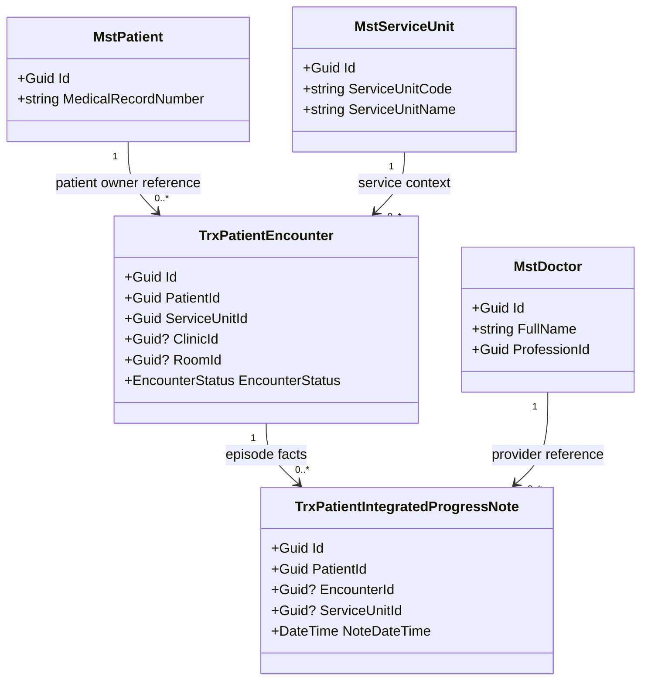
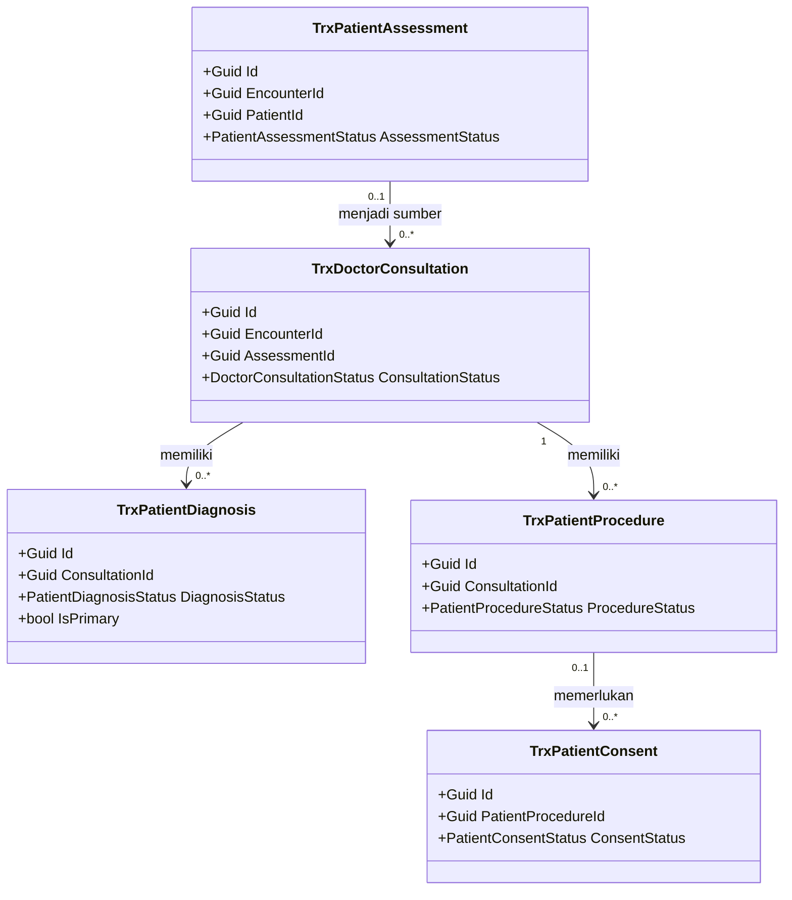
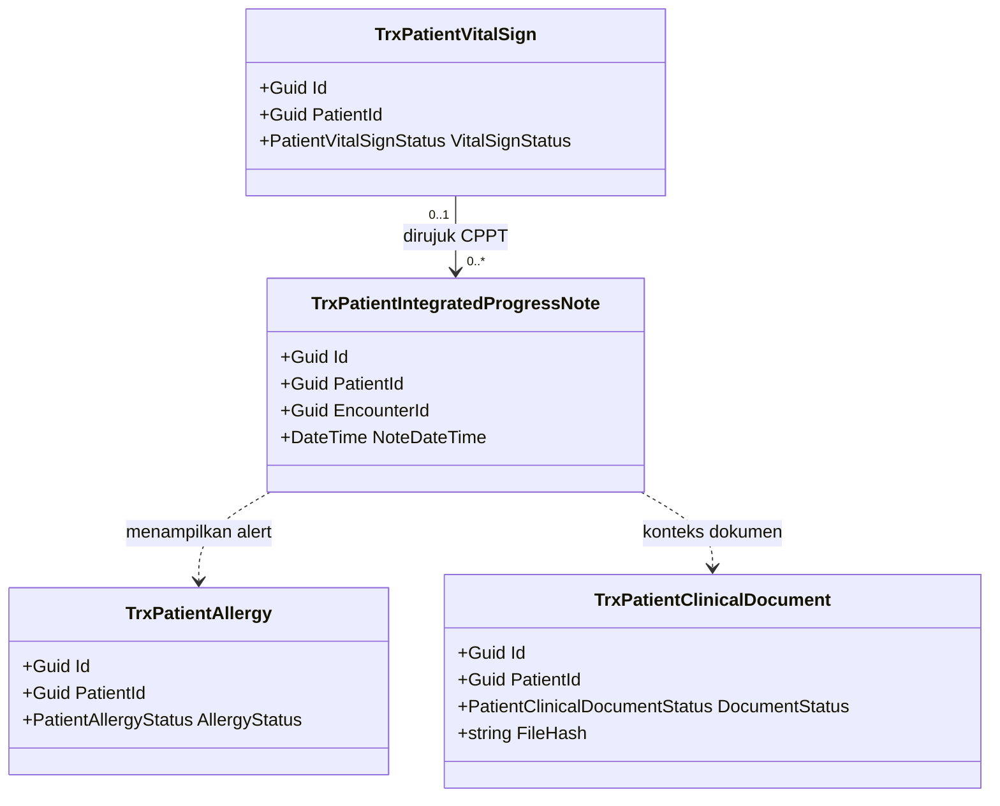
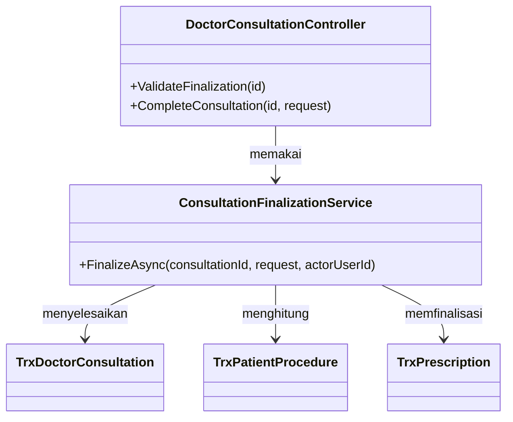

# Backend Architecture — Rekam Medis: Existing Clinical Foundation

| Field | Nilai |
| --- | --- |
| Status | `draft` |
| Scope | Existing-first: ownership/reference dan provider klinis yang sudah ada |
| Input architecture | `evidence/04-hospital-domain-architecture-full.md`, `DOMAIN_ARCHITECTURE_READY` untuk desain draft |
| Production gate | `RM-APR-002`; tidak memblokir desain draft menurut `RM-APR-006` |
| Dampak source | Tidak ada perubahan pada revision ini |

## Bounded Context dan Ownership

Rekam Medis menjadi downstream consumer. Patient Management memiliki pasien; Registration memiliki
encounter; Workforce/Identity memiliki tenaga kesehatan; Health Services Master Data memiliki
lokasi; Clinical Management memiliki fakta klinis; lab/radiologi memiliki hasil; dan Pharmacy
memiliki resep. Revision ini memprioritaskan adapter terhadap assessment, konsultasi/SOAP,
diagnosis, tindakan, alergi, tanda vital, CPPT, dokumen klinis, dan consent yang sudah ada.

Aggregate episode, break-glass, release, dan menu RM baru belum dimaterialisasi pada revision ini.
Mereka tetap tercantum di arsitektur domain penuh sebagai fase berikutnya.

Transaction boundary tetap berada pada owner masing-masing. Pembacaan reference tidak boleh
membuka transaksi yang mengubah owner lain.

## Tabel Kepemilikan Data

| Kelompok data | Modul pemilik | Dipakai RM | Dibuat ulang di RM | Cara pakai |
| --- | --- | :---: | :---: | --- |
| Pasien dan nomor Rekam Medis | Patient Management | Ya | Tidak | Reference ID dan response owner |
| Encounter | Registration Management | Ya | Tidak | Anchor episode pelayanan |
| User, dokter, profesi, credential | Workforce/Identity | Ya | Tidak | Reference pelaku/profesi |
| Unit, klinik, ruang, bed | Health Services Master Data/Registration | Ya | Tidak | Reference konteks lokasi |
| Assessment, SOAP, diagnosis, tindakan, alergi, vital, CPPT, dokumen, consent | Clinical Management | Ya | Tidak | Reference atau view baca |
| Hasil laboratorium/radiologi | Owner penunjang | Ya | Tidak | Reference/copy released beserta provenance |
| Resep dan dispensing | Pharmacy Management | Ya | Tidak | Reference dan summary baca |
| Readiness/charge/claim | Billing/Casemix/Keuangan | Tidak pada slice ini | Tidak | Tidak disentuh |

## Class Diagram Existing yang Menjadi Boundary



Diagram menunjukkan model existing sebagai boundary evidence. Ia bukan perintah menambah FK atau
mengubah relasi source.

## Penjelasan Class

### `MstPatient`

| Aspek | Penjelasan |
| --- | --- |
| **Status** | `Sudah ada` |
| **Lokasi file** | `Areas/HealthServices/PatientManagement/MasterData/Models/MstPatient.cs` |
| Kategori | Master pasien |
| Tanggung jawab | Menjadi source of truth identitas dan nomor Rekam Medis. |
| Field penting | `Id`, `MedicalRecordNumber` |
| Relasi | Direferensikan encounter dan fakta klinis. |
| Pemakaian | RM membaca reference; tidak membuat atau mengubah pasien. |
| Catatan desain | Data identitas sensitif tidak boleh masuk custom logger. |

### `TrxPatientEncounter`

| Aspek | Penjelasan |
| --- | --- |
| **Status** | `Sudah ada` |
| **Lokasi file** | `Areas/HealthServices/RegistrationManagement/Models/TrxPatientEncounter.cs` |
| Kategori | Transaksi pelayanan |
| Tanggung jawab | Menjadi anchor pelayanan, bukan status kelengkapan RM. |
| Field penting | `Id`, `PatientId`, `ServiceUnitId`, `ClinicId`, `RoomId`, `EncounterStatus` |
| Relasi | Menunjuk pasien dan konteks lokasi; direferensikan fakta klinis. |
| Pemakaian | RM memverifikasi pasangan patient–encounter. |
| Catatan desain | Jangan menyamakan `EncounterStatus` dengan `Belum Lengkap`/`Ditutup Final`. |

### `MstServiceUnit`

| Aspek | Penjelasan |
| --- | --- |
| **Status** | `Sudah ada` |
| **Lokasi file** | `Areas/HealthServices/MasterData/Models/MstServiceUnit.cs` |
| Kategori | Master lokasi pelayanan |
| Tanggung jawab | Menyediakan kode dan nama unit pelayanan. |
| Field penting | `Id`, `ServiceUnitCode`, `ServiceUnitName` |
| Relasi | Direferensikan encounter dan fakta klinis. |
| Pemakaian | RM menampilkan konteks unit dari owner. |
| Catatan desain | Tidak dibuat `MstMedicalRecordServiceUnit`. |

### `MstDoctor`

| Aspek | Penjelasan |
| --- | --- |
| **Status** | `Sudah ada` |
| **Lokasi file** | `Areas/Corporate/HumanResource/MasterData/Workforce/Models/MstDoctor.cs` |
| Kategori | Master workforce klinis |
| Tanggung jawab | Menyediakan identity reference dokter dan profesinya. |
| Field penting | `Id`, `FullName`, `ProfessionId`, `SpecializationId` |
| Relasi | Direferensikan fakta klinis sesuai owner fakta. |
| Pemakaian | RM membaca pelaku; authorization penugasan belum dirancang pada slice ini. |
| Catatan desain | Snapshot nama tidak boleh menggantikan ID workforce sebagai identitas otoritatif. |

### `TrxPatientIntegratedProgressNote`

| Aspek | Penjelasan |
| --- | --- |
| **Status** | `Sudah ada` — provider konflik untuk finality |
| **Lokasi file** | `Areas/HealthServices/ClinicalManagement/Models/TrxPatientIntegratedProgressNote.cs` |
| Kategori | Fakta klinis/CPPT |
| Tanggung jawab | Menjadi fakta Clinical Management yang dapat direferensikan RM. |
| Field penting | `Id`, `PatientId`, `EncounterId`, `ServiceUnitId`, `ClinicId`, `NoteDateTime` |
| Relasi | Menunjuk pasien, encounter, lokasi, dan provider menurut model owner. |
| Pemakaian | RM hanya membaca reference pada slice ini. |
| Catatan desain | Endpoint update/delete existing bukan kontrak finality RM. |

### Controller Existing

| Class | Status | Lokasi file | Service yang dipakai | Endpoint dalam slice | Catatan |
| --- | --- | --- | --- | --- | --- |
| `PatientController` | Sudah ada | `Areas/HealthServices/PatientManagement/MasterData/Controllers/PatientController.cs` | Pola existing controller/DbContext | GET detail/options | Owner pasien; tidak dipindahkan ke RM. |
| `PatientEncounterController` | Sudah ada | `Areas/HealthServices/RegistrationManagement/Controllers/PatientEncounterController.cs` | Pola existing controller/DbContext | GET detail/options | Owner encounter; mutation bukan kewenangan RM. |
| `ServiceUnitController` | Sudah ada | `Areas/HealthServices/MasterData/Controllers/ServiceUnitController.cs` | Pola existing controller/DbContext | GET detail/options | Owner lokasi. |
| `PatientIntegratedProgressNoteController` | Sudah ada | `Areas/HealthServices/ClinicalManagement/Controllers/PatientIntegratedProgressNoteController.cs` | Pola existing controller/DbContext | GET detail/timeline | Read provider saja; mutation conflict dipertahankan. |

### Service Target

Tidak ada service RM baru pada revision existing-first. Service existing tetap digunakan melalui
controller owner. Repair finality CPPT/dokumen dan orchestration finalisasi harus menjadi task
extension terpisah; jangan membuat service generik yang menyalin seluruh fakta klinis.

## Register Existing Clinical Foundation

| Capability existing | Owner | Status target | Tindakan desain revision ini |
| --- | --- | --- | --- |
| Patient assessment | Clinical Management | `Extend` | Pertahankan completion lock; jangan samakan cancel dengan correction signed. |
| Doctor consultation/SOAP | Clinical Management | `Extend` | Pakai transaction finalization existing; jangan samakan complete dengan closure RM. |
| Diagnosis | Clinical Management | `Existing/Adapter` | Tetap owner diagnosis; RM membaca reference. |
| Procedure | Clinical Management | `Existing/Adapter` | Tetap owner tindakan; RM membaca reference. |
| Allergy dan vital sign | Clinical Management | `Existing/Adapter` | Dipakai sebagai data keselamatan; tidak diduplikasi. |
| CPPT | Clinical Management | `Repair/Extend` | Update/delete existing tidak boleh dipakai pada record signed; correction contract fase extension. |
| Clinical document | Clinical Management | `Repair/Extend` | Metadata/file/hash dapat dipakai; authority verify/approve/finality perlu dipisahkan. |
| Consent | Clinical Management | `Existing/Adapter` | Tetap owner consent; applicability mengikuti tindakan. |
| Prescription | Pharmacy Management | `Existing/Adapter` | Reference saja; dispensing tetap owner farmasi. |

## Class Diagram — Provider Klinis Existing-First





## Penjelasan Class Provider Klinis

Setiap baris menjelaskan satu class pada diagram. Semuanya berstatus `Sudah ada`, berkategori
transaksi Clinical Management, dan berada di `Areas/HealthServices/ClinicalManagement/Models/`.

| Class | Lokasi file | Tanggung jawab dan field penting | Relasi/pemakaian | Catatan desain |
| --- | --- | --- | --- | --- |
| `TrxPatientAssessment` | `.../Models/TrxPatientAssessment.cs` | Assessment awal; encounter, patient, status, waktu completion. | Sumber konsultasi dan vital awal. | `Completed` bukan signature RM. |
| `TrxDoctorConsultation` | `.../Models/TrxDoctorConsultation.cs` | Konsultasi/SOAP; patient, encounter, doctor, status, SOAP, completion. | Induk diagnosis/tindakan dan konteks resep. | Complete bukan closure RM. |
| `TrxPatientDiagnosis` | `.../Models/TrxPatientDiagnosis.cs` | Diagnosis; code/name snapshot, status, `IsPrimary`. | Diagnosis utama menjadi bukti completeness. | Record final tidak boleh ditimpa. |
| `TrxPatientProcedure` | `.../Models/TrxPatientProcedure.cs` | Tindakan; master reference, status, execution, billing reference. | Pemicu dokumen/consent conditional. | Billing tidak menguasai closure RM. |
| `TrxPatientAllergy` | `.../Models/TrxPatientAllergy.cs` | Fakta alergi dan alert keselamatan. | Ditampilkan lebih awal. | Delete/cancel fakta resmi perlu guard. |
| `TrxPatientVitalSign` | `.../Models/TrxPatientVitalSign.cs` | Observasi vital dan alert kritis. | Direferensikan assessment, konsultasi, CPPT. | Koreksi mempertahankan histori. |
| `TrxPatientIntegratedProgressNote` | `.../Models/TrxPatientIntegratedProgressNote.cs` | CPPT lintas profesi dan provenance. | Timeline episode dari owner Clinical. | Belum memiliki status signed. |
| `TrxPatientClinicalDocument` | `.../Models/TrxPatientClinicalDocument.cs` | Metadata file, hash, status, review/verify/approve. | Dokumen diagnosis/tindakan/hasil. | Permission workflow generic. |
| `TrxPatientConsent` | `.../Models/TrxPatientConsent.cs` | Consent, signer, file/hash, sign/verify/approve. | Conditional terhadap tindakan. | Signature existing belum evidence RM lengkap. |

Ekuivalen model lama tidak ditetapkan karena revision ini memakai model existing apa adanya.



Diagram orchestration ini menunjukkan transaction boundary existing. `TrxPrescription` tetap
dimiliki Pharmacy Management dan tidak dibuat ulang oleh Rekam Medis.

## Controller Existing yang Dipertahankan

| Controller | Lokasi | Grup Swagger | Status |
| --- | --- | --- | --- |
| `PatientAssessmentController` | `Areas/HealthServices/ClinicalManagement/Controllers/PatientAssessmentController.cs` | `Health Services / Clinical Management / Patient Assessment` | Extend |
| `DoctorConsultationController` | `Areas/HealthServices/ClinicalManagement/Controllers/DoctorConsultationController.cs` | `Health Services / Clinical Management / Doctor Consultation` | Extend |
| `PatientDiagnosisController` | `Areas/HealthServices/ClinicalManagement/Controllers/PatientDiagnosisController.cs` | `Health Services / Clinical Management / Patient Diagnosis` | Reuse |
| `PatientProcedureController` | `Areas/HealthServices/ClinicalManagement/Controllers/PatientProcedureController.cs` | `Health Services / Clinical Management / Patient Procedure` | Reuse |
| `PatientAllergyController` | `Areas/HealthServices/ClinicalManagement/Controllers/PatientAllergyController.cs` | `Health Services / Clinical Management / Patient Allergy` | Reuse |
| `PatientVitalSignController` | `Areas/HealthServices/ClinicalManagement/Controllers/PatientVitalSignController.cs` | `Health Services / Clinical Management / Patient Vital Sign` | Reuse |
| `PatientIntegratedProgressNoteController` | `Areas/HealthServices/ClinicalManagement/Controllers/PatientIntegratedProgressNoteController.cs` | `Health Services / Clinical Management / Patient Integrated Progress Note` | Repair/Extend |
| `PatientClinicalDocumentController` | `Areas/HealthServices/ClinicalManagement/Controllers/PatientClinicalDocumentController.cs` | `Health Services / Clinical Management / Patient Clinical Document` | Repair/Extend |
| `PatientConsentController` | `Areas/HealthServices/ClinicalManagement/Controllers/PatientConsentController.cs` | `Health Services / Clinical Management / Patient Consent` | Reuse |

Semua controller berstatus `Sudah ada`, memakai `[AccessController]`, dan mengakses
`ApplicationDbContext` secara langsung untuk sebagian operasi. `DoctorConsultationController` juga
memakai service finalisasi. Endpoint serta permission persis ada di `contracts/api-contract.md` dan
`contracts/permission-audit-matrix.md`.

### `ConsultationFinalizationService`

| Aspek | Penjelasan |
| --- | --- |
| **Status** | `Sudah ada` — utang lokasi folder |
| **Lokasi file** | `Areas/HealthServices/PharmacyManagement/Services/ConsultationFinalizationService.cs` |
| Kategori | Service orchestration konsultasi |
| Tanggung jawab utama | Memvalidasi konsultasi, membangun atau memfinalisasi resep draft, lalu menyelesaikan konsultasi, queue, dan encounter dalam satu transaksi database. |
| Dipanggil oleh | `DoctorConsultationController` |
| Membuka transaksi database | Ya, melalui `ApplicationDbContext.Database.BeginTransactionAsync`. |
| Catatan desain | File berada di area Pharmacy tetapi namespace Clinical Management. Jangan dipindahkan diam-diam. Completion service bukan signature atau closure RM. |

### `TrxPrescription`

| Aspek | Penjelasan |
| --- | --- |
| **Status** | `Sudah ada` |
| **Lokasi file** | `Areas/HealthServices/PharmacyManagement/Models/TrxPrescription.cs` |
| Kategori | Transaksi resep milik Pharmacy Management |
| Tanggung jawab utama | Menyimpan resep yang dapat difinalisasi bersama konsultasi. |
| Field penting | `Id`, `ConsultationId`, `PrescriptionStatus` |
| Navigation/relasi | Direferensikan oleh `ConsultationFinalizationService`. |
| Pemakaian | Resep draft divalidasi dan difinalisasi pada transaction boundary existing. |
| Catatan desain | Rekam Medis hanya memakai reference; dispensing tetap milik Pharmacy. |
| Ekuivalen model lama | — |

## Arsitektur Folder

```text
Areas/HealthServices/
├── PatientManagement/                    # Sudah ada — owner pasien
├── RegistrationManagement/               # Sudah ada — owner encounter
├── MasterData/                            # Sudah ada — owner lokasi
└── ClinicalManagement/                    # Sudah ada — owner fakta klinis

Areas/Corporate/HumanResource/
└── MasterData/Workforce/                  # Sudah ada — owner tenaga klinis

Areas/HealthServices/PharmacyManagement/
└── Services/ConsultationFinalizationService.cs # Sudah ada; namespace Clinical — utang teknis

Repositories/Configurations/HealthService/   # Sudah ada; nama tunggal adalah utang teknis
└── TrxPatient*Configuration.cs              # Configuration provider klinis existing

Areas/HealthServices/MedicalRecordManagement/  # Belum dibuat pada revision existing-first
```

Tidak ada controller, service, DTO, enum, model, configuration, atau registration DI baru.

## Status Model dan Dampak Migration

| Model | Status | Kolom berubah | Migration |
| --- | --- | --- | --- |
| `MstPatient` | Sudah ada | Tidak ada | Tidak ada |
| `TrxPatientEncounter` | Sudah ada | Tidak ada | Tidak ada |
| `MstServiceUnit` | Sudah ada | Tidak ada | Tidak ada |
| `MstDoctor` | Sudah ada | Tidak ada | Tidak ada |
| `TrxPatientIntegratedProgressNote` | Sudah ada | Tidak ada | Tidak ada |
| `TrxPatientAssessment` | Sudah ada | Tidak ada | Tidak ada |
| `TrxDoctorConsultation` | Sudah ada | Tidak ada | Tidak ada |
| `TrxPatientDiagnosis` | Sudah ada | Tidak ada | Tidak ada |
| `TrxPatientProcedure` | Sudah ada | Tidak ada | Tidak ada |
| `TrxPatientAllergy` | Sudah ada | Tidak ada | Tidak ada |
| `TrxPatientVitalSign` | Sudah ada | Tidak ada | Tidak ada |
| `TrxPatientClinicalDocument` | Sudah ada | Tidak ada | Tidak ada |
| `TrxPatientConsent` | Sudah ada | Tidak ada | Tidak ada |

## Rencana Migration

Tidak ada migration pada revision desain existing-first. Model owner existing tidak diubah pada
artefak ini. Migration baru hanya boleh dirancang pada task extension finality yang terpisah.

## Rencana Data Master Awal

Tidak ada seed/master baru. Pasien, service unit, workforce, profesi, dan lokasi tetap memakai data
owner existing. Blueprint dilarang menyalin nilai owner menjadi master RM.

## Validasi Boundary

1. Patient ID harus dapat di-resolve pada Patient Management.
2. Encounter ID harus dapat di-resolve pada Registration.
3. `Encounter.PatientId` harus sama dengan patient reference yang diminta.
4. Kegagalan lookup tidak boleh menciptakan patient/encounter lokal.
5. CPPT/reference klinis harus mempertahankan owner record ID.
6. Response provider tidak boleh disimpulkan sebagai izin akses klinis; contextual authorization
   berada pada slice terblokir.

**Contoh gagal:** Request membawa patient A dan encounter milik patient B. Boundary menolak pasangan
tersebut; sistem tidak mengganti patient ID secara otomatis.

## Yang Sengaja Tidak Dibuat

| Yang ditolak | Alasan |
| --- | --- |
| `MstMedicalRecordPatient` | Menduplikasi Patient Management. |
| `TrxMedicalRecordEncounter` sebagai salinan encounter | Encounter sudah dimiliki Registration; lifecycle RM belum approved. |
| `MstMedicalRecordDoctor` | Menduplikasi Workforce/Identity. |
| `MstMedicalRecordLocation` | Menduplikasi master lokasi. |
| `TrxMedicalRecordCPPTCopy` editable | Menciptakan dua source of truth fakta klinis. |
| `MedicalRecordReferenceController` | Existing provider sudah tersedia; facade baru belum diperlukan. |
| Menu dashboard Rekam Medis baru | User meminta mendahulukan menu/alur medis existing. |
| Break-glass/release UI dan backend | Capability belum ada dan tetap fase berikutnya; policy harus fail-closed. |
