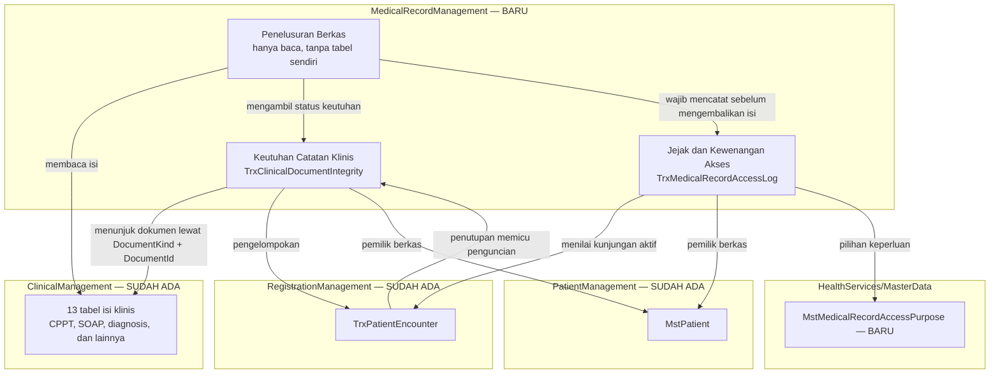

# Rekam Medis — Context ERD

| Field | Value |
|---|---|
| Blueprint ID | `RM-BP-001` |
| Revision | `1` |
| Status | `draft` |
| Backend SHA | `ab37e3a2e80f0e34efe22ec0f6a8c9b90a3ae45e` |

> **PERINGATAN DASAR DESAIN.** Disusun di atas keputusan berstatus `draft` yang belum
> disetujui owner mana pun. Lihat `RM-DEC-025`.

---

## 1. Peta antar bounded context

Diagram berikut menunjukkan **arah ketergantungan**, bukan aliran data satu per satu. Panah
berarti "bergantung pada" atau "membaca dari".

Dua hal yang paling penting dibaca dari diagram ini:

1. **Seluruh panah dari `MedicalRecordManagement` menuju keluar berarti membaca, bukan
   menyalin.** Tidak ada satu pun tabel isi klinis yang diduplikasi. Ini penerapan langsung
   `RM-DEC-001`.
2. **Hanya satu panah masuk ke `MedicalRecordManagement` dari modul lain**, yaitu dari
   `TrxPatientEncounter` ke keutuhan, ketika kunjungan ditutup. Itulah satu-satunya titik di
   mana modul lain memanggil modul ini.

## 2. Hubungan `TrxClinicalDocumentIntegrity` dengan tiga belas tabel klinis

Hubungan ini tidak digambar sebagai foreign key, dan alasannya perlu dipahami sebelum membaca
ERD detail.

Satu baris keutuhan menunjuk satu dokumen klinis memakai sepasang kolom:

| Kolom | Isi |
|---|---|
| `DocumentKind` | Jenis dokumennya, misalnya `ProgressNote` untuk CPPT |
| `DocumentId` | Nilai `Id` pada tabel dokumen yang bersangkutan |

Cara ini disebut rujukan polimorfik. Konsekuensinya jujur disebutkan: **basis data tidak dapat
menjamin `DocumentId` benar-benar ada.** Penjaminannya berada di lapisan service, bukan di
constraint. Ini harga yang dibayar untuk sifat yang lebih berharga, yaitu nol perubahan kolom
pada tiga belas tabel yang sedang dipakai.

Alternatif yang ditolak dan alasannya:

| Alternatif | Alasan ditolak |
|---|---|
| Tiga belas foreign key nullable pada satu tabel keutuhan | Tabel jadi punya tiga belas kolom yang dua belas di antaranya selalu kosong. Sulit dibaca dan tetap tidak menjamin apa pun |
| Tiga belas tabel keutuhan terpisah | Aturan penguncian harus ditulis tiga belas kali — persis masalah `RM-CAP-010` yang mau diselesaikan |
| Kolom keutuhan langsung di tiap tabel klinis | Ditolak `RM-DEC-013` karena menyentuh tabel yang dipakai IGD dan antrean dokter |

## 3. Tabel status entity lintas konteks

| Entity | Status | Owner | Catatan |
|---|---|---|---|
| `MstPatient` | Sudah ada | Patient Management | Dirujuk, **MUST NOT** disalin |
| `TrxPatientEncounter` | Sudah ada | Registration Management | Dirujuk; controllernya `Diperbarui` untuk memicu penguncian |
| `TrxPatientIntegratedProgressNote` | Sudah ada | Clinical Management | Tabel tidak berubah; controllernya `Diperbarui` |
| Dua belas tabel klinis lain | Sudah ada | Clinical Management | Dibaca untuk penelusuran; tidak berubah sama sekali |
| `ApplicationUser` | Sudah ada | Identity | Dirujuk sebagai penulis, penandatangan, dan pengakses |
| `TrxClinicalDocumentIntegrity` | **Baru** | Medical Record Management | — |
| `TrxClinicalNoteAddendum` | **Baru** | Medical Record Management | — |
| `TrxClinicalNoteAuthorDelegation` | **Baru** | Medical Record Management | — |
| `TrxMedicalRecordAccessLog` | **Baru** | Medical Record Management | Tabel dengan pertumbuhan tercepat |
| `MstMedicalRecordAccessPurpose` | **Baru** | HealthServices Master Data | — |

## 4. ERD detail per konteks

| Konteks | File |
|---|---|
| Keutuhan Catatan Klinis | [keutuhan-dokumen.md](keutuhan-dokumen.md) |
| Jejak dan Kewenangan Akses | [jejak-akses.md](jejak-akses.md) |
| Kamus data seluruh tabel | [data-dictionary.md](data-dictionary.md) |

Konteks Penelusuran Berkas tidak memiliki ERD tersendiri karena **tidak memiliki tabel sama
sekali**. Ia hanya membaca tabel milik konteks lain.
