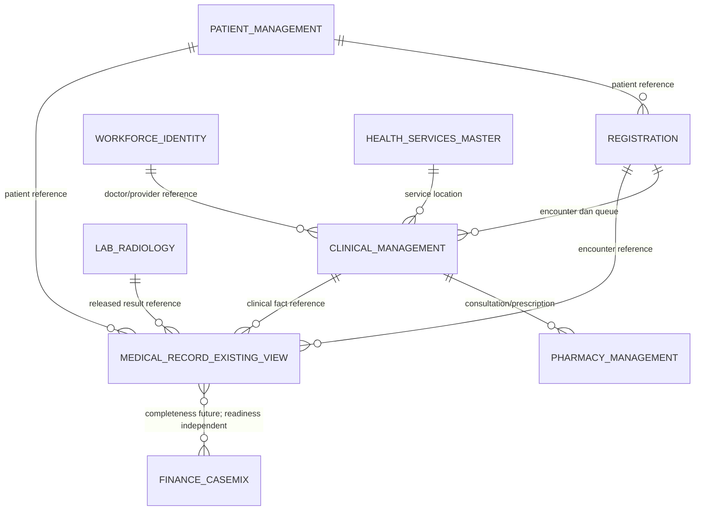

# Context ERD — Rekam Medis Existing-First

Status: `draft`. Diagram menunjukkan ownership dan arah konsumsi, bukan foreign key atau database
baru.

| Context | Status pada revision ini | Batas |
| --- | --- | --- |
| Patient/Registration/Workforce/Master Data | Existing owner | Direferensikan, tidak disalin. |
| Clinical Management | Existing owner | Assessment, SOAP, diagnosis, tindakan, alergi, vital, CPPT, dokumen, consent. |
| Pharmacy | Existing owner | Resep/dispensing; terlibat dalam finalisasi konsultasi existing. |
| Medical Record existing view | Adapter/view | Belum menjadi aggregate episode RM. |
| Lab/Radiology | Existing owner eksternal slice | Hanya hasil released/versioned kelak. |
| Finance/Casemix | Existing owner | Menentukan readiness sendiri; tidak menahan signature/closure RM. |

Detail entity Clinical Management ada di `erd/existing-clinical-foundation.md`. Aggregate baru dari
arsitektur domain penuh belum dimaterialisasi pada revision existing-first.
