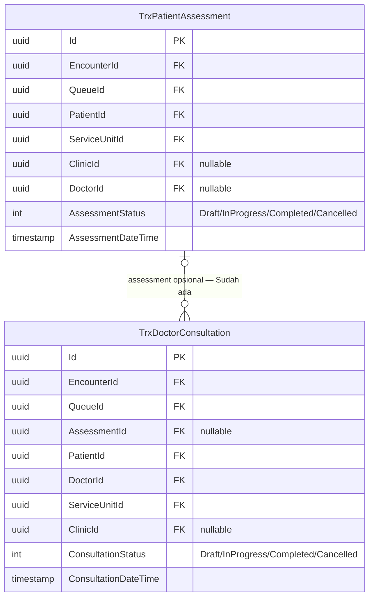
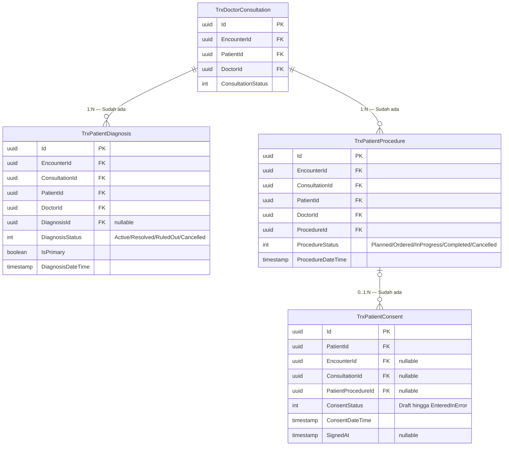
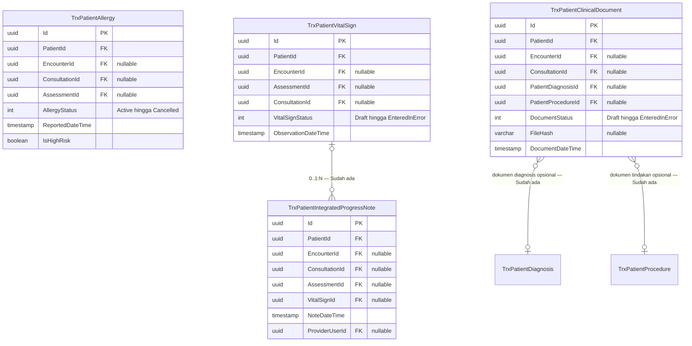

# ERD — Fondasi Klinis Existing Rekam Medis

| Field | Nilai |
| --- | --- |
| Status | `draft` |
| Scope | Entity Clinical Management yang sudah tersedia dan dipakai ulang pada tahap existing-first |
| Owner | Clinical Management; Rekam Medis hanya consumer/reference |
| Snapshot source | Backend `5103e68eec5529540d369673c8a4e2651be0344b` |

Diagram ini menggambarkan relasi penting yang sudah ada. Ia tidak memerintahkan penambahan tabel,
kolom, atau foreign key. Semua entity berstatus `Sudah ada`.

## Assessment dan konsultasi

## Diagnosis, tindakan, dan consent

## Data keselamatan dan catatan lintas profesi

## Status entity dan keputusan reuse

| Entity | Status | Owner | Keputusan existing-first |
| --- | --- | --- | --- |
| `TrxPatientAssessment` | Sudah ada | Clinical Management | `Extend`; status complete bukan signature RM. |
| `TrxDoctorConsultation` | Sudah ada | Clinical Management | `Extend`; finalisasi konsultasi bukan penutupan episode RM. |
| `TrxPatientDiagnosis` | Sudah ada | Clinical Management | `Adapter`; sumber diagnosis tetap entity ini. |
| `TrxPatientProcedure` | Sudah ada | Clinical Management | `Adapter`; tindakan dan billing touchpoint tetap milik owner. |
| `TrxPatientAllergy` | Sudah ada | Clinical Management | `Adapter`; dipakai sebagai data keselamatan. |
| `TrxPatientVitalSign` | Sudah ada | Clinical Management | `Adapter`; nilai klinis tidak disalin ke tabel RM. |
| `TrxPatientIntegratedProgressNote` | Sudah ada | Clinical Management | `Repair/Extend`; belum memiliki lifecycle signature immutable. |
| `TrxPatientClinicalDocument` | Sudah ada | Clinical Management | `Repair/Extend`; update/delete existing tidak cukup untuk finality RM. |
| `TrxPatientConsent` | Sudah ada | Clinical Management | `Adapter`; signature existing belum otomatis menjadi signature evidence RM. |

## Batas interpretasi

- Status `Completed`, `Verified`, `Approved`, atau `Signed` pada provider existing tidak otomatis
  memenuhi signature evidence Rekam Medis yang memerlukan autentikasi ulang dan hash isi.
- Endpoint update/delete existing hanya boleh dipakai sesuai lifecycle owner. Record yang kelak
  dinyatakan final oleh RM harus read-only dan berubah melalui correction/addendum.
- Tidak ada DDL karena revision ini tidak menambah atau memperbarui tabel.

**Contoh:** konsultasi berstatus `Completed` boleh dipakai sebagai bukti layanan selesai, tetapi
episode Rekam Medis tetap `Belum Lengkap` bila diagnosis utama atau catatan wajib belum mempunyai
bukti tanda tangan yang sah.
