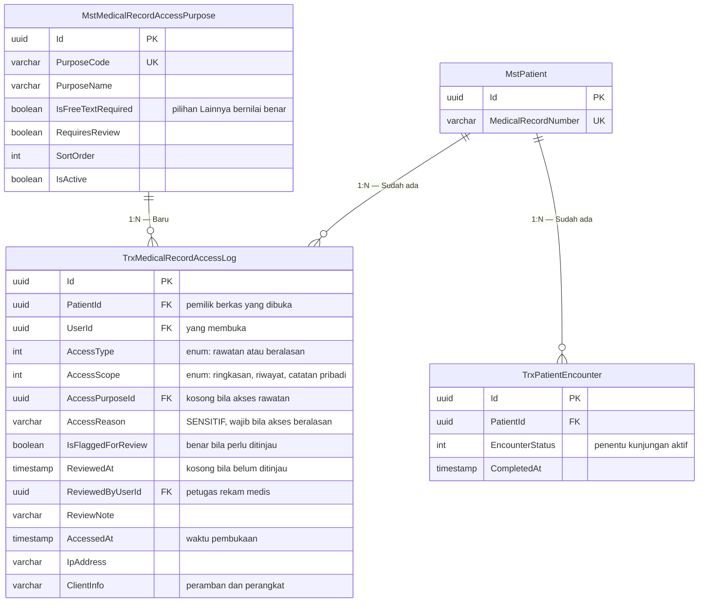

# ERD — Konteks Jejak dan Kewenangan Akses

| Field | Value |
|---|---|
| Blueprint ID | `RM-BP-001` |
| Revision | `1` |
| Status | `draft` |
| Bounded context | Jejak dan Kewenangan Akses |
| Owner | `MedicalRecordManagement` (baru) |

> **PERINGATAN DASAR DESAIN.** Disusun di atas keputusan berstatus `draft`. Lihat `RM-DEC-025`.

---

## 1. Diagram



`TrxPatientEncounter` digambar tanpa relasi langsung ke jejak akses. Ia muncul karena
**dibaca** untuk menentukan apakah pasien sedang punya kunjungan aktif, bukan karena ada
foreign key. Perbedaan ini penting: satu baris jejak akses tidak melekat pada kunjungan mana
pun, sebab pengguna bisa membuka rekam medis pasien yang sedang tidak berkunjung sama sekali.

## 2. Tabel status entity

| Entity | Status | Owner | Catatan |
|---|---|---|---|
| `TrxMedicalRecordAccessLog` | Baru | Medical Record Management | Aggregate root. Tabel dengan pertumbuhan tercepat di sistem |
| `MstMedicalRecordAccessPurpose` | Baru | HealthServices Master Data | Wajib terisi, lihat rencana data master awal |
| `MstPatient` | Sudah ada | Patient Management | Dirujuk, **MUST NOT** disalin |
| `TrxPatientEncounter` | Sudah ada | Registration Management | Hanya dibaca untuk menilai kunjungan aktif |

## 3. Bagaimana satu baris jejak terbentuk

Urutannya penting, karena menentukan bahwa tidak ada pembacaan yang lolos tanpa jejak.

```text
1. Pengguna membuka berkas rekam medis seorang pasien
2. Service memeriksa: apakah pasien punya kunjungan yang belum ditutup?
      ya    -> AccessType = RoutineCare, alasan tidak diminta
      tidak -> AccessType = ReasonedAccess, alasan WAJIB diisi
                bila alasan kosong  -> permintaan ditolak, isi TIDAK dikembalikan
3. Baris jejak ditulis dan transaksinya diselesaikan
4. Baru setelah itu isi rekam medis dikembalikan
```

Langkah 3 mendahului langkah 4 dengan sengaja. Bila penulisan jejak gagal, isi rekam medis
tidak dikembalikan sama sekali. Pilihan ini menutup rapat, bukan melonggarkan: membaca
diam-diam dinilai lebih berbahaya daripada tidak bisa membaca.

## 4. Index dan rencana pembagian tabel

| Index | Alasan |
|---|---|
| `(PatientId, AccessedAt)` | Pertanyaan paling sering: siapa saja membuka rekam medis pasien ini |
| `(UserId, AccessedAt)` | Pertanyaan kedua: apa saja yang dibuka pengguna ini |
| `(IsFlaggedForReview, ReviewedAt, AccessedAt)` | Antrean tinjauan unit rekam medis |
| `(AccessType, AccessedAt)` | Laporan perbandingan akses rawatan dan beralasan |

**Pembagian tabel per periode wajib dirancang sejak migration pertama.** Alasannya bukan
kehati-hatian berlebihan: tabel ini bertambah satu baris setiap kali seseorang membuka satu
berkas rekam medis, sehingga pertumbuhannya jauh melampaui tabel transaksi mana pun di sistem.
Memasang pembagian tabel setelah berisi puluhan juta baris menuntut waktu henti layanan, dan
itu dapat dihindari sepenuhnya dengan merancangnya di awal.

### Rancangan pembagian tabel

Masa simpan ditetapkan **25 tahun** pada `RM-DEC-024`.

| Aspek | Ketetapan |
|---|---|
| Kolom pembagi | `AccessedAt` |
| Satuan pembagian | **Per tahun** |
| Jumlah bagian pada keadaan penuh | 25 |
| Bagian tertua | Dihapus setelah melewati 25 tahun, lewat proses pengarsipan resmi |
| Pembuatan bagian baru | Otomatis menjelang pergantian tahun, bukan manual |

Pembagian per tahun dipilih, bukan per bulan. Per bulan menghasilkan 300 bagian pada keadaan
penuh — jumlah yang mempersulit perencanaan query dan pemeliharaan tanpa memberi manfaat
sepadan, sebab penghapusan memang hanya terjadi sekali setahun.

### Perkiraan volume

Angka pasti bergantung jumlah pembukaan rekam medis per hari, yang belum diketahui karena data
produksi tidak diaudit. Perkiraan berikut disajikan agar perencanaan penyimpanan punya pijakan.

| Pembukaan per hari | Baris per tahun | Baris setelah 25 tahun | Perkiraan ukuran termasuk index |
|---:|---:|---:|---|
| 500 | ±182 ribu | ±4,6 juta | ±2 sampai 5 GB |
| 2.000 | ±730 ribu | ±18,3 juta | ±9 sampai 18 GB |
| 5.000 | ±1,8 juta | ±45,6 juta | ±23 sampai 46 GB |
| 10.000 | ±3,7 juta | ±91,3 juta | ±46 sampai 91 GB |

Dasar perhitungan: satu baris diperkirakan memakan 0,5 sampai 1 KB termasuk empat index
gabungan. Kolom terbesar adalah `AccessReason` dan `ClientInfo`, keduanya bersifat opsional,
sehingga baris akses rutin jauh lebih kecil daripada baris akses beralasan.

Kesimpulan yang dapat diambil: pada seluruh rentang di atas, PostgreSQL dengan pembagian per
tahun **sanggup menanganinya tanpa kesulitan**. Yang membuatnya sanggup justru pembagian itu
sendiri — tanpa pembagian, tabel 45 juta baris akan menyulitkan pemeliharaan rutin seperti
pembersihan dan pembangunan ulang index.

### Catatan privasi yang perlu disampaikan ke owner

Menyimpan jejak akses 25 tahun berarti menyimpan **data pribadi pegawai** — siapa membuka apa,
kapan — selama seperempat abad. Ini dapat dibenarkan karena jejaknya melekat pada rekam medis
yang juga disimpan lama, dan berfungsi sebagai bukti bila terjadi sengketa bertahun-tahun
kemudian.

Yang perlu dipastikan owner saat mengesahkan: dasar hukum atau kebijakan rumah sakit yang
menetapkan angka 25 tahun **wajib dilampirkan**, sebab masa simpan yang lebih panjang daripada
yang diwajibkan justru berbenturan dengan asas perlindungan data.

## 5. Aturan yang tidak biasa pada tabel ini

| Aturan | Alasan |
|---|---|
| Baris **tidak boleh** dihapus, termasuk lewat penandaan `IsDelete` | Jejak yang bisa dihapus bukan jejak. Penghapusan hanya boleh terjadi lewat proses pengarsipan resmi sesuai masa simpan |
| Tabel **tidak boleh** memuat isi klinis apa pun | Tabel ini menjawab "siapa membuka apa", bukan "apa isinya". Menyimpan cuplikan isi akan menjadikannya salinan rekam medis kedua |
| `AccessReason` bertanda sensitif | Alasan akses dapat mengungkap keadaan pasien, misalnya "konsultasi kejiwaan". Karena itu tidak boleh masuk `LoggerService` |
| Pembukaan `PrivateNote` selalu `AccessScope = PrivateNote` | Agar dapat dihitung terpisah saat ditinjau, sesuai `RM-DEC-022` |

## 6. Contoh isi tabel

Contoh memakai data karangan, bukan data pasien nyata.

Seorang dokter jaga malam membuka rekam medis pasien yang baru masuk. Pasien punya kunjungan
aktif, jadi tidak diminta alasan:

| UserId | PatientId | AccessType | AccessScope | AccessPurposeId | AccessReason | IsFlaggedForReview |
|---|---|---|---|---|---|:---:|
| `dr-andi` | `pas-001` | `1` RoutineCare | `2` Timeline | — | — | Tidak |

Dokter yang sama kemudian membuka rekam medis pasien lain yang terakhir berkunjung tahun lalu.
Tidak ada kunjungan aktif, jadi alasan diminta:

| UserId | PatientId | AccessType | AccessScope | AccessPurposeId | AccessReason | IsFlaggedForReview |
|---|---|---|---|---|---|:---:|
| `dr-andi` | `pas-114` | `2` ReasonedAccess | `2` Timeline | `Konsultasi lintas unit` | Diminta sejawat poli untuk menilai riwayat | **Ya** |

Baris kedua muncul di antrean tinjauan unit rekam medis. Petugas dapat menandainya wajar atau
meneruskannya untuk ditelaah lebih lanjut. Inilah bahan yang tidak dimiliki sistem sekarang,
dan yang membuat jejak akses berguna alih-alih hanya menumpuk.
