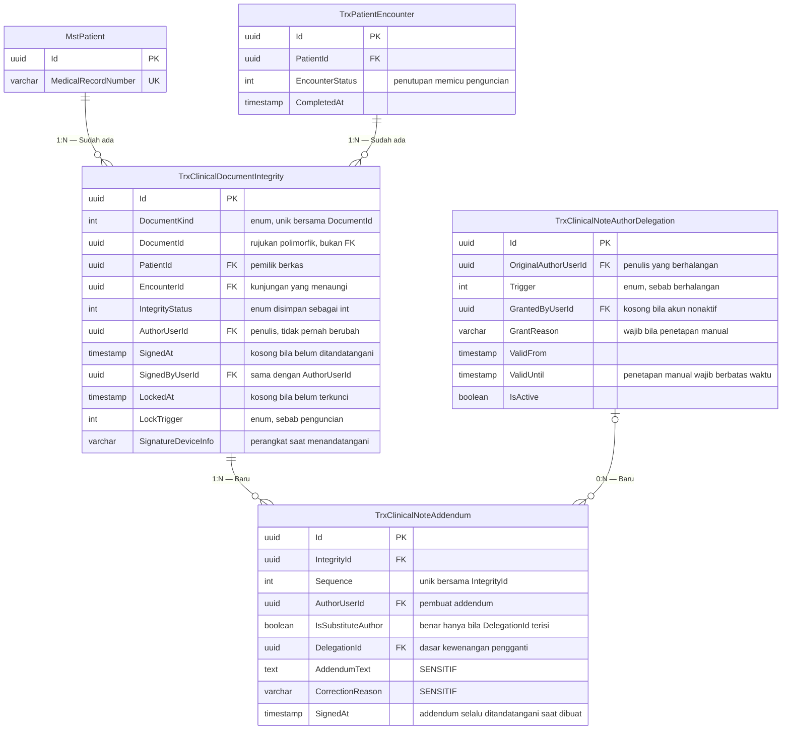

# ERD — Konteks Keutuhan Catatan Klinis

| Field | Value |
|---|---|
| Blueprint ID | `RM-BP-001` |
| Revision | `1` |
| Status | `draft` |
| Bounded context | Keutuhan Catatan Klinis |
| Owner | `MedicalRecordManagement` (baru) |

> **PERINGATAN DASAR DESAIN.** Disusun di atas keputusan berstatus `draft`. Lihat `RM-DEC-025`.

---

## 1. Diagram

`TrxPatientIntegratedProgressNote` sengaja **tidak** digambar sebagai entity berelasi, karena
hubungannya bersifat polimorfik lewat `DocumentKind` dan `DocumentId`. Alasannya dijelaskan
pada [00-context-erd.md](00-context-erd.md) bagian 2.

## 2. Tabel status entity

| Entity | Status | Owner | Catatan |
|---|---|---|---|
| `TrxClinicalDocumentIntegrity` | Baru | Medical Record Management | Aggregate root konteks ini |
| `TrxClinicalNoteAddendum` | Baru | Medical Record Management | Tidak dapat diubah maupun dihapus setelah dibuat |
| `TrxClinicalNoteAuthorDelegation` | Baru | Medical Record Management | Penetapan manual wajib berbatas waktu |
| `MstPatient` | Sudah ada | Patient Management | Dirujuk, **MUST NOT** disalin |
| `TrxPatientEncounter` | Sudah ada | Registration Management | Dirujuk, **MUST NOT** disalin |

## 3. Index dan constraint yang menentukan

| Tabel | Index atau constraint | Alasan |
|---|---|---|
| `TrxClinicalDocumentIntegrity` | Unik `(DocumentKind, DocumentId)` | Satu dokumen tepat satu baris keutuhan. Tanpa ini, satu dokumen bisa punya dua status yang bertentangan |
| `TrxClinicalDocumentIntegrity` | `(PatientId, IntegrityStatus, IsDelete)` | Menjawab pertanyaan "berapa catatan pasien ini yang belum ditandatangani" |
| `TrxClinicalDocumentIntegrity` | `(EncounterId, IntegrityStatus, IsDelete)` | Dipakai saat kunjungan ditutup untuk menemukan dokumen yang masih terbuka |
| `TrxClinicalDocumentIntegrity` | `(AuthorUserId, IntegrityStatus, IsDelete)` | Menjawab "catatan saya yang belum saya tandatangani" |
| `TrxClinicalNoteAddendum` | Unik `(IntegrityId, Sequence)` | Urutan koreksi terbaca pasti dan tidak dapat kembar |
| `TrxClinicalNoteAuthorDelegation` | `(OriginalAuthorUserId, IsActive, ValidUntil)` | Dipakai memeriksa apakah jalur pengganti sedang terbuka |

Seluruh relasi memakai `DeleteBehavior.Restrict`, mengikuti konvensi project untuk relasi
klinis, supaya histori tidak ikut terhapus berantai.

## 4. Aturan yang tidak dapat dijamin basis data

Bagian ini penting dan sering terlewat. Tiga aturan berikut **wajib** ditegakkan service,
karena constraint basis data tidak dapat melakukannya:

| Aturan | Ditegakkan di mana |
|---|---|
| `DocumentId` benar-benar ada di tabel yang sesuai `DocumentKind` | `ClinicalDocumentIntegrityService.RegisterAsync` |
| `AuthorUserId` tidak pernah berubah setelah baris dibuat | `ClinicalDocumentIntegrityService`; kolom tidak pernah dimasukkan ke DTO ubah mana pun |
| `IsSubstituteAuthor` bernilai benar hanya bila `DelegationId` terisi dan penetapannya masih berlaku | `ClinicalNoteAddendumService.ResolveAuthorityAsync` |

## 5. Contoh isi tabel

Contoh berikut memakai data karangan, bukan data pasien nyata.

Seorang dokter menulis CPPT pada 20 Agustus 2026 dan menandatanganinya. Dua hari kemudian ia
menyadari salah menulis dosis, lalu menambah addendum.

`TrxClinicalDocumentIntegrity`:

| Id | DocumentKind | DocumentId | IntegrityStatus | AuthorUserId | SignedAt | LockedAt | LockTrigger |
|---|---|---|---|---|---|---|---|
| `a1…` | `1` (ProgressNote) | `cp…` | `2` (Signed) | `dr-budi` | 2026-08-20 14:10 | 2026-08-20 14:10 | `1` (AuthorSigned) |

`TrxClinicalNoteAddendum`:

| Id | IntegrityId | Sequence | AuthorUserId | IsSubstituteAuthor | CorrectionReason |
|---|---|---:|---|:---:|---|
| `b1…` | `a1…` | 1 | `dr-budi` | Tidak | Pembetulan dosis yang salah tulis |

Yang perlu diperhatikan pembaca: baris CPPT aslinya **tidak berubah sama sekali**. Isi tanggal
20 Agustus tetap terbaca apa adanya, dan addendum tertempel di bawahnya. Itulah maksud
`RM-DEC-004`.

Kasus kedua, seorang perawat menemukan kesalahan pada catatan dokter yang sudah keluar dari
rumah sakit. Akun dokter itu sudah nonaktif, sehingga jalur pengganti terbuka otomatis tanpa
perlu penetapan manual. Kepala unit membuat addendum:

| Id | IntegrityId | Sequence | AuthorUserId | IsSubstituteAuthor | DelegationId |
|---|---|---:|---|:---:|---|
| `b2…` | `a2…` | 1 | `kepala-unit-sari` | **Ya** | `d1…` |

Addendum itu tercatat atas nama kepala unit, **bukan** atas nama dokter yang sudah keluar.
Perawat yang menemukan kesalahan tidak berhak membuatnya sendiri. Ini penerapan `RM-DEC-004`
dan `RM-DEC-020`.
