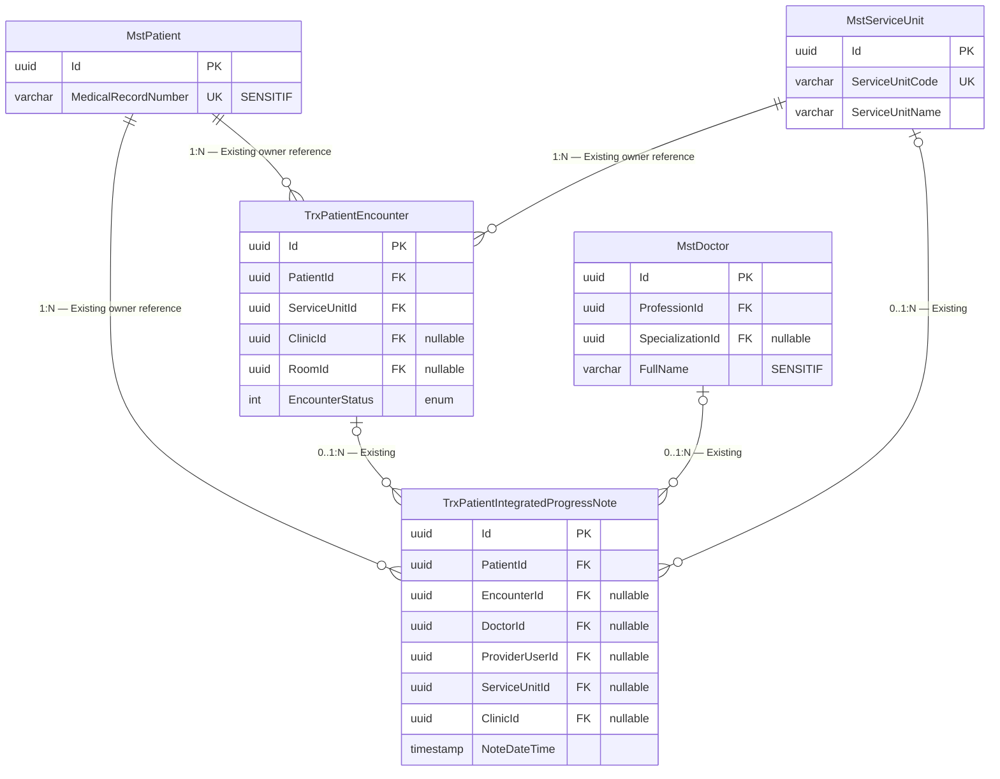

# ERD — Ownership/Reference Existing

Status: `draft`. Semua entity berstatus `Sudah ada`; tidak ada tabel baru atau diperbarui.

## Status Entity

| Entity | Status | Owner | Catatan |
| --- | --- | --- | --- |
| `MstPatient` | Sudah ada | Patient Management | Direferensikan; tidak disalin. |
| `TrxPatientEncounter` | Sudah ada | Registration Management | Anchor pelayanan; bukan lifecycle RM. |
| `MstServiceUnit` | Sudah ada | Health Services Master Data | Direferensikan. |
| `MstDoctor` | Sudah ada | Workforce/Identity | Identity/profession reference. |
| `TrxPatientIntegratedProgressNote` | Sudah ada | Clinical Management | Read reference; mutation existing tetap conflict. |

Tidak ada DDL karena tidak ada tabel `Baru` atau `Diperbarui`.
